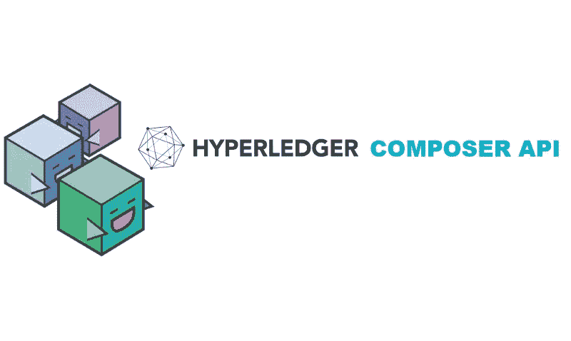

# hyperledger Composer API:BusinessNetworkConnection

> 原文：<https://medium.com/coinmonks/hyperledger-composer-api-businessnetworkconnection-afd5dbdb7227?source=collection_archive---------2----------------------->

BusinessNetworkConnection 类位于 Hyperledger Composer APIs 的客户端模块中。此类用于与已经部署的业务网络应用程序进行交互。

BusinessNetworkConnection 类中公开了多个函数，可用于

*   收集有关企业网络应用程序的信息。