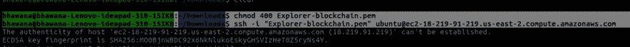

# AWS 上的 Hyperledger Composer

> 原文：<https://medium.com/coinmonks/hyperledger-composer-on-aws-6753e5e40bb7?source=collection_archive---------2----------------------->


[Image Source](https://www.google.co.in/url?sa=i&source=images&cd=&cad=rja&uact=8&ved=2ahUKEwi5zfaM05ngAhWJMI8KHQGtC5IQjxx6BAgBEAI&url=https%3A%2F%2Fwww.cryptoninjas.net%2F2017%2F07%2F11%2Fhyperledger-announces-production-ready-hyperledger-fabric-1-0%2F&psig=AOvVaw1iNlLaQ4I5RhrdkGVLG2YQ&ust=1549080051895741)

使用新技术总是令人兴奋的，深入了解它需要许多安装过程。在本地机器上设置开发环境是非常忙碌的，有时会与其他包产生依赖冲突！！！！

在这篇博客中，我们将为 AWS 实例上的单个组织(而不是本地计算机)完成 Hyperledger Composer block chain business network 到 Hyperledger Fabric 的安装过程。

我们需要遵循的步骤是在 AWS 上创建一个免费层帐户，您可以利用它的免费服务。之后，从 service 选项卡的下拉列表中选择 EC2 实例，并使用默认配置启动该实例。之后，使用以下命令连接本地终端。记住，在我的例子中，我提到的私钥的名称是`Explorer-blockchain.pem`,但是它也可以是您喜欢的其他名称。Explore-blockchain.pem 是用于保存连接到 AWS 实例的 ssh 密钥的文件。

```
**chmod 400 Explorer-blockchain.pem
ssh -i "Explorer-blockchain.pem" ubuntu@ec2-18-219-91-219.us-east-2.compute.amazonaws.com**
```



以下是在 EC2 实例上安装 Hyperledger Composer with Fabric 所需开发工具的先决条件。

```
Operating Systems: Ubuntu Linux 14.04 / 16.04 LTS (both 64-bit) or Mac OS 10.12Docker Engine: Version 17.03 or higherDocker-Compose: Version 1.8 or higherNode: 8.9 or higher (note version 9 and higher is not supported)npm: v5.xgit: 2.9.x or higherPython: 2.7.x
```

如果您运行的是 Ubuntu，您可以使用下面的命令下载这些必备软件。

```
**curl -O https://hyperledger.github.io/composer/latest/prereqs-ubuntu.sh
chmod u+x prereqs-ubuntu.sh
./prereqs-ubuntu.sh**
```


## 安装 CLI 工具

Composer 开发工具用于创建业务网络。包含`composer-cli`。它包含了所有的基本操作，所以我们将首先安装它。接下来，我们还将挑选`generator-hyperledger-composer`、`composer-rest-server`和`Yeoman`。

```
**npm install -g composer-cli@0.20
npm install -g composer-rest-server@0.20
npm install -g generator-hyperledger-composer@0.20
npm install -g yo
npm install -g composer-playground@0.20**
```

在 AWS 实例上安装`**composer-cli@0.20**`和其他包时。如果它显示一些错误，请按照下面的链接来解决这些问题。

[](https://stackoverflow.com/questions/50398689/installing-hyperledger-composer-on-aws-linux) [## 在 AWS Linux 上安装 Hyperledger Composer

### 感谢贡献一个堆栈溢出的答案！请务必回答问题。提供详细信息并分享…

stackoverflow.com](https://stackoverflow.com/questions/50398689/installing-hyperledger-composer-on-aws-linux) 

## 安装 Hyperledger 结构

我们将用于下载和提取的脚本将创建一个本地 Hyperledger Fabric v1.2 运行时。

```
**mkdir ~/fabric-dev-servers && cd ~/fabric-dev-servers****curl -O https://raw.githubusercontent.com/hyperledger/composer-tools/master/packages/fabric-dev-servers/fabric-dev-servers.tar.gz
tar -xvf fabric-dev-servers.tar.gz****cd ~/fabric-dev-servers
export FABRIC_VERSION=hlfv12
./downloadFabric.sh**
```


运行`./downloadFabric.sh`时。它显示权限被拒绝的问题。要解决该问题，请在`.sh` 文件前使用`sudo`。

## 创建业务网络结构

Hyperledger Composer 的关键概念是**业务网络定义(BND)** 。它为您的区块链解决方案定义了数据模型、事务逻辑和访问控制规则。使用 Yeoman 创建一个基本的商业网络。该命令将需要企业网络名称、描述、作者姓名、作者电子邮件地址、许可证选择和名称空间。

1.  输入`tutorial-network`作为网络名称，并输入所需的信息作为描述、作者姓名和作者电子邮件。
2.  选择`Apache-2.0`作为许可证。
3.  选择`org.example.mynetwork`作为名称空间。
4.  当询问是否生成空网络时，选择`No`。


创建业务网络后。它将创建业务网络框架。


## 定义业务网络

在主干业务网络中，有一个模型`.cto`文件，它将包含业务网络中所有资产、参与者和事务的类定义。主干业务网络还包含一个具有基本访问控制规则的访问控制`permissions.acl`文档、一个包含事务处理器函数的脚本`logic.js`文件和一个包含业务网络元数据的`package.json`文件。

1.  打开`org.example.mynetwork.cto`模型文件。使用`vi org.example.mynetwork.cto`并粘贴上述代码。
2.  将内容替换为以下内容。

```
**/**
 * My commodity trading network
 */
namespace org.example.mynetwork
asset Commodity identified by tradingSymbol {
    o String tradingSymbol
    o String description
    o String mainExchange
    o Double quantity
    --> Trader owner
}
participant Trader identified by tradeId {
    o String tradeId
    o String firstName
    o String lastName
}
transaction Trade {
    --> Commodity commodity
    --> Trader newOwner
}**
```

3.将您的更改保存到`org.example.mynetwork.cto`。

4.打开`logic.js`脚本文件。

5.将内容替换为以下内容。

```
**/**
 * Track the trade of a commodity from one trader to another
 * @param {org.example.mynetwork.Trade} trade - the trade to be processed
 * @transaction
 */
async function tradeCommodity(trade) {
    trade.commodity.owner = trade.newOwner;
    let assetRegistry = await getAssetRegistry('org.example.mynetwork.Commodity');
    await assetRegistry.update(trade.commodity);
}** 
```

6.将您的更改保存到`logic.js`。

7.替换文件`permissions.acl`中的以下访问控制规则。

```
**/**
 * Access control rules for tutorial-network
 */
rule Default {
    description: "Allow all participants access to all resources"
    participant: "ANY"
    operation: ALL
    resource: "org.example.mynetwork.*"
    action: ALLOW
}

rule SystemACL {
  description:  "System ACL to permit all access"
  participant: "ANY"
  operation: ALL
  resource: "org.hyperledger.composer.system.**"
  action: ALLOW
}**
```

8.将您的更改保存到`permissions.acl`。

## 生成业务网络档案

业务网络已经定义，必须打包成可部署的业务网络档案(`.bna`)文件。

1.  使用命令行，导航到`tutorial-network`目录。
2.  从`tutorial-network`目录中，运行以下命令

```
**composer archive create -t dir -n .**
```


命令运行后，在`tutorial-network`目录中创建了一个名为`tutorial-network@0.0.1.bna`的业务网络归档文件。

创建完`.bna`文件后，就该使用`touch`命令在`fabric-dev-server` 目录下创建一个名为`package.json` 的新文件了。在这个文件中，放置下面提到的代码，并用 AWS 实例的相应公共 IP 地址替换`18.219.91.219`。


## 找到 Hyperledger 结构管理员的证书和私钥

为了将区块链业务网络部署到此 Hyperledger 结构网络，我们必须将自己标识为具有执行此操作权限的管理员。

在这一步中，我们将找到将您标识为管理员所需的文件。我们 Hyperledger Fabric 网络的管理员是一个名为`Admin@org1.example.com`的用户。该用户的证书和私钥文件存储在目录中。

```
**~/fabric-dev-servers/fabric-scripts/hlfv12/composer/crypto-config/peerOrganizations/org1.example.com/users/Admin@org1.example.com/msp**
```

将`Admin@org1.example.com/msp`和`114aab0e76bf0c78308f89efc4b8c9423e31568da0c340ca187a9b17aa9a4457_sk`文件复制到`fabric-dev-server`文件夹中。这样我们就可以很容易地访问数据。


## 为 Hyperledger 结构管理员创建业务网卡

业务网卡包含连接到区块链业务网络和基础 Hyperledger 结构网络所需的所有信息。这些信息包括在前面步骤中创建的连接配置文件，以及管理员的证书和私钥。

在此步骤中，将为管理员创建一张业务网卡，用于将区块链业务网络部署到 Hyperledger 结构网络。

运行`composer card create`命令来创建一个业务网卡。

```
**composer card create -p connection.json -u PeerAdmin -c Admin@org1.example.com-cert.pem -k 114aab0e76bf0c78308f89efc4b8c9423e31568da0c340ca187a9b17aa9a4457_sk -r PeerAdmin -r ChannelAdmin**
```


## 为 Hyperledger Fabric 管理员导入业务网卡

Hyperledger Composer 只能使用放在钱包中的业务网卡。wallet 是文件系统中包含业务网卡的目录。在这一步中，我们将把在上一步中创建的业务网络卡导入到钱包中，以便在后续步骤中使用该业务网络卡。

运行`composer card import`命令将业务网卡导入钱包:

```
**composer card import -f PeerAdmin@fabric-network.card**
```


导入业务网卡后，移动 fabric-dev-server 文件夹中的`.bna`文件。


正如你所看到的，所有必要的文件现在都在主文件夹中。


## 将 Hyperledger Composer 业务网络安装到 Hyperledger 结构对等节点上

在此步骤中，我们将在贵组织的所有 Hyperledger 结构对等节点上安装我们的区块链业务网络。在 Hyperledger Fabric 术语中，这是一个链码安装操作。

运行`composer network install`命令将 Hyperledger Composer 运行时安装到我们在上面创建的连接配置文件中指定的 Hyperledger Fabric 对等节点上。


```
**composer network install -c PeerAdmin@fabric-network -a tutorial-network@0.0.1.bna**
```


## 启动区块链商业网络

在这一步中，我们将启动区块链业务网络。在 Hyperledger 结构术语中，这是一个链码实例化操作。

运行`composer network start`命令启动区块链商业网络。

```
**composer network start --networkName tutorial-network --networkVersion 0.0.1 -A admin -S adminpw -c PeerAdmin@fabric-network**
```


## 为业务网络管理员导入业务网卡

运行`composer card import`命令将业务网卡导入钱包。

```
**composer card import -f admin@tutorial-network.card**
```


啊哈！！！！最后，我们运行解决所有问题，完成我们的安装。现在是时候启动 REST-API 了。

## 生成 REST 服务器

Hyperledger Composer 可以基于业务网络生成定制的 REST API。对于开发 web 应用程序，REST API 提供了一个有用的语言无关的抽象层。

1.  要创建 REST API，导航到`tutorial-network`目录并运行`composer-rest-server`命令
2.  输入`admin@tutorial-network`作为卡名。
3.  当询问是否在生成的 API 中使用名称空间时，选择**永不使用名称空间**。
4.  当询问是否保护生成的 API 时，选择**否**。
5.  当询问是否启用事件发布时，选择**是**。
6.  当询问是否启用 TLS 安全时，选择**否**。


使用 AWS 实例的公共地址启动 Hyperledger Composer 的 REST-API。


yeppppiiii……我们在 AWS 上运行 Hyperledger Composer 设置！！！！

如果想进一步玩 Angular REST-API。您可以运行以下命令，与基于 GUI 的应用程序进行交互，以即插即用部署的链代码。

1.  要创建您的 Angular 应用程序，导航到`tutorial-network`目录并运行以下命令。
2.  `yo hyperledger-composer:angular`
3.  当要求连接到正在运行的业务网络时，选择**是**。
4.  输入标准`package.json`问题(项目名称、描述、作者姓名、作者电子邮件、许可证)
5.  输入`admin@tutorial-network`为业务网卡。
6.  选择**连接到现有的 REST API**
7.  输入`http://18.219.19.219`作为 REST 服务器地址(注意:我提供我的 AWS 实例公共地址，你必须提供你的地址)。
8.  输入`3000`作为服务器端口。

然后，角度生成器将为项目创建脚手架并安装所有依赖项。要运行应用程序，导航到您的 angular 项目目录并运行`npm start`。这将在`[http://18.219.19.219:4200](http://localhost:4200)`启动一个针对 REST API 运行的 Angular 4 应用程序。