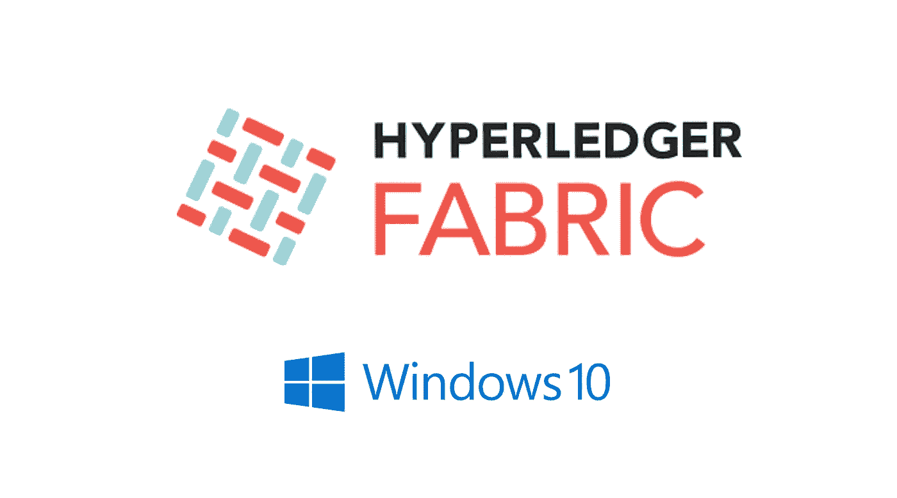

# Windows 上的 Hyperledger Fabric 1.1.0

> 原文：<https://medium.com/coinmonks/hyperledger-fabric-1-1-0-on-windows-fd142651a904?source=collection_archive---------4----------------------->



我猜你知道这个故事。你想开发一个东西，不管你是出于什么原因在 Windows 电脑上，也许你喜欢 Windows(但很可能不敢承认)，也许是公司政策，或者因为你需要它用于其他项目。不管原因是什么，你将会在一些“跨平台”的 SDK 上进行开发，而这些 SDK 并不能在 Windows 上真正工作。

不幸的是，Hyperledger 就是其中之一。理论上它应该可以工作，实际上，不用麻烦了。

本指南将让您通过 Windows 中的 Ubuntu Bash Shell 设置 Hyperledger 开发环境。

如果您还没有这样做，请按照这些指令来启用这个 shell。

如果你还没有安装 Docker，从[这里](https://www.docker.com/docker-windows)安装到你的 Windows 主机上。

我们要做的第一件事是在 Ubuntu shell 上安装 docker，并将它们链接到 Windows Docker 实例。

## [塞巴斯蒂安·戈麦斯](https://medium.com/u/6f41b7faa0f2?source=post_page-----fd142651a904--------------------------------) [为这个](/@sebagomez/installing-the-docker-client-on-ubuntus-windows-subsystem-for-linux-612b392a44c4)做了一个完美的演练

从现在开始，一切都将在 Ubuntu 外壳中

安装 Docker 撰写

```
sudo apt install docker-compose
```

安装 Go(1.9 版)

```
$ sudo add-apt-repository ppa:gophers/archive
$ sudo apt-get update
$ sudo apt-get install golang-1.9-go$ export GOPATH=$HOME/go
```

安装最新的 NodeJs LTS(8.9)

```
curl -sL https://deb.nodesource.com/setup_8.x | sudo -E bash -
sudo apt-get install -y nodejs
sudo apt-get install -y build-essential
```

安装 python

```
sudo apt-get install python
```

从 Windows 挂载 Docker-compose 有一些困难，所以我们挂载 c 盘并在那里创建一个新的工作空间。您可以通过 windows 中的 IDE 访问这个 C:/工作区。

```
sudo mkdir /c
sudo mount --bind /mnt/c /cmkdir /c/workspace && cd /c/workspace
```

如果你还没有在 docker 中分享你的 c 盘。转到 Docker 托盘图标，右键单击>-设置>共享驱动器，然后选择 c。确保您的防火墙已关闭。

还要确定您打开了文件共享，并将所有权限授予了“用户”。(右键点击 c 盘>属性>共享->高级共享->权限，添加“用户”并赋予其全部权限。

现在安装 Hyperledger 结构

```
$ cd /c/workspace
$ curl **-**sSL https:**//**goo**.**gl**/**6wtTN5 **|** bash **-**s 1.1**.**0
```

现在我们已经准备好了:

```
cd ./fabric-samples/first-network && ./byfn.sh -m generate
```

然后我们启动网络:

```
./byfn.sh -m up
```

完成后，您的网络现在可以运行了，您可以直接在 windows 下编辑代码了！

本指南基于[本指南](/cochain/hyperledger-fabric-on-windows-10-26723116c636)，但对 1.1.0 版本的 Hyperledger 进行了修改

> 如果你喜欢这篇文章，请给我一些掌声。我会在未来分享更多的文章，所以不要忘记关注，如果你认为你的朋友会喜欢这篇文章，请随时与他们分享。感谢阅读👐