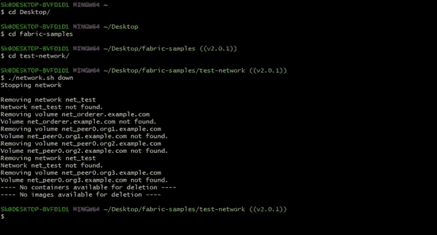
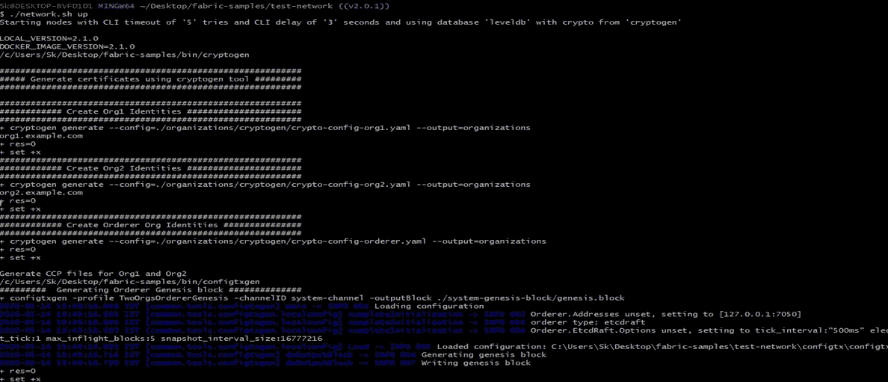
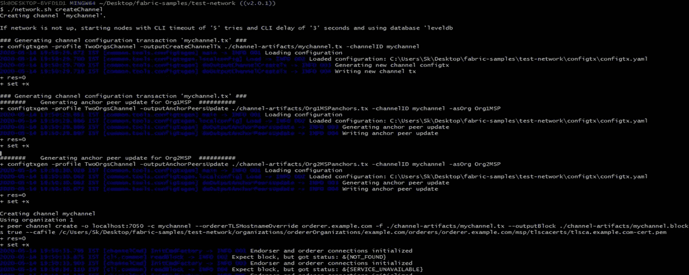
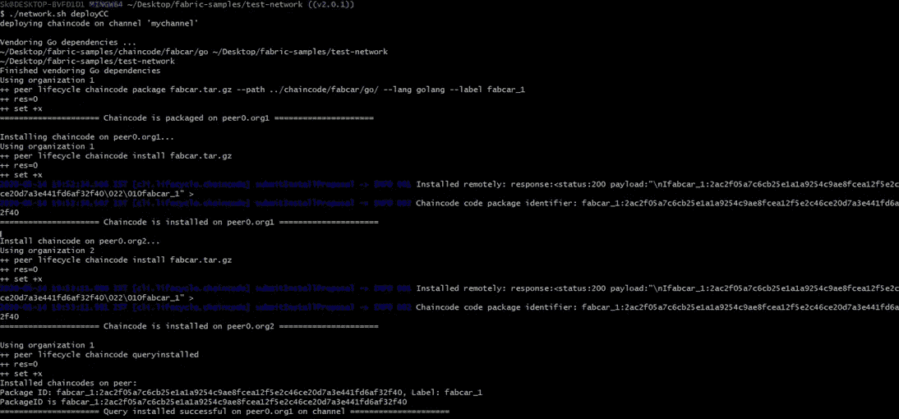
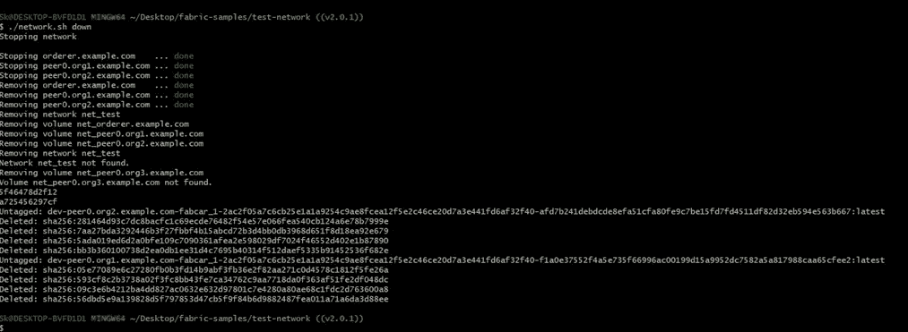

# Windows 10 上的 Hyperledger Fabric 2.0 网络设置

> 原文：<https://medium.com/coinmonks/hyperledger-fabric-2-0-network-setup-in-windows-10-417470713d95?source=collection_archive---------1----------------------->

# **简介**

大家好，

这篇博客旨在向开发者介绍在 windows 10 上原生设置 Hyperledger fabric 的概念。

在这篇博客中，我将向您展示如何在 windows 机器上构建 Hyperledger fabric 网络设置的完整分步指南。

首先，让我们看看先决条件并安装它们。

# 先决条件—

*   **安装 Git**

使用下面的命令安装 git

> [https://git-scm.com/downloads](https://git-scm.com/downloads)

使用以下命令检查版本

```
"*git — version*"
```

*   **安装卷曲**

如果您的机器上没有安装 curl，请浏览下面的链接并安装它。

 [## curl -下载

### 项目协议发布安全版本号漏洞 curl 工具手册页教程 HTTP 脚本谁和…

curl.haxx.se](https://curl.haxx.se/download.html) 

*   **安装 Docker 桌面**

如果您的机器上没有安装 Docker，请浏览下面的链接并安装它。

Docker 桌面安装包括 [Docker 引擎](https://docs.docker.com/engine/)，Docker CLI 客户端[，Docker 编写](https://docs.docker.com/compose/)，[公证人](https://docs.docker.com/notary/getting_started/)， [Kubernetes](https://github.com/kubernetes/kubernetes/) ，以及[凭证助手](https://github.com/docker/docker-credential-helpers/)。

[](https://docs.docker.com/docker-for-windows/install/) [## 在 Windows 上安装 Docker 桌面

### Docker Desktop for Windows 是 Docker for Microsoft Windows 的社区版本。你可以下载 Docker 桌面…

docs.docker.com](https://docs.docker.com/docker-for-windows/install/) 

安装后，我们必须启动 Docker 桌面。默认情况下，它不会启动，因此您必须手动启动它。要启动它，搜索 docker 并从机器上的搜索窗口结果中选择 Docker Desktop。

**测试您的安装—**

1.  **打开一个终端窗口(命令提示符或 PowerShell)。**
2.  **运行** `**docker –version”**` **以确保您有一个受支持的 Docker 版本**

```
*“ $ docker –version”
 Docker version 19.03.8, build afacb8b*
```

3.**从 Docker Hub 中拉出** [**hello-world 镜像**](https://hub.docker.com/r/library/hello-world/) **并运行一个容器**

```
*“$ docker run hello-world”**Unable to find image ‘hello-world:latest’ locally**latest: Pulling from library/hello-world**0e03bdcc26d7: Pulling fs layer**0e03bdcc26d7: Verifying Checksum**0e03bdcc26d7: Download complete**0e03bdcc26d7: Pull complete**Digest: sha256:6a65f928fb91fcfbc963f7aa6d57c8eeb426ad9a20c7ee045538ef34847f44f1**Status: Downloaded newer image for hello-world:latest*
```

4.**列出从 Docker Hub** 下载的 `**hello-world**` ***图片***

```
*“$ docker image ls”*
```

5.**列出** `**hello-world**` ***容器***

```
“*$ docker container ls –all”*
```

如果您能够看到结果，那么这是一个成功的 docker 安装在您的机器上的指示。

恭喜你！！！您成功地完成了本文的第一部分。

现在，让我们继续下一部分，这是超帐织物。

# 设置 Hyperledger 结构网络—

确定机器上您想要放置 *fabric-samples* 储存库的位置，并在命令提示窗口中输入该文件夹。

1.  使用以下命令克隆[hyperledger/fabric-samples](https://github.com/hyperledger/fabric-samples)存储库

```
*“git clone* [*https://github.com/hyperledger/fabric-samples.git*](https://github.com/hyperledger/fabric-samples.git)*”*
```

2.准备好之后，在将要安装 Fabric 示例和二进制文件的目录中，继续执行命令来下载二进制文件和映像。

```
*“curl* ***-****sSL* [*https:****//****bit****.****ly****/****2ysbOFE*](https://bit.ly/2ysbOFE)***|*** *bash* ***-****s”*
```

# 使用织物测试网络—

*   我们在这里使用 fabric test network 示例，因为 Fabric v2.0 中引入了测试网络，作为第一个网络示例的长期替代。
*   在运行测试网络之前，您需要克隆 fabric-samples 存储库并下载 fabric 映像。确保您已经安装了[先决条件](https://hyperledger-fabric.readthedocs.io/en/release-2.0/prereqs.html)和[安装了示例、二进制文件和 Docker 映像](https://hyperledger-fabric.readthedocs.io/en/release-2.0/install.html)，您也可以在这里找到**[](https://hyperledger-fabric.readthedocs.io/en/release-2.0/getting_started.html)****。******

1.  ********调出网络********

****您可以在 **fabric-samples 存储库的 **test-network** 目录中找到启动网络的脚本。**使用以下命令导航至测试网络目录****

```
cd fabric**-**samples**/**test**-**network
```

**从 test-network 目录中，运行下面的命令来删除任何以前运行的容器或工件**

```
**./**network**.**sh down
```

****

**然后，您可以通过发出以下命令来启动网络。**

```
**./**network**.**sh up
```

****

****2。创建频道****

**既然我们的机器上已经运行了 peer 和 orderer 节点，我们可以使用该脚本为 Org1 和 Org2 之间的事务创建一个 Fabric 通道。信道是特定网络成员之间通信的私有层。通道只能由被邀请进入通道的组织使用，对网络的其他成员不可见。**

```
**./**network**.**sh createChannel
```

****

**如果该命令成功，您可以在日志中看到以下消息:**

```
========= Channel successfully joined ===========
```

**3.**在通道上启动链码****

**使用 network.sh 创建通道后，可以使用以下命令在通道上启动链码**

```
**./**network**.**sh deployCC
```

****

****4。关闭网络****

**当您使用完测试网络后，您可以使用以下命令关闭网络**

```
**./**network**.**sh down
```

****

**该命令将停止并删除节点和链码容器，删除组织加密材料，并从 Docker 注册表中删除链码映像。该命令还会从以前的运行中删除频道伪像和 docker 音量。**

**哇，如果您到达这里，这意味着您已经成功地执行了所有步骤，并且在您的 Windows 系统上完成了结构设置。**

**你应该为自己出色的工作感到自豪。**

**恭喜你！！！快乐学习！**

> **[*在您的收件箱中直接获得最佳软件交易*](https://coincodecap.com/?utm_source=coinmonks)**

**[](https://coincodecap.com/?utm_source=coinmonks)**