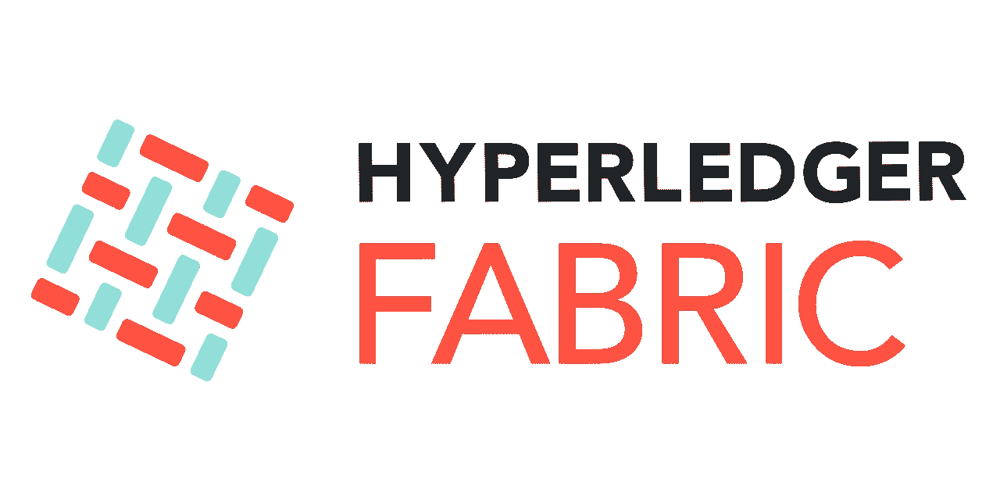
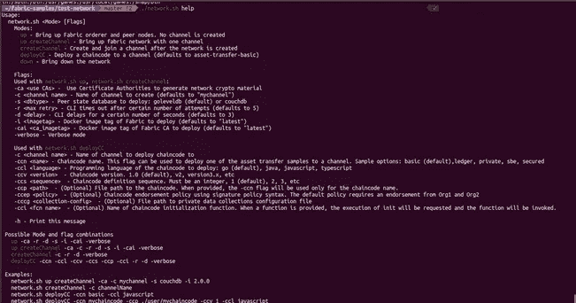
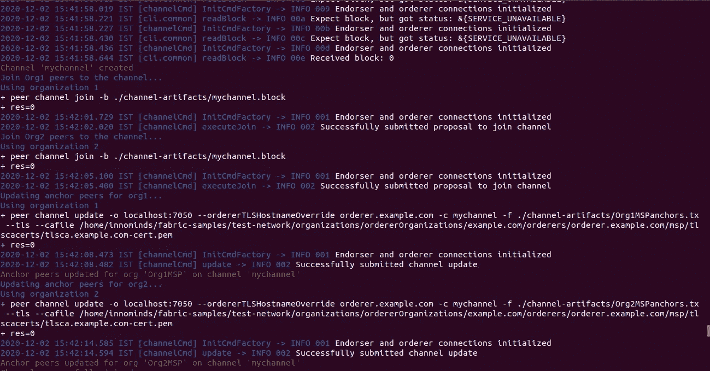
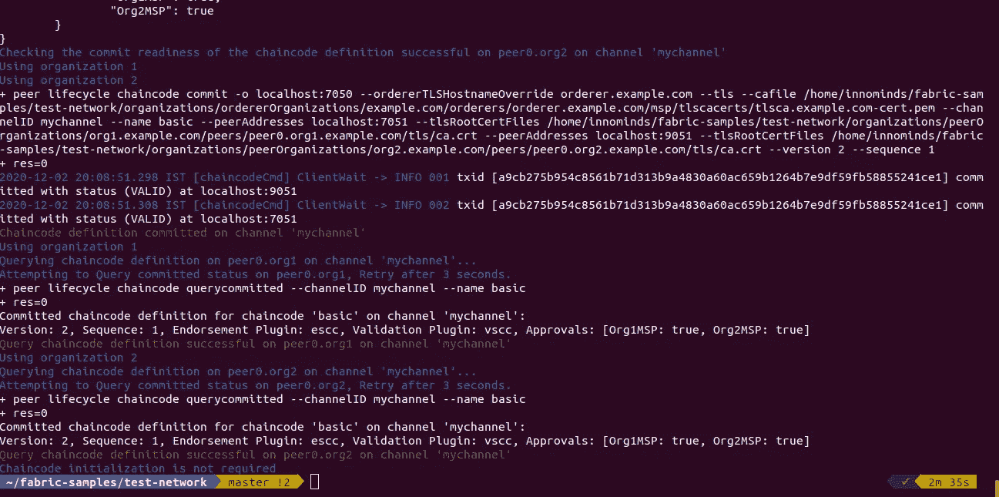
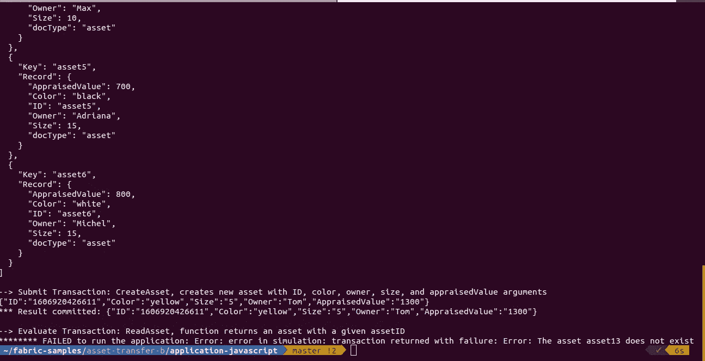

# Hyperledger Fabric 2.2 教程

> 原文：<https://medium.com/coinmonks/hyperledger-fabric-2-2-tutorial-eb21618d5fa?source=collection_archive---------2----------------------->



Hyperledger Fabric v2.2

# 概观

本文展示了如何设置 Hyperledger Fabric Network(HLF)v 2.2、部署链码、调用和查询链码。我们首先给出该过程的高级走查，然后使用 HLF 示例中提供的测试网络来演示整个过程。测试网络中提供的脚本使得将区块链网络与结构 CA 服务器结合起来变得更加容易，并且我们可以使用加密材料来执行演示。

> 查看我的[课程，了解多主机上的 Hyperledger Fabric 部署](https://www.udemy.com/course/learn-to-deploy-hyperledger-fabric-v22-on-multihost/?referralCode=8AF12D11DDC9A3D5B636)

# 高级走查

1.  使用结构 CA 服务器从组织和订购者(Org1、Org2 和订购者)生成加密材料。
2.  生成通道工件(如系统通道生成块、通道事务、通道生成块等)。
3.  更新定位点对等点。
4.  创建一个通道。
5.  加入频道。
6.  在通道上部署链码。
7.  调用或查询链码。

# 先决条件

1.  戈朗
2.  码头工人
3.  Nodejs

# 调出网络

在这里，我们首先下载 HLF 二进制文件以及 [fabric 示例](https://github.com/hyperledger/fabric-samples)。我们将使用[结构示例](https://github.com/hyperledger/fabric-samples)中提供的测试网络。我们网络将由两个各有一个对等点的组织、一个订购者节点、三个 CA 服务器(每个组织一个，订购者一个)、两个用于状态数据库的 couchdb 实例(每个对等点一个)

1.下载 fabric 二进制文件。

```
curl **-**sSL https:**//**bit**.**ly**/**2ysbOFE **|** bash **-**s **--** 2.3**.**0 1.4**.**9
```

2.设置环境变量

```
cd fabric-samples && export PATH=$PWD/bin:$PATH
```

3.一旦步骤 2 完成，进入 ***测试网络*** 文件夹。

```
cd test-network
```

4.运行命令并根据需要传递选项。运行 ***检查所有可用选项。/network.sh help***



help command

5.使用 Fabric CA 服务器、CouchDB 和创建通道`mychannel`来启动网络。

*   `-ca`:使用认证机构生成网络加密材料
*   `-c`:要创建的频道名称(默认为`"mychannel”`)
*   `-s`:要部署的对等状态数据库:`goleveldb`(默认)或`couchdb`
*   `up` —调出结构订购者和对等节点。没有创建频道。
*   `up createChannel`:用一个通道调出光纤网络。
*   `createChannel`:创建网络后，创建并加入频道

`./network.sh up createChannel -ca -c mychannel -s couchdb`

如果一切顺利，最后你会看到这样的东西。



我们已经完成了本文**高级演练**部分的步骤 1 到步骤 5。

6.下一步是部署链代码，在示例存储库中有多个链代码

*   `-ccn`:链码名称。此标志可用于将一个资产转移示例部署到渠道。示例选项:基本(默认)、分类帐、私有、sbe、安全
*   `-ccl:`要部署的链码的编程语言:`go`(默认)、`java`、`javascript`、`typescript`
*   `-verbose:`详细模式

您可以在帮助部分探索所有可用的选项

`./network.sh deployCC -ccn basic -ccl go -verbose`

一旦链码部署成功，您将得到如下输出



7.现在，链码部署已经完成，我们现在将调用和查询链码。我们将使用 nodejs SDK 与区块链网络进行交互。

`cd ../asset-transfer-basic/application-javascript && npm install`

`node app.js`



该脚本将用户 ***appUser*** 注册到 FileSystemWallet 中，并调用 chaincode 的 ***InitLedger*** 函数，该函数将在分类帐中创建 6 条记录。在此之后，它调用函数***GetAllAssets****，该函数返回存储在分类帐中的所有记录，我们可以通过 faux ton UI(****peer 0 . org 1 =>***[http://localhost:5984/_ utils/#](http://localhost:7984/_utils/#)和**peer 0 . org 2 =>**[http://来访问 CouchDB 之后，它调用 **CreateAsset** 向分类帐中添加一条新记录。](http://localhost:7984/_utils/#)

我们已经建立并运行了 HLF 网络。

# 摘要

我希望这篇文章提供了使用 Fabric CA 服务器和 CouchDB 作为状态数据库来设置 Fabric Network v2.2 的见解。

> 加入 coin monks[Telegram group](https://t.me/joinchat/EPmjKpNYwRMsBI4p)学习加密交易和投资

## 另外，阅读

*   什么是[闪贷](https://blog.coincodecap.com/what-are-flash-loans-on-ethereum)？
*   最好的[密码交易机器人](/coinmonks/crypto-trading-bot-c2ffce8acb2a) | [网格交易](https://blog.coincodecap.com/grid-trading)
*   [3 商业评论](/coinmonks/3commas-review-an-excellent-crypto-trading-bot-2020-1313a58bec92) | [Pionex 评论](/coinmonks/pionex-review-exchange-with-crypto-trading-bot-1e459d0191ea) | [Coinrule 评论](https://blog.coincodecap.com/coinrule-review-a-perfect-trading-bot)
*   [AAX 交易所评论](/coinmonks/aax-exchange-review-2021-67c5ea09330c) | [德里比特评论](/coinmonks/deribit-review-options-fees-apis-and-testnet-2ca16c4bbdb2) | [FTX 密码交易所评论](/coinmonks/ftx-crypto-exchange-review-53664ac1198f)
*   [n 零审核](/coinmonks/ngrave-zero-review-c465cf8307fc)
*   [Bybit 交易所评论](/coinmonks/bybit-exchange-review-dbd570019b71) | [Bityard 评论](https://blog.coincodecap.com/bityard-reivew) | [CoinSpot 评论](https://blog.coincodecap.com/coinspot-review)
*   [3Commas vs Cryptohopper](/coinmonks/3commas-vs-pionex-vs-cryptohopper-best-crypto-bot-6a98d2baa203)
*   最好的比特币[硬件钱包](/coinmonks/the-best-cryptocurrency-hardware-wallets-of-2020-e28b1c124069?source=friends_link&sk=324dd9ff8556ab578d71e7ad7658ad7c) | [BitBox02 回顾](/coinmonks/bitbox02-review-your-swiss-bitcoin-hardware-wallet-c36c88fff29)
*   [莱杰 vs n rave](https://blog.coincodecap.com/ngrave-vs-ledger)|[莱杰 nano s vs x](https://blog.coincodecap.com/ledger-nano-s-vs-x)
*   [密码拷贝交易平台](/coinmonks/top-10-crypto-copy-trading-platforms-for-beginners-d0c37c7d698c) | [比特码拷贝交易](https://blog.coincodecap.com/bityard-copy-trading)
*   [沃德评论](https://blog.coincodecap.com/vauld-review) | [尤霍德勒评论](/coinmonks/youhodler-4-easy-ways-to-make-money-98969b9689f2) | [区块链评论](/coinmonks/blockfi-review-53096053c097)
*   最好的[加密税务软件](/coinmonks/best-crypto-tax-tool-for-my-money-72d4b430816b) | [硬币追踪评论](/coinmonks/cointracking-review-a-reliable-cryptocurrency-tax-software-5114e3eb5737)
*   最佳[加密借贷平台](/coinmonks/top-5-crypto-lending-platforms-in-2020-that-you-need-to-know-a1b675cec3fa)
*   [莱杰纳米 S vs 特雷佐 one vs 特雷佐 T vs 莱杰纳米 X](https://blog.coincodecap.com/ledger-nano-s-vs-trezor-one-ledger-nano-x-trezor-t)
*   [block fi vs Celsius](/coinmonks/blockfi-vs-celsius-vs-hodlnaut-8a1cc8c26630)|[Hodlnaut 审查](https://blog.coincodecap.com/hodlnaut-review)
*   [Bitsgap 审查](/coinmonks/bitsgap-review-a-crypto-trading-bot-that-makes-easy-money-a5d88a336df2) | [四项审查](/coinmonks/quadency-review-a-crypto-trading-automation-platform-3068eaa374e1)
*   [埃利帕尔泰坦评论](/coinmonks/ellipal-titan-review-85e9071dd029) | [赛克斯斯通评论](https://blog.coincodecap.com/secux-stone-hardware-wallet-review)
*   [DEX Explorer](https://explorer.bitquery.io/ethereum/dex) | [区块链 API](https://explorer.bitquery.io/graphql)|[local bitcoins 评论](https://blog.coincodecap.com/localbitcoins-review)
*   [最佳区块链分析工具](https://bitquery.io/blog/best-blockchain-analysis-tools-and-software)
*   [加密套利](/coinmonks/crypto-arbitrage-guide-how-to-make-money-as-a-beginner-62bfe5c868f6)指南:新手如何赚钱
*   最佳[加密制图工具](/coinmonks/what-are-the-best-charting-platforms-for-cryptocurrency-trading-85aade584d80) | [最佳加密交易所](https://blog.coincodecap.com/crypto-exchange)
*   了解比特币最好的[书籍有哪些？](/coinmonks/what-are-the-best-books-to-learn-bitcoin-409aeb9aff4b)

> [在您的收件箱中直接获得最佳软件交易](/coinmonks/newsletters/coinmonks)

[](https://medium.com/coinmonks/newsletters/coinmonks)