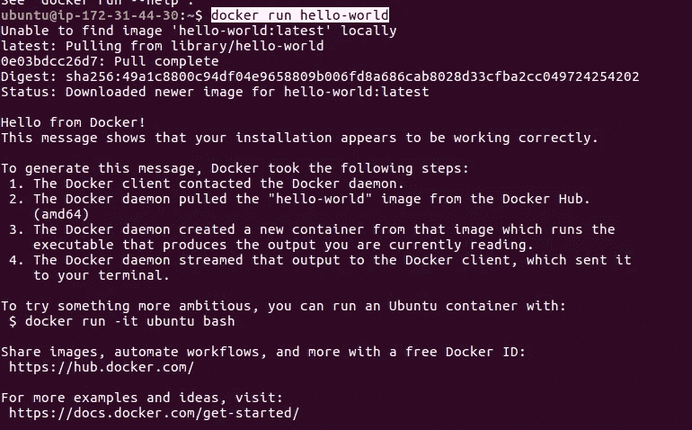
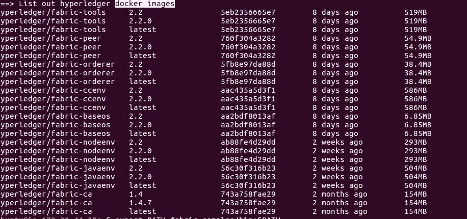
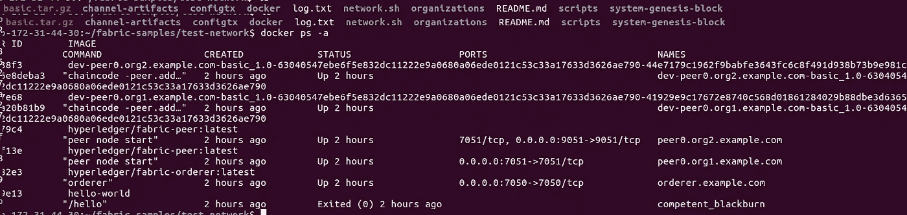
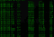

# Hyperledger Fabric 2.2 测试-10 分钟内完成网络设置！！

> 原文：<https://medium.com/coinmonks/hyperledger-fabric-2-2-version-test-network-setup-in-10-minutes-b25e0eee2606?source=collection_archive---------0----------------------->

这篇中型文章将帮助您在十分钟内创建一个 hyperledger-fabric 2.2 版本的网络。我们将安装最新版本的 hyperledger fabric，并在测试网络中试用脚本。本教程是为希望了解 fabric 2.2 网络如何一步一步运行的初学者准备的。

为此，我使用 ubuntu 16.04 LTS 版本 aws ec2 实例 T2-中等自由层虚拟机，这是一个全新的安装，我还没有在我的服务器上安装任何其他东西。

**在下载 hyperledger-fabric 2.2 二进制文件之前安装先决条件:**

**安装 curl，docker，docker-compose，nodejs & npm。**

**安装 GOlang 并设置路径如下:-**

> *wget*T8*https://dl.google.com/go/go1.14.2.linux-amd64.tar.gz*
> 
> 塔尔-xvf go1.14.2.linux-amd64.tar.gz
> 
> *sudo chown -R root:根。/go
> sudo mv go /usr/local*
> 
> *导出 GOPATH=$HOME/go
> 导出路径= $ PATH:/usr/local/go/bin:$ GOPATH/bin*
> 
> 来源~/。bashrc
> 
> *sudo systemctl 启用 docker*
> 
> *sudo usermod -a -G docker <用户名>*

通过运行以下命令，检查您的 docker 是否运行正常。

> docker 运行 hello-world

它应该会给你这样的回应



> *导出路径= <路径到下载位置> /bin:$PATH*

下载 Hyperledger 结构二进制文件

```
curl **-**sSL https:**//**bit**.**ly**/**2ysbOFE **|** bash **-**s
```

您可以通过键入以下命令来检查是否已获取 fabric2.2.0 fabric 二进制文件

> docker 图像

它应该给你看这个。



> cd 织物-样品/测试-网络/

创建网络并设置对等点和订购点。运行此命令

> 。/network.sh up

创建渠道

> *。/network.sh 创建频道*

展开链码

> *。/network.sh deployCC*

输入以下命令，检查您的链码容器是否已经启动并运行

> docker ps -a

你会看到这样的回应。



您的网络启动了，您的对等机和订购者容器启动了，您的 chaincode 安装好了，可以使用了。

在下一篇文章中，我将带你到一个更详细的网络架构，我们将深入研究 network.sh、deploy.sh、createchannel 等内部的代码。

我希望你喜欢这篇文章，如果是的话，请不要忘记鼓掌。

请继续关注更多文章，并关注我，以便在我发布任何新文章时获得通知。



> [*在您的收件箱中直接获得最佳软件交易*](https://coincodecap.com/?utm_source=coinmonks)

[](https://coincodecap.com/?utm_source=coinmonks)