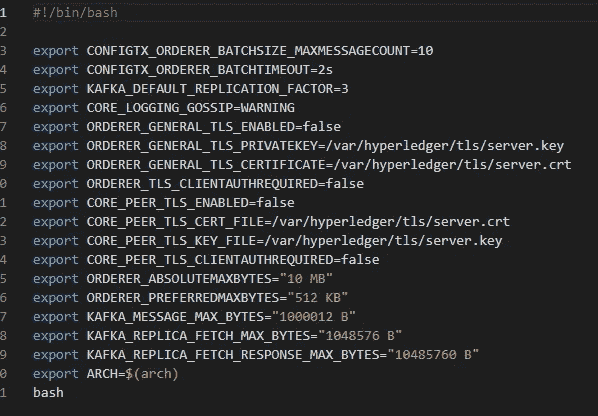
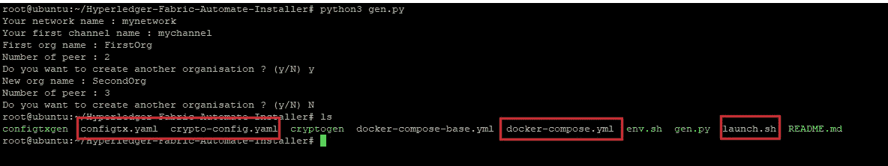
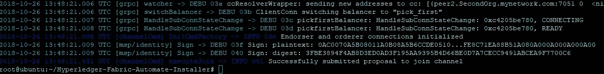
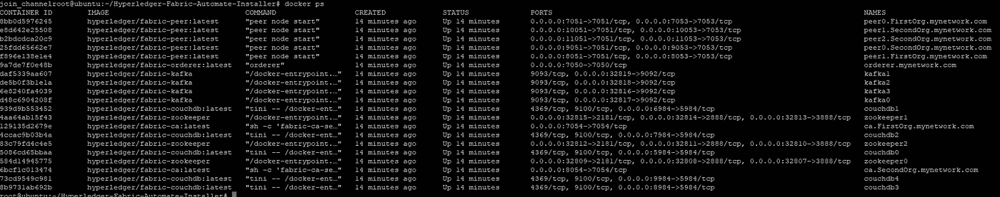

# Hyperledger 结构自动部署

> 原文：<https://medium.com/coinmonks/hyperledger-fabric-automatic-deployement-770f0c785031?source=collection_archive---------2----------------------->


Hyperledger Fabric 网络需要 3 个配置文件，每次我们更改网络结构时，都必须对其进行个性化设置。这个脚本自动完成了它。

本教程将向您展示如何创建和启动您自定义的 Hyperledger 结构网络。

> 基于 Ubuntu 16.04 的教程

# 1.安装必备组件并获取 Hyperledger 二进制文件:

[](/@pechin.leo/hyperledger-fabric-prerequisite-45830fc6613f) [## 超级分类帐结构先决条件:

### 本教程将向您展示如何安装 Hyperledger Fabric 先决条件(docker，docker-compose，golang，nodejs…

medium.com](/@pechin.leo/hyperledger-fabric-prerequisite-45830fc6613f) 

# 2.开始工作:

克隆 git 仓库:

[](https://github.com/Nihcep/Hyperledger-Fabric-Automate-Installer) [## NIH CEP/Hyperledger-Fabric-Automate-Installer

### Hyperledger 结构工具。通过创建帐户，为 NIH CEP/Hyperledger-Fabric-Automate-Installer 开发做出贡献…

github.com](https://github.com/Nihcep/Hyperledger-Fabric-Automate-Installer) 

```
git clone  [https://github.com/Nihcep/Hyperledger-Fabric-Automate-Installer.git](https://github.com/Nihcep/Hyperledger-Fabric-Automate-Installer)
```

从 Hyperledger Fabric 复制所有有用的二进制文件(configtxgen & cryptogen ),将其粘贴到 Hyperledger-Fabric-Automate-Installer 文件夹中，然后转到此文件夹:

```
cd fabric-samples/bin/
cp configtxgen cryptogen ../../Hyperledger-Fabric-Automate-Installer
cd ../../Hyperledger-Fabric-Automate-Installer
```

授予所有文件的执行权限:

```
sudo chmod 755 *
```

我们现在必须设置一些环境变量感谢 env.sh 文件，不要犹豫改变你想要的值:



执行它:

```
sudo ./env.sh
```

我们知道准备创建我们的网络！只需使用 python3 启动 gen.py:

```
python3 gen.py
```

程序会问你一些问题:

*   您要创建的网络的名称
*   将自动创建的通道的名称(将所有对等体加入)
*   您的第一个组织的名称，该组织的同级人数
*   如果你想创建其他组织，你需要多少次就说是。

## (频道和网络名称必须小写)



如您所见，该命令在我们的文件夹中创建了 4 个新文件:

*   启动 Hyperledger 结构网络的所有有用文件:configtx.yaml、crypto-config.yaml、docker-compose.yml
*   一个 launch.sh 文件，用于自动启动我们新创建的网络。

授予 launch.sh 执行权限:

```
sudo chmod 755 launch.sh
```

发射它！

```
./launch.sh
```

如果一切顺利，你必须看到:



恭喜你！您的网络现在已经启动，执行 docker ps 以查看您正在运行的容器。

```
docker ps
```



注意事项:

*   此脚本使用最新的 Hyperledger Fabric 映像(当前版本为 1.3)，只需在启动脚本之前在 docker-compose.yaml 文件中将“最新”更改为您需要的版本，以便使用另一个版本。
*   这个脚本使用 Kafka 订购系统和 couchdb 安装一个网络(您可以在这里访问您的 couchdb 实例:[http://localhost:5984/_ utils/#/_ all _ DBS](http://192.168.0.28:5984/_utils/#/_all_dbs)，为您的第二个对等点将 5984 改为 6984，依此类推)

## ***敬请关注，一些更新和全新的 Hyperledger 面料仪表盘即将推出！***

***有用链接:***

> Github:

[](https://github.com/Nihcep) [## 开源代码库

### Nihcep 有一个可用的存储库。在 GitHub 上关注他们的代码。

github.com](https://github.com/Nihcep) 

> 官方 Hyperledger 结构文档:

[](https://hyperledger-fabric.readthedocs.io/en/latest/build_network.html) [## 构建您的第一个网络- hyperledger-fabricdocs 主文档

### 编辑描述

hyperledger-fabric . readthedocs . io](https://hyperledger-fabric.readthedocs.io/en/latest/build_network.html) 

> Hyperledger 官方聊天:

 [## 超级分类帐聊天

### 编辑描述

chat.hyperledger.or](https://chat.hyperledger.org/channel/general) 

> 面向超级分类帐的论坛:

[](https://chaincodedevs.com/) [## ChaincodeDevs

### Chaincode Devs 是一个学习如何使用 Hyperledger Fabric 和其他技术构建区块链的论坛。

chaincodedevs.com](https://chaincodedevs.com/) 

> [在您的收件箱中直接获得最佳软件交易](https://coincodecap.com/?utm_source=coinmonks)

[](https://coincodecap.com/?utm_source=coinmonks)