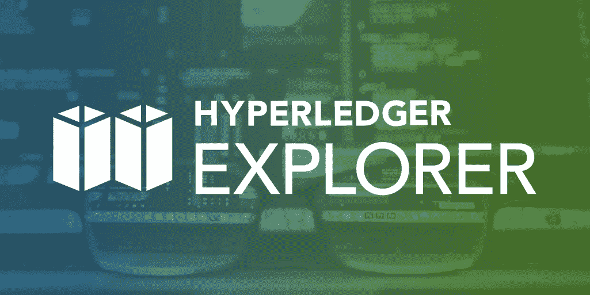
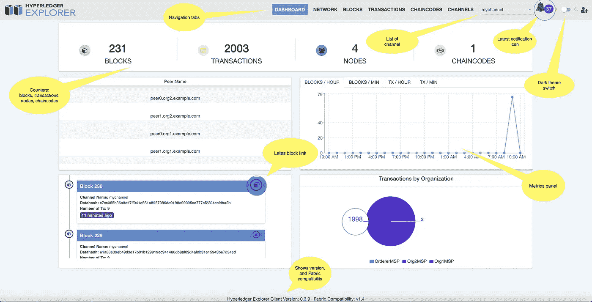
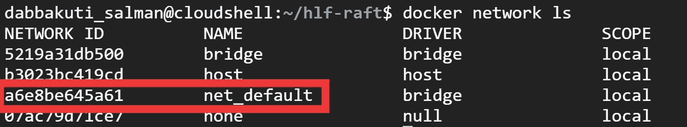
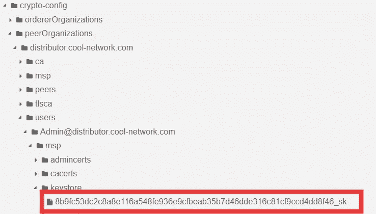
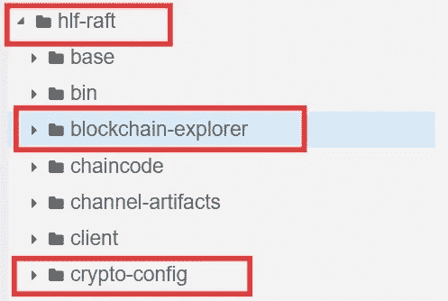
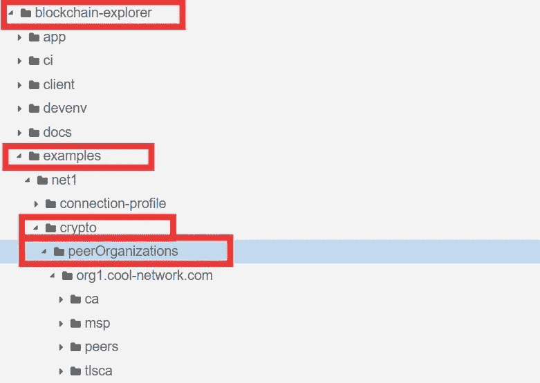
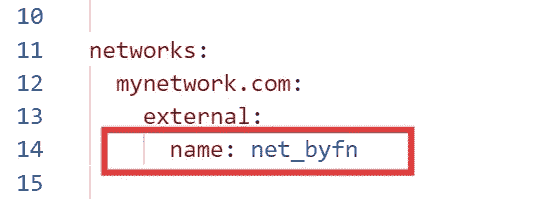

# Hyperledger 结构最佳实践#2 以最简单的方式将 Hyperledger Explorer 连接到您的网络

> 原文：<https://medium.com/coinmonks/hyperledger-fabric-best-practices-in-production-2-connect-hyperledger-explorer-to-your-network-bf0810b3a7c9?source=collection_archive---------0----------------------->



Image Source: [hyperledger.org](https://www.hyperledger.org/)

这里，我假设您已经设置了结构网络，并尝试将 explorer 连接到网络。你查看了 explorer 的官方文档，不知何故你在设置时遇到了很多问题。于是你打开 medium，搜索“连接 hyperledger explorer 到网络”。嘣！外面有很多文章。你一个接一个地打开，不知何故，它们都让你感到害怕，你需要设置 Nodejs、Postgres DB、创建表和行，以及在每个子目录上安装一堆 npm 命令。你做梦去吧。不记得怎么可能忘记？好吧，没关系！。我们大多数人都不知道，我们可以用 docker 轻松设置 hyperledger explorer。甚至，官方文档总是强调本机设置。如果我们可以在三个简单的步骤内将 explorer 连接到我们的网络，而不发生任何戏剧性的事情，会怎么样？好吧，dockerizing hyperledger 浏览器..！本文的目的是提升被低估的 dockerized explorer 设置。Dockerizing hyperledger explorer 解决了原生设置带来的许多棘手问题。我谅你也不敢用这三个步骤来设置 hyperledger explorer 到你的网络。让我们跳进来。

**等等，关于 Hyperledger Explorer 的小背景:**

人们注意到，账本中的其他原始[区块链](https://blog.coincodecap.com/what-is-blockchain-a-simple-guide-for-dummies/)数据格式困难，因此人工阅读存在障碍。区块链就是交易，区块，对吧？因此，作为开发人员，在演示区块链应用程序时，我们需要向客户展示我们的事务活动、统计数据，或者向非技术人员展示区块链是如何工作的。这就是 Hyperledger Explorer 发挥作用的地方。Hyperledger Explorer 在模板、图表、图片和图形的帮助下，创建了一个简单而有吸引力的可视化界面。Hyperledger Explorer 是一个用户友好的 Web 应用程序工具，用于查看或查询块、事务和相关数据、网络信息(名称、状态、节点列表)、链代码和事务系列，以及存储在分类帐中的任何其他相关信息。事不宜迟，让我们进入设置。



Image Source: [https://blockchain-explorer.readthedocs.io/en/master/presentation/](https://blockchain-explorer.readthedocs.io/en/master/presentation/)

## 步骤:

**步骤 1:** 将 b [锁链浏览器](https://github.com/hyperledger/blockchain-explorer)存储库克隆到您的项目根目录。

**步骤 2:** 将您的对等证书复制到区块链浏览器目录，并根据您的网络设置更新连接配置文件。

**步骤 3:** 根据您的网络修改 explorer 的 docker-compose 文件。

**先决条件:**

1.  **网络名称:**

为了将 hyperledger explorer 连接到您的网络，您的网络应该在设置 explorer 的同一台主机上启动并运行。检查您正在运行的网络，并复制网络名称，因为我们稍后需要这样做。



docker network list

**2。组织的管理员私钥:**

由于 hyperledger fabric 是一个许可网络，具有适当身份验证的参与者只能查看特定网络的分类帐数据。因此，我们需要复制参与者(组织)的私有密钥来装载 admin 用户，以便他可以访问分类帐数据。因此，请转到该组织的管理目录。即`crypto-config/peerOrganizations/org1.example.com/users/Admin@org1.example.com/msp/keystore`，并复制包含字母数字字符串并以`_sk`结尾的私钥文件名(仅文件名)。请注意，文件夹结构因网络而异。您所要做的就是复制特定组织的管理私钥。



# 步骤:

**步骤 1:将区块链资源管理器存储库克隆到您的项目根目录:**

在所有网络工件所在的项目根目录下，克隆官方的区块链资源管理器存储库。

```
git clone [https://github.com/hyperledger/blockchain-explorer.git](https://github.com/hyperledger/blockchain-explorer.git)
```



Project Root Directory where ‘hlf-raft’ is the running fabric network artifacts directory.

**步骤 2:** **将您的** `**crypto-config/peerOrganizations**` **目录复制到** `**blockchain-explorer/examples/net1/crypto**` **目录，并根据您的网络设置更新连接配置文件:**

```
cd crypto-config
cp -r peerOrganizations ../blockchain-explorer/examples/net1/crypto
```



peerOrganizations directory in “blockchain-explorer/examples/net1/crypto/

根据您的网络组件配置修改`blockchain-explorer/examples/net1/connection-profile/first-network.json`中的连接配置文件，即修改通道名称、组织名称、MSP 和对等名称。如果您的组织有多个同级，您不需要定义所有同级。定义一个对等点就足够了。如果您正在将 explorer 连接到第一网络(BYFN)，您不需要更改配置。默认情况下，所有这些命名约定都与第一网络相关。然而，作为先决条件(2)，您仍然需要用您之前复制的私钥的文件名来修改`adminPrivateKey` path。只需用复制的密钥替换默认密钥。

注意:如果您的网络结构不同于 BYFN 或传统的命名约定，即 org1.example.com。您需要根据您的网络证书路径修改`signedCert`的`path`和对等方的`tlsCaCerts`。


File Path — “blockchain-explorer/examples/net1/connection-profile/first-network.json”

第三步:根据你的网络修改资源管理器的 docker-compose 文件。

回到`blockchain-explorer`根目录，打开名为`docker-compose.yaml`的文件。在这里，您需要做的只是使用您之前作为先决条件(1)复制的运行结构网络名称修改外部网络`name`，并保存它。



File Path — “blockchain-explorer/docker-compose.yaml”

现在，在您的`blockchain-explorer`目录中，运行

```
sudo docker-compose up -d
```

在一分钟内，Hyperledger explorer 与您的网络连接，您可以查看它的运行情况。

```
[http://localhost:8080](http://localhost:8080)    #Internal
http://<machine Ip>:8090 #External
```

## 故障排除:

如果您无法在上述任何端点上查看 explorer，请使用命令`docker ps -a`检查是否所有容器都已启动并运行。如果有任何容器关闭，请检查该容器的日志。在大多数情况下，如果您的连接配置文件中有任何配置错误或者提供了错误的管理员私有密钥，`explorer.mynetwork.com` 容器将会退出。请确保您的连接配置文件配置正确，并检查您是否提供了正确的管理密钥和管理私钥的路径。

# 结论

社区中有许多关于设置 Hyperledger Explorer 的问题，因此我们决定与您分享我们的知识。感谢您的阅读，如果您有任何问题，请随时提问。这是关于" [Hyperledger Fabric 最佳实践](/series/bf95a7f80d74)"的系列文章，我将在这个系列中添加更多的实践和技巧。你们有兴趣吗？跟我来。

快乐超帐织物🙌


> [直接在您的收件箱中获得最佳软件交易](https://coincodecap.com/?utm_source=coinmonks)

[](https://coincodecap.com/?utm_source=coinmonks)