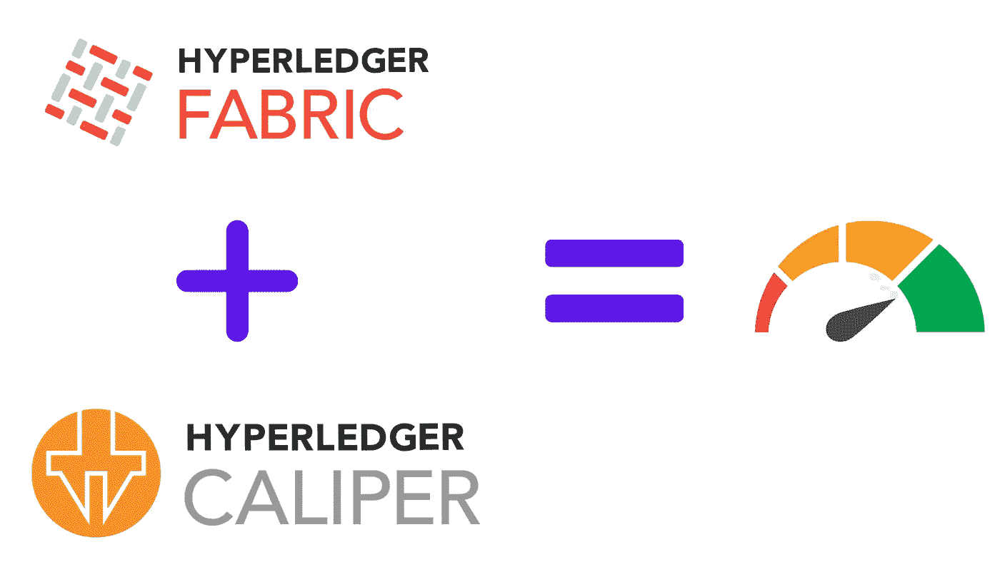
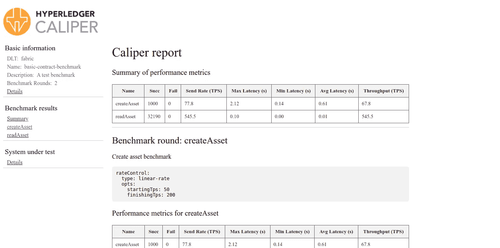

# 使用 Hyperledger 卡尺的 Hyperledger 织物性能基准测试

> 原文：<https://medium.com/coinmonks/hyperledger-fabric-blockchain-performance-benchmark-using-hyperleger-capiler-66d9a9af5cce?source=collection_archive---------0----------------------->



# 1.概观

在本文中，我们将学习如何借助 Hyperledger Caliper 对 Hyperledger Fabric 区块链进行性能基准测试。Caliper 是一个区块链性能基准框架，它允许用户使用预定义的用例测试不同的区块链解决方案，并获得一组性能测试结果。最后，caliper 以 HTML 文档的形式生成报告。

# 2.卡钳

Hyperledger Caliper 是一款区块链基准测试工具，它允许用户使用一组预定义的用例来衡量区块链实施的性能。Hyperledger Caliper 将生成包含大量性能指标的报告，作为使用以下区块链解决方案时的参考:Hyperledger Besu、以太坊、Hyperledger Fabric、FISCO BCOS。

**目前，caliper 支持以下区块链解决方案:**

*   [Hyperledger Besu](https://github.com/hyperledger/besu) ，利用以太坊适配器。
*   [总账架构 v1。x，v2。X](https://github.com/hyperledger/fabric)
*   [以太坊](https://github.com/ethereum/go-ethereum)
*   [FISCO BCOS](https://github.com/FISCO-BCOS/FISCO-BCOS)

使用卡尺，您可以获得以下性能指标:

*   接通率
*   事务/读取吞吐量
*   事务/读取延迟(最小、最大、平均)
*   资源消耗(CPU、内存、网络 IO 等)

# **3。先决条件**

1.  运行中的 HLF 网络(参见[本](/coinmonks/hyperledger-fabric-2-2-tutorial-eb21618d5fa)或[本](https://bit.ly/hlf-advance))。
2.  必须安装 NodeJS(我在节点版本 10、12 和 14 上测试了这一点)。

# **4。设置**

1.  克隆存储库

```
$ git clone [https://github.com/adityajoshi12/fabric-samples-advance-topics](https://github.com/adityajoshi12/fabric-samples-advance-topics).git
$ cd fabric-samples-advance-topics/test-network
$ ./network.sh up createChannel -ca -c mychannel  -i 2.2 -s couchdb
$ ./network.sh deployCC -ccn basic -ccv 1
```

2.要设置 caliper，让我们从创建文件夹开始，我们将在下载的存储库的根级别创建一个名为 caliper 的文件夹，之后，我们需要在 caliper 目录中创建 3 个文件夹。

```
$ cd caliper
$ mkdir networks benchmarks workload
$ npm init -y
$ npm install --only=prod @hyperledger/caliper-cli@0.4.2
$ npx caliper bind --caliper-bind-sut fabric:2.2
```

# 5.网络结构

现在，我们将创建卡尺与区块链网络交互所需的网络配置文件。我们将在上一步创建的网络文件夹中创建一个文件`[networkConfig.yaml](https://gist.github.com/adityajoshi12/1a3d01d6cf3f512db638f07a9ff49c2f)`(确保您传递的是正确的证书路径)。

# 6.基准配置

之后，我们将创建我们的基准配置文件，我将把我所有的基准配置保存在基准文件夹中。我将创建名为`[assetCCBenchmark.yaml](https://gist.github.com/adityajoshi12/ed1beef9ca9f3e97d2759d3f43737321)`的文件。
基准配置文件定义了基准轮次，并引用了定义的工作负载模块。它将指定生成负载时使用的测试工作者的数量、测试回合的数量、每回合的持续时间、每回合期间应用于事务负载的速率控制，以及与监控相关的选项。对于本教程，我已经使用 docker 模块对 docker 容器进行了监控。

*   **测试**:包含基准测试信息的根级块。
*   **名称**:测试的名称，在本例中为“基础-合同-基准”。
*   **描述**:对基准的描述，在这里是“测试基准”。
*   **workers** :一组键，用于定义后续基准测试中使用的 workers(独立的 worker-client 实例)的数量。
*   **轮次**:将按顺序进行的不同测试轮次的数组。回合可用于以不同的方式对不同的智能合约方法或相同的方法进行基准测试。

每个`round`模块包含以下内容:

*   `label` -用于该轮的唯一标题标签。
*   `description` -正在运行的回合的描述。
*   `txDuration` -测试持续时间的规格，以秒为单位。
*   `txNumber` —要执行的交易数量。
*   `rateControl` -一种速率控制类型，带选项。
*   `workload` -要使用的工作负载模块，带有要传递给该模块的参数。所有传递的参数在工作负载模块中都可以作为`roundArguments`获得。

`rate controllers`有多种类型，如`fixed-load`、`fixed-rate`、`fixed-feedback-rate`、`linear-rate`等

# 7.创建测试工作负载模块

在基准测试期间，工作负载模块与部署的智能合同进行交互。工作负载模块从`caliper-core`扩展了卡钳类`WorkloadModuleBase`。工作负荷模块提供三种覆盖:

*   `initializeWorkloadModule` -用于初始化基准所需的任何项目
*   `submitTransaction` -用于在基准的监控阶段与智能合约方法进行交互
*   `cleanupWorkloadModule` -用于完工后的清理基准

现在我们需要创建一个`[createAsset](https://gist.github.com/adityajoshi12/b333ab39fca7cb48a2f154f3bdb146e0)`模块，它将在区块链中创建资产，我们使用随机数据，您可以有自己的实现。我们需要将以下细节传递给`sendRequests`:

*   `contractId` —要使用的智能合约的名称，该名称存在于 Caliper 网络配置文件中。
*   `contractFunction` —智能合约中要调用的特定函数。
*   `contractArguments` —传递给智能合同函数的参数。
*   `invokerIdentity`—Caliper 网络配置文件中存在的要使用的身份。这可以是可选的，caliper 将为您选择一个身份(从适当的调用组织或默认组织中),在本教程中，只能选择一个身份，但为了完整起见，示例明确定义了身份。
*   `readOnly` —是否执行查询操作。

以类似的方式，让我们创建用于从智能合约读取数据的`readAsset`模块。我们在`initializeWorkloadModule`中创建了一些数据，在`submitTransaction`中，我们从智能合同中读取数据，在`cleanupWorkloadModule`中，我们删除了在`initializeWorkloadModule`中创建的所有资产。

# 8.运行卡尺基准测试

现在，我们已经准备好使用配置文件和测试模块运行性能基准测试了。性能基准将使用 Caliper CLI 运行，需要为其提供工作区路径以及网络配置文件和基准配置文件的工作区相对路径。该信息分别带有标志`--caliper-workspace`、`--caliper-networkconfig`和`--caliper-benchconfig`。

由于智能合同已经安装并提交，Caliper 只需要执行测试阶段。这通过使用标志`--caliper-flow-only-test`来指定。

由于我们使用的是 2.2 SUT，我们必须指定使用网关功能，因为 2.x 连接器没有非网关版本，所以指定标志`--caliper-fabric-gateway-enabled`

```
// ensure that you are in caliper folder
$ npx caliper launch manager --caliper-workspace ./ --caliper-networkconfig networks/networkConfig.yaml --caliper-benchconfig benchmarks/assetCCBenchmark.yaml --caliper-flow-only-test --caliper-fabric-gateway-enabled
```

# 9.卡钳配置(可选)

在第 8 步中，我们学习了如何运行卡尺测试，但使用的命令太长，这可以通过使用配置文件来改进，我们可以将所有这些参数放在文件中，并与`caliper-cli`一起使用。

为此，我们需要在`caliper`文件夹中再创建一个文件`caliper.yaml`。

最后，我们可以使用命令运行它。

```
$ npx caliper launch manager --caliper-fabric-gateway-enabled
```

# 10.基准测试结果

结果报告将生成为`report.html`，并可在浏览器中查看。每个基准回合的以下项目:

*   `Name`-基准配置文件中的倒圆角名称
*   `Succ/Fail` —成功/失败交易的数量
*   `Send Rate` —卡尺发行交易的利率
*   `Latency (max/min/avg)` —与发出交易和收到响应之间所用时间(秒)相关的统计数据
*   `Throughput` —平均每秒处理的事务数



# 11.摘要

在本文中，我们学习了如何使用 caliper 测试我们的 hyperledger fabric 应用程序。源代码可以在[这里](http://bit.ly/hlf-advance)找到

如果你觉得这篇文章很有帮助，请点击拍手按钮，并跟随我阅读更多这样的信息丰富的文章。

你可以在 [Linkedin](https://linkedin.com/in/adityajoshi12) 上找到我或者在 [GitHub](https://github.com/adityajoshi12) 上跟踪我？如果这对你来说太社交化了，如果你想和我讨论技术，就给 adityaprakashjoshi1@gmail.com 发封邮件。


> 加入 Coinmonks [电报频道](https://t.me/coincodecap)和 [Youtube 频道](https://www.youtube.com/channel/UCbyDhTbOiKh2iUMKBi4-4Zg)了解加密交易和投资