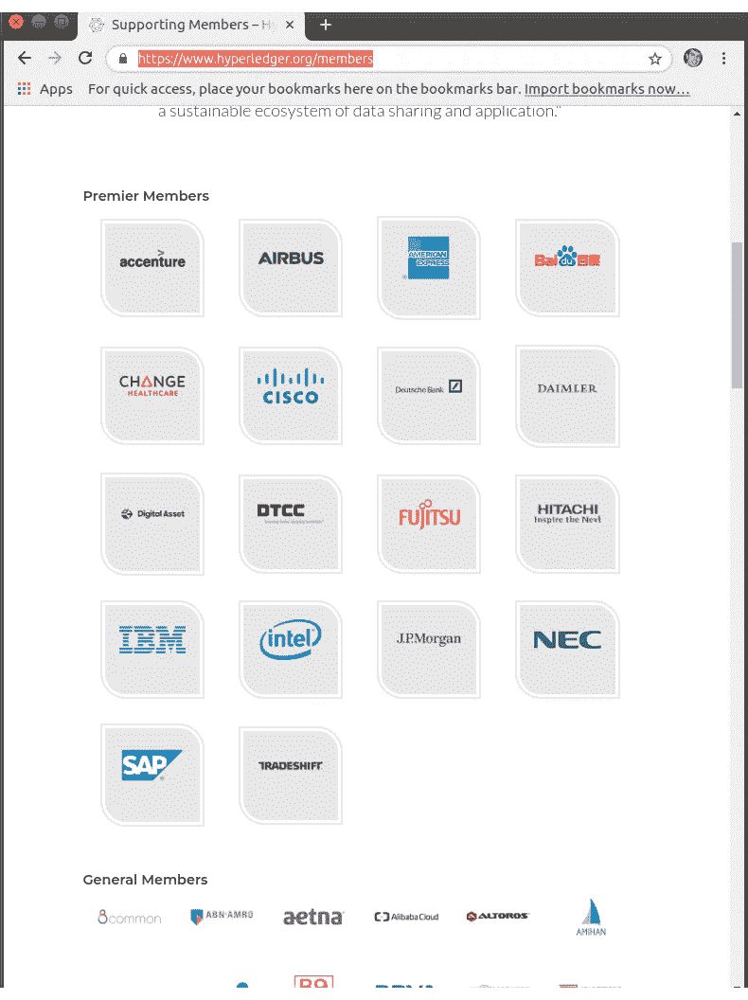

# 超分类帐结构示例:第 1 部分

> 原文：<https://medium.com/coinmonks/hyperledger-fabric-by-example-part-1-758547e9fb04?source=collection_archive---------1----------------------->

## 2019 年感觉是学习分布式账本技术的一年。区块链。

**什么/为什么是 Hyperledger 结构？**

> Hyperledger Fabric 是一个开源的企业级许可分布式分类帐技术(DLT)平台，设计用于企业环境，提供了一些超越其他流行的分布式分类帐或区块链平台的关键差异化功能。

*—总账面料—* [*简介*](https://hyperledger-fabric.readthedocs.io/en/release-1.3/whatis.html)

至于为什么；“你和你的团队一样优秀。”

> [发现并回顾最佳区块链软件](https://coincodecap.com)

**为什么是这个系列？**

在学习 *Hyperledger Fabric* 时，我从阅读 *Hyperledger Fabric 的* [概念文档](https://hyperledger-fabric.readthedocs.io/en/release-1.3/key_concepts.html)开始。我的脑子里充满了新的概念，于是我一头扎进了他们的实践教程 [*编写你的第一个应用程序*](https://hyperledger-fabric.readthedocs.io/en/latest/write_first_app.html) 。

它进行得并不顺利；我努力将实践步骤与概念联系起来。在这个系列中，我们将重温动手教程；这一次我们将详细探索概念和软件组件。

**先决条件**

如果你想跟进，你需要安装[先决条件](https://hyperledger-fabric.readthedocs.io/en/latest/prereqs.html)和 [*织物样品*](https://hyperledger-fabric.readthedocs.io/en/latest/install.html) 。

**注意**:与其外观相反， *fabric-samples* 安装还包括 *Hyperledger Fabric* 二进制文件(命令行工具和 *Docker* 图像)。

**软件组件**

在浏览文档时，一个基本的挑战是确定他们的( *Hyperledger Fabric* )软件和我的(操作员/开发人员)软件之间的界限；例如，他们的实践教程严重依赖于 shell 脚本(他们的还是我的？)

在准备撰写本系列时，我对他们的软件组件提出了一个工作假设(如果我了解到其他情况，以后会修改)。

*码头工人图片*

他们的服务器软件通过 *Docker Hub* 上的 *Docker* 映像交付，例如[*hyperledger/fabric-peer*](https://hub.docker.com/r/hyperledger/fabric-peer)。

*命令行界面(CLI)工具*

*fabric-samples* 安装提供了许多[命令行界面工具](https://hyperledger-fabric.readthedocs.io/en/latest/command_ref.html)；用于控制 *Docker* 图像；通过配置文件或 API 调用。

*Hyperledger Fabric SDK*(NPM 软件包)

[*Hyperledger Fabric SDK*](https://hyperledger-fabric.readthedocs.io/en/latest/getting_started.html#hyperledger-fabric-sdks)*(我们将重点关注 *Node.js* SDK)控制 *Docker* 图像的方式与 CLI 工具非常相似。它们通过两个 NPM 包[*fabric-client*](https://www.npmjs.com/package/fabric-client)和[*fabric-client-ca*](https://www.npmjs.com/package/fabric-ca-client)交付。*

**链码接口* (NPM 包)*

*最后，还有 NPM 包， [*fabric-shim*](https://www.npmjs.com/package/fabric-shim) ，它提供了一种开发智能合约的机制。，chaincode，在 *JavaScript* 中。*

***魔法***

**编写你的第一个应用*教程的第一步是:*

> *使用 startFabric.sh shell 脚本启动您的网络。这个命令将启动一个由对等方、订购方、认证机构等组成的区块链网络。它还将安装和实例化 FabCar 智能契约的 javascript 版本，我们的应用程序将使用该版本来访问分类帐。在本教程中，我们将学习更多关于这些组件的知识。*

**—Hyperledger Fabric—*[*编写您的第一个应用程序*](https://hyperledger-fabric.readthedocs.io/en/latest/write_first_app.html)*

***什么？！？这里有相当多的魔法。因此，我需要打破角色，使用我最喜欢的一张照片，因为它完美地捕捉了我对魔术的感受。***

*相反，我们将剖析 *startFabric.sh* ，并(希望)将一切都与概念和软件组件联系起来。*

***1/19/2019 更新**:解剖 *startFabric.sh* 后，似乎他们走了一些没有记录的捷径；切换到剖析单独的*Hyperledger Fabric*[*构建你的第一个网络*](https://hyperledger-fabric.readthedocs.io/en/latest/build_network.html) 教程中同样神奇的 *byfn.sh* 脚本。在本教程中，他们更深入地研究了脚本的实际功能(希望不要走没有记录的捷径)。*

***接下来的步骤***

*在下一篇文章中，[*Hyperledger Fabric By Example:Part 2*](/@johntucker_48673/hyperledger-fabric-by-example-part-2-57242add8409)，我们开始深入细节*

***同样，阅读***

*   *[顶级 DeFi 项目](/coinmonks/defi-future-10-promising-projects-in-the-defi-world-ff2b697ab006)*
*   *[最佳加密交易机器人](/coinmonks/whats-the-best-crypto-trading-bot-in-2020-top-8-bitcoin-trading-bot-c16adeb13317)*
*   *最好的比特币[硬件钱包](/coinmonks/the-best-cryptocurrency-hardware-wallets-of-2020-e28b1c124069?source=friends_link&sk=324dd9ff8556ab578d71e7ad7658ad7c)*
*   *最好的[加密税务软件](/coinmonks/best-crypto-tax-tool-for-my-money-72d4b430816b)*
*   *[最佳加密交易平台](/coinmonks/the-best-crypto-trading-platforms-in-2020-the-definitive-guide-updated-c72f8b874555)*
*   *[unis WAP 最佳钱包](/coinmonks/best-wallets-to-use-uniswap-e91a6385d9e8)*
*   *Bitsgap 评论——一个轻松赚钱的加密交易机器人*
*   *为专业人士设计的加密交易机器人*
*   *Bitmex 上的[保证金交易的白痴指南](/coinmonks/the-idiots-guide-to-margin-trading-on-bitmex-dbbd7742c6fc?source=friends_link&sk=7bfa99d2a181142510c8442c8ddb0786)*
*   *[加密摇摆交易的权威指南](/coinmonks/the-definitive-guide-to-crypto-swing-trading-7e4af6496d4d?source=friends_link&sk=70448050bd9323b42f63bfc0bb1e60d1)*
*   *[Bitmex 高级保证金交易指南](/coinmonks/bitmex-advanced-margin-trading-guide-2270c195ce25?source=friends_link&sk=1d986cca731f5084b9a2db4a4bc4a7ad)*
*   *面向开发者的最佳加密 API*
*   *[加密套利](/coinmonks/crypto-arbitrage-guide-how-to-make-money-as-a-beginner-62bfe5c868f6)指南:新手如何赚钱*
*   *顶级[比特币节点](https://blog.coincodecap.com/bitcoin-node-solutions)提供商*

> *[直接在您的收件箱中获得最佳软件交易](https://coincodecap.com?utm_source=coinmonks)*

**