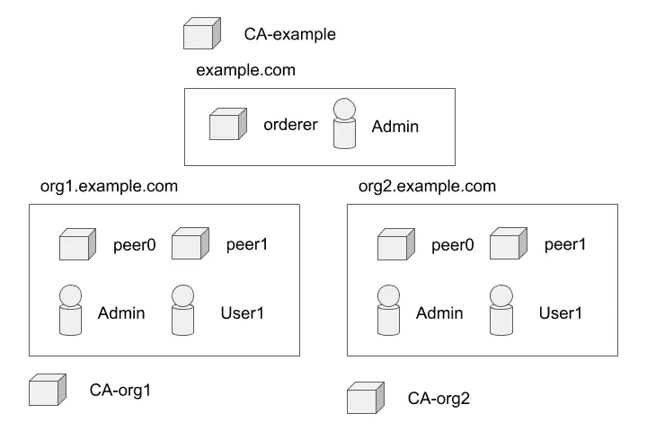

# 超分类帐结构示例:第 2 部分

> 原文：<https://medium.com/coinmonks/hyperledger-fabric-by-example-part-2-57242add8409?source=collection_archive---------3----------------------->

## 探索 *Hyperledger Fabric* 如何严重依赖数字证书。


本文是以[*Hyperledger Fabric By Example:Part 1*](/@johntucker_48673/hyperledger-fabric-by-example-part-1-758547e9fb04)开始的系列文章的一部分。

正如上一篇文章中所讨论的，我们将剖析 byfn.sh 的*,并将一切与概念和软件组件联系起来。*

本教程让您运行的第一个命令是:

```
./byfn.sh generate
```

**隐源**

按照脚本的逻辑，第一个有影响的命令是:

```
cryptogen generate --config=./crypto-config.yaml
```

使用以下配置(去掉大量注释):

*。/first-network/crypto-config . YAML*

[*Cryptogen*](https://hyperledger-fabric.readthedocs.io/en/latest/commands/cryptogen.html) 是 *fabric-samples* 安装中提供的命令行界面工具之一:

> cryptogen 是一个用于生成 Hyperledger 结构密钥材料的实用程序。它是一种为测试目的而预先配置网络的方法。它通常不会用于生产网络的运行。

*—超帐织物—* [*隐源*](https://hyperledger-fabric.readthedocs.io/en/latest/commands/cryptogen.html)

观察结果:

*   构建你的第一个网络教程对这个工具的功能有一个合理的描述。从根本上说，我们正在为我们的示例网络创建数字证书基础设施；在生产中，这将通过从支持 [*ECDSA*](https://blog.cloudflare.com/ecdsa-the-digital-signature-algorithm-of-a-better-internet/) 的[认证机构](https://en.wikipedia.org/wiki/Certificate_authority)获得数字证书来手动完成
*   *超帐结构*在 [*超帐结构—标识*](https://hyperledger-fabric.readthedocs.io/en/latest/identity/identity.html) 中提供了相关的概念文档
*   在我们运行 *cryptogen* 工具后，生成的数字证书和密钥将被保存到一个名为 *crypto-config* 的文件夹中。它创建的 [109 个目录和 107 个文件](https://gist.github.com/larkintuckerllc/8c2f390081204ab132ccd4b8a7be5e7a)有点吓人。我们将在后面探讨如何使用其中的每一个

**示例网络**

示例网络由节点和用户组成；每个都有自己的证书和密钥。



在这种情况下，请注意三个证书颁发机构(CA):

> 为每个组织提供一个唯一的根证书(ca-cert ),将特定组件(对等方和订购方)绑定到该组织。通过为每个组织分配一个唯一的 CA 证书，我们模拟了一个典型的网络，其中参与成员将使用自己的证书颁发机构。

*—Hyperledger Fabric—*[*构建您的第一张网络*](https://hyperledger-fabric.readthedocs.io/en/latest/build_network.html#how-does-it-work)

虽然 *Hyperledger Fabric* 提供了它们自己的[证书授权实现](https://hyperledger-fabric-ca.readthedocs.io/en/latest/)(通过 *Docker* 映像)供开发期间使用，但本教程并不要求实例化它们；我们使用 *cryptogen* 命令行界面工具预先生成所有的数字证书和密钥。

**Configtxgen**

回到`./byfn.sh generate`脚本中的下一个有影响的命令，我们看到它使用了 *fabric-samples* 安装中提供的另一个命令行界面工具(四次): [*configtxgen*](https://hyperledger-fabric.readthedocs.io/en/latest/commands/configtxgen.html) 。

```
configtxgen -profile TwoOrgsOrdererGenesis -outputBlock ./channel-artifacts/genesis.blockconfigtxgen -profile TwoOrgsChannel -outputCreateChannelTx ./channel-artifacts/channel.tx -channelID $CHANNEL_NAMEconfigtxgen -profile TwoOrgsChannel -outputAnchorPeersUpdate ./channel-artifacts/Org1MSPanchors.tx -channelID $CHANNEL_NAME -asOrg Org1MSPconfigtxgen -profile TwoOrgsChannel -outputAnchorPeersUpdate \
    ./channel-artifacts/Org2MSPanchors.tx -channelID $CHANNEL_NAME -asOrg Org2MSP
```

至于这个工具是做什么的。

> configtxgen 命令允许用户创建和检查与通道配置相关的工件。

*—Hyperledger Fabric—*[*configtxgen*](https://hyperledger-fabric.readthedocs.io/en/latest/commands/configtxgen.html)

没什么帮助。更糟糕的是，这个工具使用了自文档化的配置文件；在这个例子中，它有 322 行长； [*。/first-network/configtx . YAML*](https://gist.github.com/larkintuckerllc/7ae7d7b47cdf731a2ccb2a386bb2d383)。

**下一步**

在下一篇文章中，[*Hyperledger Fabric By Example:Part 3*](/@johntucker_48673/hyperledger-fabric-by-example-part-3-8f28b6080852)*，*我们通过构建一个最小网络来继续探索关键的 *Hyperledger Fabric* 概念。

[](http://bit.ly/2G71Sp7)

> [直接在您的收件箱中获得最佳软件交易](https://coincodecap.com/?utm_source=coinmonks)

[](https://coincodecap.com/?utm_source=coinmonks)