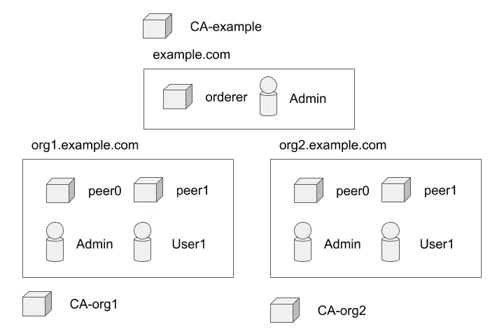
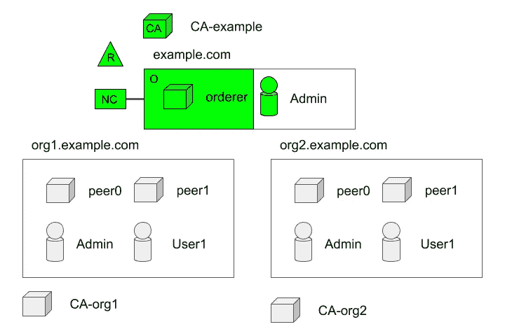
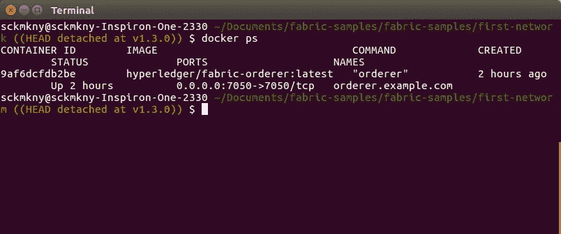

# 超分类帐结构示例:第 3 部分

> 原文：<https://medium.com/coinmonks/hyperledger-fabric-by-example-part-3-8f28b6080852?source=collection_archive---------0----------------------->

## **建立一个最小的网络。**


本文是以[*Hyperledger Fabric By Example:Part 1*](/@johntucker_48673/hyperledger-fabric-by-example-part-1-758547e9fb04)开始的系列文章的一部分。

此时，我们有了下图中每个网络元素的身份(数字证书和密钥)。我们也知道证书颁发机构(CA)的作用是生成这些身份；然而，在本教程中，我们使用了 *cryptogen* 命令行界面工具来生成它们，因此我们不需要 CAs 的运行实例。



这些网络元件是*超级分类帐结构*网络的这个例子的物理元件，即主机和用户。同时，该图中缺少逻辑覆盖，例如组织等。

由于有相当多的新概念要学习，我们将采用[*Hyperledger Fabric block chain Network*](https://hyperledger-fabric.readthedocs.io/en/latest/network/network.html)*文档的方法，一步一步地构建网络。*

***最小网络***

*我们从文档 [*超链接结构中描述的最小网络开始:区块链网络——创建网络*](https://hyperledger-fabric.readthedocs.io/en/latest/network/network.html#creating-the-network) ( **在继续**之前阅读本节)。该网络的元素(绿色)在文档中进行了标识。*

**

*从我们早期的工作中，我们已经了解了**认证中心(CA)** 的角色。*

*第一个逻辑元素是一个**组织(R)；**可以认为绿色作为元素是与组织相联系的。*

> *也被称为“成员”的组织是由区块链服务提供商邀请加入区块链网络的。组织通过将其成员资格服务提供商(MSP)添加到网络来加入网络。MSP 定义了网络中的其他成员如何验证签名(如交易中的签名)是由该组织发布的有效身份生成的。*

**—Hyperledger Fabric—*[*词汇表*](https://hyperledger-fabric.readthedocs.io/en/latest/glossary.html#organization)*

*在本例中，我们创建了第一个组织*order org*，它基于我们之前创建的以下数字证书，也称为**成员资格服务提供商(MSP)** :*

**。/first-network/crypto-config/order organizations/example . com/MSP/**

```
*.
├── admincerts
│   └── [Admin@example.com](mailto:Admin@example.com)-cert.pem
├── cacerts
│   └── ca.example.com-cert.pem
└── tlscacerts
    └── tlsca.example.com-cert.pem*
```

*以及以下配置文件的相关部分(注释被删除):*

**。/first-network/configtx . YAML**

*观察结果:*

*   *包括这个文件在内的配置文件是自文档化的；尽管模糊不清*
*   *该配置的主要优点是，我们将**的*管理员*用户**(由数字证书*Admin @ example . com-cert . PEM*定义)定义为 *OrderOrg* 组织的管理员*

*另一个逻辑元素是**order(O):***

> *将事务排序到一个块中的定义的节点集合。订购服务独立于对等进程而存在，并根据先来先服务的原则为网络上的所有渠道订购交易。订购服务旨在支持开箱即用的 SOLO 和 Kafka 以外的可插拔实现。订购服务是整个网络的公共绑定；它包含绑定到每个成员的加密身份材料。*

**—Hyperledger Fabric—*[*词汇表*](https://hyperledger-fabric.readthedocs.io/en/latest/glossary.html#ordering-service)*

*以及同一配置文件的相关部分:*

**。/first-network/configtx . YAML**

*观察结果:*

*   *这种配置的主要方式，也称为**网络配置(NC)** ，是我们定义一个 solo 类型的订购者，由一个节点组成:*orderer.example.com*与 *OrderOrg* 组织相关联。*
*   *[整个配置文件](https://gist.github.com/larkintuckerllc/45694a2e4d6b5b992ba1ee1c14bc7d09)是为这个最小网络准备的*

***注**:由于一些技术限制，最小网络实际上需要定义一个联合体(我们将在后面介绍)。*

*使用这个配置文件，我们构建了 *genesis.block* 文件；将用于自举*orderer.example.com*节点。*

```
*configtxgen -profile TwoOrgsOrdererGenesis -channelID byfn-sys-channel -outputBlock ./channel-artifacts/genesis.block*
```

***注意**:虽然我们将在后面介绍通道，但是订购者中的节点(在这种情况下只有一个)通过一个通道进行通信，例如 *byfn-sys-channel。**

*我们接下来定义 *Docker Compose* 文件来显示订购者的单个节点；orderer.example.com*:**

**。/first-network/docker-compose-CLI . YAML**

*哪个引用了这个 *Docker 编写*文件:*

**。/first-network/base/docker-compose-base . YAML**

*观察结果:*

*   *找不到关于*超级分类帐/结构订单*图像的文档*

*我们通过以下方式建立网络:*

```
*docker-compose -f docker-compose-cli.yaml up*
```

*通过运行:*

```
*docker ps*
```

*我们可以看到我们有一个单一的*orderer.example.com*实例:*

**

***下一步***

*在下一篇文章[*hyper ledger Fabric By Example:Part 4*](/@johntucker_48673/hyperledger-fabric-by-example-part-4-f6b2e9e35842)中，我们将随着网络的扩展不断引入新概念。*

*[](http://bit.ly/2G71Sp7)*

> *[直接在您的收件箱中获取最佳软件交易](https://coincodecap.com/?utm_source=coinmonks)*

*[](https://coincodecap.com/?utm_source=coinmonks)*