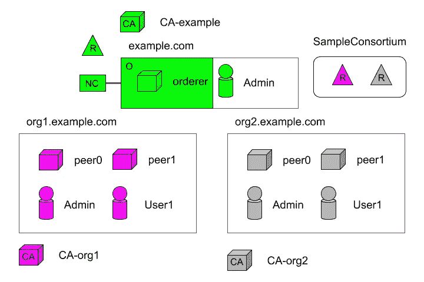
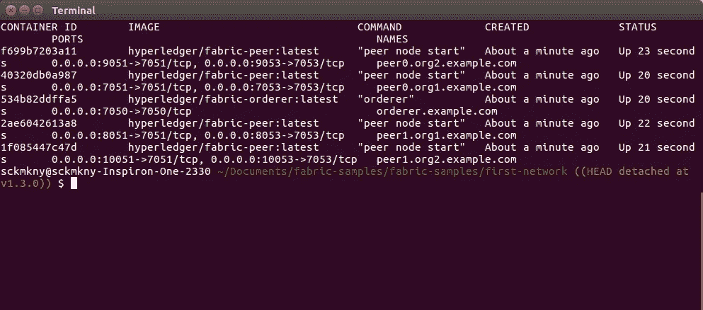

# 超分类帐结构示例:第 4 部分

> 原文：<https://medium.com/coinmonks/hyperledger-fabric-by-example-part-4-f6b2e9e35842?source=collection_archive---------2----------------------->

在联盟中加入新的组织。


本文是以[*Hyperledger Fabric By Example:Part 1*](/@johntucker_48673/hyperledger-fabric-by-example-part-1-758547e9fb04)开始的系列文章的一部分。

我们继续构建我们的网络，同时引入新概念，如概念性的*Hyperledger Fabric block chain Network*文档中的 [*添加网络管理员*](https://hyperledger-fabric.readthedocs.io/en/latest/network/network.html#adding-network-administrators) 和 [*定义联盟*](https://hyperledger-fabric.readthedocs.io/en/latest/network/network.html#defining-a-consortium) 部分所述(**请在继续**之前阅读这些部分)。

**财团**

我们遇到的第一个新概念是**财团**:

> 联盟是区块链网络上非订购者组织的集合。这些是形成和加入渠道并拥有同行的组织。一个区块链网络可以有多个财团，而大多数区块链网络只有一个财团。在创建渠道时，所有添加到渠道的组织都必须是联盟的一部分。但是，未在联盟中定义的组织可以添加到现有渠道中。

*—总账结构—* [*术语表*](https://hyperledger-fabric.readthedocs.io/en/latest/glossary.html)

在我们的示例网络中，我们定义了一个联合体 *SampleConsortium* ，它包含了 *Org1MSP* 和 *Org2MSP* 组织:



与创建 *OrderOrg* 组织的方式非常相似，我们在一个配置文件中定义新的组织(和联合体);添加到我们之前的配置文件中:

*。/first-network/configtx . YAML*

和以前一样，使用这个配置文件，我们构建了 *genesis.block* 文件；将用于引导 orderer.example.com 节点*。*

```
configtxgen -profile TwoOrgsOrdererGenesis -channelID byfn-sys-channel -outputBlock ./channel-artifacts/genesis.block
```

**注意**:我们实际上不需要再次这样做，因为我们使用的是与上一篇文章相同的 *configtx.yaml* 文件；配置文件需要联合体。

**同行**

在配置 *Org1MSP* 和 *Org2MSP* 时，我们滑入了对等体和锚对等体的概念:

**同行**有:

> 维护分类帐并运行链码容器以便对分类帐执行读/写操作的网络实体。对等体由成员拥有和维护。

*—总账结构—* [*词汇表*](https://hyperledger-fabric.readthedocs.io/en/latest/glossary.html)

**主播同行**有:

> 由 gossip 用来确保不同组织中的同行相互了解。
> …
> 由于跨组织的通信依赖于 gossip 才能正常工作，因此必须在通道配置中定义至少一个锚定对等体。强烈建议每个组织提供自己的一组锚定对等点，以实现高可用性和冗余。

*—Hyperledger Fabric—*[*词汇表*](https://hyperledger-fabric.readthedocs.io/en/latest/glossary.html)

接下来，我们更新 *Docker Compose* 文件，以显示订购者的单个节点和四个对等节点:

*。/first-network/docker-compose-CLI . YAML*

哪个引用了这个 *Docker 编写的*文件:

*。/first-network/base/docker-compose-base . YAML*

哪个引用了这个 *Docker 编写的*文件:

*。/first-network/base/peer-base . YAML*

观察结果:

*   找不到关于*超级分类帐/结构对等*映像的文档。

因为我们想要开始新的 *Docker* 图像，所以我们停下来，删除我们之前创建的图像:

```
docker stop $(docker ps -aq)
docker rm $(docker ps -aq)
```

如前所述，我们提出了网络:

```
docker-compose -f docker-compose-cli.yaml up
```

通过运行:

```
docker ps
```

我们可以看到我们有五个容器:



**下一步**

在下一篇文章中，[*【Hyperledger Fabric By Example:Part 5*](/@johntucker_48673/hyperledger-fabric-by-example-part-5-67b8185078f2)***(编写中)**，随着我们网络的扩展，我们不断引入新概念。*

*[](http://bit.ly/2G71Sp7)*

> *[在您的收件箱中直接获得最佳软件交易](https://coincodecap.com/?utm_source=coinmonks)*

*[](https://coincodecap.com/?utm_source=coinmonks)*