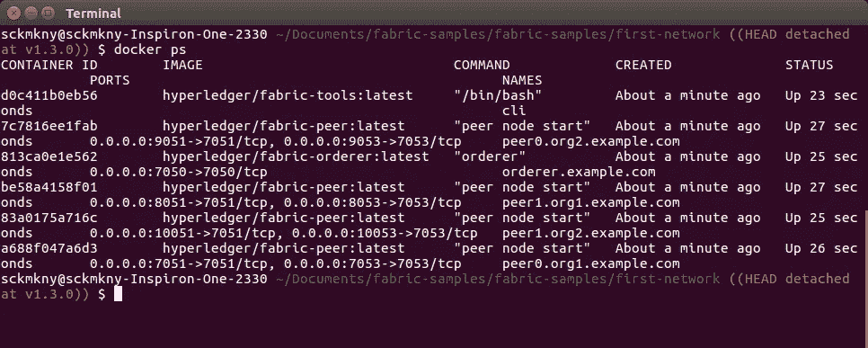
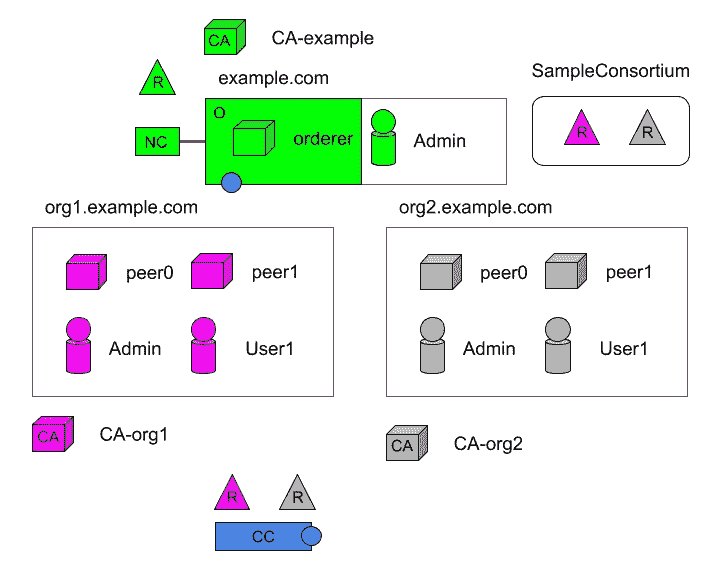
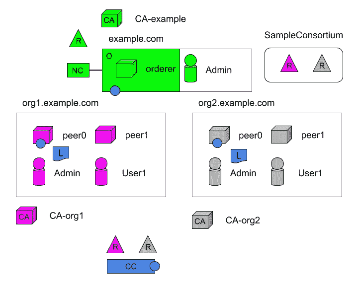

# 超分类帐结构示例:第 5 部分

> 原文：<https://medium.com/coinmonks/hyperledger-fabric-by-example-part-5-67b8185078f2?source=collection_archive---------4----------------------->

## 在网络中增加一个信道。


本文是以[*Hyperledger Fabric By Example:Part 1*](/@johntucker_48673/hyperledger-fabric-by-example-part-1-758547e9fb04)开始的系列文章的一部分。

**命令行界面(CLI)**

到目前为止，我们已经通过创建一个配置文件来配置示例网络，这个文件是 *genesis.block* 文件；用于自举*orderer.example.com*节点。

今后，我们将希望能够在所有节点都已启动之后，即在所有 *Docker* 容器都在运行之后，配置网络。

为此，我们创建了一个额外的容器，我们可以远程访问它并从中执行配置命令。我们用一个额外的容器向 *Docker Compose* 文件添加一个部分:

*。/first-network/docker-compose-CLI . YAML*

观察结果:

*   找不到关于 *Docker* 容器、*hyperledger/fabric-tools*的文档
*   这种配置目前是硬编码的，只能与*peer0.org1.example.com*对等机通信；当我们与其他对等体通信时，我们将不得不覆盖几个环境变量

因为我们想要开始新的 *Docker* 图像，所以我们停下来删除我们之前创建的图像:

```
docker stop $(docker ps -aq)
docker rm $(docker ps -aq)
```

如前所述，我们提出了网络:

```
docker-compose -f docker-compose-cli.yaml up
```

通过运行:

```
docker ps
```

我们可以看到我们有六个容器。一个是新的 CLI 容器。



**通道**

此时，网络中的所有节点都已运行，我们开始使用 CLI 容器配置网络；接下来的步骤将在概念上的*Hyperledger Fabric block chain Network*关于 [*为财团创建渠道的文档*](https://hyperledger-fabric.readthedocs.io/en/latest/network/network.html#creating-a-channel-for-a-consortium) ( **请在继续**之前阅读这些章节)。

一个**通道**是:

> 通道是一个私有的区块链覆盖层，允许数据隔离和保密。特定于渠道的分类帐在渠道中的对等方之间共享，交易方必须通过渠道的正确身份验证才能与之交互。通道由配置块定义。

*—总账结构—* [*术语表*](https://hyperledger-fabric.readthedocs.io/en/latest/glossary.html)

在我们的示例中，我们将使用**通道配置(CC)** *创建一个新通道 *mychannel、*。*该通道与*样品联合体*和两个组织( *Org1MSP* 和 *Org2MSP* )相关联。



我们用新的配置文件更新 *Hyperledger Fabric* 配置文件；在这次更新中，我们使用示例提供的[原始文件](https://gist.github.com/larkintuckerllc/7ae7d7b47cdf731a2ccb2a386bb2d383)(放回注释中)。

*。/first-network/configtx . YAML*

然后，我们生成另一个文件 *channel.tx* ，我们将在 CLI 容器中使用它:

```
configtxgen -profile TwoOrgsChannel -outputCreateChannelTx ./channel-artifacts/channel.tx -channelID mychannel
```

然后，我们远程进入 CLI 容器:

```
docker exec -it cli bash
```

并执行以下命令:

```
peer channel create -o orderer.example.com:7050 -c mychannel -f ./channel-artifacts/channel.tx --tls --cafile /opt/gopath/src/github.com/hyperledger/fabric/peer/crypto/ordererOrganizations/example.com/orderers/orderer.example.com/msp/tlscacerts/tlsca.example.com-cert.pem
```

*建立你的第一个网络*确实提供了一些关于幕后发生的事情的有用信息，在这个例子中:

> 该命令返回一个 genesis 块— <channel-id.block>—我们将使用它来加入通道。它包含 channel.tx 中指定的配置信息。如果您没有对默认通道名称进行任何修改，则该命令将返回一个标题为 mychannel.block 的原型。</channel-id.block>

*—Hyperledger Fabric—*[*构建你的第一张网络*](https://hyperledger-fabric.readthedocs.io/en/latest/build_network.html)

接下来，我们将使用 *mychannel.block* 将对等体加入通道。

**将对等体加入通道**

既然我们已经创建了渠道，我们需要加入同行。；接下来的步骤将在概念上的*Hyperledger Fabric block chain Network*文档中介绍 [*对等体和分类帐*](https://hyperledger-fabric.readthedocs.io/en/latest/network/network.html#peers-and-ledgers) ( **请在继续**之前阅读这些章节)。

在这里，我们将努力把*peer0.org1.example.com*和*peer0.org2.example.com*加入 *mynetwork* 频道；这样就创建了一个**分布式分类账(L)** 。



使用 CLI 容器:

```
docker exec -it cli bash
```

我们执行以下命令将*peer0.org1.example.com*加入*我的通道*。

```
peer channel join -b mychannel.block
```

正如我们前面指出的，创建的 CLI 容器是硬编码的，可以与*peer0.org1.example.com*一起工作；因此，我们需要忽略一些环境变量，将*peer0.org2.example.com*连接到*我的频道*。

```
CORE_PEER_MSPCONFIGPATH=/opt/gopath/src/github.com/hyperledger/fabric/peer/crypto/peerOrganizations/org2.example.com/users/Admin@org2.example.com/msp CORE_PEER_ADDRESS=peer0.org2.example.com:7051 CORE_PEER_LOCALMSPID="Org2MSP" CORE_PEER_TLS_ROOTCERT_FILE=/opt/gopath/src/github.com/hyperledger/fabric/peer/crypto/peerOrganizations/org2.example.com/peers/peer0.org2.example.com/tls/ca.crt peer channel join -b mychannel.block
```

**主播同行**

正如我们之前提到的，我们需要将*peer0.org1.example.com*和*peer0.org2.example.com*配置为每个组织的*我的频道*的主持人。

与通道创建步骤一样，我们需要使用 *configtxgen* 命令行界面工具生成一个文件:

```
configtxgen -profile TwoOrgsChannel -outputAnchorPeersUpdate ./channel-artifacts/Org1MSPanchors.tx -channelID mychannel -asOrg Org1MSP
```

并且再次为 *Org2MSP* :

```
configtxgen -profile TwoOrgsChannel -outputAnchorPeersUpdate ./channel-artifacts/Org2MSPanchors.tx -channelID mychannel -asOrg Org2MSP
```

然后，我们远程访问 CLI 容器并运行:

```
peer channel update -o orderer.example.com:7050 -c mychannel -f ./channel-artifacts/Org1MSPanchors.tx --tls --cafile /opt/gopath/src/github.com/hyperledger/fabric/peer/crypto/ordererOrganizations/example.com/orderers/orderer.example.com/msp/tlscacerts/tlsca.example.com-cert.pem
```

而对于*org 2 MSP；*用环境变量设置:

```
CORE_PEER_MSPCONFIGPATH=/opt/gopath/src/github.com/hyperledger/fabric/peer/crypto/peerOrganizations/org2.example.com/users/Admin@org2.example.com/msp CORE_PEER_ADDRESS=peer0.org2.example.com:7051 CORE_PEER_LOCALMSPID="Org2MSP" CORE_PEER_TLS_ROOTCERT_FILE=/opt/gopath/src/github.com/hyperledger/fabric/peer/crypto/peerOrganizations/org2.example.com/peers/peer0.org2.example.com/tls/ca.crt peer channel update -o orderer.example.com:7050 -c mychannel -f ./channel-artifacts/Org2MSPanchors.tx --tls --cafile /opt/gopath/src/github.com/hyperledger/fabric/peer/crypto/ordererOrganizations/example.com/orderers/orderer.example.com/msp/tlscacerts/tlsca.example.com-cert.pem
```

**接下来的步骤**

在下一篇文章中，[*Hyperledger Fabric By Example:Part 6*](/@johntucker_48673/hyperledger-fabric-by-example-part-6-591d89158940)，我们在扩展网络的同时继续引入新概念。

[](http://bit.ly/2G71Sp7)

> [直接在您的收件箱中获得最佳软件交易](https://coincodecap.com/?utm_source=coinmonks)

[](https://coincodecap.com/?utm_source=coinmonks)