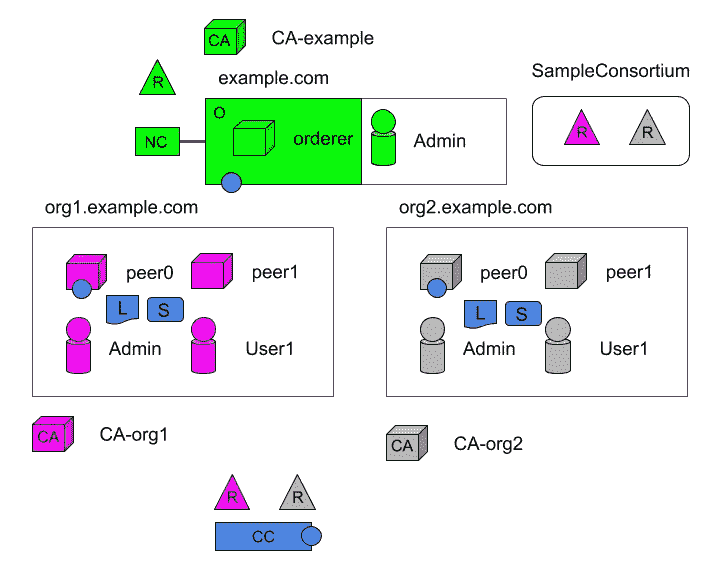

# 超分类帐结构示例:第 6 部分

> 原文：<https://medium.com/coinmonks/hyperledger-fabric-by-example-part-6-591d89158940?source=collection_archive---------1----------------------->

## 通过探索 chaincode 结束本系列。


本文是以[*Hyperledger Fabric By Example:Part 1*](/@johntucker_48673/hyperledger-fabric-by-example-part-1-758547e9fb04)开始的系列文章的一部分。

**链码**

现在我们有了分布式账本，我们可以开始做一些有趣的事情；使用**链码**。

> 智能合约是由区块链网络外部的客户端应用程序调用的代码，它管理对世界状态中的一组键值对的访问和修改。在 Hyperledger Fabric 中，智能合同被称为链码。智能合同链代码被安装到对等节点上，并被实例化到一个或多个通道。

*—Hyperledger Fabric—*[*词汇表*](https://hyperledger-fabric.readthedocs.io/en/latest/glossary.html#smart-contract)

以下示例严格遵循 *Hyperledger Fabric* 文档中描述的概念(**在继续**之前阅读)。

*   [应用程序和智能合同链代码](https://hyperledger-fabric.readthedocs.io/en/latest/network/network.html#applications-and-smart-contract-chaincode)
*   [安装智能合同](https://hyperledger-fabric.readthedocs.io/en/latest/network/network.html#installing-a-smart-contract)
*   [实例化智能合同](https://hyperledger-fabric.readthedocs.io/en/latest/network/network.html#instantiating-a-smart-contract)
*   [背书政策](https://hyperledger-fabric.readthedocs.io/en/latest/network/network.html#endorsement-policy)

在本例中，我们将在*peer0.org1.example.com*和*peer0.org2.example.com*上安装一个 *Node.js* chaincode，又名智能合约，名为 *mycc* 。然后我们在通道 *mychannel* 上实例化它。



使用 CLI 容器:

```
docker exec -it cli bash
```

我们执行以下命令将链码安装到*peer0.org1.example.com*上:

```
peer chaincode install **-**n mycc **-**v 1.0 **-**l node **-**p **/**opt**/**gopath**/**src**/**github**.**com**/**chaincode**/**chaincode_example02**/**node**/**
```

和以前一样，我们设置环境变量并在*peer0.org2.example.com*上执行:

```
CORE_PEER_MSPCONFIGPATH=/opt/gopath/src/github.com/hyperledger/fabric/peer/crypto/peerOrganizations/org2.example.com/users/Admin@org2.example.com/msp CORE_PEER_ADDRESS=peer0.org2.example.com:7051 CORE_PEER_LOCALMSPID="Org2MSP" CORE_PEER_TLS_ROOTCERT_FILE=/opt/gopath/src/github.com/hyperledger/fabric/peer/crypto/peerOrganizations/org2.example.com/peers/peer0.org2.example.com/tls/ca.crt peer chaincode install **-**n mycc **-**v 1.0 **-**l node **-**p **/**opt**/**gopath**/**src**/**github**.**com**/**chaincode**/**chaincode_example02**/**node**/**
```

我们执行以下命令来实例化通道上的链码。

```
peer chaincode instantiate -o orderer.example.com:7050 --tls --cafile /opt/gopath/src/github.com/hyperledger/fabric/peer/crypto/ordererOrganizations/example.com/orderers/orderer.example.com/msp/tlscacerts/tlsca.example.com-cert.pem -C mychannel -n mycc -l node -v 1.0 -c '{"Args":["init","a", "100", "b","200"]}' -P "AND ('Org1MSP.peer','Org2MSP.peer')"
```

**注意**:*node . js*chain code 的实例化大约需要一分钟。命令没有挂起；相反，它是在编译映像时安装 *fabric-shim* 层。

让我们看一看链码本身。通过检查 CLI 容器配置，我们可以看到以下代码:

*。/chain code/chain code _ example 02/node/package . JSON*

*。/chain code/chain code _ example 02/node/chain code _ example 02 . js*

观察结果:

*   老实说，这段代码在做什么并不太清楚。*Hyperledger*[*Fabric 编写你的第一个应用*](https://hyperledger-fabric.readthedocs.io/en/latest/write_first_app.html#) 有一个编写链码的更好的例子和解释

最后，我们用下面的命令执行 chaincode(在本例中是*查询*方法):

```
peer chaincode query -C mychannel  -n mycc -c '{"Args":["query","a"]}'
```

它会将数字 *100* 记录到屏幕上。

**总结**

虽然我发现 *Hyperledger Fabric* 的概念非常有趣，但是实现起来有点粗糙；配置的大量盲目复制粘贴。我猜这是一个新项目，可能会随着时间的推移迅速改善。

也就是说，我们确实完成了逆向工程的目标*构建您的第一个网络示例*教程。

[](http://bit.ly/2G71Sp7)

> [直接在您的收件箱中获得最佳软件交易](https://coincodecap.com/?utm_source=coinmonks)

[](https://coincodecap.com/?utm_source=coinmonks)