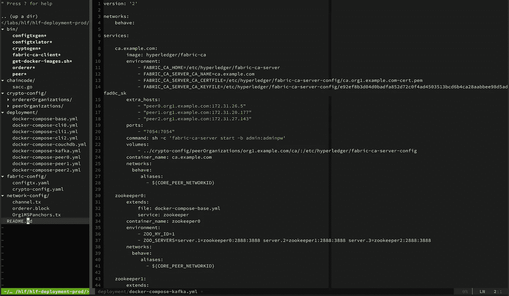
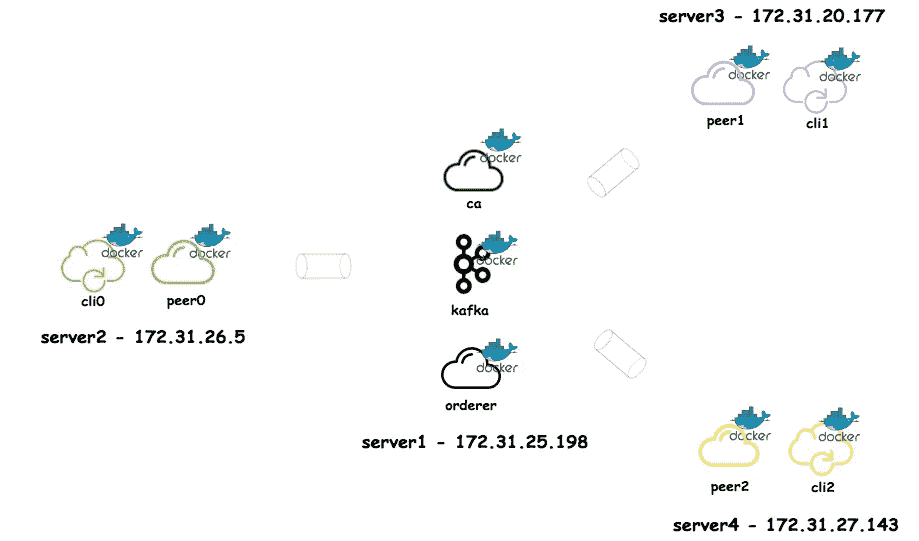

# 多台主机上的 Hyperledger 结构集群

> 原文：<https://medium.com/coinmonks/hyperledger-fabric-cluster-on-multiple-hosts-af093f00436?source=collection_archive---------1----------------------->

## 生产就绪 hyperledger 结构群

# 快乐分类器:)

这是我的 hyperledger fabric 博客系列的第三部分- `Happyledger`博客系列:)。在这篇文章中，我将介绍如何在多主机环境中部署 hyperledger fabric 集群。在[上一篇文章](/coinmonks/hyperledger-fabric-setup-with-multiple-peers-and-orderers-with-kafka-542023787a6d)中，我解释了如何在单个主机上设置生产就绪 hyperledger fabric 集群。请通读这篇文章，首先熟悉 hyperledger 的配置和部署。

> [发现并回顾最佳区块链软件](https://coincodecap.com)

与这篇文章相关的所有部署文件和配置都在[hlf-deployment-prod](https://gitlab.com/rahasak-labs/hlf-deployment-prod)git lab repo。请检查回购和后续的职位。

# 服务结构

我要建立的 hyperledger 网络包含以下服务。我将在多台主机上部署这些服务，如图 1 所示。

1.  一个组织(`org1.example.com`)
2.  三个同行(`peer0.org1.example.com`、`peer1.org1.example.com`、`peer2.org1.example.com`)
3.  一个认证机构(`ca.example.com`)
4.  三个命令(`orderer0.example.com`、`orderer1.example.com`、`orderer2.example.com`)
5.  三个动物园管理员节点(`zookeeper0`、`zookeeper1`、`zookeeper2`)
6.  四个卡夫卡节点(`kafka0`、`kafka1`、`kafka2`、`kafka3`)

以下是在多主机环境中部署这些服务的方法。

# 1.部署服务

## 1.部署 ca、orderer 和 kafka

如`Figure 1`所述，我正在`server1`机上部署`ca`节点、`3 orderers`节点、`4 kafka`节点和`3 zookeeper`节点。在真实的生产环境中，在不同的机器上部署卡夫卡集群和订购者是有好处的。为了让这篇文章变得简单，我将在一台机器上部署所有的卡夫卡经纪人和订购者。与此部署相关的 docker-composite 文件是`docker-compose-kafka.yml`。您可以按照以下方式部署服务。

在备审文件中没有什么需要澄清的。我正在`ca`和`orderer`服务中定义`extra_hosts`属性。它包含所有对等主机信息。由于 ca 和订购者可能需要与对等方通信，他们需要知道对等方在哪里。对等体在不同的主机上，所以我可以在`extra_hosts`字段中定义`peer0.org1.example.com`、`peer1.org1.example.com`和`peer2.org1.example.com`的主机。`extra_hosts`提供一种方式，通过服务名称与不同机器上的码头工人服务进行通信。在此处[继续阅读`extra_hosts`。](https://biancatamayo.me/blog/2017/11/03/docker-add-host-ip/)

## 2.部署 peer0 和 cli0

我正在`server2`机器上部署`peer0`和`cli0`(连接到 peer0)。与部署相关的归档文件有`docker-compose-peer0.yml`和`docker-compose-cli0.yml`。按照以下方式部署服务。

在`docker-compose-peer0.yml`中，我定义了以下`extra_hosts`字段。包含`all orderers`、`pee1`、`peer2`的宿主信息。在 extra_hosts 中添加对等体信息的主要原因是，hlf 对等体使用与其他对等体的八卦通信来广播这些块。

`docker-compose-cli0.yml`中包含订购者的主机信息。它需要这些信息，因为 cli 在执行`invoke transactions`时会与订购者进行通信。

## 3.部署 peer1 和 cli1

接下来，我将在`server3`机器上部署`peer1`和`cli1`。您可以按如下方式部署服务。

在`docker-compose-peer1.yml`容器中，extra_hosts 包含订购方主机和其他对等主机(peer0 和 pee1)。`docker-compose-cli1.yml`包含订购者的额外 _ 主机。

## 4.部署 peer2 和 cli2

最后我可以在`server4`机器上部署`peer2`和`cli2`。下面是做这件事的方法。

与 peer0 和 peer1 相同，这些 docker-compose 文件也包含 extra_hosts 信息。

# 2.设置频道

现在服务部署已经完成。接下来的事情是`setup channels`、`setup chaincode`和`installing chaincode`。

## 2.1 创建渠道

我正在通过连接到`server2`机器上的`peer0`容器来创建通道。执行以下命令创建通道。

接下来，我需要将所有这些对等方(3 个对等方)加入渠道。

## 2.2 将 peer0 加入通道

现在，我正在连接到`server2`机器上的`peer0` docker 容器，并在其上执行通道加入命令。该命令将在`peer0` docker 容器中生成`mychannel.block`。

## 2.3 将 mychannel.block 复制到 peer1 和 peer2

正如我在[上一篇](/coinmonks/hyperledger-fabric-setup-with-multiple-peers-and-orderers-with-kafka-542023787a6d)中所描述的，`mychannel.block`需要复制到`peer1`和`peer2`容器中才能加入通道。为此，首先我需要通过`docker cp`将我的 channel.block 文件从`peer0` docker 容器复制到`server1`。由于 peer1 和 peer2 在不同的机器上，我需要通过`scp`将 mychannel.block 复制到`server2`和`server3`。最后，我可以用 docker cp 将 mychannel.block 复制到`peer1`和`peer2`中。

## 2.4 将 pee1 加入通道

现在我可以从`server3`机器将`peer1`连接到通道。

## 2.5.将 peer2 加入通道

和以前一样，我可以从`server4`机器将`peer2`连接到频道。

# 3.设置链码

## 3.1 安装链码

链码驻留在`chaincode`目录中。我使用 cli 容器在每个对等体上安装链码。在[上一篇文章的](/coinmonks/hyperledger-fabric-setup-with-multiple-peers-and-orderers-with-kafka-542023787a6d)单主机场景中，我有一个 cli 容器。但是在多主机场景中，我为每个对等体运行三个 cli 容器(连接到每个对等体)。

## 3.2 实例化链代码

然后我可以实例化 chaincode，如下所示。链码仅在通道上实例化一次(不在对等体中)。在这里，我从`server2`机器上的`cli0`容器中实例化链码。

# 4.做交易

和我在[上一篇文章](/coinmonks/hyperledger-fabric-setup-with-multiple-peers-and-orderers-with-kafka-542023787a6d)中一样，我现在可以执行事务了。

## 5.1.调用事务

我正在调用包含在`server2`上的`cli0`事务。当执行交易时，它连接到`peer0`和`order0`。

## 5.2 查询交易

我正在用`server4`上的`cli2`容器进行查询事务。执行交易时连接到`peer2`。

# 下一步是什么

现在，我们已经在`single host environment`和`multi host environment`上使用 kafka 设置了多对等、多订购者的 hyperledger 集群。在下一篇文章中，我计划展示如何在 kubernetes 上部署 hyperledger fabric 集群。快乐阅读:)

# 参考

1.  [https://medium . com/coin monks/hyperledger-fabric-setup-with-multiple-peers-and-orders-with-Kafka-542023787 a6d](/coinmonks/hyperledger-fabric-setup-with-multiple-peers-and-orderers-with-kafka-542023787a6d)
2.  [https://biancatamayo.me/blog/2017/11/03/docker-add-host-ip/](https://biancatamayo.me/blog/2017/11/03/docker-add-host-ip/)
3.  [https://medium . com/1950 labs/setup-hyperledger-fabric-in-multiple-physical-machines-d8f 3710 ed 9 b 4](/1950labs/setup-hyperledger-fabric-in-multiple-physical-machines-d8f3710ed9b4)

> 加入 Coinmonks [电报频道](https://t.me/coincodecap)和 [Youtube 频道](https://www.youtube.com/c/coinmonks/videos)获取每日[加密新闻](http://coincodecap.com/)

## 另外，阅读

*   [复制交易](/coinmonks/top-10-crypto-copy-trading-platforms-for-beginners-d0c37c7d698c) | [加密税务软件](/coinmonks/crypto-tax-software-ed4b4810e338)
*   [网格交易](https://coincodecap.com/grid-trading) | [加密硬件钱包](/coinmonks/the-best-cryptocurrency-hardware-wallets-of-2020-e28b1c124069)
*   [密码电报信号](http://Top 4 Telegram Channels for Crypto Traders) | [密码交易机器人](/coinmonks/crypto-trading-bot-c2ffce8acb2a)
*   [最佳加密交易所](/coinmonks/crypto-exchange-dd2f9d6f3769) | [印度最佳加密交易所](/coinmonks/bitcoin-exchange-in-india-7f1fe79715c9)
*   开发人员的最佳加密 API
*   [最佳期货交易信号](https://coincodecap.com/futures-trading-signals) | [流动性交易所评论](https://coincodecap.com/liquid-exchange-review)
*   [火币加密交易信号](https://coincodecap.com/huobi-crypto-trading-signals) | [Swapzone 审查](/coinmonks/swapzone-review-crypto-exchange-data-aggregator-e0ad78e55ed7)
*   [最佳加密交易机器人](/coinmonks/crypto-trading-bot-c2ffce8acb2a) | [购买索拉纳](https://coincodecap.com/buy-solana) | [矩阵导出评论](https://coincodecap.com/matrixport-review)
*   [Coldcard 评论](https://coincodecap.com/coldcard-review) | [BOXtradEX 评论](https://coincodecap.com/boxtradex-review)|[uni swap 指南](https://coincodecap.com/uniswap)
*   [比特币基地评论](/coinmonks/coinbase-review-6ef4e0f56064) | [德里比特评论](/coinmonks/deribit-review-options-fees-apis-and-testnet-2ca16c4bbdb2) | [FTX 评论](/coinmonks/ftx-crypto-exchange-review-53664ac1198f)
*   [Coinmetro 评论](https://coincodecap.com/coinmetro-review) | [VirgoCX 评论](https://coincodecap.com/virgocx-review)
*   最佳[密码借贷平台](/coinmonks/top-5-crypto-lending-platforms-in-2020-that-you-need-to-know-a1b675cec3fa)
*   [免费加密信号](/coinmonks/free-crypto-signals-48b25e61a8da) |加密交易机器人
*   杠杆代币的终极指南