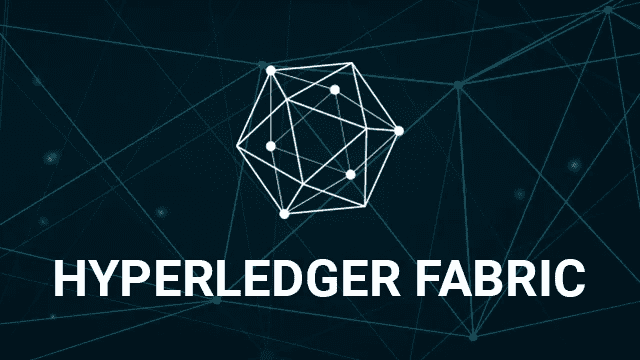

# Hyperledger Fabric:使用 ExpressJS REST Api 扩展 FabCar 网络

> 原文：<https://medium.com/coinmonks/hyperledger-fabric-extending-the-fabcar-example-with-a-expressjs-rest-api-c270710ebbc9?source=collection_archive---------0----------------------->



# 开始前

我认为扩展从 **Hyperledger Fabric** 文档提供的[基本示例](http://hyperledger-fabric.readthedocs.io/en/latest/write_first_app.html)中学习到的概念的最佳方式，如 [fabcar](http://hyperledger-fabric.readthedocs.io/en/latest/understand_fabcar_network.html) ，是增加一层额外的复杂性。我在接下来的帖子中的意图是在 **Salesforce** 中集成定制开发。

在这种情况下，我将向 **fabcar** 网络添加一个 [ExpressJS REST API](https://expressjs.com/) 。

在我的案例中，我是在一个数字海洋的实例中完成的。但是你可以使用任何实例( **Heroku，...**)按照步骤使用 **Ubuntu 16.04** 。

首先，我推荐一下相关文献的讲座:

[了解 Fabcar 网络](http://hyperledger-fabric.readthedocs.io/en/latest/understand_fabcar_network.html)。

[简介](http://hyperledger-fabric.readthedocs.io/en/latest/blockchain.html)

建立你的第一个人际网络

然后按照[编写你的第一个 App](http://hyperledger-fabric.readthedocs.io/en/latest/write_first_app.html) 教程。我会推荐它，在本地做。

# Fabcar 网络架构:

根据文件:

> F abcar 使用**“基本网络”**样本作为其有限开发网络。它由**一个配置为使用 **CouchDB** 作为状态数据库的单个对等节点**，一个**单个“solo”排序节点**，**一个认证机构(CA)** 和一个用于执行命令的 **CLI 容器组成。**

…

> 这些组件由`./startFabric.sh`脚本引导，该脚本还:
> 
> 1.创建一个通道并将对等体加入到通道中。
> 
> 2.将`fabcar`智能契约(fabric-samples/chain code/fab car)安装到对等方的文件系统上，并在通道上实例化它(实例化启动一个容器)
> 
> 3.调用`initLedger`函数，用 10 辆不同的汽车填充渠道分类帐。

# 安装 ExpressJS

下一步是转到您的实例(记住您需要安装 docker)，并安装[需求](http://hyperledger-fabric.readthedocs.io/en/latest/install.html)。

一个可选的步骤是检查到目前为止一切都好，再次做[写你的第一个应用](http://hyperledger-fabric.readthedocs.io/en/latest/write_first_app.html)，但是现在在实例中。

所以如果一切正确，接下来就是安装文件夹**中的 express js-fabric-samples/fab car**。只需遵循此处解释的标准程序:

 [## 安装 Express

### 要临时安装 Express 而不将其添加到依赖项列表中，请执行以下操作:

expressjs.com](https://expressjs.com/en/starter/installing.html) 

然后，它需要创建**server . js。**你可以在我的[库](https://bitbucket.org/krukmat/fabcar-expressjs/src/master/fabcar/server.js)中查看我的例子。想法是发布教程中描述的**查询**方法。

在这种情况下，NodeJS 将在 **8080** 运行，但是您可以更改它。

因此，现在您可以简单地运行:

> node server.js

要检查它，您只需在本地实例中从终端执行 curl 操作:

```
curl http://localhost:8081/api/query
```

您应该会看到这样的内容:

> *{ " response ":"[{ \ " Key \ ":\ " car 0 \ "，\"Record\":{\"colour\":\"blue\ "，\"make\":\"Toyota\ "，\"model\":\"Prius\ "，\"owner\":\ "外川智子\"}，{\"Key\":\"CAR1\ "，\"Record\":{\"colour\":\"red\ "，\"make\":\"Ford\ "，\"model\":\"Mustang\ "，\"owner\":\"Brad\"}，{\"Key\":\"CAR2\ "，\ " Record \ ":{ \ " colour \ ":{ \ " colour*

现在，我们需要设置接受来自实例的外部请求。接下来是数字海洋中需要的一些指南。

# 外部访问的要求

下一个特别适用于数字海洋实例，但你可能会在 Heroku，Google 等其他服务中发现一些相似之处。您需要:

[配置NodeJS 从 Nginx](https://www.digitalocean.com/community/tutorials/how-to-set-up-a-node-js-application-for-production-on-ubuntu-16-04) 访问。

[配置 iptables 从外部访问网络](https://www.digitalocean.com/community/tutorials/iptables-essentials-common-firewall-rules-and-commands)

# 结论

这是一个在 **Hyperledger Fabric** 和通过一个简单的 **ExpressJS Rest API app** 给出输出之间集成的简单例子。

下一次将是一个雄心勃勃的步骤:将这个 API 与 **Salesforce 中的定制开发集成。**

编码快乐！