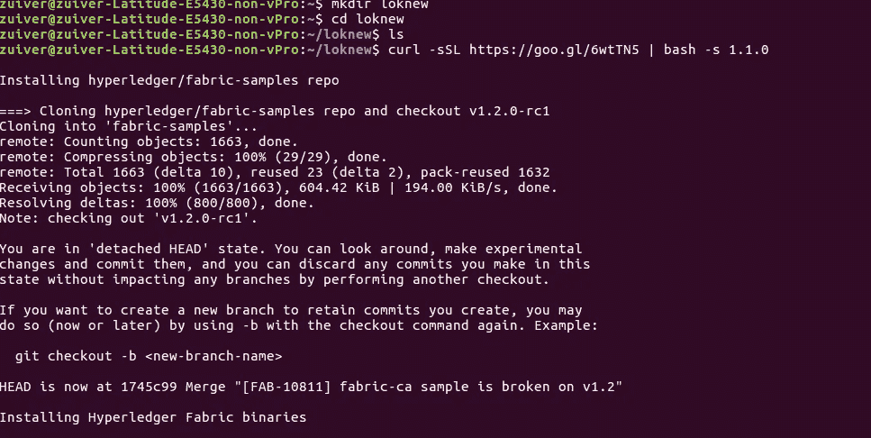
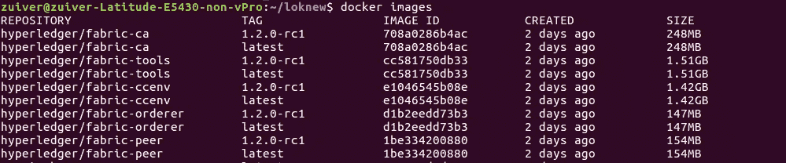

# Hyperledger Fabric:如何使用 Nodejs-Series 1 从头开始设置应用程序？？

> 原文：<https://medium.com/coinmonks/hyperledger-fabric-how-to-setup-application-from-scratch-using-nodejs-series-1-to-7fb5c56877c7?source=collection_archive---------2----------------------->


Source : Google

本教程纯粹是为技术开发人员或程序员编写的，所以如果你是管理人员或非技术人员，我很抱歉！您会发现这非常程序化，但您可以自由阅读并丰富您在 Hyperledger Fabric 开发方面的知识。

> [发现并回顾最佳区块链软件](https://coincodecap.com)

我将从头开始一步一步地介绍，从生成证书、建立组织、对等体、开发链代码、实例化它&最后创建 web 应用程序来与您的区块链总账交互！。

你准备好旅行了吗？！！

在我们开始之前，了解什么是“超账本结构”是非常重要的，没有它你就无法继续前进。有了基础知识，基础强了，那你就可以轻松设置了。

就在 Hyperledger Fabric 之前，去看这个视频吧！..它让你明白，什么是区块链&分布式账本是如何工作的。

Source : Youtube by [Lucas Mostazo](https://www.youtube.com/channel/UCW5W-dg-D_oomFNcZPXPSlw)

# Hyperledger 面料？

Hyperledger Fabric 是一个用于 ***分布式分类帐解决方案*** 的平台，以模块化架构为基础，提供高度的保密性、弹性、灵活性和可扩展性。它旨在支持不同组件的可插拔实现，并适应整个经济生态系统中存在的复杂性和错综复杂性。要了解更多信息，请阅读此官方文档[链接此处](https://hyperledger-fabric.readthedocs.io/en/release-1.1/)

# 环境设置

*   Ubuntu 16.04
*   结构版本 1.1

一旦你准备好 Ubuntu 16.04 操作系统的基本环境设置，然后打开终端并启动下面的命令(参考:[链接此处](https://hyperledger-fabric.readthedocs.io/en/release-1.1/samples.html#binaries))

```
curl **-**sSL https:**//**goo**.**gl**/**6wtTN5 **|** bash **-**s 1.1**.**0
```



Installing Fabric-Samples Repo & Docker Containers.

> 注意:如果你得到 ***Curl 命令不可用错误*** ，首先使用下面的命令`sudo apt-get install curl`安装 Curl

这个命令(curl**-**sSL[https:**//**goo**。**GL**/**6 wttn 5](https://goo.gl/6wtTN5)**|**bash**-**s 1.1**。** 0)将

1.  下载一组可执行的 shell 脚本文件(如下所示)，这些文件将生成证书、genesis 块等..

*   `cryptogen`，
*   `configtxgen`，
*   `configtxlator`，
*   `peer`
*   `orderer`和
*   `fabric-ca-client`

2.下载织物样本报告，其中包含引导或样板，以更快的方式建立我们的项目。

3.最后，它下载 docker 容器。

> 注意:这至少需要 20 到 30 分钟，因为每个 docker 容器都有 1.5GB 的映像..所以要确保你有足够的存储空间。(如果你在虚拟盒子中运行，那么分配足够的存储空间，我很难用虚拟盒子)

要查看所有 docker 容器，请在终端中使用以下命令

`docker images`



它将显示所有下载的图像。看“标签”，上面显示 **1.2.0-rc1 最新**

Hyperledge Fabric 由多个组件组成，这里的组件 I 指的是，**订购者、认证机构、Peeres & Couch DB(数据库)**。基本上，这四个组件对于 hyperledger 结构在 DLT(分布式分类帐)中进行通信&提交事务非常重要。

等等？！，要不要把这个和实时例子比较一下？..让我们在概念上应用这个。考虑一个供应链市场(笔记本电脑制造商到最终用户)。在当前系统中(没有区块链)，笔记本电脑的最终用户或经销商不容易识别产品的原创性。他们只需要依靠品牌。

现在，有了区块链，每个参与者(制造商、分销商、销售商)都将维护自己的分类账&每笔交易的副本都将在他们的分类账中被跟踪，这使得笔记本电脑的所有权、独创性、笔记本电脑是从哪个制造商处分销的等易于识别。在任何情况下，如果笔记本电脑出现故障，很容易确定该批次中有多少台笔记本电脑需要更换。

> 我谈到了 4 个组成部分，并告诉你供应链的故事，这些是如何相互关联的？，在我下一篇文章里看吧！..

我经常写文章来吸引我的读者，所以继续读吧！。这一系列，将会给你足够的关于 Hyperledger 框架的知识。

注意:如果你觉得这篇文章有趣，给我一个掌声&请随意分享。另外，标记这个系列，以便在下一篇文章中得到通知。

第二部分-> [点击这里](/coinmonks/hyperledger-fabric-how-to-setup-application-from-scratch-using-nodejs-series-part-2-binary-file-a715381ae1d6)

第三部分-> [点击这里](/coinmonks/hyperledger-fabric-how-to-setup-application-from-scratch-using-nodejs-series-part-3-9d795f2d4a8)