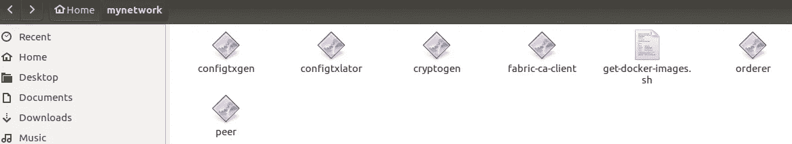
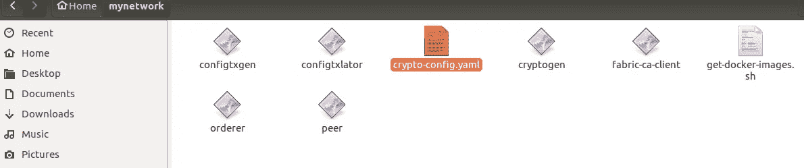
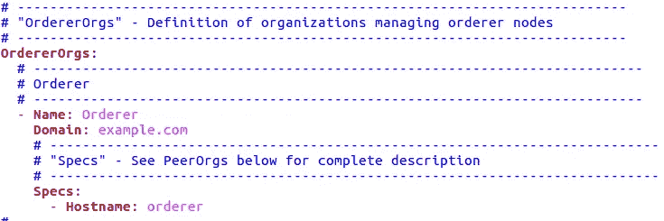
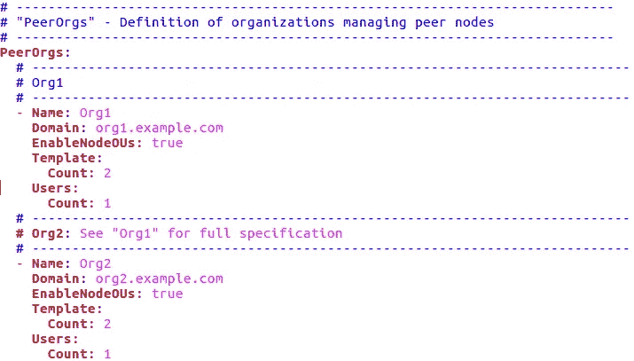
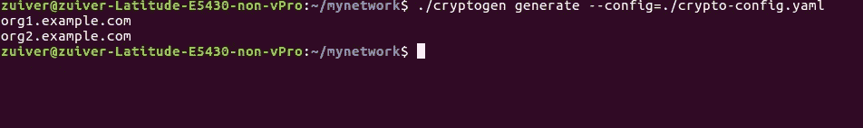

# Hyperledger Fabric:如何使用 Nodejs 系列从头开始设置应用程序—第 3 部分

> 原文：<https://medium.com/coinmonks/hyperledger-fabric-how-to-setup-application-from-scratch-using-nodejs-series-part-3-9d795f2d4a8?source=collection_archive---------5----------------------->

## 从头开始建立自己的网络


Source: Google

嘿伙计们，你们好吗！,..很高兴看到您正在阅读本系列的第 3 部分！,.如果您错过了我的早期系列，我建议您在继续之前先阅读它！。否则，你可能无法跟上这篇文章。

第 1 部分-> [Hyperledger Fabric:如何使用 Nodejs-Series 1 从头开始设置应用程序？？](/coinmonks/hyperledger-fabric-how-to-setup-application-from-scratch-using-nodejs-series-1-to-7fb5c56877c7)

第 2 部分-> [Hyperledger Fabric:如何使用 Nodejs 系列从头开始设置应用程序—第 2 部分](/coinmonks/hyperledger-fabric-how-to-setup-application-from-scratch-using-nodejs-series-part-2-binary-file-a715381ae1d6)

好，我们开始吧..在本文中，我们将从头开始设置我们的 Hyperledger 结构网络。为此，我们需要理解一些文件&它的配置。

首先，我们需要定义谁将扮演什么角色！正如我在之前的文章中提到的。让我们假设你已经阅读了我的第一篇文章，并且已经下载了必要的二进制文件。..

步骤 1:进入“织物样本”文件夹，在 Bin 文件夹中找到二进制文件。将所有这些复制到你的新文件夹中(我将其命名为 mynetwork)



Binary files in mynetwork folder

第二步:进入“Fabric-samples/first-network”文件夹，将**的 crypto-config.yaml** 文件复制到你的 mynetwork 文件夹中



Folder with “Crypto-Config-Yaml”

是时候深入研究这个文件并进行必要的修改了..

这个文件基本上有几个组件，第一个是订购者(非常重要)组件在光纤网络中，有两种类型的订购者。第一个是“独奏”，另一个是以“卡夫卡”为基础的。SOLO 是单一订购者，在开发环境中使用它是没问题的，但是在生产环境中绝对不行！..当网络中断时，你最终会丢失数据。



crypto-config.yaml — Orderer section

这里，给出的大多数名称都是“用户定义的”，因此您的身份(CA)将基于这些名称创建，因此在将此订购者映射到各自的结构映像时，您应该使用相同的名称/ca 文件。最佳实践是，使用适当的命名标准，以便容易识别哪个容器属于哪个组件。

在上图中，“订购者的名称是“订购者”&域名是 example.com(不要使用任何特殊字符)..所以这个订购者的最终名字将是“{{。主机名}}。{{.在我们的示例中是“orderer.example.com”



Peer & Org Settings in Crypto-config.yml

上图显示，我们有两个组织&每个组织分别对应一个同事。我们一个一个来。

对等->表示此部分属于定义对等

名称->组织名称，此处为 Org1

EnableNodeOUS:真的？表示将身份分类为“客户”或“对等方”的能力。这允许您在现有的`Org.member`和`Org.admin`之外创建诸如`Org.peer`和`Org.client`的策略。如果您启用这是密码，它将生成使用此功能的 MSP。

模板:计数 2，表示将在该组织(org1)下创建 2 个对等方，因此对等方名称将类似于 peer1.org1.example.com peer0.org1.example.com

Users: count 1 表示将创建一个用户身份。在现实中，或者在生产结构中，CA 为我们完成了这项工作。它为新用户创建身份。但是在开发中我们将使用**密码(二进制文件)**

下一个对等体(Org2)也是如此。

在这个文件中，我们已经看到了如何设置订购者、同行、组织和用户。在定义您的网络时，您将在这个文件中花费大量的时间，因为生成正确的身份和证书是最重要的。

好了，一切都设置好了，现在是时候生成我们的证书了。去终端和执行这个命令，你会看到 Org1.example.com 和 Org2.example.com 的结果

```
./cryptogen generate --config=./crypto-config.yaml
```



Results obtained after Cryptogen Command

祝贺您，您已经成功地为这些组件创建了证书，现在进入您的目录，浏览每个文件夹，检查它已经创建了多少个文件夹/文件。

理解每个文件夹是什么&它做什么，花一些时间浏览并理解文件夹结构是非常重要的。(但是 DONT 玩它:)

我们已经迈出了非常成功的第一步，接下来我们需要创建我们的第一个模块(创世纪)&定义谁将成为我们的锚定对等体，对吗？..让我们在我的下一篇文章中见面。

注意:如果你觉得这篇文章有趣，给我一个掌声&请随意分享。另外，标记这个系列，以便在下一篇文章中得到通知。