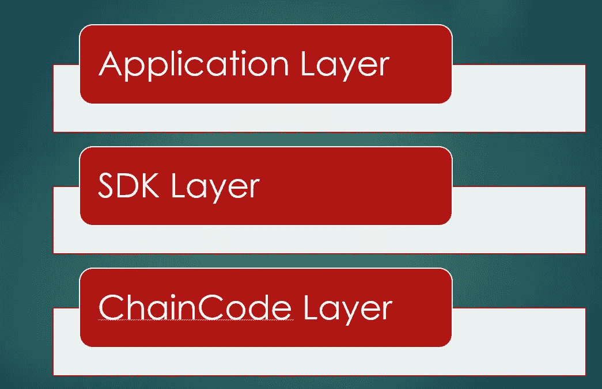

# Hyperledger 结构实施—第 1 部分

> 原文：<https://medium.com/coinmonks/hyperledger-fabric-implementation-v1-1-part-1-chaincode-for-node-7b72aec2430d?source=collection_archive---------0----------------------->

## Hyperledger 结构实施 1.3 版:使用 Node.js 和 Golang 的链码

为了在 Fabric V1.3 上构建区块链应用，需要实现三层

1.  链码层(与分类帐交互)
2.  SDK 层(应用程序和链代码之间的交互)
3.  应用层(SDK 和应用程序之间的交互)



在 V1.3 中，可以使用 GoLang 或 Node oe Java 语言编写链代码

要编写智能契约，开发人员应该知道三个主要的类 Shim、ChaincodeInterface 和 ChaincodeStub。

本文提供了这些类的概述，以及所有 Smartcontract 或 Chaincode 实现的 node.js 代码的通用模板。

# fabric-shim npm 包:智能合同实施的核心

Package 包含一个 **Shim** 类，用于向目标对等体注册链码，监听传入的请求，处理事务提议或执行查询。

Shim 类中的所有方法都是静态的。

*   **start(chaincode-class)** :启动 chaincode 进程，向目标对等体注册 chaincode(将目标对等体的地址作为程序参数传递:— peer.address)。
*   **success(return-value)** :返回成功响应对象状态码 200 和可选的 Buffer 类型的成功返回值内容。
*   **error(return-value)** :返回成功响应对象状态码 200 和可选的 Buffer 类型的错误返回值内容。

链码程序必须实现**链码**接口。在 node.js 中，它被定义为 ChaincodeInterface 类

# Chaincode 接口有两种方法

```
init() : Called to instantiate or upgrade the chaincodeinvoke() : Called to interact with Ledger (query/update/create/delete the asset)
```

这两种方法都接受 ChaincodeStub 类作为方法参数。

# 链码存根

ChaincodeStub 类包含获取传入请求信息的方法，如函数名、作为传递函数的数组的参数、通道 id、CRUD(创建/读取/更新/删除)状态变量

## ChaincodeStub 类中常用的方法

*   **getFunctionAndParameters():**返回一个全局类型定义 **FunctionAndParameters** 包含两个属性:

> * fcn:要调用的函数名
> 
> * params:已定义函数的参数数组

*   **getState(key) :** 返回键值
*   **putState(key，value) :** 将状态变量 key &的值写入/更新到状态存储中
*   **getTxID()** :返回当前请求的事务 ID

# 节点的智能合同模板

```
const shim = require(‘fabric-shim’);const PradeepChaincode = class {
async Init(stub) {
 return …;
 }async Invoke(stub) {
 return …;
 }};shim.start(new PradeepChaincode())
```

***详细介绍上面的***

*   步骤 1 :
    织物垫片包被导入。
*   步骤 2 :
    定义链码类和方法(初始化以实例化/升级，调用以处理分类帐)
*   步骤 3 :
    启动 chaincode 进程并监听传入的请求

# Golang 的智能合同模板

```
package mainimport (“fmt”“github.com/hyperledger/fabric/core/chaincode/shim”“github.com/hyperledger/fabric/protos/peer”)//SmartContract : name of the smart contracttype SmartContract struct{}// Init : Method to initialize or update the chaincodefunc (s *SmartContract) Init(APIstub shim.ChaincodeStubInterface) peer.Response {return shim.Success(nil)}// Invoke : Method to transaction between the ledgerfunc (s *SmartContract) Invoke(APIstub shim.ChaincodeStubInterface) peer.Response {return shim.Error(“Invalid Smart Contract function name.”)}func main() {err := shim.Start(new(SmartContract))if err != nil {fmt.Printf(“Error Creating the new smart contract SmartContract : %s”, err)}}
```

资源

*   [https://fabric-shim.github.io/index.html](https://fabric-shim.github.io/index.html)
*   [http://hyperledger-fabric . readthedocs . io/en/release-1.1/chain code 4a de . html](http://hyperledger-fabric.readthedocs.io/en/release-1.1/chaincode4ade.html)