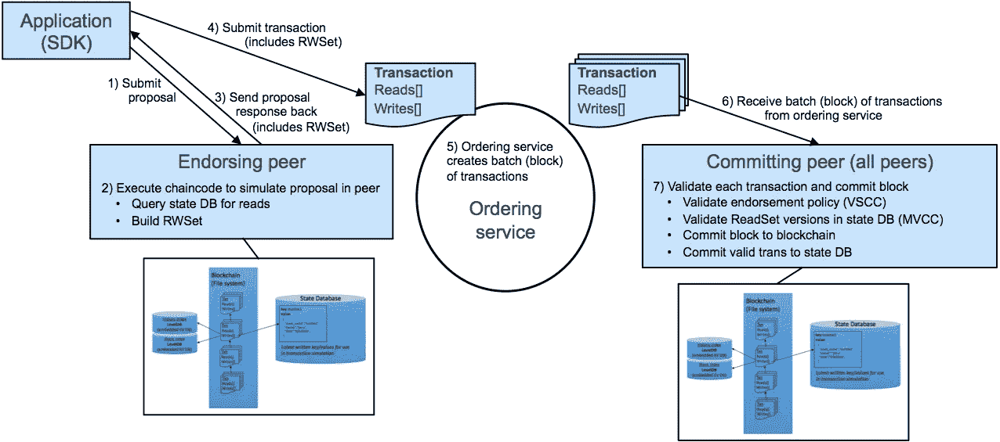

# 实践中的超分类帐结构。主要组件并在本地运行它们

> 原文：<https://medium.com/coinmonks/hyperledger-fabric-in-practice-part-1-main-components-and-running-them-locally-aa4b805465fa?source=collection_archive---------1----------------------->


source

# 动机

如今，与机器学习/人工智能一起被炒作的技术之一是区块链。我们仍在探索加密货币世界之外的使用案例，但这项技术本身是有前途的，在我看来，了解它是如何工作的会很有帮助。

你可以在网上找到很多关于区块链及其历史的资料，所以我不打算在这里给出解释，我假设你知道基本知识。相反，我想尝试一种技术上先进的区块链实现— [Hyperledger Fabric](https://hyperledger-fabric.readthedocs.io/en/latest/) 。

> [发现并回顾最佳区块链软件](https://coincodecap.com)

# 超级分类帐结构…

Or just Fabric 是 Hyperledger blockhain 框架的旗舰实现，是第一个将状态从*孵化*更改为*活动*的项目。这是一个开放源码的项目，正在积极开发中，并得到了很好的支持。Hyperledger Fabric 的目标是企业，这已经不是什么秘密了，所以它实际上是由 IBM 这样的大玩家发起和贡献的。我鼓励您查看 [Fabric architecture](https://hyperledger-fabric.readthedocs.io/en/latest/arch-deep-dive.html#) 文档——它们提供了非常好的概述。

## 分布式分类帐

Fabric 生活在 [Hyperledger 项目](https://www.hyperledger.org/)的保护伞下，该项目支持[分布式分类帐](https://en.wikipedia.org/wiki/Distributed_ledger)的协同开发。

分布式分类帐是一个对等网络，其中每个节点维护一个分类帐状态的副本。分类帐状态是网络中发生的所有交易的存储。一笔交易不能在以后修改，因此我们经常谈到分布式分类账的不变性。

为了支持一致性(网络中的每个节点必须以相同的顺序存储相同的事务)，我们需要一种特殊的机制，称为**一致性**。它使网络中的事务保持同步。

## 特种织物

Hyperledeger Fabric 是一个**私有的**和**许可的**区块链，没有加密货币，所以没有人为任何交易付费。在公共区块链，每个人都可以加入网络，在 Fabric，在 opposite，会员通过会员服务提供商**注册。**

Fabric 没有使用工作证明来确保一致性，而是提供了一个可插拔的架构，您可以在其中自己定义一致性算法。下面我们将使用最简单的实现——SOLO，其中我们只有一个用于接收交易、对交易进行排序并形成写入分类帐的块的链的 consenter。

在一个区块链网络中，你可以有几个**通道**，允许一组参与者创建一个独立的交易分类账，这个分类账对网络的其他成员是不可见的。

为了更新分类帐，Hyperledger Fabric 引入了**智能合约**。理论上，它们可以用任何语言编写，并允许根据我们的需要保持分类帐的一致状态。目前，只有 [Go](https://golang.org/) 能很好地支持合同的编程。这样的程序叫做**链码。**

**注**:hypelegger 协会刚刚宣布正式发布了[Fabric 1.0 版](https://www.hyperledger.org/hyperledger-fabric-1-0)，带来了显著的改进。

## 认可

面料的一个特别之处在于代言过程。由客户应用程序发起的任何交易都必须经过**背书**。客户端应用程序生成交易建议**并将其发送给其选择的背书对等方进行验证。**

批准对等体验证(1)交易提议是格式良好的，(2)它在过去没有被提交过，(3)签名是有效的，以及(4)提交者被适当授权在该通道上执行提议的操作(例如，写入通道)。批准对等体将交易提议输入作为被调用的链码函数的参数。针对当前分类帐状态执行链码，以产生包括响应值、读和写集合的交易结果。*此时没有对分类帐进行更新*。这些值的集合连同签署对等体的签名和是/否签署声明作为“提议响应”被传递回客户端应用程序。

客户端应用程序检查验证是否成功，检查签署对等方的签名，然后才执行交易。以下是该过程的图解说明(摘自 IBM 网站):



你可以在这里找到交易流程的更多细节。

# 我们需要的组件

所以现在我们可以从理论走向实践了。在我们的实践实验中，我们需要以下面料成分:

*   会员服务提供商(或认证机构)
*   订购者
*   同龄人
*   组织

## 会员服务提供商(MSP)

我鼓励你查看关于 MSP 的 [Fabric 文档](https://hyperledger-fabric.readthedocs.io/en/latest/msp.html)。长话短说——我们需要 MSP 来发布和验证证书以及用户身份验证。

MSP 的配置必须在每个对等点和订购者处本地指定(以启用对等点和订购者签名),并在通信信道上指定，以启用参与者身份验证和成员各自的签名验证。对于 MSP 证书生成，我们将使用由 Fabric 提供的特殊工具 *cryptogen* 。

**注意**:在 Fabric 版本中，他们将 MSP 重命名为证书颁发机构(CA)，所以我将这两个术语互换使用。

## 订购者

订购者(或订购服务)为客户端应用程序和对等方提供共享的通信通道，为包含事务的消息提供广播服务。排序器提供*原子*传递，意味着通信通道以相同的逻辑顺序向所有连接的对等体输出相同的消息。在分布式系统的上下文中，这种原子通信保证也被称为**一致性**。所传送的消息是包含在分类帐状态中的候选交易。

## 同龄人

对等方以*块*的形式从订购方接收订购的分类帐状态更新，并维护分类帐的状态。对等方还可以承担签署对等方的角色(参见上面的交易工作流程)。

## 组织

组织在逻辑上将成员(同级)分开，他们可能共享也可能不共享 MSP。建议每个组织都有一个 MSP，我们遵循了这一建议。

## 在本地部署区块链光纤网络

让我们开始有趣的部分:-)我在 Ubuntu 16.04 下运行一切。我们需要:

*   [Git](https://git-scm.com/)
*   [开始](https://golang.org/dl/)
*   [码头工人](https://store.docker.com/search?offering=community&type=edition)
*   [Docker 撰写](https://docs.docker.com/compose/install/)

**提示**:安装 Go 后，正确设置环境变量。对于 Ubuntu，我有:

```
export GOPATH=~/go
export GOROOT=/usr/local/go
export PATH=$PATH:/usr/local/go/bin
export PATH=$PATH:$(go env GOPATH)/bin
```

必须这样做，否则 Fabric 无法正常运行。

## 获取 Hyperledger 结构

首先我们必须克隆 Fabric 存储库。Fabric 是在 Go 上编写的，所以我们需要遵循 Go 约定并在特定文件夹下克隆存储库。

```
cd $GOPATH
mkdir src
cd src
mkdir github.com
cd github.com
mkdir hyperledger
cd hyperledger
```

现在，我们准备克隆存储库:

```
git clone [https://github.com/hyperledger/fabric.git](https://github.com/hyperledger/fabric.git)
```

## 构建结构并创建 Docker 图像

幸运的是，面料团队做了很好的工作，准备了很多材料。但是首先我们必须安装依赖项:

```
sudo apt install libtool libltdl-dev
```

现在我们准备构建 Hyperledger Fabric:

```
cd fabric
make release-all
```

…然后等一下。五分钟。接下来，我们为 Hyperledger Fabric 创建 Docker 映像:

```
make docker
```

下载和构建这些东西还需要 5-10 分钟。如果你现在检查码头

```
docker images
```

您应该会看到许多标记有*x86 _ 64–1 . 0 . 1-snapshot-…*和*最新*的 *hyperledger/fabric-…* 图像。

## 构建网络配置

Fabric 提供了非常有用的例子，尤其是对于初学者。

```
cd examples
```

如果你检查一下文件夹里面有什么，你会看到几个子目录，其中两个是我们感兴趣的:*链码*和 *e2e-cli* 。

*链码*包含了一个链码的例子，写在 Go 上。我不会在这篇文章中详述，我计划在我的下一篇文章中这样做。

e2e-cli 是我们区块链网络的一个例子。首先，我们需要生成网络配置(或网络工件)。我们尤其必须:

*   为成员的验证、签名和身份验证生成证书。这将做工具*密码本*
*   生成信道配置:起源块、配置事务、锚对等体。这将使工具 *configtxgen*

这两个工具都是我们之前构建的，你可以在*$ GOPATH/src/github . com/hyperledger/fabric/release/<操作系统架构> /bin* 下找到它们。在我的例子中 *< OS 架构>* 是 *linux-amd64* 。

在运行脚本之前，插入以下行:

```
ARTIFACTS_DIR=”./channel-artifacts”
if [ ! -d “$ARTIFACTS_DIR” ]; then
  mkdir “$ARTIFACTS_DIR”
fi
```

在开始的时候

```
function generateChannelArtifacts()
```

如果输出目录不存在，就不要创建它，所以我们必须注意它。然后运行剪贴程序:

```
cd e2e_cli
./generateArtifacts.sh <channel-ID>
```

其中，通道 ID 是通信通道的名称，即*测试通道*。

**注意**:我建议只使用字符和数字作为频道名称。当我将一个通道命名为 *my_channel* (名称中带有 _ 时，我出错。

您可以在 *crypto-config.yaml* 中找到证书生成的配置。它包含网络拓扑，并允许为组织及其组件生成证书。你会在*加密配置*文件夹中找到输出。每个组织都配备有唯一的根证书( *ca-cert* )，该证书将特定的组件(对等方和订购方)绑定到该组织。Fabric 内的事务和通信由实体的私钥(*密钥库*)签名，然后通过公钥(*签名者*)验证。

通道工件在 *configtx.yaml* 中配置。在这里，您可以看到每个成员的组织和起源块、锚定对等点、订购者和成员服务提供商目录位置的标题。值得注意的是，我们使用 SOLO ordererer，即最简单的 order。我们将头名作为参数传递给 *configtxgen* 工具。你会在*通道-工件*文件夹中找到输出。

而最后生成的文件是*Docker-Compose-e2e . YAML*—一个 Docker Compose 文件，有 orderer、peers 和 certificate authority。我们还不需要认证机构，所以我们在实验中不使用这个文件。

## 启动区块链网络

该示例提供了一体化脚本 *network_setup.sh* ，我们用它来运行网络。我们创建了一个由 1 个订购者、2 个组织和 4 个同行(每个组织 2 个)组成的网络。对等体将使用 [CouchDB](http://couchdb.apache.org/) 数据库来保持分类帐状态。此外，我们还创建了一个 CLI(命令行界面)容器来与网络成员“对话”。现在启动脚本:

```
./network_setup.sh up testchannel 10000 couchdb
```

第一个参数是通道名称，第二个是 CLI 容器的超时(接下来的 10000 秒 CLI 容器是活动的，您可以使用它来操作区块链),第三个参数指示使用 CouchDB 作为对等方的分类帐状态的存储。该脚本为 orderer、peers、CouchDB 和 CLI 运行 Docker 容器。

CLI 容器启动时，执行*。/scripts/script.sh* 设置网络。值得注意的是，CLI 使用带有适当参数的*对等*可执行文件在网络上执行操作。这个脚本非常简单:

*   创建订购者通信通道*测试通道。*记住，我们在沟通渠道上执行所有操作，订购者在其中扮演着核心角色。
*   将所有 4 个对等体加入到通道中—对等体 0 和 1 属于 org。1、对等 2 和 3 属于 org。2
*   为两个组织设置锚定对等方(对等方 0 代表组织。组织 2 的 1 和对等 2)
*   安装链码*..对等体 0 和对等体 2 上的/chain code/go/chain code _ example 02*。链码将两个变量保存在分类帐中，并更新它们，使第一个变量减少，第二个变量增加相同的值
*   在对等体 2 上实例化链代码。实例化将链码添加到通道中，为对等体 2 启动单独的容器，并初始化与链码相关联的值对。请注意，事务(链码实例化)必须得到认可。我已经标注了相关参数。这里我们看到了背书策略，这意味着任何交易都必须由与 org 相关联的对等方背书。1 或组织。2.

```
peer chaincode instantiate -o orderer.example.com:7050 --tls $CORE_PEER_TLS_ENABLED --cafile $ORDERER_CA -C $CHANNEL_NAME -n mycc -v 1.0 -c '{"Args":["init","a","100","b","200"]}' **-P "OR    ('Org1MSP.member','Org2MSP.member')"** >&log.txt
```

*   查询对等 0 上当前值链代码。Query 为对等体 0 创建一个单独的 Docker 容器来执行链代码
*   通过调用对等 0 上分类帐状态中的链码来更改值
*   安装链码*..对等 3 上的/chain code/go/chain code _ example 02*
*   查询对等体 3 上的当前值的链码。Query 为 peer 3 创建一个单独的 Docker 容器来执行链代码

您可以遵循这个过程，并将日志信息打印到终端中。启动和配置后，您应该有 Docker 容器用于:

*   1 名订购者
*   4 名同行
*   3 个链码执行者
*   4 CouchDb
*   1 个 CLI

使用以下命令对此进行检查:

```
docker ps
```

您可以在对等日志中看到链码输出。这里有一个例子:

```
docker logs dev-peer1.org2.example.com-mycc-1.0ex02 Invoke
Query Response:{"Name":"a","Amount":"90"}
```

完成后，不要忘记关闭网络(所有容器都将被停止和删除):

```
./network_setup.sh down
```

# 结论

我们在 Docker 容器中成功创建了区块链网络的所有必要组件，并正确配置了网络。我们还通过部署和操作一个示例链代码来演示网络的功能。

现在，我们有了在 Hyperledger Fabric 区块链上开发应用程序的基础:

*   在链码中加入更多的逻辑
*   编写简单的 web 应用程序，将数据写入区块链，并从其中读取数据

> 加入 Coinmonks [电报频道](https://t.me/coincodecap)和 [Youtube 频道](https://www.youtube.com/c/coinmonks/videos)获取每日[加密新闻](http://coincodecap.com/)

## 另外，阅读

*   [复制交易](/coinmonks/top-10-crypto-copy-trading-platforms-for-beginners-d0c37c7d698c) | [加密税务软件](/coinmonks/crypto-tax-software-ed4b4810e338)
*   [网格交易](https://coincodecap.com/grid-trading) | [加密硬件钱包](/coinmonks/the-best-cryptocurrency-hardware-wallets-of-2020-e28b1c124069)
*   [密码电报信号](http://Top 4 Telegram Channels for Crypto Traders) | [密码交易机器人](/coinmonks/crypto-trading-bot-c2ffce8acb2a)
*   [Pionex 双重投资](https://coincodecap.com/pionex-dual-investment) | [AdvCash 审查](https://coincodecap.com/advcash-review) | [光宗耀祖审查](https://coincodecap.com/uphold-review)
*   [面向开发者的 8 个最佳加密货币 API](https://coincodecap.com/best-cryptocurrency-apis)
*   [维护卡审核](https://coincodecap.com/uphold-card-review) | [信任钱包 vs MetaMask](https://coincodecap.com/trust-wallet-vs-metamask)
*   [赢取注册奖金——10 大最佳加密平台](https://coincodecap.com/earn-sign-up-bonus)
*   [最佳加密交易所](/coinmonks/crypto-exchange-dd2f9d6f3769) | [印度最佳加密交易所](/coinmonks/bitcoin-exchange-in-india-7f1fe79715c9)
*   [面向开发人员的最佳加密 API](/coinmonks/best-crypto-apis-for-developers-5efe3a597a9f)
*   最佳[密码借贷平台](/coinmonks/top-5-crypto-lending-platforms-in-2020-that-you-need-to-know-a1b675cec3fa)
*   杠杆代币的终极指南