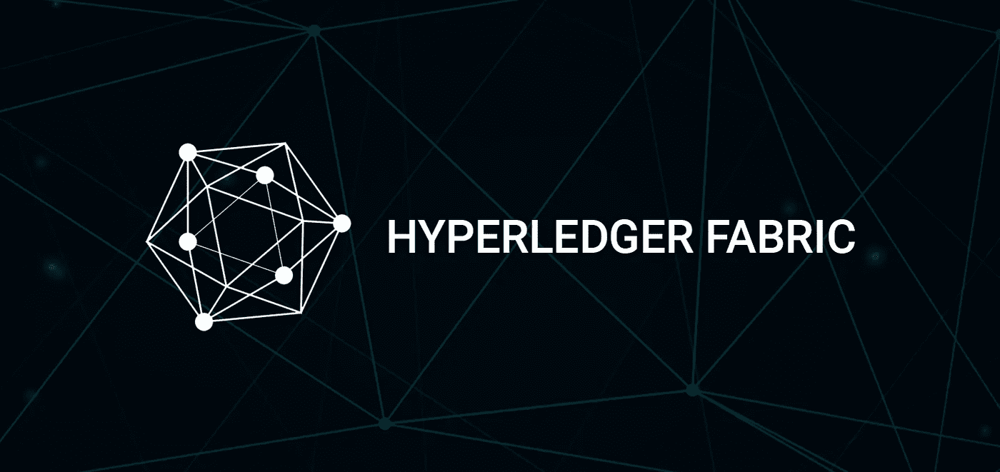

# Hyperledger 面料制作简单——高级

> 原文：<https://medium.com/coinmonks/hyperledger-fabric-made-easy-highlevel-9e56ded4f368?source=collection_archive---------7----------------------->

## 第二部分，组件继续！



Source: [Bangbit](https://bangbit.in/)

合十礼！

我在 PUBG 上有点忙，因此这个系列有点延迟😛 🍓

请参考下面第一部分的链接，我已经介绍了区块链和 Hyperledger 面料的基本知识和一半的组件..

 [## Hyperledger 面料制作简单——高级

### 第一部分，这是给 noobs 的！

medium.com](/coinmonks/hyperledger-fabric-made-easy-highlevel-part-i-6103b463f57a) 

我已经在这篇文章中介绍了所有剩余的组件，在下一篇文章中，我将向您展示 Hyperledger Fabric network 中交易流程的全貌。除此之外，我还将在供应链领域启动简单而彻底的 D-app 开发。

# **同行**

同行是区块链网络最重要的组成部分。“链码”和“分类帐”实例托管在每个对等体上。对等体属于已经同意形成网络的组织。每个组织通过提供对等体来为网络做出贡献。对等体可以有不同链码和分类帐的实例，这些实例可能与其他通道完全无关。组织、同行、分类帐、应用程序、链码和订购者通过一个通道相互连接。这些来自网络/渠道的元素可能完全不知道其他渠道及其合同，这使得 Hyperledger fabric 成为一个**许可的区块链**。当双方希望在不让其他组织知道的情况下完成交易时，这非常有用。

每个组织都有一个锚节点，负责发现属于其他组织的其他节点并与之通信。

Hyperledger fabric SDK 使开发人员能够轻松地与同行进行交互，以调用链码，进而访问分类帐。应用程序与对等方连接，以调用链代码来查询或更新分类帐。来自应用程序的建议发送给对等体，对等体调用相关的链代码，链代码在查询分类帐后形成建议响应。在这种情况下，响应将具有从数据库/分类帐查询的结果和同级的背书。然后，这个响应被发送回应用程序。然而，在分类账更新的情况下，该流程还有一个步骤，即**订购者**进入角色。对等方形成一个建议响应，其中包含分类帐的更新状态(由于交易尚未提交，因此这只是一个建议响应，说明更新后的分类帐在此操作中的情况。)来自对等体的这种响应被组合成一个事务，然后该事务被发送给订购者。订购者收集整个网络上的交易，形成块并将它们分发给所有对等方。对等方验证交易，然后将更新应用到他们自己的分类帐副本。一旦分类帐(每当分类帐在对等方上更新时)被更新，对等方生成一个事件，该事件标记交易完成并发送到应用程序。

这可能是对整个交易流在 fabric 中如何工作的简要说明，可能会再次出现，只是为了在您的记忆中记下这个概念:)

# **频道**

通道是一种媒介，就像(媒介是一种通道😛)的专用通信和结构网络中不同组件的连接。这些组件(对等方、订购方、应用程序等。)基本上为该渠道工作并共享相同分类帐副本。这些实体中的每一个都必须经过身份验证和授权才能在 channel 上进行交易，该身份由会员服务提供商提供，我们将在后面介绍。这些相同的单一分类账副本/实例保持一致，并由各自的同行进行更新。频道就像 whatsapp 群组，其中一个群组中的一些成员也可能出现在另一个群组中，他们可以完全独立，也可以在他们之间进行一些共享。

每当创建一个新的渠道时，就会创建一个 **Genesis 块**，用于存储有关分类帐、成员和渠道策略的配置信息。当一个新成员被添加到一个现有的信道时，这个起源块与它共享，以向该成员提供最近的配置更新。

# **组织**

区块链网络由多个组织管理和运营。这些组织与他们自己的同行一起做出贡献，并在分布式分类帐更新中充当验证和认可单元。该网络不是由任何单一组织集中或运营的，即使任何一个组织离开使其分散，该网络也将继续存在。应当适当注意的是，对于查询分类帐的事务，单个组织内的对等体足以查询分类帐，然而对于更新分类帐事务，网络中的所有组织(对等体)需要在提交之前签署更新。我们将讨论更多关于使用 MSP 使组织加入网络的内容。

# **订购者**

众所周知，在更新分类账交易的情况下，需要额外的步骤来获得批准方的一致同意或验证，订购方或订购服务是该流程的核心。订购节点从许多应用程序(确切地说是对等方)接收包含认可的提议响应的事务。这些交易被排序并打包成块，这些块将被分发给所有对等方，用于验证和更新分类帐。交易的顺序不必与它们到达订购方时的顺序相同；但是，秩序是严格的，不可改变的。这些交易以相同的顺序记录到分类账的所有副本中，以保持分类账的一致性。一旦它们被打包成块，它们就不能被改变，订购者收集所有的交易，而不管它们的失败或错误/无效输出。事务永远不会被丢弃。订购者向所有对等体广播块并不是强制性的，但是对等体也可以使用 Gossip 协议将它们传送给其他对等体。

# **身份和会员服务提供商(MSP)**

为了加入到结构网络中，不同的参与者如对等者、订购者等。需要表明身份。这些身份决定了区块链网络中的成员需要被授予何种角色和权限。所有这些属性统称为**主体**，就像用户标识或群组标识一样，具有灵活的特性。现在，验证这些身份的合法性意味着它们来自可信的来源，它们需要由某个权威机构进行监控。成员服务提供商(MSP)负责管理这个过程。MSP 定义了一组有效的身份，成员必须拥有这些身份才能插入。默认情况下，MSP 使用 X.509 证书作为身份，采用传统的公钥基础设施(PKI)模型。

将身份视为您拥有的不同信用卡，将 MSP 视为商店经理在销售商品时遵循的规则手册。该规则手册只允许特定信用卡提供商的信用卡付款，因为他们是商店唯一信任的成员。(同样，默认情况下，MSP 允许 X.509 证书)

PKI 涉及到由可信的认证机构签署的数字证书的发行，这些证书可以在建立和与其他方通信时使用。如果你正在使用 HTTPs 连接的网站，你可以在浏览器的搜索栏看到一个绿色的“安全”图标。如果你点击它，你可以看到一个包含大量相关信息的数字证书。这个数字证书只不过是一个文档，其中保存了持有者的重要信息，包括其公钥，并使用 CA 的私钥进行加密。对证书的任何篡改都是显而易见的，证书会被拒绝，然后被吊销。CRL 跟踪吊销的证书列表。因此，只要接收方也信任同一个 CA，成员就可以用这个证书来证明自己的身份。尽管没有要求，接收方应始终与 CRL 一起检查证书的有效性。最常见的证书类型是符合 X.509 标准的证书。

这么多的内容应该足以理解面料的**特性**，但是[探索更多](https://en.wikipedia.org/wiki/Public_key_infrastructure)总是很有趣，呃！？

**MSP** 包括并标识哪些 ca 被授权向成员颁发身份，还负责向不同成员提供不同级别的特权。组织在一个 MSP 下管理他们的成员。

```
**Part III topics:**
 Transaction flow Big picture
 Kick-start of sample D-app
```

这看起来像是一篇过于简单的文章，但事实就是如此。如果你想更深入地了解区块链世界，我会一直建议你阅读这些文件！

请随时发表评论和问题。在那之前，请保持关注和好奇！🐕


Rudra from Sacred Games