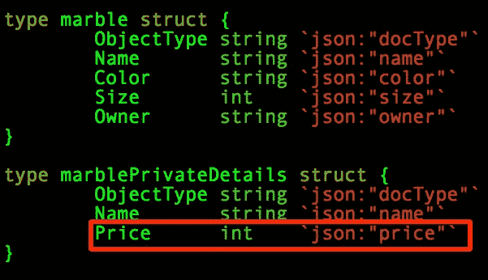

# Hyperledger 结构私有数据集合

> 原文：<https://medium.com/coinmonks/hyperledger-fabric-not-so-private-data-collections-cb4dbff62c58?source=collection_archive---------0----------------------->

Hyperledger Fabric 向前迈进了一大步，在 Hyperledger Fabric 的 1.2 版本中增加了 [**私有数据集合**](https://hyperledger-fabric.readthedocs.io/en/release-1.2/private-data/private-data.html) 。这个概念很有意义，因为当一些组织希望在一个更大的通道内交换私有数据时，创建一个新的通道就成了管理上的噩梦。

# **私人数据收集**

私有数据收集使部分数据成为私有数据成为可能，从而允许组织的子集在同一渠道上查看数据的私有部分。

# 2018 年 10 月 26 日更新

IBM**的 David Enyeart(Hyperledger Fabric 项目的维护者)联系我，澄清了我在文章第一版中发现的问题:**

> 不幸的是，最初的社区样本并没有展示使用瞬态字段来保持数据的私密性

Dave 说最新的 [1.3 文档](https://hyperledger-fabric.readthedocs.io/en/release-1.3/private-data-arch.html#how-to-pass-private-data-in-a-chaincode-proposal)在指定瞬态字段方面做得更好，如下所示:

> chaincode 提议中的一个特殊字段称为`*transient*`字段，可以用来传递来自客户端的私有数据(或者 chaincode 将用来生成私有数据的数据)，以便在对等体上调用 chaincode。

这篇文章是 ***现在*** 关于当你 ***不*** 使用`*transient*`字段时会发生什么。谢谢戴夫！

# **我是如何发现这个问题的**

我一直在建立一个数据库适配器来存储任何标准数据库，如 MySQL，MongoDB，Oracle 或 Postgres 的 Hyperledger 私人数据。

确保我的数据库适配器安全的一部分是首先检查 Hyperledger 是如何存储和清除私有数据的。

# **BlockToLive**

Hyperledger 在 collections_config.json 中有一个[**block to live**](https://hyperledger-fabric.readthedocs.io/en/release-1.2/private-data-arch.html?highlight=blockToLive)**属性，该属性指定在清除数据之前有多少个块。**

****

# ****吹扫****

**在添加了 X 个块(在本例中是 3 个块)之后，数据不再可用于查询，从这个意义上说，清除是有效的。**

**这是一个在**预清除**时完成的私有数据查询的示例。**

****

**这是在清除后完成的**相同的私有数据查询。****

****

# ****问题****

**问题是私有数据被清除了，**但是**如果你不调用带有 transient 字段的调用，当我们初始化私有数据(在本例中是一个弹球，价格为 0.99 美元)时，私有数据实际上被写入了**所有的**块文件中，甚至是在组织对等体上，这些对等体本应**而不是**对私有数据有任何**访问权。指定了 **blockToLive** 属性的 collections_config.json 还指定了指示哪些组织可以访问私有数据的策略。****

****

**私有数据是由 [Golang](https://github.com/golang) 文件 marbles_chaincode_private.go 中的 initMarble 函数创建的**

**下面是 marblePrivateDetails 结构，来自 marbles_chaincode_private.go，其中很明显 ***Price*** 整数是 **private。****

****

**这里是 Org2 上一个对等体的**清除后**块文件，在这里您可以看到 Org2 不应该**获得的私有数据，即清除前和清除后。****

****

# ****结论****

**我相信 Hyperledger 将成为企业的主流区块链解决方案，这个问题不会让我对 Hyperledger 失去兴趣，但这项技术是新的，公司需要对开发和迭代测试保持警惕，以确保使用瞬态字段保持私人数据的私密性。**

**你觉得这篇文章怎么样？如果你喜欢它或者学到了什么，请留下你的掌声！DarkBlock.io 是一家区块链企业发展公司，我们一直在接纳新客户。请通过 [sheffield@darkblock.io](mailto:sheffield@darkblock.io) 联系我或访问我们的网站 [DarkBlock.io](https://darkblock.io/) ！**