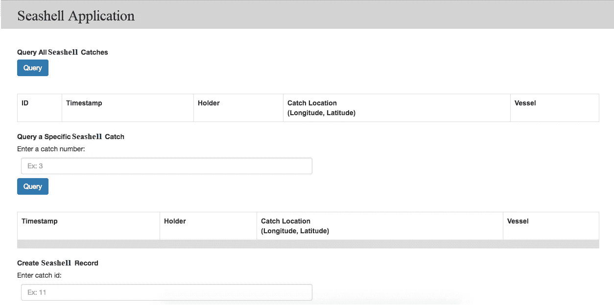

# Hyperledger Fabric —贝壳供应链系统 II

> 原文：<https://medium.com/coinmonks/hyperledger-fabric-seashell-supplychain-system-ii-3622ccefd11d?source=collection_archive---------1----------------------->

现在，我们已经了解了区块链的基本原理和 Hyperledger 的高级结构，让我们利用这些知识来处理一个真实的场景。

**问题背景:**

我们的目标是消除非法的、未报告的和不受管制的贝壳开采。我们将使用 Hyperledger Fabric 为一个真实世界的例子带来透明度和清晰度:**海贝开采的供应链。**

我们将描述如何改进海贝开采，从源头开始，工人山姆，以及他的海贝最终到达米拉商店的过程。在此期间，我们将让其他各方参与进来，比如负责核实数据有效性和贝壳捕捞可持续性的监管机构。

我们将使用 Hyperledger Fabric 的框架来跟踪这一过程的每个部分。

要记住两件事:

1.  网络中有许多参与者，您将看到这些参与者如何互动，以及交易是如何进行的。
2.  私人渠道允许 Sam 和 Mira 私下商定他们互动的条款，同时仍然保持透明度，因此其他行为者可以确证和确认他们的交易。

通过私人渠道，监管者和店主可以确认某一批贝壳的来源是否是可持续和合法的，而不需要查看整个旅程的细节。

# 利益相关者

*   **山姆**是一名可持续且合法获取贝壳的工人。
*   监管者核实这些贝壳是合法且可持续捕捞的。
*   **Mira** 是一名店主，在这种情况下，他将充当最终用户。
*   **卡尔**是另一家商店的店主，工人山姆可以卖贝壳给。

# 问题架构概述:

下面是本节介绍的贝壳获取场景的摘要:

1.  Sam 取出一个贝壳，并使用供应链应用程序的用户界面将有关取出的所有细节记录到分类账中。在到达分类帐之前，交易被传递到网络上的背书对等点，然后在那里被背书。被认可的交易被发送到订购服务，被订购到一个块中。然后，该数据块被发送到网络中的提交对等方，在那里经过验证后被提交。
2.  当贝壳沿着供应链传递时，监管者可以使用他们自己的应用程序**查询分类账**以获得关于具体捕获量的详细信息(不包括价格，因为他们无法访问与价格相关的链码)
3.  山姆可以与店主卡尔达成协议，并同意每磅 80 美元的价格。他们使用蓝色通道的链码合同规定 80 美元/磅。**蓝色通道的分类账**用包含该交易的块更新。
4.  在另一份商业协议中，Sam 和 Mira 商定了每磅 50 美元的特价。他们使用红色通道的链码合同，规定 50 美元/磅。**红色通道的分类账**用包含该交易的块更新。

实施修复贝壳供应链[解决方案的第一步是建立技术环境，这是第一步。安装 Hyperledger Fabric 并确保网络正常运行。](/swlh/hyperledger-chapter-5-tuna-fishing-supplychain-context-f593b03e2cf0)

# 安装 Hyperledger 结构

确定您的计算机上要放置 Hyperledger Fabric 示例应用程序存储库的位置，并在终端窗口中打开它。然后，执行以下命令:

> git 克隆 **-** b 主[https://github.com/sakshm-aurora/fabric-samples.git](https://github.com/sakshm-aurora/fabric-samples.git)
> 
> cd 面料 **-** 样品
> 
> git checkout {TAG}

注意-为确保示例与您下载的以下 Fabric 二进制文件版本兼容，请检查与您的 Fabric 版本匹配的示例`{TAG}`,例如 v1.1.0。要查看所有 fabric-samples 标签的列表，请使用命令“git tag”。

# 下载特定于平台的二进制文件

接下来，我们将安装特定于 Hyperledger Fabric 平台的二进制文件。这一过程旨在补充上述 Hyperledger 织物样本，但可以独立使用。如果您没有安装上面的示例，那么只需创建并输入一个目录，将特定于平台的二进制文件的内容提取到该目录中。

请在要将特定于平台的二进制文件解压缩到的目录中执行以下命令:

> https://goo.gl/6wtTN5 | bash-1 . 1 . 0

上面的命令下载并执行一个 bash 脚本，该脚本将下载并提取设置网络所需的所有特定于平台的二进制文件，并将它们放入上面创建的克隆 repo 中。它检索四个特定于平台的二进制文件:

*   `cryptogen`，
*   `configtxgen`，
*   `configtxlator`，
*   `peer`
*   `orderer`和
*   `fabric-ca-client`

并将它们放在当前工作目录的`bin`子目录中。

您可能希望将它添加到 PATH 环境变量中，这样就可以在不完全限定每个二进制文件的路径的情况下选择这些变量。例如:

> 导出路径= <path to="" download="" location="">/bin:$PATH</path>

测试:

> docker 图像

Expected Output

# 启动测试 Hyperledger 结构网络

现在我们已经成功安装了 Hyperledger Fabric，我们可以逐步建立一个有两个成员的简单网络。回到我们演示的场景，该网络包括在工人 Sam 和餐馆老板 Mira 之间验证、转移和购买的每个贝壳的资产管理。我们将创建一个简单的双成员网络，由两个组织(实际上是 Sam 和 Mira)组成，每个组织维护两个对等点和一个订购服务。

我们将使用 Docker 映像来引导我们的第一个 Hyperledger 结构网络。它还将启动一个容器来运行脚本化执行，该脚本化执行将对等体加入到通道中，部署和实例化链代码，并针对链代码执行事务。

> cd 优先-网络
> 
> 。/byfn.sh -m 生成

将会出现一个简短的描述，以及一个 **Y/N** 命令行提示。回复一个 **Y <回车>T3 继续。**

该步骤为我们的各种网络实体生成所有证书和密钥，包括用于引导订购服务的 genesis 块和创建通道所需的配置事务集合。

接下来，您可以使用以下命令启动网络:

> 。/byfn.sh -m up

另一个命令行会出现，回复用 **Y <回车>继续。最后，让我们测试一下如何关闭这个网络。在同一终端内，do **Control+C** 退出当前执行。然后，运行以下命令:**

> 。/byfn.sh -m 向下

另一个命令行会出现，回复 **Y <回车>继续。这个命令将杀死你的容器，删除加密材料和四个工件，并从你的 Docker 注册表中删除链码图像。**

上面的过程在下面的 GIF 中有说明:

byfn.sh

# 链码

在 Hyperledger Fabric 中， **chaincode** 是在对等体上运行并创建交易的“智能合约”。更广泛地说，它使用户能够在 Hyperledger Fabric 网络的共享分类帐中创建交易，并更新资产的世界状态。

使用 Hyperledger Fabric 开发智能合同有两种方法:

*   将单个契约编码到链代码的独立实例中
*   使用 chaincode 创建管理一种或多种业务合同的生命周期的分散应用程序，并让最终用户在这些应用程序中实例化合同实例。[效率更高]

**链码程序概述**

创建链码时，需要实现两种方法:

*   当 chaincode 接收到一个 ***实例化*** 或 ***升级*** 事务时，调用 **Init**
    。这是初始化任何应用程序状态的地方。
*   **Invoke**
    当 ***invoke*** 交易收到时调用，处理任何交易建议。

作为开发人员，必须在链代码中创建一个 **Init** 和一个 **Invoke** 方法。必须使用**对等链码安装**命令安装链码，并在调用链码之前使用**对等链码实例化**命令实例化链码。然后，可以使用**对等链代码调用**或**对等链代码查询**命令创建事务。

# 如何查看链码日志？

您可以检查单个的 chaincode 容器，查看针对每个容器执行的独立事务。使用以下命令查找正在运行的容器列表，以找到您的链码容器:

> $ docker ps -a

# 了解 Docker 组合拓扑

**BYFN** 示例为我们提供了两种风格的 Docker Compose 文件，它们都是从***Docker-Compose-base . YAML***(位于 base 文件夹中)扩展而来的。我们的第一个风格，***docker-compose-cli . YAML***，为我们提供了一个 CLI 容器，以及一个订购者，四个对等者。我们使用这个文件来完成本页的全部说明。

第二种风格是***【docker-compose-e2e . YAML***，它被构造成使用 Node.js SDK 运行端到端测试。除了与 SDK 一起工作之外，它的主要区别是有用于 fabric-ca 服务器的容器。因此，我们能够将 **REST 调用**发送到组织 CAs 进行用户注册和登记。

# 为什么选择 CouchDB

CouchDB 是一种 NoSQL 解决方案。这是一个面向文档的数据库，文档字段存储为键值映射。字段可以是简单的键值对、列表或映射。除了 LevelDB 支持的键/组合键/键范围查询之外，CouchDB 还支持完整的富数据查询功能，例如针对整个[区块链](https://blog.coincodecap.com/what-is-blockchain-a-simple-guide-for-dummies/)数据的非键查询，因为其数据内容以 JSON 格式存储，并且完全可查询。因此，CouchDB 可以满足 LevelDB 不支持的许多用例的链代码、审计和报告需求。

我们将在金枪鱼渔业供应链系统的基础上构建我们的贝壳供应链系统，下面是相同的代码。

[*https://github . com/hyperledger/education/blob/master/lfs 171 x/fabric-material/chain code/tuna-app/tuna-chain code . go*](https://github.com/hyperledger/education/blob/master/LFS171x/fabric-material/chaincode/tuna-app/tuna-chaincode.go)

# Fabric Node.js SDK

现在，我们将使用 node . js SDK(【https://fabric-sdk-node.github.io/】)来与网络交互，因此也与总账交互。Hyperledger Fabric 客户端 SDK 使得使用 API 与 Hyperledger Fabric 区块链进行交互变得非常容易。本节将帮助您编写第一个应用程序，从测试 Hyperledger Fabric 网络开始，然后学习示例智能合同的参数，最后开发查询和更新分类帐记录的应用程序。

有关其他信息，请访问 Hyperledger Fabric Node SDK 文档:[https://Fabric-SDK-Node . github . io/tutorial-app-dev-env-setup . html](https://fabric-sdk-node.github.io/tutorial-app-dev-env-setup.html)。

# **区块链应用**

在尝试运行这个区块链应用程序之前，请确保您已经解决了技术依赖问题。

 [## 这将是一个关于 hyperledger 的两部分系列，hyperledger 是创建、部署和维护…

### 超级分类帐

medium.com](/@saksham.aurora/this-will-be-a-two-part-series-on-hyperledger-the-framework-to-create-deploy-and-maintain-936ac2236c2f) 

**第一步:克隆回购**

> git 克隆[https://github.com/sakshm-aurora/education.git](https://github.com/sakshm-aurora/education.git)
> 
> cd 教育/lfs 171 x/织物材料/金枪鱼应用程序

在运行下一个命令之前，确保您的机器上运行了 Docker。此外，请确保您已完成安装 Hyperledger Fabric。

首先，删除任何预先存在的容器，因为它可能与本教程中的命令冲突:

> 文档 rm -f $(文档 ps -aq)

# 步骤 2:启动结构网络

接下来，让我们使用以下命令启动 Hyperledger 结构网络:

> 。/startFabric.sh

让我们来分析一下当您在终端中运行这个命令时会发生什么。

1.  从 Docker 中删除了现有的网络工件，只创建了一个具有对等体的组织& couch DB 和一个订购者。

正如您在代码中看到的，startfabric。Sh 内部调用 basic-network 文件夹中的 start.sh。

现在，如果您遍历 start.sh，您可以看到 docker 容器是如何被清除和重新填充的。此外，还创建了一个通道并添加了一个对等体。

# 第三步:注册管理员

酷毙了。现在网络已经开通。让我们注册管理员。

> 节点注册 Admin.js

您应该得到这个输出，基本上是用所需的键创建了一个管理员。您可以打开 registerAdmin.js 来查看代码。基本上，对于结构 CA 客户端，我们检查管理员是否已经注册，如果没有，则向 CA 客户端注册。设置基本参数，如 enrollmentID、Secret。然后，使用成员 ID 为的 FabricClient 以及公钥/私钥对创建用户。

# 第四步:注册用户

既然已经设置了网络和管理员，让我们注册一个用户。

> **节点注册用户. js**

如果你打开 **registerUser.js** ，你可以看到我们用 CA 服务器注册用户，然后注册。

# 步骤 5:运行服务器

这一步是运行应用程序的最后一步。为此，我们需要设置 nodejs 服务器，调用所需的包，实例化应用程序并监听特定端口。

> ***节点 server.js***

繁荣..我们的应用程序在端口 8000 上运行

用户界面在 4 个标题下有一个按钮。

查询所有贝壳渔获—触发器—***query alltuna . js***

查询特定贝壳—触发器—***query tuna . js***

创建贝壳记录—触发器—***Record tuna . js***

更换贝壳固定器—触发器—***changetunaholder . js***

所有这些 js 文件都在链码***tuna-chain code . go***中定义

**注意—** 如前所述，贝壳应用程序是基于金枪鱼捕捞应用程序构建的，因此使用相同的脚本。

# 输出

1.  **查询所有贝壳—** 我们在 initLedger 的 chaincode 中使用的所有数据都被提取并显示在这里。

2.**查询贝壳—** 这里我们发送一个查询来查找渔获号为 6 的记录。

3.记录一个贝壳——我们正在创造一个新的记录。

4.**更改贝壳的所有者** —这里我们发送一个 POST 请求来查询渔获 ID 为 12 的记录，并将持有者的名称修改为“Saksham”。

因此，我们来到了我们的两部分系列的结尾。

**阅读第 1 部分:**

[https://medium . com/@ saksham . aurora/this-will-be-a-two-part-series-on-hyperledger-the-framework-to-create-deploy-and-maintain-936 AC 2236 c2f](/@saksham.aurora/this-will-be-a-two-part-series-on-hyperledger-the-framework-to-create-deploy-and-maintain-936ac2236c2f)

**参考文献:**

许多插图和内容取自以下博客，所有的荣誉都属于它们:

 [## Hyperledger —第 1 章|区块链基金会

### 这是我学习 Hyperledger 的日志，Hyperledger 是为企业创建、部署和维护区块链的框架…

medium.com](/swlh/hyperledger-chapter-1-foundation-7ad5bd94d452)  [## 揭开 Hyperledger 结构的神秘面纱(1/3):结构架构

### 最初在 www.serial-coder.com 出版。

medium.com](/coinmonks/demystifying-hyperledger-fabric-1-3-fabric-architecture-a2fdb587f6cb)  [## 面向企业的区块链平台——hyperledger-fabric docs 主文档

### 请确保您正在查看的文档与您正在使用的软件版本相匹配。请参见…

hyperledger-fabric . readthedocs . io](https://hyperledger-fabric.readthedocs.io/en/release-2.0/) 

> [在您的收件箱中直接获得最佳软件交易](https://coincodecap.com/?utm_source=coinmonks)

