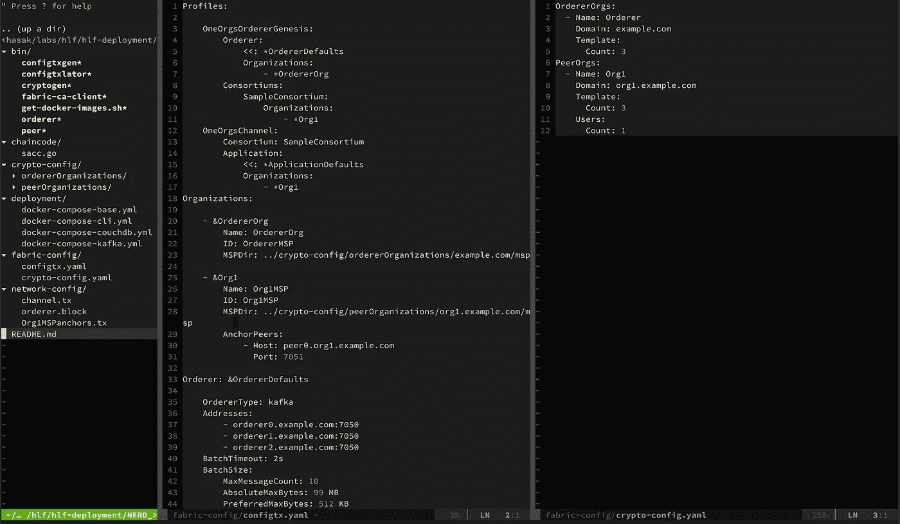

# 具有多个订购者和 kafka 的 Hyperledger 结构集群

> 原文：<https://medium.com/coinmonks/hyperledger-fabric-setup-with-multiple-peers-and-orderers-with-kafka-542023787a6d?source=collection_archive---------0----------------------->

## 生产就绪 hyperledger 结构群

# 快乐分类器:)

当你进入 hyperldger 设置时，你会发现它根本不是一个令人愉快的设置。大量的配置、大量的部署文件，简直就是一场苦战:)。当我进入`kubernetes`时，我认为这是最难理解和配置的东西。但当我在使用 hyperledger 时，我觉得它是错误的:)。所以我想写一些关于 hyperldger fabric 设置的细节。

> [发现并回顾最佳区块链软件](https://coincodecap.com)

我会写一系列关于 hyperldger 面料的帖子。我将这个博客系列命名为`Happyledger`:)以下是我将在`Happyledger`系列中涉及的话题。

1.  在单节点环境中部署生产就绪的 hyperldger 集群
2.  在多节点环境上部署生产就绪的 hyperldger 集群
3.  在 kubernetes 上部署生产就绪的 hyperldger 集群
4.  编写基于 scala 的 hyperledger 客户端应用程序
5.  编写链代码并在本地环境上测试它们

在这篇文章中，我将介绍如何部署生产就绪 hlf 集群(具有多个对等体、多个订购者和 kafka)。所有的部署文件和配置都在[hlf-deployment](https://gitlab.com/rahasak-labs/hlf-deployment)git lab repo。请检查存储库并跟随帖子。

# 服务结构

我要建立的 hyperledger 网络包含以下服务。在本文中，这些服务将部署在一台主机上。在下一篇文章中，我将为多主机环境扩展这个设置。

1.  一个组织(`org1.example.com`
2.  三个同行(`peer0.org1.example.com`、`peer1.org1.example.com`、`peer2.org1.example.com`)
3.  一个认证机构(`ca.example.com`)
4.  三个命令者(`orderer0.example.com`、`orderer1.example.com`、`orderer2.example.com`)
5.  三个动物园管理员节点(`zookeeper0`、`zookeeper1`、`zookeeper2`)
6.  四个卡夫卡节点(`kafka0`、`kafka1`、`kafka2`、`kafka3`)

以下是配置和部署集群的步骤。

# 1.生成配置

## 1.1.设置环境

为了与 hlf 一起工作，我们需要有加密证书、genesis 块和通道配置。为了生成它们，我们使用了`bin`目录上的脚本和`config`目录上的配置(`crypto-config.yaml`和`configtx.yaml`)。所以我们需要添加`bin`目录`$PATH`，并用`config`目录设置`FABRIC_CFG_PATH`(其中`configxtx.yaml`存在)。

## 1.2.生成加密材料

现在我们需要为我们的`orderer`、`peers`和`ca`生成证书/密钥。我们使用`cryptogen`脚本来生成它们。该脚本将在`crypto`目录中生成加密材料。

## 1.3.生成生成块

接下来，我们需要为订购者生成 genesis 块。可以通过使用`configtxgen`脚本来完成。

## 1.4.生成通道配置事务

现在我们需要使用`configtxgen`脚本生成通道配置事务。

## 1.5.生成锚点对等事务

最后，我们需要使用`configtxgen`脚本为每个组织生成锚定对等事务。在这个场景中，我们只有一个组织(`org1`)。如果有多个组织，我们需要为所有组织执行此步骤(例如`org1`、`org2`等)。

现在我们的配置已经准备好了。下一件事是部署 docker 容器并运行服务。

# 2.部署服务

## 2.1.定义 CA 证书/密钥

在启动服务之前，我们需要在`deployment/docker-compose-kafka.yaml`中定义 CA 证书和密钥。CA 证书和密钥可以在`crypto-config/peerOrganizations/org1.example.com/ca`目录下找到。用`FABRIC_CA_SERVER_CA_CERTFILE`变量定义 CA 证书，用`FABRIC_CA_SERVER_CA_KEYFILE`变量定义 CA 密钥，如下所示。

## 2.2.启动服务

现在，我们可以部署与结构服务和 cli 服务相关的 docker 容器。在`docker-compose-kafka.yaml`上需要注意的一点是，在每个对等体中，它定义了`CORE_PEER_GOSSIP_BOOTSTRAP`地址。在光纤网络中，订购方仅向每个组织中的单个对等方交付数据块(`leader peer`)。通过进程调用`gossip`，网络中的其他对等体接收到该块。更多关于布料八卦的信息可以从[这里](/kokster/understanding-hyperledger-fabric-gossip-512a217d5d1e)找到。

`CORE_PEER_GOSSIP_BOOTSTRAP`用来在组织内部自举流言蜚语。如果您正在使用 gossip，那么您通常会将您组织中的所有对等体配置为指向用于引导的一组初始对等体(您可以指定一个用空格分隔的对等体列表)。在这里，我使用了一个对等体作为八卦引导地址。对于`peer1`和`peer2`中的一个例子，我已经用`peer0`作为八卦自举。在`peer0`中，我使用了`peer1`作为八卦引导。

在结构中，初始跨组织引导信息通过`anchor peer`提供。这意味着，最初组织中的对等体将只知道锚对等体。要将一个对等体的八卦终点通知给不同组织中的其他对等体，您需要设置`CORE_PEER_GOSSIP_EXTERNALENDPOINT`。如果未设置此项，则有关对等方的端点信息将不会广播给其他组织中的对等方。如果简单地说，为了与其他组织的同事闲聊，你需要设置`CORE_PEER_GOSSIP_EXTERNALENDPOINT`。

它将开始跟踪你机器上的容器。

1.  一个`ca`集装箱
2.  三个`orderer`容器
3.  三个`peer`容器
4.  三个`zookeeper`容器
5.  四个`kafka`容器
6.  一个`cli`集装箱

# 3.设置频道

## 3.1.创建频道

首先，我们需要用以前创建的渠道配置事务创建一个渠道。在这里，我们连接到`peer0.org1.example.com` docker 容器并在其上执行通道创建命令。

接下来，我们需要将我们所有的同行(3 个同行)加入这个渠道。

## 3.2.将对等机 0 加入频道

现在我们正在连接到`peer0.org1.example.com` docker 容器，并在其上执行 channel join 命令。这个命令将在`peer0.org1.example.com` docker 容器中生成`mychannel.block`。

## 3.3.将 mychannel.block 复制到其他对等方

如前所述，当加入`peero.org1.example.com`对等体时，它生成`mychannel.block`。我们需要将这个文件复制到`peer1.org1.example.com`和`peer2.org1.example.com`容器中。那么只有这些容器可以加入到通道中。我在这里使用`docker cp`命令来复制文件。

我们可以使用`cli`容器来创建通道并将对等体加入到通道中。如果你正在使用它，你不需要复制文件和做上述步骤。请关注这篇文章了解更多信息。

## 3.4.将对等 1 加入通道

现在我们可以将`peer1.org1.example.com`加入频道。

## 3.5.将 peer2 加入通道

和以前一样，我可以把`peer2.org1.example.com`加入频道。

# 4.设置链码

现在我们需要在所有对等体上安装 chaincode。链码位于`chaincode`目录中。我们使用 cli 容器来安装链码。Cli 容器连接到其中一个对等点(`peer0`、`peer1`、`peer2`)来工作。使用 cli 容器中的`CORE_PEER_ADDRESS` env 变量连接对等定义。当在对等体中安装链码时，hlf 将启动一个单独的 docker 容器来运行链码。

## 4.1.安装在 peer0 上

为了在`peer0`CLI 容器上安装 chaincode，我们需要连接到`peer0`。在`docker-compose-cli.yaml`中设置`CORE_PEER_ADDRESS=peer0.org1.example.com:7051`并重新创建 cli。然后执行下面的命令。

## 4.2.安装在对等 1 上

设置`CORE_PEER_ADDRESS=peer1.org1.example.com:7051`并执行以下命令。

## 4.3.安装在对等机 2 上

设置`CORE_PEER_ADDRESS=peer2.org1.example.com:7051`并执行以下命令。

## 4.5.实例化链代码

现在我们已经在所有的对等体上安装了 chaincode。下一件事是实例化链码。链码仅在通道上实例化一次(不在对等体中)。

现在我们的网络已经准备好了，chaincode 已经启动并在每个对等体上运行。我们可以用运行链码进行交易。

# 5.做交易

hyperldger 中有两种类型的事务，`invoke`和`query`。下面是进行交易的方法。

## 5.1.调用事务

通过`invoke`，chaincode 可以修改总账中变量的状态。每个`invoke`交易将被添加到 ledge(它更新分类帐状态)。您可以连接到任何对等体并调用/查询事务。在这里，我连接到`peer0`(使用 cli 容器)并执行调用事务。

## 5.2.查询交易

通过`query`，chaincode 将读取当前状态并发送给用户。此交易记录未添加到分类帐(它未更新分类帐状态)。现在我通过连接到`peer2`来执行查询

# 下一步是什么

现在您已经在`single host environment`上用 kafka 设置了多对等、多订购者的 hyperledger 集群，并在其上执行交易。我们使用 cli 容器来执行事务。在下一篇文章中，我将展示如何在`multi host environment`中部署光纤网络。快乐阅读:)

# 参考

1.  [https://medium . com/@ my coral health/start-your-own-hyperledger-区块链-the-easy-way-5758cb4ed2d1](/@mycoralhealth/start-your-own-hyperledger-blockchain-the-easy-way-5758cb4ed2d1)
2.  [https://medium . com/@ wahabjawed/extending-hyperledger-fabric-network-adding-a-new-peer-4f 52 f 70 a 7217](/@wahabjawed/extending-hyperledger-fabric-network-adding-a-new-peer-4f52f70a7217)
3.  [https://hyperledger-fabric . readthedocs . io/en/stable/install _ instantiate . html](https://hyperledger-fabric.readthedocs.io/en/stable/install_instantiate.html)
4.  [https://medium . com/swlh/hyperledger-chapter-7-installing-hyperledger-fabric-89430 e 61 b 7 bb](/swlh/hyperledger-chapter-7-installing-hyperledger-fabric-89430e61b7bb)
5.  [https://medium . com/@ itseranga/hyperledger-fabric-cluster-on-multi-hosts-af 093 f 00436](/@itseranga/hyperledger-fabric-cluster-on-multiple-hosts-af093f00436)

> [在您的收件箱中直接获得最佳软件交易](https://coincodecap.com/?utm_source=coinmonks)

