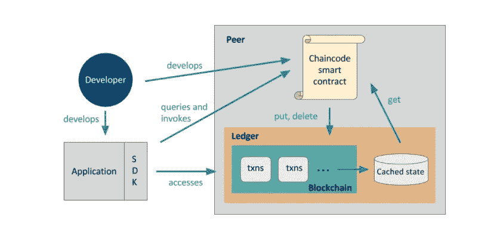
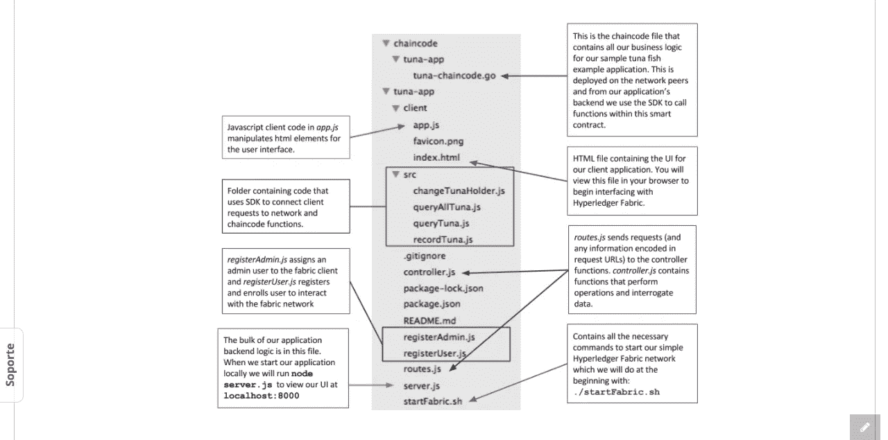
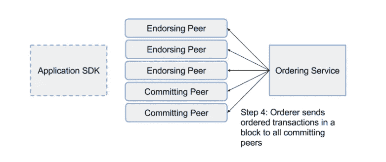
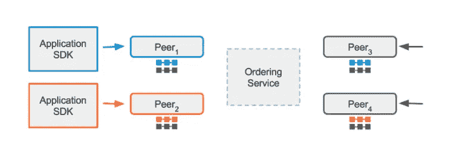

# Hyperledger 织物:最完整的

> 原文：<https://medium.com/coinmonks/hyperledger-fabric-the-most-complete-b5ed0aa6e7b9?source=collection_archive---------0----------------------->

在这一系列关于 hyperledger 项目的第一篇文章中，我想以我认为最完整的开始。[面料](http://hyperledger-fabric.readthedocs.io/en/release/)是一种

> “分布式总账解决方案的平台，以模块化架构为基础，提供高度的保密性、弹性、灵活性和可扩展性。它旨在支持不同组件的可插拔实现，并适应整个经济生态系统中存在的复杂性和错综复杂性。”

它最初是由 Digital Asset 和 IBM 作为第一次黑客马拉松的结果而贡献的。[代码](https://github.com/hyperledger/fabric)可用，有丰富的[社区](https://chat.hyperledger.org/channel/fabric)和[完整的文档](http://hyperledger-fabric.readthedocs.io/en/release/)。

我将跳过所有基于平台的理论概念，给它一个如何基于这项技术思考解决方案的概念。在这篇文章中，我不会展示如何构建一个链码。它只展示了如何在 webapp 中构建逻辑。

Basic structure for a fabric app

# **技术**

这是需要的栈:cURL、Node.js、npm 包管理器、Go 语言、Docker 和 Docker Compose。

# 步伐

$ git 克隆[https://github.com/hyperledger/education.git](https://github.com/hyperledger/education.git)

$ cd 教育/lfs 171 x/织物材料/金枪鱼应用程序

$ ./startFabric.sh

$ npm 安装

$ node registerAdmin.js

$ node registerUser.js

$ node server.js

最后，浏览本地主机:8000

# **应用程序的结构**

# 意见和建议

在 web app 中:如果您想更改逻辑，只需在 **routes.js** 和 **controller.js** 中添加即可。以及 **src** 文件夹中的逻辑。

# 词汇表

MSP

> 成员资格服务提供者(MSP)是一个定义规则的组件，在这些规则中，身份被验证、认证并被允许访问网络。MSP 管理用户 id 并认证想要加入网络的客户端。这包括为这些客户提供提议交易的凭证。MSP 使用一个*认证机构*，它是一个可插拔的接口，在确认身份后验证和撤销用户证书。

**链码**

> 它是在对等体上运行并创建交易的“智能契约”。更广泛地说，它使用户能够在结构网络的共享分类帐中创建交易，并更新资产的世界状态。
> 
> Chaincode 是可编程代码，用 Go 编写，在通道上实例化。开发人员使用 chaincode 来开发业务契约、资产定义和集中管理的分散应用程序。链码通过应用程序调用的事务来管理分类帐状态。资产由特定的链码创建和更新，不能由另一个链码访问…

在这种情况下，您可以在**中找到链码。/education/lfs 171 x/fabric-material/chain code/tuna-app/tuna-chain code . go .**

**点餐服务**

> 一个时间范围内的事务被分类到一个块中，并按顺序提交。在区块链网络中，交易必须以一致的顺序写入共享分类账。必须建立事务的顺序，以确保世界状态的更新在提交给网络时是有效的。与通过解决密码难题或挖掘进行排序的比特币区块链不同，Fabric 允许运行网络的组织选择最适合该网络的排序机制。

**频道**

> 通道允许组织利用同一个网络，同时保持多个区块链之间的隔离。只有执行交易的通道成员才能看到交易的细节。换句话说，通道划分了网络，以便只允许利益相关者看到交易。这种机制的工作原理是将交易委托给不同的分类帐。只有通道的成员参与共识，而网络的其他成员看不到通道上的交易。

> [直接在您的收件箱中获得最佳软件交易](https://coincodecap.com/?utm_source=coinmonks)

