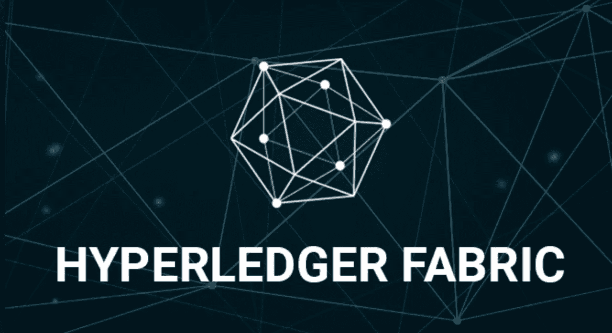
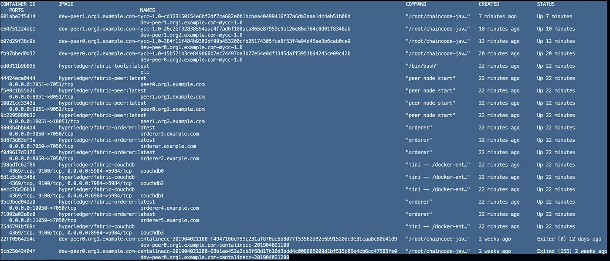

# Hyperledger 面料——筏的味道

> 原文：<https://medium.com/coinmonks/hyperledger-fabric-the-taste-of-raft-4f9f0df20b5e?source=collection_archive---------0----------------------->

## 让我们试试新加入的共识——用布料做的筏子



[Hyperledger Fabric Image](https://www.hyperledger.org/blog/2018/11/28/conducting-data-with-concerto-and-hyperledger-fabric)

## 介绍

自从 Fabric ***1.4.1*** 以来，Fabric 支持一种新的共识，叫做 ***筏*** ，而不仅仅是卡夫卡和索罗。这篇短文是为了“品尝”Fabric 的构建你的第一个网络教程中的 Raft。

> 稍后，您将看到我关闭了一些订单，其中每个订单都是筏领导。它向您展示了使用 Raft 的订购者可以:
> 
> **在首领节点**崩溃的情况下自动重选首领****

> [发现并回顾最佳区块链软件](https://coincodecap.com)

## 设置环境

我们使用 Fabric 的[构建您的第一个网络](https://hyperledger-fabric.readthedocs.io/en/release-1.4/build_network.html)，其中包含:

*   2 个组织
*   5 名订购者
*   每个组织有 2 名同事，有 CouchDB
*   控制对等机和订购机的命令行界面
*   一个频道(我的频道)
*   一种简单的织物链码

首先，按照 下面的 ***准备前提条件:***

[https://hyperledger-fabric . readthedocs . io/en/release-1.4/prereqs . html](https://hyperledger-fabric.readthedocs.io/en/release-1.4/prereqs.html)

***满足*** 前提条件后，打开终端，定位到你喜欢的地方，如桌面。

然后键入以下命令:

```
curl **-**sSL http:**//**bit**.**ly**/**2ysbOFE **|** bash **-**s
```

该命令用于下载 Fabric docker 图像，并拉出包含教程文件的目录***Fabric-samples***。

现在按照下面的*命令逐一执行:*

```
*cd fabric**-**samples**/**first**-**network**../**bin**/**cryptogen generate **--**config**=./**crypto**-**config**.**yamlexport FABRIC_CFG_PATH=$PWD**../**bin**/**configtxgen **-**profile SampleMultiNodeEtcdRaft **-**channelID byfn**-**sys**-**channel **-**outputBlock **./**channel**-**artifacts**/**genesis**.**blockexport CHANNEL_NAME=mychannel../bin/configtxgen -profile TwoOrgsChannel -outputCreateChannelTx ./channel-artifacts/channel.tx -channelID $CHANNEL_NAME../bin/configtxgen -profile TwoOrgsChannel -outputAnchorPeersUpdate ./channel-artifacts/Org1MSPanchors.tx -channelID $CHANNEL_NAME -asOrg Org1MSP../bin/configtxgen -profile TwoOrgsChannel -outputAnchorPeersUpdate ./channel-artifacts/Org2MSPanchors.tx -channelID $CHANNEL_NAME -asOrg Org2MSPdocker**-**compose **-**f docker**-**compose**-**cli**.**yaml **-**f docker-compose-couch.yaml **-**f docker-compose-etcdraft2.yaml up **-**ddocker exec **-**it cli bashCORE_PEER_MSPCONFIGPATH**=/**opt**/**gopath**/**src**/**github**.**com**/**hyperledger**/**fabric**/**peer**/**crypto**/**peerOrganizations**/**org1**.**example**.**com**/**users**/**Admin@org1**.**example**.**com**/**msp
CORE_PEER_ADDRESS**=**peer0**.**org1**.**example**.**com:7051
CORE_PEER_LOCALMSPID**=**"Org1MSP"
CORE_PEER_TLS_ROOTCERT_FILE**=/**opt**/**gopath**/**src**/**github**.**com**/**hyperledger**/**fabric**/**peer**/**crypto**/**peerOrganizations**/**org1**.**example**.**com**/**peers**/**peer0**.**org1**.**example**.**com**/**tls**/**ca**.**crtexport CHANNEL_NAME=mychannelpeer channel create -o orderer.example.com:7050 -c $CHANNEL_NAME -f ./channel-artifacts/channel.tx --tls --cafile /opt/gopath/src/github.com/hyperledger/fabric/peer/crypto/ordererOrganizations/example.com/orderers/orderer.example.com/msp/tlscacerts/tlsca.example.com-cert.pempeer channel join **-**b mychannel**.**blockCORE_PEER_MSPCONFIGPATH**=/**opt**/**gopath**/**src**/**github**.**com**/**hyperledger**/**fabric**/**peer**/**crypto**/**peerOrganizations**/**org2**.**example**.**com**/**users**/**Admin@org2**.**example**.**com**/**msp CORE_PEER_ADDRESS**=**peer0**.**org2**.**example**.**com:9051 CORE_PEER_LOCALMSPID**=**"Org2MSP" CORE_PEER_TLS_ROOTCERT_FILE**=/**opt**/**gopath**/**src**/**github**.**com**/**hyperledger**/**fabric**/**peer**/**crypto**/**peerOrganizations**/**org2**.**example**.**com**/**peers**/**peer0**.**org2**.**example**.**com**/**tls**/**ca**.**crt peer channel join **-**b mychannel**.**blockCORE_PEER_MSPCONFIGPATH**=/**opt**/**gopath**/**src**/**github**.**com**/**hyperledger**/**fabric**/**peer**/**crypto**/**peerOrganizations**/**org1**.**example**.**com**/**users**/**Admin@org1**.**example**.**com**/**msp
CORE_PEER_ADDRESS**=**peer0**.**org1**.**example**.**com:7051
CORE_PEER_LOCALMSPID**=**"Org1MSP"
CORE_PEER_TLS_ROOTCERT_FILE**=/**opt**/**gopath**/**src**/**github**.**com**/**hyperledger**/**fabric**/**peer**/**crypto**/**peerOrganizations**/**org1**.**example**.**com**/**peers**/**peer0**.**org1**.**example**.**com**/**tls**/**ca**.**crtpeer channel update -o orderer.example.com:7050 -c $CHANNEL_NAME -f ./channel-artifacts/Org1MSPanchors.tx --tls --cafile /opt/gopath/src/github.com/hyperledger/fabric/peer/crypto/ordererOrganizations/example.com/orderers/orderer.example.com/msp/tlscacerts/tlsca.example.com-cert.pemCORE_PEER_MSPCONFIGPATH=/opt/gopath/src/github.com/hyperledger/fabric/peer/crypto/peerOrganizations/org2.example.com/users/Admin@org2.example.com/msp CORE_PEER_ADDRESS=peer0.org2.example.com:9051 CORE_PEER_LOCALMSPID="Org2MSP" CORE_PEER_TLS_ROOTCERT_FILE=/opt/gopath/src/github.com/hyperledger/fabric/peer/crypto/peerOrganizations/org2.example.com/peers/peer0.org2.example.com/tls/ca.crt peer channel update -o orderer.example.com:7050 -c $CHANNEL_NAME -f ./channel-artifacts/Org2MSPanchors.tx --tls --cafile /opt/gopath/src/github.com/hyperledger/fabric/peer/crypto/ordererOrganizations/example.com/orderers/orderer.example.com/msp/tlscacerts/tlsca.example.com-cert.pempeer chaincode install **-**n mycc **-**v 1.0 **-**l java **-**p **/**opt**/**gopath**/**src**/**github**.**com**/**chaincode**/**chaincode_example02**/**java**/**peer chaincode instantiate -o orderer.example.com:7050 --tls --cafile /opt/gopath/src/github.com/hyperledger/fabric/peer/crypto/ordererOrganizations/example.com/orderers/orderer.example.com/msp/tlscacerts/tlsca.example.com-cert.pem -C $CHANNEL_NAME -n mycc -l java -v 1.0 -c '{"Args":["init","a", "100", "b","200"]}' -P "AND ('Org1MSP.peer','Org2MSP.peer')"CORE_PEER_MSPCONFIGPATH**=/**opt**/**gopath**/**src**/**github**.**com**/**hyperledger**/**fabric**/**peer**/**crypto**/**peerOrganizations**/**org1**.**example**.**com**/**users**/**Admin@org1**.**example**.**com**/**msp
CORE_PEER_ADDRESS**=**peer0**.**org1**.**example**.**com:7051
CORE_PEER_LOCALMSPID**=**"Org1MSP"
CORE_PEER_TLS_ROOTCERT_FILE**=/**opt**/**gopath**/**src**/**github**.**com**/**hyperledger**/**fabric**/**peer**/**crypto**/**peerOrganizations**/**org1**.**example**.**com**/**peers**/**peer0**.**org1**.**example**.**com**/**tls**/**ca**.**crtpeer chaincode install **-**n mycc **-**v 1.0 **-**l java **-**p **/**opt**/**gopath**/**src**/**github**.**com**/**chaincode**/**chaincode_example02**/**java**/**peer chaincode query -C $CHANNEL_NAME -n mycc -c '{"Args":["query","a"]}'peer chaincode invoke -o orderer.example.com:7050 --tls true --cafile /opt/gopath/src/github.com/hyperledger/fabric/peer/crypto/ordererOrganizations/example.com/orderers/orderer.example.com/msp/tlscacerts/tlsca.example.com-cert.pem -C $CHANNEL_NAME -n mycc --peerAddresses peer0.org1.example.com:7051 --tlsRootCertFiles /opt/gopath/src/github.com/hyperledger/fabric/peer/crypto/peerOrganizations/org1.example.com/peers/peer0.org1.example.com/tls/ca.crt --peerAddresses peer0.org2.example.com:9051 --tlsRootCertFiles /opt/gopath/src/github.com/hyperledger/fabric/peer/crypto/peerOrganizations/org2.example.com/peers/peer0.org2.example.com/tls/ca.crt -c '{"Args":["invoke","a","b","10"]}'peer chaincode query -C $CHANNEL_NAME -n mycc -c '{"Args":["query","a"]}'CORE_PEER_MSPCONFIGPATH**=/**opt**/**gopath**/**src**/**github**.**com**/**hyperledger**/**fabric**/**peer**/**crypto**/**peerOrganizations**/**org2**.**example**.**com**/**users**/**Admin@org2**.**example**.**com**/**msp
CORE_PEER_ADDRESS**=**peer1**.**org2**.**example**.**com:10051
CORE_PEER_LOCALMSPID**=**"Org2MSP"
CORE_PEER_TLS_ROOTCERT_FILE**=/**opt**/**gopath**/**src**/**github**.**com**/**hyperledger**/**fabric**/**peer**/**crypto**/**peerOrganizations**/**org2**.**example**.**com**/**peers**/**peer1**.**org2**.**example**.**com**/**tls**/**ca**.**crtpeer chaincode install **-**n mycc **-**v 1.0 **-**l java **-**p **/**opt**/**gopath**/**src**/**github**.**com**/**chaincode**/**chaincode_example02**/**java**/**peer channel join **-**b mychannel**.**blockCORE_PEER_MSPCONFIGPATH**=/**opt**/**gopath**/**src**/**github**.**com**/**hyperledger**/**fabric**/**peer**/**crypto**/**peerOrganizations**/**org1**.**example**.**com**/**users**/**Admin@org1**.**example**.**com**/**msp
CORE_PEER_ADDRESS**=**peer1**.**org1**.**example**.**com:8051
CORE_PEER_LOCALMSPID**=**"Org1MSP"
CORE_PEER_TLS_ROOTCERT_FILE**=/**opt**/**gopath**/**src**/**github**.**com**/**hyperledger**/**fabric**/**peer**/**crypto**/**peerOrganizations**/**org1**.**example**.**com**/**peers**/**peer1**.**org1**.**example**.**com**/**tls**/**ca**.**crtpeer chaincode install **-**n mycc **-**v 1.0 **-**l java **-**p **/**opt**/**gopath**/**src**/**github**.**com**/**chaincode**/**chaincode_example02**/**java**/**peer channel join **-**b mychannel**.**blockCORE_PEER_MSPCONFIGPATH**=/**opt**/**gopath**/**src**/**github**.**com**/**hyperledger**/**fabric**/**peer**/**crypto**/**peerOrganizations**/**org1**.**example**.**com**/**users**/**Admin@org1**.**example**.**com**/**msp
CORE_PEER_ADDRESS**=**peer0**.**org1**.**example**.**com:7051
CORE_PEER_LOCALMSPID**=**"Org1MSP"
CORE_PEER_TLS_ROOTCERT_FILE**=/**opt**/**gopath**/**src**/**github**.**com**/**hyperledger**/**fabric**/**peer**/**crypto**/**peerOrganizations**/**org1**.**example**.**com**/**peers**/**peer0**.**org1**.**example**.**com**/**tls**/**ca**.**crt*
```

> *事实上，如果您认为上面的命令太多，您可以只键入一个命令(下次…):*
> 
> ***。/byfn . sh up-o etc draft-l Java-s couch db***
> 
> **** * *如果您已经完成了那一长串命令，请不要在此处键入单个命令……***

## *列出现有节点*

*环境设置好后，我们来看看网络中有哪些节点在运行。*

```
*exitdocker ps -a*
```

**

*List of running containers*

*可以看到我们有 orderer2.example.com，order 2 . example . com，……(看了 ***人名*** 一栏，有点小，不好意思)*

*我们总共有 5 个订购者，因此 Raft 中有 5 个节点。*

## *杀了一个领导！*

*接下来，我将关闭一个筏头，然后看看筏网中会发生什么！*

*在杀戮之前，让我们先从 ***中找出哪位订购者是现任筏主*** 。*

```
*docker logs orderer3.example.com*
```

****我的情况(你的情况可能不一样！但是检查过程是一样的)*** ，我观察到以下日志:*

```
*[orderer.consensus.etcdraft] start -> INFO 03b Starting raft node as part of a new channel channel=mychannel **node=3**[...][orderer.consensus.etcdraft] serveRequest -> INFO 05d **Raft leader changed: 0 -> 3** channel=mychannel node=3*
```

> *如果您看不到类似上面的日志，不要担心，多尝试几次**" docker logs order 3 . example . com "**命令或稍后再尝试(例如，10-20 秒后)。*

*所以，orderer3 是 Raft 节点 3，当前的 leader 是节点 3。也就是我这里的 中，orderer3 就是现在的筏头 ***！****

*让我们杀了它:*

```
*docker stop orderer3.example.com*
```

*然后，观察另一个订购者的日志:*

```
*docker logs orderer**2**.example.com*
```

****在我的*** 中，我观察到:*

```
*[orderer.consensus.etcdraft] serveRequest -> INFO 05a **Raft leader changed: 0 -> 1** channel=mychannel node=2*
```

*现在节点 1(应该是 orderer.example.com)是新的 Raft 领导者，它被自动重新选举。*

*但是为了证明网络仍然正常工作，让我们执行一些事务:*

```
*docker exec -it cli bashexport CHANNEL_NAME=mychannelpeer chaincode query -C $CHANNEL_NAME -n mycc -c '{"Args":["query","a"]}'// then you should get 90, or whatever number peer chaincode invoke -o orderer.example.com:7050 --tls true --cafile /opt/gopath/src/github.com/hyperledger/fabric/peer/crypto/ordererOrganizations/example.com/orderers/orderer.example.com/msp/tlscacerts/tlsca.example.com-cert.pem -C $CHANNEL_NAME -n mycc --peerAddresses peer0.org1.example.com:7051 --tlsRootCertFiles /opt/gopath/src/github.com/hyperledger/fabric/peer/crypto/peerOrganizations/org1.example.com/peers/peer0.org1.example.com/tls/ca.crt --peerAddresses peer0.org2.example.com:9051 --tlsRootCertFiles /opt/gopath/src/github.com/hyperledger/fabric/peer/crypto/peerOrganizations/org2.example.com/peers/peer0.org2.example.com/tls/ca.crt -c '{"Args":["invoke","a","b","10"]}'peer chaincode query -C $CHANNEL_NAME -n mycc -c '{"Args":["query","a"]}'// then you should get 80, 
// or a number different from the query
// result above, thus the network is working!*
```

## *又杀了一个领导！*

*再杀一个首领看看会怎么样。请记住，我们当前的领导者是节点 1，即 orderer.example.com。*

```
*exitdocker stop orderer.example.com// now observe logs from another ordererdocker logs orderer4.example.com[orderer.consensus.etcdraft] serveRequest -> INFO 087 Raft leader changed: **0 -> 4** channel=mychannel node=4*
```

****以我的*** 来说，新连任的领袖是现在的节点 4(应该是 orderer4.example.com)。*

## *一而再再而三的杀一个领导！*

```
*docker stop orderer4.example.com// now observe logs from another ordererdocker logs orderer2.example.com*
```

*哦？好像这次没有选举新的领导人(没有新的选举日志出现)，为什么？*

## *怎么了？*

*在 Raft 中，为了让网络正常运行，大多数订购者都需要被持有。在我们的例子中，我们有 5 个订购者，我杀了他们中的 3 个，多数规则被打破了！*

## *修理木筏*

*让我们打开一个停止的订购者，从而修正多数规则:*

```
*docker start orderer4.example.comdocker logs orderer4.example.com// you will observe log like this:[orderer.consensus.etcdraft] serveRequest -> INFO 0ab **Raft leader changed: 0 -> 2** channel=mychannel node=4*
```

*一旦多数规则得到满足，重新选举过程又恢复正常。*

*删除订购者数据*

*我们现在尝试删除订单数据，然后看看是否可以从现有订单中恢复数据。*

```
*docker start orderer4.example.comdocker logs orderer4.example.com// you will observe log like this:[orderer.consensus.etcdraft] serveRequest -> INFO 0ab **Raft leader changed: 0 -> 2** channel=mychannel node=4*
```

## *结论*

*在这篇短文中，在 Fabric's Raft 中，我们看到订购者可以:*

*   *在领导者节点崩溃的情况下自动重新选择领导者， ***因为大多数订购者持有****

***谢谢！如果你喜欢我的故事，** [**请关注我**](/@reasdom) **的新更新！***

## *参考*

*[](https://hyperledger-fabric.readthedocs.io/en/release-1.4/build_network.html) [## 构建您的第一个网络— hyperledger-fabricdocs 主文档

### 编辑描述

hyperledger-fabric . readthedocs . io](https://hyperledger-fabric.readthedocs.io/en/release-1.4/build_network.html) [](https://cryptofi.co)

> [直接在您的收件箱中获得最佳软件交易](https://coincodecap.com/?utm_source=coinmonks)

[](https://coincodecap.com/?utm_source=coinmonks)*