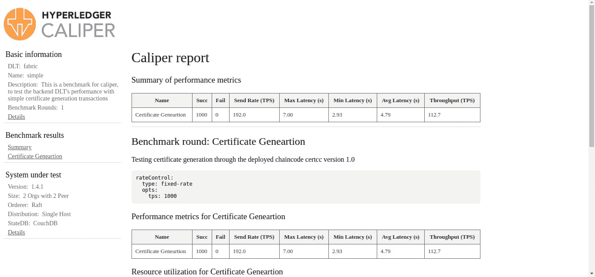

# Hyperledger 卡尺-Hyperledger 织物 TPS 标识

> 原文：<https://medium.com/coinmonks/hyperledger-fabric-tps-identification-using-hyperledger-caliper-f7a5d070f647?source=collection_archive---------5----------------------->

**Hyperledger Caliper** 是由 **Hyperledger** 项目提供的平台，方便了各种区块链平台的**标杆**，例如

*   超级分类帐
*   超分类帐洞穴
*   以太坊
*   超分类帐结构
*   FISCO·BCOS
*   Hyperledger Iroha
*   超级账本锯齿。

Hyperledger Caliper 目前支持以下指标:资源消耗、事务/读取延迟、事务/读取吞吐量和成功率。

在这篇博客中，我们将讨论 hyperledger caliper 的生命周期，**如何安装 hyperledger caliper** ，**如何用 fabric 配置 caliper**，最后**如何运行一个演示项目**。**我们希望您对 hyperledger 结构有一个基本的了解，并且非常熟悉链码、对等体、订购者、加密材料等术语。**

**大钩卡尺的生命周期**

hyperledger 卡尺的一般生命周期如下:

*   启动 SUT(被测系统)
*   初始化 SUT
*   安装智能合同/链码
*   执行基准测试
*   推倒 SUT

上面提到的是一般步骤，我们没有必要经历每一步，即:我们可以根据我们的要求跳过一两步，例如:测径-流量-跳过-开始-这跳过了 SUT 的开始

**安装大横杆卡钳**

Hyperledger caliper 发布为一个**节点包**[@ hyperledger/caliper-CLI](https://www.npmjs.com/package/@hyperledger/caliper-cli)，也发布为一个**docker image**[hyperledger/caliper](https://hub.docker.com/r/hyperledger/caliper)。在这个博客中，我们将使用节点包。

基本上有两种方法来安装这个软件包:

*   全球范围:
*   NPM I-g-only**=**prod @ hyperledger/caliper-CLI @ 0 . 3 . 0
*   本地存储库中:
*   npm 初始化-y
*   NPM I-g-only**=**prod @ hyperledger/caliper-CLI @ 0 . 3 . 0

安装完软件包后，我们将我们的绑定到我们需要的 SDK 软件包。这里我们是用面料 1.4.6 捆绑的。(如果我们在全球范围内安装，我们不需要使用 npx 前缀，如下所示，我们可以直接使用 caliper)

*   npx 卡尺粘合-卡尺粘合-sut 织物-卡尺粘合-sdk 1.4.6

这个绑定过程也可以在我们运行基准/测试过程时自动完成。

**运行演示项目**

hyperledger caliper 项目回购附带了构建示例，如织物样本。在本节中，我们将运行一个演示项目，该项目包含以下配置单独订购者、两个各有一个同级的组织和两个 ca。该项目是 fabric 的 1.4.1 版本。所以我们必须相应地绑定卡尺。

运行演示的命令非常简单，如下所示。(下面的命令我将 SUT SDK 和启动命令绑定在一起)

*   npx 测径仪启动主程序—测径仪-粘合-缝合织物:1.4.0 —测径仪-工作空间。— caliper-benchconfig 基准/scenario/simple/config . YAML—caliper-network config networks/fabric/fabric-v 1 . 4 . 1/2 org 1 peergoleveldb/fabric-go . YAML

运行此命令，我们将启动演示项目并基于 benchmarks/scenario/simple 文件夹中的 config.yaml 文件运行测试，网络配置可以在 networks/fabric/fabric/fabric-v 1 . 4 . 1/2 org 1 peergoleveldb/fabric-go . YAML 中找到

因此，在下一节中，我们将更多地讨论如何开发我们自己的网络配置。

**如何用面料项目配置卡尺**

在我们详细配置卡尺和结构之前，让我们回顾一下刚刚运行的演示，看看其中提到了哪些不同的东西，以便更清楚地了解这些东西。让我们首先分析一下 **fabric-go.yaml** 文件

**fabric-go.yaml** 文件实际上是**连接**卡尺和我们的 **fabric 网络**的文件。如果我们浏览这个文件，我们可以找到一些类似的网络参数的结构。我们基本上配置网络的**加密细节以及对等配置和链码版本和语言**。等等

**config.yaml** 文件实际上是我们定义**轮数**的文件，即要测试的不同链码函数的数量。

在每一轮中，我们定义了 **txNumber** ，它表示要执行的事务数量。我们还定义了每秒要发送的 tps(每秒事务数)或 **txDuration** ，它指定了我们将发送事务的持续时间。这就是所谓的**速率控制器**。有不同类型的速率控制器:

*   **固定速率:**固定速率控制器是**最基本的控制器**，也是没有指定控制器时的默认选项。它将以固定的间隔发送输入事务，该间隔被指定为 TPS(每秒事务数)。
*   **固定反馈率**:固定反馈率控制器是固定反馈率的延伸，最初也会以固定的间隔发送输入交易**。当未完成的事务超过为每个客户端定义的未完成事务的次数时，它将通过长时间休眠暂时停止发送输入事务**。
*   **固定积压:**固定积压比率控制器是用于以目标负载(积压事务)驱动测试的控制器。**该控制器旨在通过修改被驱动的交易计划来维护系统内已定义的交易积压。结果是系统的最大可能 TPS，同时保持积压水平。**
*   **复合速率:**卡尺中的基准轮与单个速率控制器相关联。然而，单个速率控制器很少足以模拟高级客户端行为。此外，为这种行为实现新的速率控制器可能很麻烦并且容易出错。大多数情况下，一个复杂的客户端行为可以分成几个简单的阶段。因此，复合速率控制器使得能够在单轮 中配置**多个“更简单”的速率控制器*，促进了现有速率控制器实现的可重用性。复合速率控制器将根据指定的权重在给定的控制器之间自动切换***
*   **线性速率**:探索系统的性能极限通常包括随着负载强度的增加进行多次测量。然而，通过这种方式找到系统的临界点并不容易，这更像是一种试错法。**线性速率控制器可以逐渐地(线性地)在开始和结束 TPS 值之间改变 TPS 速率(以增加和减少的方式)**。这使得更容易找到以有趣的方式影响系统性能的工作负载率。线性速率控制器既可用于基于持续时间的回合，也可用于基于交易次数的回合。

配置文件中下一个重要的东西是**回调**。回调实际上指定了一个 JavaScript 文件，它将在每一轮执行中被调用。这个 JavaScript 文件主要有三个函数 **init** 、 **run** 和 **end** 。 **init** 函数是轮次开始时调用的第一个函数，它检索从配置文件传递的所有参数，如 **txNumber/txDuration** 参数等。在执行 **init** 函数后，调用 **run** 函数，在该函数中，我们调用 **invokeSmartContract()** ，它接受**上下文、链代码名称、版本参数和超时**。运行函数执行后，调用**结束**函数生成测试报告。

对于每个链代码调用，如果我们需要传递不同的参数，那么我们需要使用一个函数在这个文件中编写一个相应的逻辑，并在运行函数开始时调用那个函数。同样，如果我们有一轮来自区块链的查询数据，那么我们可能会基于索引或键进行查询，因此我们需要编写一个逻辑来适当地存储这些键或索引，并将其导出，以便在另一轮的回调中使用它。

下面给出了一个代码示例:

**配置文件**

**工作量模块/回调**

**网络配置文件**

一旦测试完成，caliper 将在项目的基本目录中生成一个 html 格式的详细报告，其中包括我们前面讨论的所有参数。

感谢您抽出宝贵的时间阅读本博客，我希望您对 hyperledger caliper 及其用途以及配置和测试它的方法有一个基本的了解。希望在那之前回来更多有趣的文章

✌和平

> [直接在您的收件箱中获得最佳软件交易](https://coincodecap.com/?utm_source=coinmonks)

