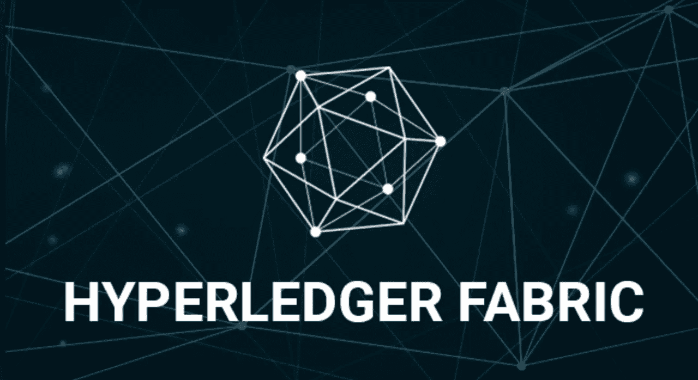
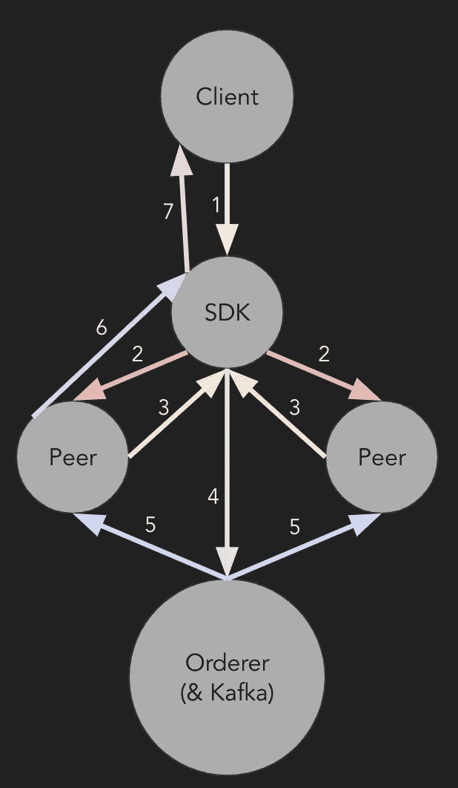

# 超级分类帐结构事务处理流程

> 原文：<https://medium.com/coinmonks/hyperledger-fabric-transaction-flow-43a6b7e39c6e?source=collection_archive---------0----------------------->

## 从一无所有到一个街区，大局是什么？

[Hyperledger Fabric Image](https://www.hyperledger.org/blog/2018/11/28/conducting-data-with-concerto-and-hyperledger-fabric)

这是一个关于 ***总账架构交易流程*** 的小故事。通过了解交易流程，它可能有助于我们调试和设计 Hyperledger Fabric 应用程序。

## 交易流程是什么？

*   从客户端的 API 请求开始—我想向区块链写入一些数据
*   以对客户端的 API 响应结束—数据块在数据块链中提交

> 那么，中间会发生什么呢？让我们打开黑盒。

## 黑盒——没有魔法

以下是 Hyperledger Fabric 中的常见事务处理流程。

The (One Possible) Transaction Flow

假设没有错误:

1.  一个客户端，比如一个 iOS 应用，用 Hyperledger Fabric SDK 向后端服务器发送 API 请求——我想向区块链写入一些数据
2.  SDK 向对等体发送 ***交易提议*** 以进行背书
3.  对等方 ***签署*** (签署)交易提议，并将其返回给 SDK(此外，对等方在签署交易提议之前，在此时执行链码/智能合同执行)
4.  SDK 向交易订购服务的订购者(& Kafka)发送 ***交易***
5.  订购者订购交易，形成块并将其广播给对等方
6.  对等端通知 SDK —在块链中提交数据块(此外，对等端在通知 SDK 之前执行事务验证和块提交)
7.  SDK(后端服务器)向客户端发送 API 响应——数据块在数据块链中提交

> 看起来 SDK(后端服务器)挺忙的，就箭头数量而言。但是不要忘记，对等体的认可(签名)、链代码执行/模拟以及事务验证也是高负载的工作。

这就是大局。接下来，我打算写一个关于 ***Corda 交易流程*** 的小故事，以及一些关于链码或智能合约开发的设计实践的故事。

> Corda 是另一个类似 Hyperledger Fabric 的许可区块链框架。

谢谢！如果你喜欢我的故事， [**请关注我**](/@reasdom) **的新更新！**

## 关于 Hyperledger Fabric 的更多信息

要了解更多关于 Hyperledger Fabric 的信息，您可以阅读我的一些故事:

1.  [Hyperledger Fabric“构建您的第一个网络”教程—第 1 部分](/@reasdom/hyperledger-fabric-building-your-first-network-tutorial-part-1-2d3b32213529)
2.  [Hyperledger Fabric“构建您的第一个网络”教程—第 2 部分](/@reasdom/hyperledger-fabric-building-your-first-network-tutorial-part-2-267fc5d36118)
3.  [Hyperledger Fabric“构建您的第一个网络”教程—第 3 部分](/@reasdom/hyperledger-fabric-building-your-first-network-tutorial-part-3-fde6022d8739)
4.  [基于 Hyperledger 结构账户的钱包 Java Chaincode](/coinmonks/hyperledger-fabric-account-based-wallet-java-chaincode-8cbf80a6fb82)
5.  [Hyperledger Fabric —更新渠道配置](/coinmonks/hyperledger-fabric-updating-channel-configs-45082a5dc9b2)
6.  [Hyperledger Fabric Damn implicitmeta policy](/coinmonks/hyperledger-fabric-damn-implicitmetapolicy-44cc9cc5c472)

我会继续发布关于区块链的新故事。

> [直接在您的收件箱中获得最佳软件交易](https://coincodecap.com/?utm_source=coinmonks)

