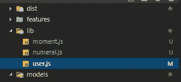
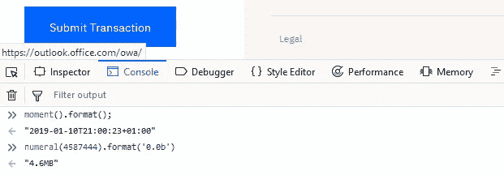
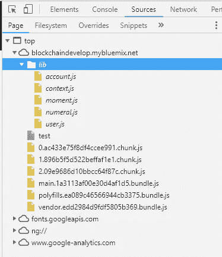
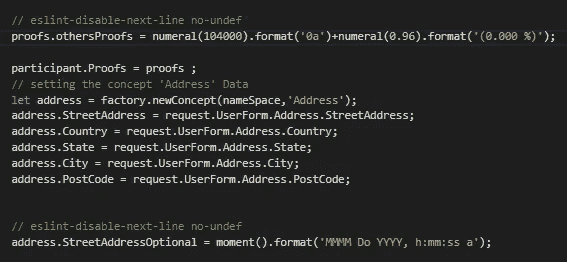
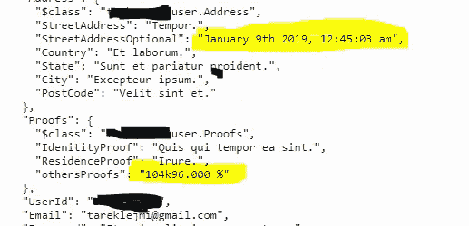
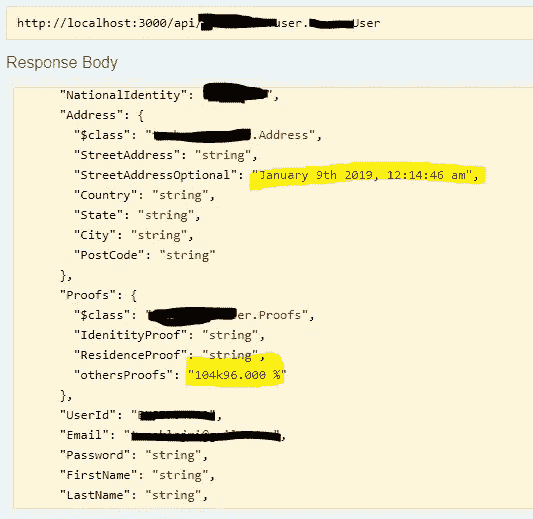

# Hyperledger 结构:在事务处理器上使用 JavaScript 库

> 原文：<https://medium.com/coinmonks/hyperledger-fabric-use-javascript-libraires-on-transaction-processor-33e13b8c020d?source=collection_archive---------5----------------------->

当在业务网络模型中编码业务逻辑时，开发人员可能不得不编写 Javascript 库中已经存在的函数或代码。比如像' digital . js '和' moment.js '这样的库，还有很多其他的库可能会对开发者有很大的帮助。

但是，由于脚本中不支持 import 和 require。似乎不可能包含任何库。



Js file in lib folder

后来，我意识到 lib 文件夹中的所有 javascript 文件都包含在应用程序中。

所以我决定将 moment.js 和 digital . js 包含到 BNM 的 lib 文件夹中，并检查它们是否会被添加到运行时。结果是它们在控制台中被识别。



momentjs and numeraljs are identified in “Javascript Runtime”

> 这里，我决定在我的事务处理器‘logic . js’中使用它们，而不导入或需要它们，因为它们将在应用程序中注入，并且我禁用了 eslint undefined。其中，我的模型中参与者的两个字段将具有由 moment 和 numeral 生成的值。使用 RequestUser Transaction 时为" proof . others proof s and a dress . stressaddressoptional"。

```
// eslint-disable-next-line no-undef
```



Screenshot from user.js : Transaction

这里是提交事务后操场和 composer-rest-server 中的结果。



Composer Playground



Composer-reset-server explorer

但是，在添加一些库时，您必须要注意，因为它们可能是某些异常的原因。你可能会在 Playground v0.19.5 遇到问题，而你在 Playground v0.20.6 找不到问题，其他人两者都有。因此，每次向 lib 文件添加新的库时，都要尝试逐个添加它们并检查结果，因为它们中的一些具有依赖性，而另一些可能使用 composer 中定义的某些全局变量或函数的名称。

快乐编码…

# WWOLF 第一单元