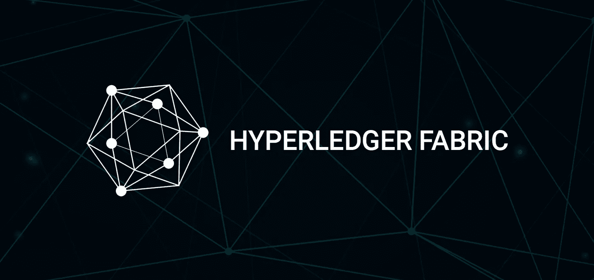

# Hyperledger Fabric v2.1 安装指南-先决条件和启动测试网络

> 原文：<https://medium.com/coinmonks/hyperledger-fabric-v2-1-installation-guide-prerequisites-bring-up-the-test-network-4ac658b0df64?source=collection_archive---------0----------------------->



在这个故事中，我们将在 Linux 机器上安装 Hyperledger Fabric v2.1。当开始新的话题时，一切都可能是艰难的，所以我试图收集这个故事中你可能需要的一切。

让我们从安装 Hyperledger Fabric 之前的[这里](https://hyperledger-fabric.readthedocs.io/en/release-2.0/prereqs.html)中明确提到的先决条件开始；

*   **安装 Git:** 使用下面的命令安装最新版本的 Git。

```
sudo apt-get install git
```

*   **安装 cURL:** 用下面的命令安装 cURL 的最新版本。

```
sudo apt-get install curl
```

*   **安装 wget:** 用下面的命令安装最新版本的 wget。下载 Fabric 二进制文件需要用到它。

```
sudo apt-get install wget
```

*   **安装 Docker 和 Docker Compose:** 用下面的命令安装最新版本的 Docker。然后，您将当前用户添加到 docker 组中。

```
sudo apt-get -y install docker-compose
sudo usermod -aG docker ${USER}*===> logout and login are needed after adding docker group, check everything is ok with the command below*id -nG
```

*   **安装 Go:** 用下面的命令安装并解压 1.14.x 版本的 Go。然后我们把 go 文件夹放到 */usr/local* 目录下。

```
wget [https://golang.org/dl/go1.14.2.linux-amd64.tar.gz](https://golang.org/dl/go1.14.2.linux-amd64.tar.gz)
sudo tar -xvf go1.14.2.linux-amd64.tar.gzsudo chown -R root:root ./go
sudo mv go /usr/local
```

我们需要将我们的 go 路径添加到`$PATH`变量中，但是当用户登录时，我们添加的内容总是被删除。为了避免每次登录时都执行该命令，我们打开了*。位于 *$HOME/的配置文件*。profile* 将导出命令写到*的末尾。轮廓文件*。

```
sudo gedit $HOME/.profile
export PATH=$PATH:/usr/local/go/bin
```

*   **安装 Node.js & NPM:** 用下面的命令下载并安装 Node.js 和 NPM。我们可以安装版本 8(支持 8.9.4 及更高版本)或版本 10(支持 10.15.3 及更高版本)。

```
curl -sL [https://deb.nodesource.com/setup_8.x](https://deb.nodesource.com/setup_8.x) | sudo bash -
sudo apt-get install nodejs
```

*   **安装 Python:** 用下面的命令安装 Python 的 2.7 版本。此外，合适的版本是随 node.js 安装一起安装。

```
sudo apt-get install python
```

这就是全部，我们最终安装了我们需要的所有东西，我们将继续安装 Fabric 示例、二进制文件和 docker 映像。

# **安装示例、二进制文件和 Docker 映像**

现在，我们将使用下面的命令安装 Fabric 示例、二进制文件和 docker 映像。

```
curl -sSL [http://bit.ly/2ysbOFE](http://bit.ly/2ysbOFE) | bash -s
```

> 要安装特定版本，我们可以将版本标识符传递给 curl 命令，如下所示。

```
curl -sSL [http://bit.ly/2ysbOFE](http://bit.ly/2ysbOFE) | bash -s -- <fabric_version> <fabric-ca_version> <thirdparty_version>curl -sSL [http://bit.ly/2ysbOFE](http://bit.ly/2ysbOFE) | bash -s -- 1.4.1 1.4.1 0.4.15
```

*fabric-samples/bin* 文件夹保存了设置网络所需的所有特定于平台的二进制文件，并将它们放入克隆的 repo 中，在 curl 命令之后，它看起来像下图。


fabric-samples/bin folder

我们可以用下面的命令检查图像。

```
docker images
```

# 测试 Hyperledger 结构网络

由于我们已经成功安装了所需的一切，我们可以使用脚本来部署和测试 Hyperledger Fabric 网络。

*   **启动网络:**我们转到*fabric-samples/test-network*目录，使用脚本启动网络。

```
cd fabric-samples/test-network
./network.sh up=> we need root authorization if $USER is not in Docker group:
sudo ./network.sh up
```


the expected output

> 在这里，我们可能会面临“本地 fabric 二进制文件和 docker 映像不同步”的警告。这可能会导致问题”以及“1.4.6 的结构 Docker 映像版本与测试网络支持的版本不匹配”的错误如下图所示。


> 为了解决这个问题，我们首先删除 docker 映像，只提取映像，而不克隆 repo，也不通过执行下面的命令下载二进制文件。如果一切正常，我们将不得不看到所有的 hyperledger docker 图像，如下所示。

```
docker rmi $(docker images | grep hyperledger)
curl -sSL [https://bit.ly/2ysbOFE](https://bit.ly/2ysbOFE) | bash -s -- -s -b-
```


*   **创建通道:**我们可以使用`createChannel`子命令在`Org1`和`Org2`之间创建一个通道，将他们的对等体加入到通道中。

```
./network.sh createChannel
```

> 如果我们不使用`-c`标志，它会创建默认名称为`mychannel`的通道，因此我们可以使用`-c`标志更改通道名称。

```
./network.sh createChannel -c <channel_name>
```

如果命令成功，我们可以看到下面的消息。


the expected message

*   **部署链码:**我们可以使用`deployCC`子命令来部署链码。

```
sudo ./network.sh deployCC -l javascript
```

`deployCC`子命令将在`peer0.org1.example.com`和`peer0.org2.example.com`上安装`fabcar`链码，然后在使用通道标志指定的通道上部署链码。因为我们用默认名称`mychannel`创建了一个通道，所以不需要任何修改。

> 默认情况下，该脚本安装 fabcar chaincode 的 Go 版本。正如您在上面看到的，我使用了语言标志`-l`来安装 chaincode 的 javascript 版本。所有用不同语言编写的 Fabcar 链码可以在`fabric-samples`目录的`chaincode`文件夹中找到。

在 Hyperledger Fabric 2.0 中，chaincode 的生命周期发生了变化，并且`deployCC`子命令提供了要安装、部署和调用的 chaincode，以适应新的生命周期。这个故事里，我就不细说了。如果你想了解这个新生命周期的更多细节，你可以看看这篇文章。

[](/@bcekici11/the-chaincode-lifecycle-on-hyperledger-fabric-v2-72dffb7acf30) [## Hyperledger Fabric v2 上的链码生命周期

### 在本案例中，我们将研究如何在 Hyperledger Fabric v2 中运行链码生命周期流程

medium.com](/@bcekici11/the-chaincode-lifecycle-on-hyperledger-fabric-v2-72dffb7acf30) 

由于调用了`initLedger`函数，chaincode 将汽车的初始列表放到分类帐中。正如您在下面看到的代码，在`fabcar` chaincode 和 cars JSON 数组中的`initLedger`函数被填充。然后每一个都用等待`putState`的方法记入总账。

如果正确安装、部署和调用了 chaincode，您应该会在日志中看到与上面相同的汽车列表:


the expected output

*   **与网络交互:**现在我们将使用对等 CLI，它允许我们从 CLI 调用已部署的智能合约、更新通道或安装和部署新的智能合约。在这里，我们只是专注于与我们的网络互动。要添加我们安装的二进制文件 ***安装示例、二进制文件和 Docker 镜像*** 部分，我们使用以下命令。

```
export PATH=${PWD}/../bin:${PWD}:$PATH
export FABRIC_CFG_PATH=$PWD/../config/
export CORE_PEER_TLS_ENABLED=true
export CORE_PEER_LOCALMSPID="Org1MSP"
export CORE_PEER_TLS_ROOTCERT_FILE=${PWD}/organizations/peerOrganizations/org1.example.com/peers/peer0.org1.example.com/tls/ca.crt
export [CORE_PEER_MSPCONFIGPATH=${PWD}/organizations/peerOrganizations/org1.example.com/users/Admin@org1.example.com](mailto:CORE_PEER_MSPCONFIGPATH=${PWD}/organizations/peerOrganizations/org1.example.com/users/Admin@org1.example.com)/msp
export CORE_PEER_ADDRESS=localhost:7051
```

之后，我们可以从我们的 CLI 查询分类帐。以下命令用于查询。它接受我们想要查询的函数名作为第一个参数，所以如果我们想要查询的方法需要它，我们可以添加参数作为参数。我们通过`queryCar`函数得到车号为 *CAR9* 的汽车信息。

```
peer chaincode query **-**C mychannel **-**n fabcar **-**c '{"Args":["queryCar", "CAR9"]}'
```

因为我们想要改变一个资产，我们调用了链码。当网络成员想要转移或改变分类帐上的资产时，就调用链码。使用下面的命令，我们通过调用`changeCarOwner`函数来更改车号为 *CAR9* 的车主。

```
peer chaincode invoke -o localhost:7050 --ordererTLSHostnameOverride orderer.example.com --tls true --cafile ${PWD}/organizations/ordererOrganizations/example.com/orderers/orderer.example.com/msp/tlscacerts/tlsca.example.com-cert.pem -C mychannel -n fabcar --peerAddresses localhost:7051 --tlsRootCertFiles ${PWD}/organizations/peerOrganizations/org1.example.com/peers/peer0.org1.example.com/tls/ca.crt --peerAddresses localhost:9051 --tlsRootCertFiles ${PWD}/organizations/peerOrganizations/org2.example.com/peers/peer0.org2.example.com/tls/ca.crt -c '{"function":"changeCarOwner","Args":["CAR9","Dave"]}'
```

如果命令已经成功执行，您会看到`Chaincode invoke successful. result: status:200`消息。


the expected output

在一个资产上改变之后，我们将通过添加我们的二进制文件在其他对等体上检查它，就像我们对`Org1`对等体所做的那样，并执行下面的命令来定义变量。

```
export CORE_PEER_TLS_ENABLED=true
export CORE_PEER_LOCALMSPID="Org2MSP"
export CORE_PEER_TLS_ROOTCERT_FILE=${PWD}/organizations/peerOrganizations/org2.example.com/peers/peer0.org2.example.com/tls/ca.crt
export CORE_PEER_MSPCONFIGPATH=${PWD}/organizations/peerOrganizations/org2.example.com/users/Admin@org2.example.com/msp
export CORE_PEER_ADDRESS=localhost:9051
```

之后，我们可以作为`Org2`对等方从我们的 CLI 查询分类帐。以下命令用于查询，我们将看到 *CAR9* 的所有者已经更改。


the information of CAR9

当我们使用完网络后，必须通过以下命令关闭它。

```
./network.sh down
```

就是这样，我们有；

*   安装的先决条件
*   安装的示例、二进制文件和 Docker 映像
*   调出测试网络
*   创建了一个频道
*   部署了链码
*   互动网络

在这个故事里。

> [在您的收件箱中直接获得最佳软件交易](https://coincodecap.com/?utm_source=coinmonks)

[](https://coincodecap.com/?utm_source=coinmonks)

v