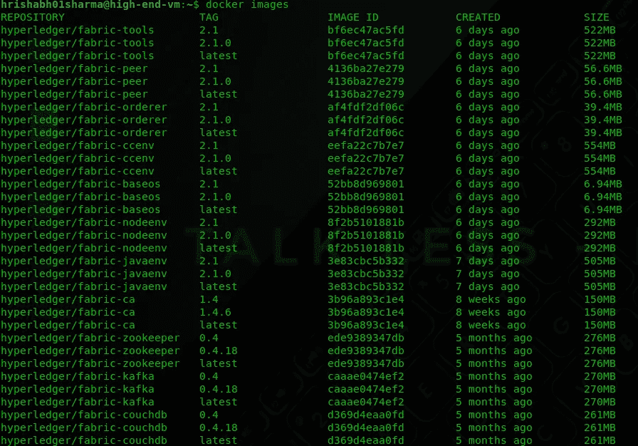
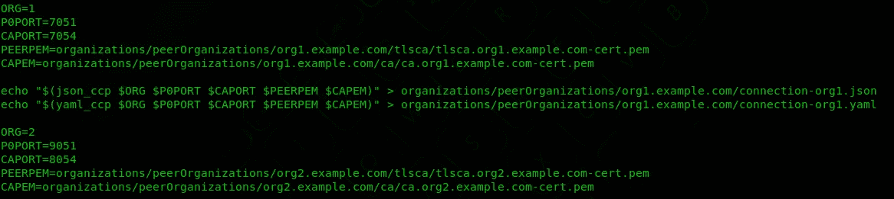
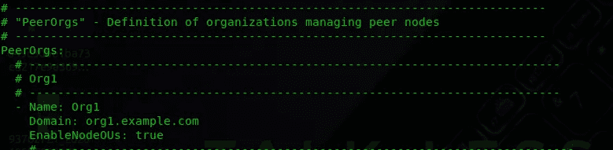
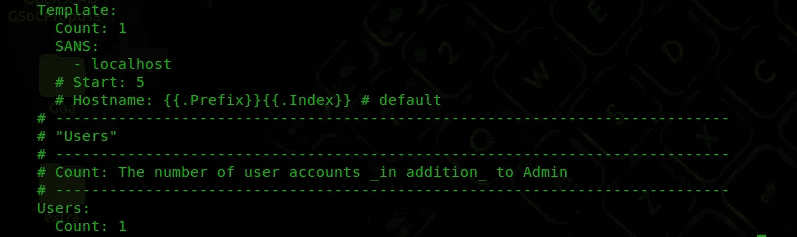
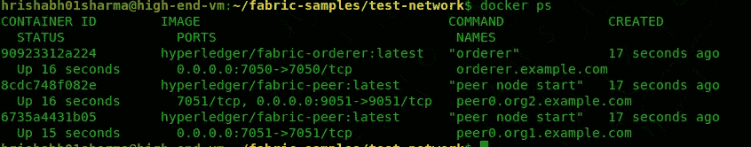
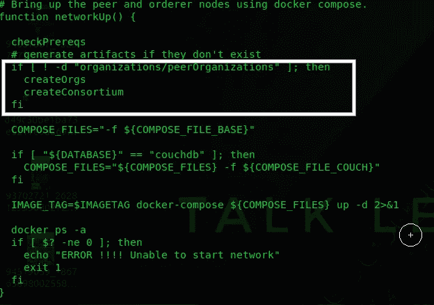
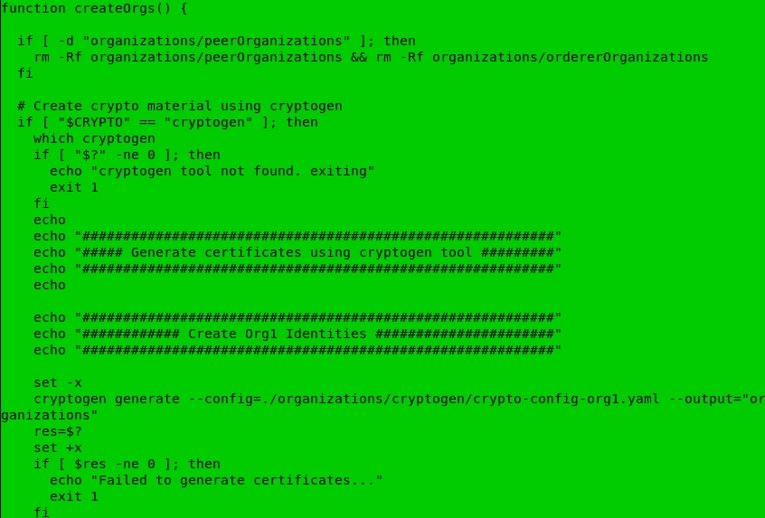
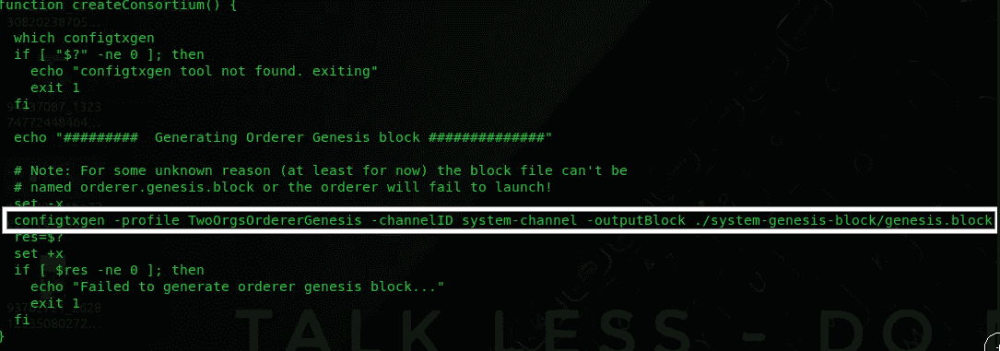

# Hyperledger Fabric v2.1:设置

> 原文：<https://medium.com/coinmonks/hyperledger-fabric-v2-1-setting-things-up-76e9f53f264f?source=collection_archive---------0----------------------->

本文将带您了解设置 Hyperledger Fabric v 2.1 的简单步骤。它将参考 Hyperledger Fabric 官方文档，每个步骤都有简短的解释，以节省您的时间。我已经看到，在建立结构网络时，人们通常会忽略一些小事情，并且由于选择了错误的依赖版本、导出了错误的路径以及许多其他事情而面临许多困难。所以，我写这篇博客的主要动机是想看到你运行测试网络，不遗漏任何东西。

我将在 GCP 使用 Ubuntu 18.04 虚拟机来建立测试网络。

遵命船长。！🚢，我们开船吧…

# 安装先决条件并获取 fabric 二进制文件:

跟我一起跟着步骤走😉：

1.  **安装 curl，docker，docker-compose，nodejs & npm。**

> 必须安装 curl docker docker-compose 节点 npm

2.**安装 golang**

不要用 apt 安装 golang，因为 ubuntu 一般会维护 golang 的老版本😕。用 golang 官网下载，关注我:

a)使用 curl 或 wget 从官方[下载页面](https://golang.org/dl/)下载 Go 的当前二进制文件:

> https://dl.google.com/go/go1.14.2.linux-amd64.tar.gz

b)提取 tarball

> 塔尔-xvf go1.14.2.linux-amd64.tar.gz

c)调整权限并将 go 目录移动到/usr/local:

> sudo chown -R root:root。/go
> sudo mv go /usr/local

d)调整中的路径变量。bashrc

> 导出 GOPATH=$HOME/go
> 导出路径= $ PATH:/usr/local/go/bin:$ GOPATH/bin

e)将文件命令加载到当前 shell 实例中

> 来源~/。bashrc

**注意**:始终检查任何先决条件的最低版本，以避免混乱。

3.**启用 docker 运行于**

> sudo 系统启用 docker

4.**将您，用户，添加到 docker 组**

> sudo usermod -a -G docker<username></username>

5.**安装 Fabric 二进制文件**

> https://bit.ly/2ysbOFE 的 curl -sSL

6.**导出路径到你的面料样本下载位置**

> 导出路径= <path to="" download="" location="">/bin:$PATH</path>

现在，您可以通过使用以下命令，在您的系统中看到以下 docker 映像

> docker 图像

好了，做完这一切后，你现在可以测试 hyperledger fabric 提供的第一个网络示例了。

# 玩织物测试网络床:

首先，将当前目录更改为 test-network 文件夹，让我们继续。

在继续之前，请确保没有与正在运行的 Hyperledger 结构相关的容器。使用以下命令停止它们:

> 。/network.sh 向下

或者

> docker rm $(docker ps -aq)

**测试网络架构:**

Fabric v2.1 附带的测试网络包含两个各有一个对等点的组织和一个有一个对等点的订购者组织。

您可以查看 ccp-generate.sh 来了解与组织相关的配置。

另外，为对等点和订单生成加密材料所需的配置存在于 cryptogen 文件夹中的 yaml 文件中。

看看这些照片📷来自 cryptogen 文件夹中的 crypto-config-org1.yaml 文件:

您可以看到**模板计数设置为 1** 。它对应于只为 org 创建一个对等体的事实，并且只为该对等体生成加密材料。

让我们通过三个步骤开始演示:

**第一步:调出测试网络**

> 。/network.sh up

如果一切顺利完成，那么您将能够看到以下三个容器——两个对等点和一个订购点。

那么前面的命令到底发生了什么，答案就在 network.sh 中。

命令**。/network.sh up** 本身调用两个函数创建 orgs 和创建 consortium。

Snapshot when cryptogen is selected.

您可以看到 cryptogen 正在使用 organisations 文件夹中的配置文件。

**注意**:在 2.1 版中，test-network 的一个很好的增强是，它还有一个使用 fabric-ca 创建身份的选项。早期版本使用加密工具创建身份和加密材料。所以现在你可以选择用 ca 还是 cryptogen 来为组织生成加密材料。事实上，Fabric 根本不关心身份/证书来自哪里。它只是使用它们进行验证和签名。

类似地，使用 organisation 文件夹中的配置文件创建 org2 和 orderer 的代码也出现在同一个函数中。

下一步，createConsortium 函数将在订购方系统通道中创建一个 genesis 块。

这就是我们在此阶段所需要的所有容器，我们可以进入下一步，为 Org1 和 Org2 之间的事务创建一个通道。

**步骤 2:创建频道**

network.sh 中的 createChannel()函数将使用位于 scripts 文件夹中的 createChannel.sh 脚本。

看看这个脚本，你会发现，它执行必要的任务，比如更新锚节点，创建通道，让节点加入通道。

因此，让我们使用以下方式启动该函数:

> 。/network.sh 创建频道

呜呜，你离考网络又近了一步。

好了，最后一步是在对应于您刚刚创建的通道的对等体上部署链码。

**第三步:部署链码**

> 。/network.sh deployCC

查看脚本 deployCC.sh，它在对等体上打包、安装和实例化链代码。

我们将在单独的博客中讨论链码结构。希望我能尽快写出来👯。

现在，您可以自由地与链码进行交互。但是…

从 Fabric v2.0 开始，Docker 守护程序依赖性已经消除。现在，您可以直接使用对等 CLI 与您的网络进行交互。

要首先与对等 CLI 交互，请确保:

1.  您已经导出了到 fabric 二进制文件的**路径，我想我们已经在预备步骤中介绍过了。**
2.  将**路径导出到 fabric-samples 中的配置文件夹**。

> 导出 FABRIC _ CFG _ PATH = $ HOME/FABRIC-samples/config/

之后，您就可以开始了，您只需要导出 Org1 的环境变量，如果您想使用它的话。

> export CORE _ PEER _ TLS _ ENABLED = true
> export CORE _ PEER _ LOCALMSPID = " org 1 MSP "
> export CORE _ PEER _ TLS _ root cert _ FILE =＄{ PWD }/organizations/PEER organizations/org 1 . example . com/peers/PEER 0 . org 1 . example . com/TLS/ca . CRT
> export[CORE _ PEER _ MSPCONFIGPATH =＄{ PWD }/organizations/PEER organizations/org 1 . example . com/users/Admin @ org 1 . example](mailto:CORE_PEER_MSPCONFIGPATH=${PWD}/organizations/peerOrganizations/org1.example.com/users/Admin@org1.example.com)

之后，您就可以与安装在对等体上的链码进行交互了。

所以，让我们试试**查询命令**:

> 对等链代码查询-C my channel-n fab car-C ' { " Args ":[" query allcars "]} '

类似地，您可以调用 chaincode 的其他方法。

您还可以通过修改 deployCC 脚本来使用 fabric-samples 的 chaincode 文件夹中的一些其他 chaincode，甚至可以在测试网络上测试您自己的 chaincode。

庆祝一下，你现在意识到管理一个 Hyperledger Fabric 简单网络，并参考这个测试网络，你可以设计自己的网络，感觉自己像一个区块链架构师。

欢迎在评论中讨论你在设置网络时可能遇到的一些错误。

我要离开我的 bash.rc 重要导出以防你错过了什么:

> 导出 GOPATH=$HOME/go
> 导出路径= $ PATH:/usr/local/go/bin:$ GOPATH/bin
> 导出路径= $ HOME/FABRIC-samples/bin:$ PATH
> 导出路径=$PATH:$GOPATH/bin
> 导出 FABRIC _ CFG _ PATH = $ HOME/FABRIC-samples/config/

如果这个博客节省了你的时间，别忘了鼓掌👏 👏 👏

参考资料:

 [## 用于企业的区块链平台- hyperledger-fabricdocs 主文档

### 请确保您正在查看的文档与您正在使用的软件版本相匹配。请参见…

hyperledger-fabric . readthedocs . io](https://hyperledger-fabric.readthedocs.io/en/release-2.1/) 

> [直接在您的收件箱中获得最佳软件交易](https://coincodecap.com?utm_source=coinmonks)

