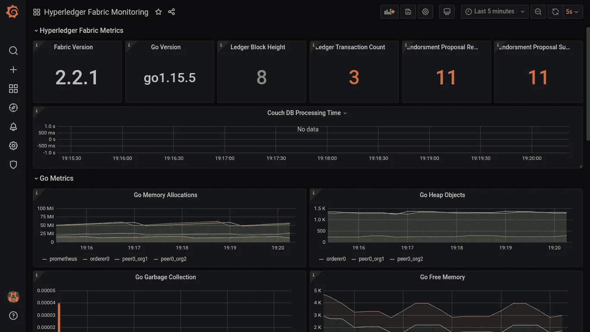
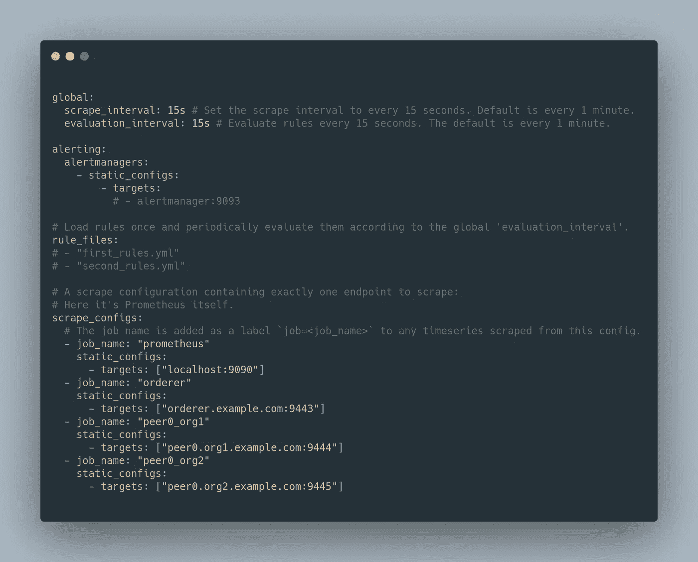
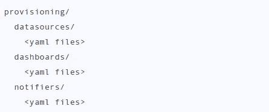
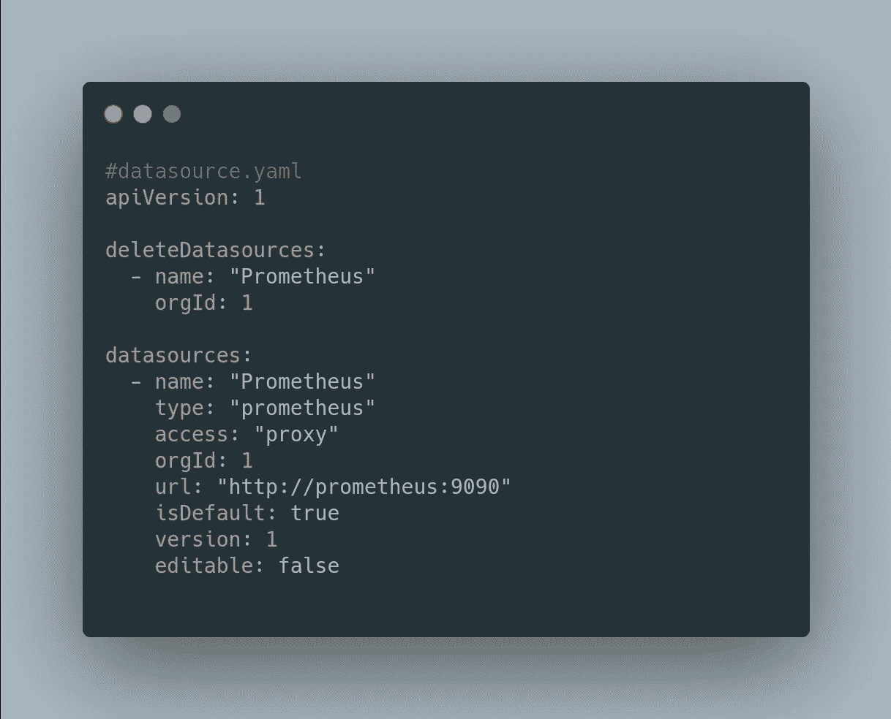
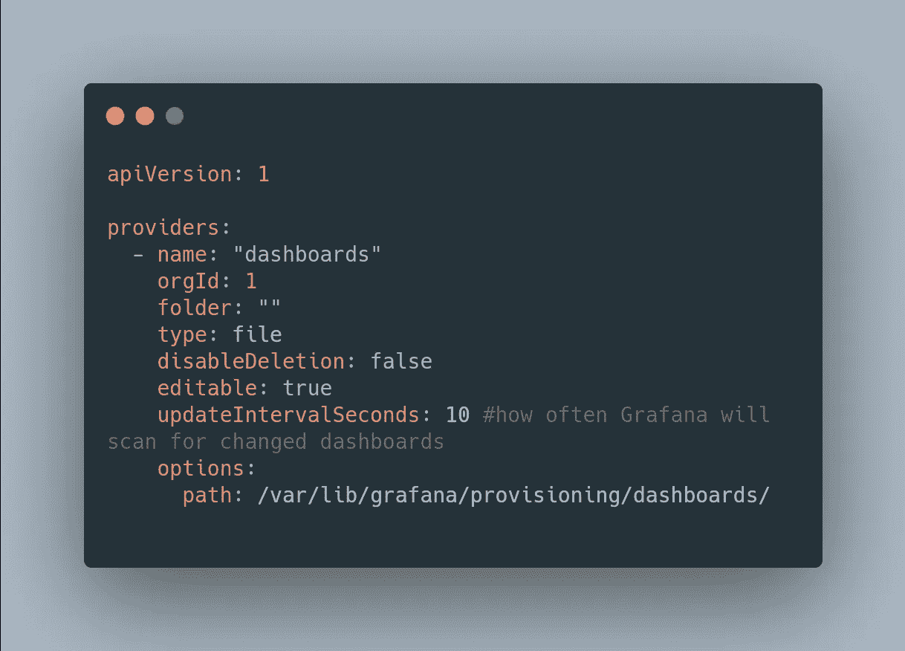
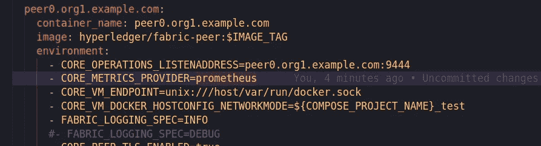
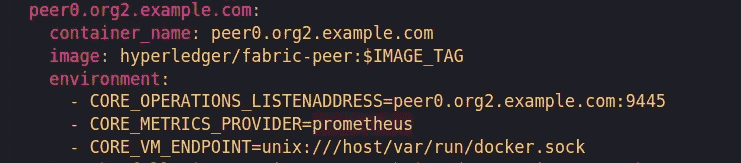
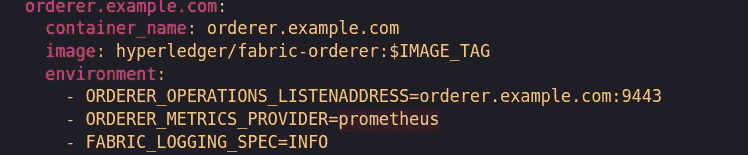

# Hyperledger Fabric v2。x 使用 Prometheus 进行监控

> 原文：<https://medium.com/coinmonks/hyperledger-fabric-v2-x-monitoring-using-prometheus-974e433073f5?source=collection_archive---------1----------------------->



# 1.概观

在本文中，我们将了解如何为我们的 hyperledger 结构网络设置监控。在我之前的一篇文章中，我们看到了如何[将 Hyperledger explorer 与 Hyperledger Fabric network](/coinmonks/integrating-hyperledger-explorer-with-hyperledger-fabric-network-v2-2-9a70e4c5311) 集成。我们将使用普罗米修斯和格拉夫纳进行监控。 **Prometheus** 是由 SoundCloud 开发的开源时序数据库，作为 Prometheus 监控系统的存储层。 **Grafana** 是针对每个数据库的开源分析&监控解决方案。当连接到支持的数据源时，它为 web 提供图表、图形和警报。

> *另外，请查看我的* [*课程，了解多主机*](http://bit.ly/hlf-multihost-deployment) 上的 Hyperledger Fabric 部署

# 2.普罗米修斯构型

要运行 prometheus 实例，我们需要用您的配置文件来运行它。配置文件允许我们设置用于抓取的作业和目标。



`global`部分描述并覆盖一些默认值。`rule_files`部分列出了 Prometheus 需要加载和处理的所有规则文件(记录或警报规则)。`scrape_configs`部分描述了 Prometheus 需要处理的任务。在我们的例子中，我们有一个名为`prometheus`、`orderer`、`peer0_org1`、`peer0_org2`的任务，带有一些配置项，包括`target_groups`子部分。

# 3.格拉夫纳构型

配置为代码是将系统配置存储为一组受版本控制的、人类可读的配置文件，而不是存储在数据库中的实践。Grafana 通过*供应*支持代码配置。当前支持资源调配的资源有:

*   [仪表盘](https://grafana.com/docs/grafana/latest/administration/provisioning/#dashboards)
*   [数据来源](https://grafana.com/docs/grafana/latest/administration/provisioning/#datasources)
*   [预警通知渠道](https://grafana.com/docs/grafana/latest/administration/provisioning/#alert-notification-channels)

预配目录采用以下结构:



我们的数据源文件如下所示



我们的仪表板文件如下所示



# **4。对等方的配置**

在对等体的配置中，我们需要添加两个环境变量`CORE_OPERATIONS_LISTENADDRESS`和`CORE_METRICS_PROVIDER`



# 5.订购者配置

在订购者配置中，我们需要添加两个环境变量`ORDERER_OPERATIONS_LISTENADDRESS`和`ORDERER_METRICS_PROVIDER`



# 6.设置

1.  克隆存储库

```
git clone [https://github.com/adityajoshi12/fabric-samples-advance-topics](https://github.com/adityajoshi12/fabric-samples-advance-topics).git
cd [fabric-samples-advance-topics](https://github.com/adityajoshi12/fabric-samples-advance-topics)
```

2.导航到`monitoring and logging`目录

```
cd test-network/moniter\ and\ logging/monitering
```

3.启动普罗米修斯和格拉夫纳服务。

```
docker-compose up
```

4.现在，我们可以启动结构网络了

```
cd ../..
./network.sh up createChannel -ca -c mychannel  -i 2.2
```

5.一旦网络启动，访问浏览器上的`[http://localhost:3000](http://localhost:3000)`，您就可以看到 grafana 仪表盘。

grafana 的用户名和密码是 *admin/admin*

# 7.摘要

在本文中，我们了解了如何在 hyperledger 结构网络上启用指标，并设置 Prometheus 和 grafana 进行监控。源代码可以在[这里找到](http://bit.ly/hlf-advance)

如果你觉得这篇文章很有帮助，请点击拍手按钮，并跟随我阅读更多这样的信息丰富的文章。

你可以在 [Linkedin](https://linkedin.com/in/adityajoshi12) 上找到我或者在 [GitHub](https://github.com/adityajoshi12) 上跟踪我？如果这对你来说太社交化了，如果你想和我讨论技术，就给 adityaprakashjoshi1@gmail.com 发封邮件。

