# 从头开始超级分类帐-第 1 部分

> 原文：<https://medium.com/coinmonks/hyperledger-from-scratch-50a2535e26b6?source=collection_archive---------0----------------------->

## Hyperledger Composer 游乐场中的编码

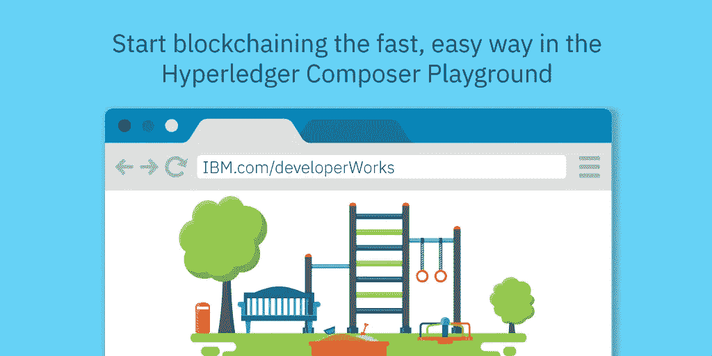

# 俯视图

在本教程中，我们将从头开始创建和部署一个业务网络，它定义了使用户、他们的帐户以及从一个帐户向另一个帐户转账的功能。

# **先决条件**

NPM 码头，节点 JS。

等待不要害怕，因为我们希望从基础本身开始，所以首先让我们只通过在 Hyperledger Composer Playground 上编写模型、脚本和访问控制文件来实现。

# **词汇**

Composer Playground:对于初学者来说，使用 hyperledger 合并块中的各种抽象可能会成为一项乏味的工作，所以这就是 Playground 的用处。Composer playground 是一个广泛的、开放的开发工具集和框架，使开发人员更容易开发区块链应用程序。

文件:一个托管在 Composer playground 中的项目，需要三个文件，即模型、脚本和访问控制。顾名思义，模型文件用于定义区块链网络的域模型，在这里我们定义了参与者、资产、交易、事件、概念等。脚本文件主要是用来描述业务逻辑的。存在访问控制是为了登记不同用户的权限。

**那么让我们开始:**

第一步:点击以下链接

 [## 超级分类帐编辑器

### 超级分类帐编辑器

Composercomposer-playground.mybluemix.net 总账会计公司](https://composer-playground.mybluemix.net/login) 

您将被定向到如下所示的主页，我们将从头开始定义业务网络，因此单击“部署新的业务网络”图标。

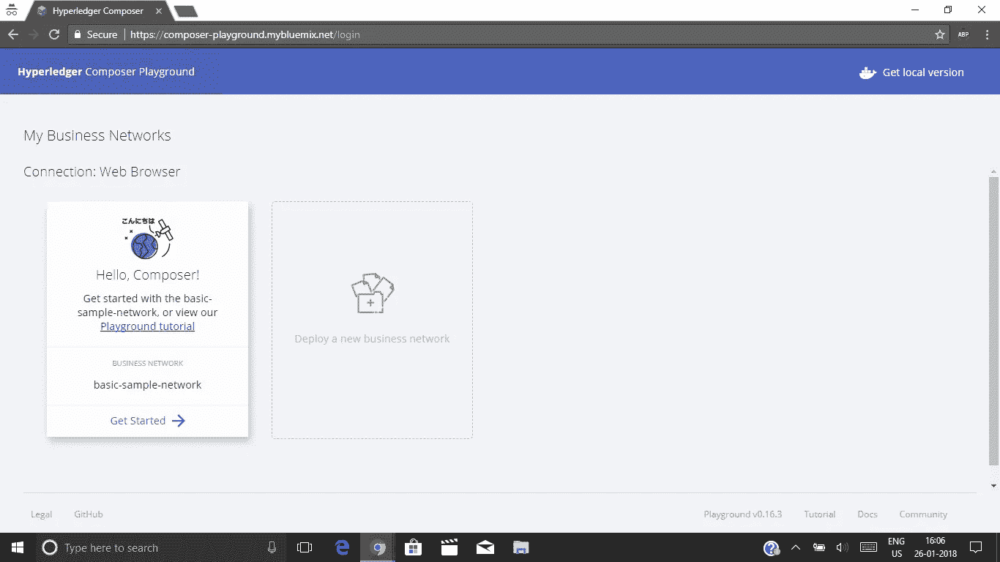

> 前言:Composer playground 为您呈现一个默认的业务网络，让您熟悉平台。点击**开始**，您将被重定向至该商业网络。

第二步:给你的商业网络起个名字。出于演示目的，我们将网络命名为“testnetwork ”,并在 template 部分选择 empty-business-network template。现在点击部署按钮

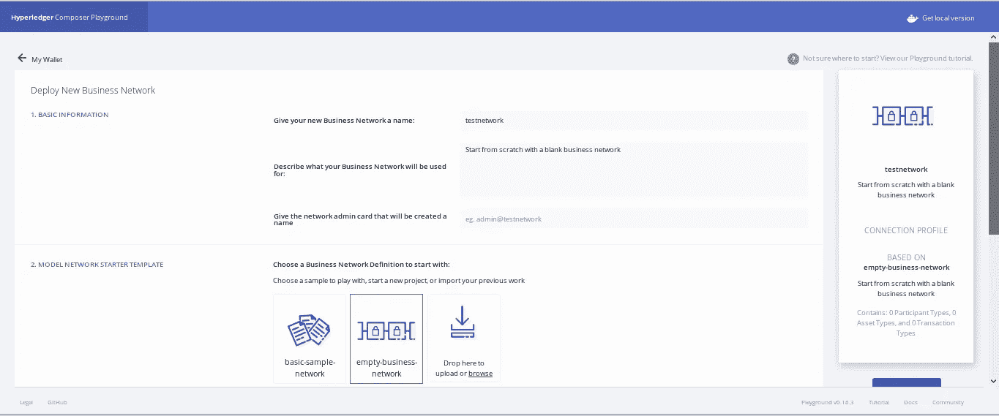

第三步:点击“添加文件”,添加模型和脚本文件。

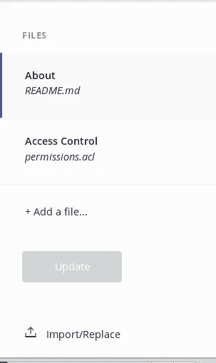

步骤 4:点击模型文件

在模型文件中复制粘贴下面的代码。

> /**
> *新模型文件
> */
> 
> 命名空间 org.acme.model
> 由 accnt id {
> o String accnt id
> o Double balance
> }标识的资产帐户
> 
> 由 userId {
> o String userId
> o String first name
> →account acnt
> }标识的参与者用户
> 
> 交易样本 transaction {
> o Double amount
> →accent from acct
> →accent to acct
> }//注:→实际上是“- - >”，不带空格。

第 1 行:名称空间 org.acme.model *，*定义了可以用来标识业务网络中资源的惟一名称。例如，在上面的代码中,“用户”资源可以使用如下命名空间来标识:

org.acme .样本.用户

为了更清楚地理解，请参考下面列出的脚本文件。

第 2 行:定义一个名为“account”的资源。普通语言中的资产是指*“个人或公司拥有的一项财产，被认为具有价值并可用于偿还债务、承诺或遗产”，*类似地，当我们在此定义资产时，我们指定一个属性，借助该属性我们可以唯一地识别所定义的资产。在我们的示例中，它是“ *o 字符串* accntId *”。*

在资产定义中，我们还可以包含一个可选的抽象声明，这对于避免代码冗余非常有用。

> 由用户标识标识的参与者用户

这里我们来定义一个参与者。在普通语言中，参与者是参与某事的人，这里我们定义网络的参与者，例如用户、管理员、资产所有者和其他人。

类似于“account ”,参与者还可以具有诸如 userId 等属性，以唯一地标识每个参与者等等。

行“→账户 acnt”定义了从“用户”参与者到“账户”资产的单向**关系，即一个账户可以由一个用户唯一识别，这意味着每个用户与一个账户相关。**

接下来，为了将钱从一个用户的账户转移到另一个用户的账户，我们必须定义一个交易。在我们的例子中，我们定义了一个名为“SampleTransaction”的交易，用于转帐 b/w 用户帐户。这里要注意的一点是，我们不在模型文件中指定事务背后涉及的逻辑。

事务定义中给出的属性被作为事务的参数。稍后当我们在测试中测试我们的业务网络时，我们可以看到这一点。

步骤 5:查看脚本文件。

脚本文件定义了我们的业务模型的逻辑。在 hyperledger 中，它被称为链码。

将下面列出的代码复制粘贴到脚本文件中

> /**
> *新脚本文件
> */
> /**
> *示例事务函数。
> *[@ param](http://twitter.com/param){ org . acme . model . sample transaction } sample transfer
> *[@ transaction](http://twitter.com/transaction)
> */
> 函数 sample transfer(sample transfer){
> sample transfer . from accnt . balance-= sample transfer . amount；
> sample transfer . toaccnt . balance+= sample transfer . amount；
> 返回 getAssetRegistry(' org . acme . model . account ')
> 。然后(function(account registery){
> return account registery . update all([sample transfer . from accnt，sample transfer . toaccnt])；
> })；
> 
> }

上面的代码使用了一个简单的交易函数，将钱从一个用户帐户转移到另一个用户帐户。

首先让我们测试这些文件，以便更好地理解完整的概念。所以让我们开始…

从更新业务网络开始。要更新，请按更新图标，

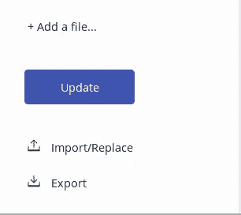

更新完成后，转到测试选项卡。

现在，在 test 选项卡中，首先您必须创建用户。为此，单击用户，单击“创建新参与者”，

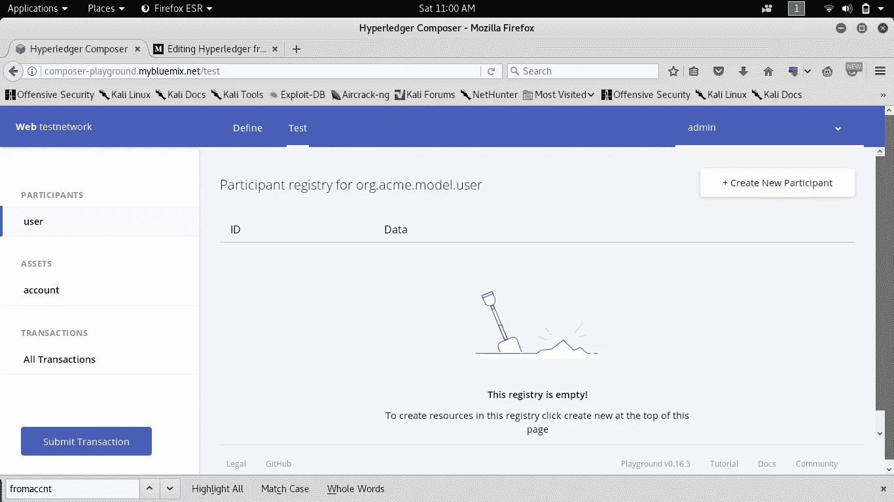

将会看到如下所示的屏幕

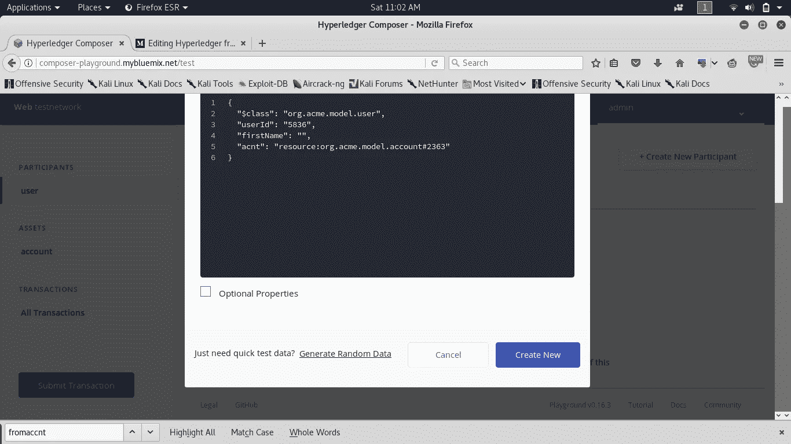

键入“userId”作为 U1 而不是数字，根据您的选择更改“名字”，在“acnt”中，只需将“#”后的值更改为“A1”，然后单击“创建新选项卡”。您至少需要让两个用户来执行一个事务，所以以与上面类似的方式再定义一个用户。

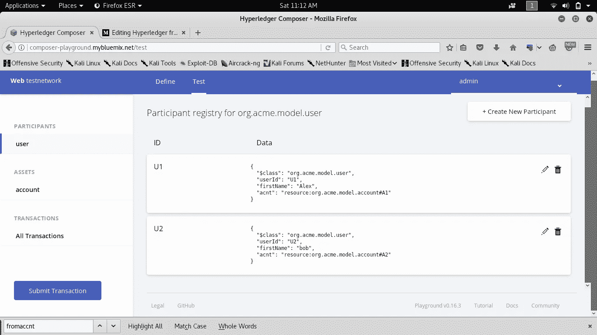

分别为每个用户创建帐户，

转到帐户，然后创建帐户，这里首先为用户 U1，

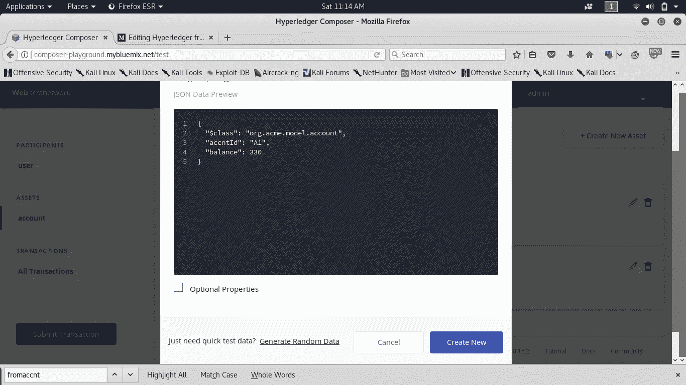

将“accntId”作为 A1，并给出余额，在我们的例子中，我们将其作为 330。最后，只需点击新建。

同样为用户 U2 重复此操作。

你进入了一个类似于下图的屏幕

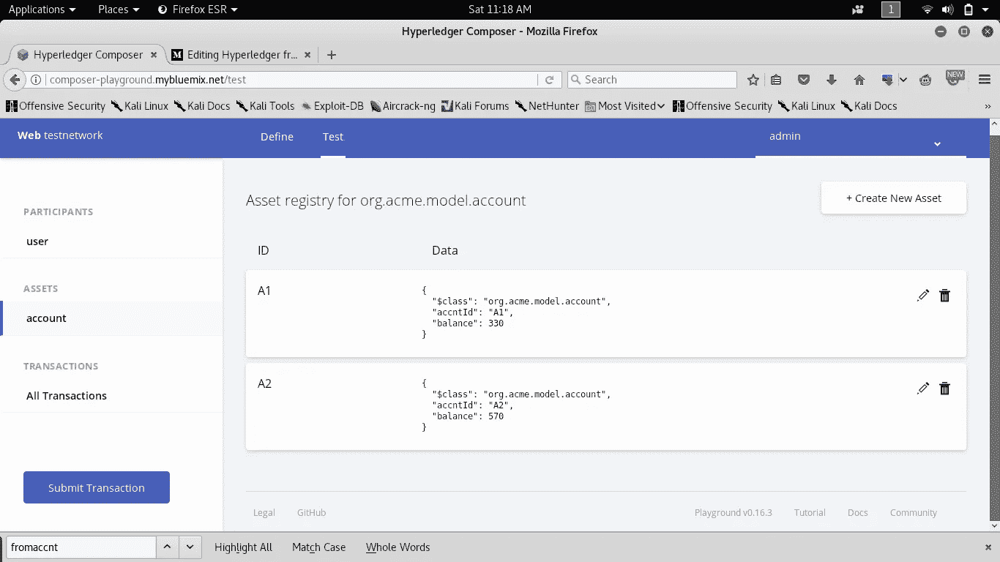

点击提交交易，您会看到如下内容

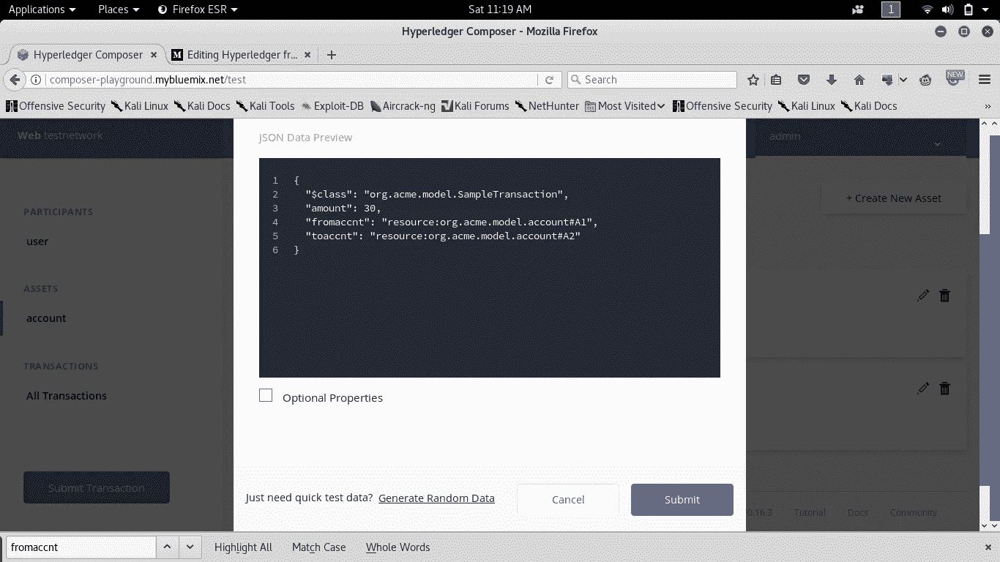

在此指定“金额”，即需要转账的金额。在“fromaccnt”中，将# to 帐户 id 后面的值更改为发送帐户，在“toaccnt”中，再次将# to 帐户 id 后面的值更改为受益人帐户。单击提交，您将被重定向到帐户页面，在此页面上，您可以看到资金从一个帐户转移到另一个帐户。

现在回到脚本文件，首先要注意的是我们使用了相同的名称空间，

> [@ param](http://twitter.com/param){ org . acme . model . sample transaction } sample transfer

这增强了我们可以进行交易的事实。

接下来，我们访问 account 类的两个对象，即通过“fromaccnt.balance”我们访问发送方的帐户余额，通过“toaccnt.balance”我们访问帐户受益人，并对他们各自的余额进行所需的更改，即从发送方扣除并添加到受益人。

现在，接下来的几行代码将这些更改提交给全局数据库。

> 返回 getAssetRegistry(' org . acme . model . account ')
> 。然后(function(account registery){
> return account registery . update all([sample transfer . from accnt，sample transfer . toaccnt])；
> })；

第 1 行返回 A1、A2 中的所有帐户资产，这是一个 javascript 承诺。然后，updateAll 方法更新注册表。在我们的例子中，它更新 A1，A2。

第六步:

查看访问控制文件。访问控制文件，如前所述，是控制哪类用户可以访问，什么样的东西，像提供超级用户权限，只允许所有者更新他的帐户等等。

为了使我们的例子简单，我们没有使用任何 access 文件。通过使用访问控制，这将变得适用于现实生活场景。

至此，我们到达了本系列第一篇文章的结尾，希望它能给你一些启发，并期待更多的发布…..

请与我分享您的宝贵意见和建议，如果您愿意，请继续关注..

您可以在这里找到本系列[的](/@alex.cs1/hyperledger-from-scratch-part-2-4bc6f45180f8)[部分-2](/@alex.cs1/hyperledger-from-scratch-part-2-4bc6f45180f8) 。

谢谢你…和平！！！

> [直接在您的收件箱中获取最佳软件交易](https://coincodecap.com/?utm_source=coinmonks)

