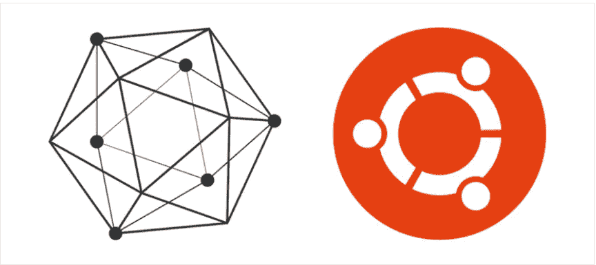
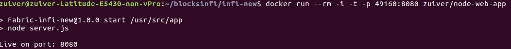

# Hyperledger:如何为 Node.js Web app 构建自己的 docker 容器(Ubuntu 16.04)

> 原文：<https://medium.com/coinmonks/hyperledger-how-to-build-your-own-docker-container-for-node-js-web-app-ubuntu-16-04-c0ed7653adc1?source=collection_archive---------8----------------------->



Image [source](https://www.siliconian.com/blog/15-tutorials/27-hyperledger-fabric-v0-6-on-a-fresh-ubuntu-16-04)

最近，我需要构建自己的 docker 容器来触发 node.js 服务器应用程序，我需要将它与 Hyperledger Fabric 服务器集成。

我尝试了许多步骤，但最终以 NodeJS 的这个漂亮的官方文档结束(在本文中称之为官方文档)

> [https://nodejs.org/en/docs/guides/nodejs-docker-webapp/](https://nodejs.org/en/docs/guides/nodejs-docker-webapp/)

虽然你可以按照上面的文章来构建你的 docker 容器，但是你可能会面临一些问题。我想在这里谈谈这些问题。

我们开始吧..

## 假设:

1.  您已经设置了 nodejs 应用程序，并准备好构建容器
2.  你对 docker 的工作原理有所了解吗？
3.  你应该已经准备好你的系统并安装了 docker，如果没有的话，按照这篇文章安装同样的*(*[*)https://docs . docker . com/install/Linux/docker-ce/Ubuntu/# supported-storage-drivers*](https://docs.docker.com/install/linux/docker-ce/ubuntu/#supported-storage-drivers)*)*

a)官方提到的 Setup Package.json

b)官方提到的 Setup server.js

c)创建 Dockerfile，如官方所述(注意，这里您可能会在从服务器设置不同的端口号时出错。JS 和 Dockerfile:保持不变)

d)创建。官方文件中提到的档案

使用此命令构建您的映像，这里 node-web-app 是用户定义的，您可以随意命名。

```
docker build -t <your username>/node-web-app .
```

最后使用下面的代码运行你的 docker

```
docker run --rm -i -t -p 49160:8080 <your username>/node-web-app
```

它应该显示在结果下面



Results after Docker Run command

您可能遇到的错误:

*   curl: (7)无法连接到本地主机端口 49160:连接被拒绝

> 检查:[https://medium . com/coin monks/hyperledger-fabric-composer-errors-solutions-827112 a3 FCE 6](/coinmonks/hyperledger-fabric-composer-errors-solutions-827112a3fce6)

感谢您花时间阅读，如果您有任何问题，请评论。

乐意帮忙…