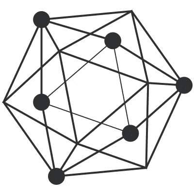

# 超级分类帐和超级分类帐结构

> 原文：<https://medium.com/coinmonks/hyperledger-hyperledger-fabric-53f510a006d?source=collection_archive---------0----------------------->

[source](https://www.google.co.in/search?q=hyperledger&newwindow=1&biw=1301&bih=653&source=lnms&tbm=isch&sa=X&ved=0ahUKEwi19oiBk9HaAhUdT48KHR7DAq8Q_AUICygC#imgrc=SdoE1BDoupPmdM:)

Hyperledger，也称为 Hyperledger 项目，是开源区块链的一个标志性项目。它使用商业区块链技术促进跨行业协作，包括分布式分类帐框架、身份、访问控制和智能合同、客户端库、GUI 和实用程序库。Hyperledger 项目于 2016 年初作为 Linux 基金会的一部分成立，目前拥有 50 多名成员。

Linux 基金会将 Hyperledger 项目分为五个子项目，即:Fabric、Sawtooth、Indy、Burrow 和 Iroha。根据 Hyperledger 执行董事布莱恩·贝伦多夫的说法，“这些项目中的每一个都是在 Hyperledger 之外开始的，首先，由一个心中有特定用例的团队完成，每个项目都必须为开源团队带来独特的东西，并且其技术必须适用于其他公司”。

本文分析了织物及其结构。

Fabric 由 Linux 基金会托管，最初由 Digital Asset 和 IBM 出资，是迄今为止最活跃的项目。这是一个“许可的”区块链平台，或者说是一个运行智能合约的基础设施。通过“允许”，它意味着所有参与者在一定程度上都是被认同的，并且带有解决问题的适当政策。Fabric 允许一组已确定的参与者之间进行安全的交互，这些参与者具有共同的目标，但是彼此之间没有信任。依靠对等体身份，Hyperledger Fabric 是一个许可的区块链，可以使用传统的拜占庭容错(BFT)共识来代替工作证明(PoW)算法。

传统的区块链平台，无论是无许可的还是有许可的，都遵循顺序执行方法，也称为“订单-执行”架构，通过这种架构，智能合约上的交易在达成共识后执行，所有参与者执行所有合约。它有几个缺点，如可伸缩性的限制、事务的顺序执行和所有对等体的认可。

Fabric 被设计为在不同的架构上运行，该架构通过支持模块化共识协议，改进了区块链处理安全问题(如资源耗尽或性能攻击)的方式。它使用一种新的“执行-订单-验证”架构，允许在区块链达成共识之前执行交易。分布式应用可以用标准或通用编程语言编写，如 Google Go、Java、Node.js，而不需要对本地加密货币的基本依赖。对于现有的区块链平台来说，这是一个重大的进步，现有的平台需要用特定领域的语言编写代码，而这种语言需要特定的培训

“执行-订单-验证”架构与“订单-执行”原型完全不同，因为它将交易流分成模块化的构建块，并包括可伸缩复制数据库的元素。由 Fabric 首创的混合复制方法结合了拜占庭模型中的被动和主动复制。虽然只有在达成共识后才使用主动复制来写入事务对分类帐状态的影响，但它也结合了被动复制，即每个事务仅由对等体的子集签署，从而允许并行执行和不确定性。因此，事务不必都按一个顺序设计，只要它们彼此一致并在正确的时间组合。由于模块化共识，它的实现可以是灵活的，并适合特定的部署。

总之，Hyperledger Fabric 由于其独特的体系结构，能够利用其独特的网络功能(如高效处理、可伸缩性、标准编程语言、增强的隐私和模块化结构)提供可定制的个人部署，这使其成为适合企业的区块链平台。

> [在您的收件箱中直接获得最佳软件交易](https://coincodecap.com/?utm_source=coinmonks)

