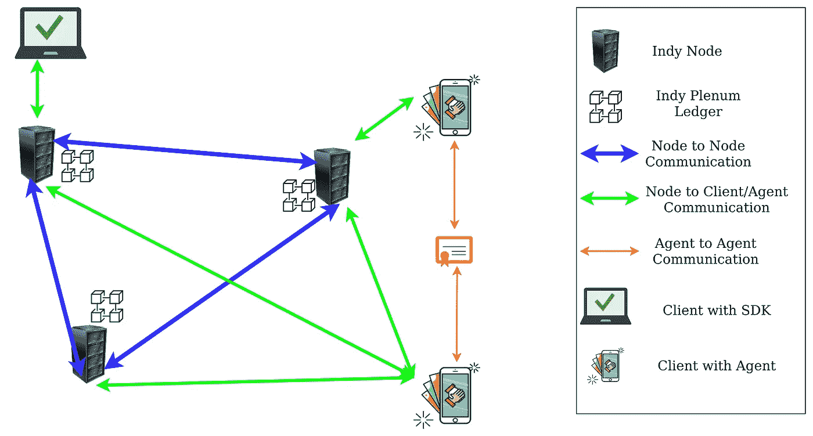

# 具有 Indy 节点和集气室的 Hyperledger Indy 自定义网络(协议和分类帐)

> 原文：<https://medium.com/coinmonks/hyperledger-indy-custom-network-with-indy-node-plenum-protocol-ledger-85fd10eb5bf5?source=collection_archive---------0----------------------->

## 区块链的自我主权身份(SSI)



区块链技术的自我主权身份(SSI)正在迅速普及，其中自我主权身份(SSI)被视为互联网身份的未来，区块链技术将用于构建适当的自我主权身份(SSI)系统的底层结构。另一方面，Hyperledger Indy 提供了工具、库和可重用组件，用于提供基于区块链或其他分布式分类帐的数字自我主权身份，以便它们可以跨管理域、应用程序和任何其他筒仓进行互操作。 ***Hyperledger Indy 是一个正在开发的平台，到目前为止还没有开发定制 Indy 网络的合适教程或文档，因为所有其他教程都基于 Indy 测试网络。此外，Indy Sdk 不准备开发定制的 Indy 网络。因此，通过遵循本教程，任何人都可以很容易地按照任何人的要求构建一个定制的 Hyperledger Indy 网络。***

要了解自我主权身份(SSI)的必要性，请点击以下链接:
[https://medium . com/@ taseen . junaid/Self-Sovereign-Identity-SSI-in-the-future-of-internet-Identity-6deb 75607 aa](/@taseen.junaid/self-sovereign-identity-ssi-in-blockchain-the-future-of-internet-identity-6deb75607aa)

[](/@taseen.junaid/self-sovereign-identity-ssi-in-blockchain-the-future-of-internet-identity-6deb75607aa) [## 区块链中的自我主权身份&互联网身份的未来

### 自我主权身份(SSI)被认为是互联网身份的未来，其中将使用区块链技术…

medium.com](/@taseen.junaid/self-sovereign-identity-ssi-in-blockchain-the-future-of-internet-identity-6deb75607aa) 

Hyperledger Indy Network

# 印地节点:

每个 Indy 节点都作为分布式服务器工作，每个节点都有一个分类帐来存储记录。

# 印度全会(协议和分类帐):

## **总账**

分类账用于存储交易，并且基于区块链的分布式系统中的每个节点持有相同的分类账。目前，Indy Plenum 有四种分类帐，但插件也可以添加新的分类帐。

**域分类帐**用于存储身份和应用特定的交易。例如，如果您需要存储管理者、受托者、参与者的身份，或者您需要存储凭证定义、模式定义甚至特定凭证的撤销信息，您必须使用域分类帐。


Different types of Indy Ledger

**池分类帐**用于存储所有节点特定的事务，以便我们可以创建和管理网络池。它用于在分布式系统中添加、编辑或删除节点。

**配置分类帐**用于存储配置相关交易、池配置参数、交易验证等目的。例如，如果一个机构想要添加一个凭证定义，并且需要大多数管理员的许可，我们可以将这种类型的访问控制选项存储到配置分类帐中。

**审计分类帐**实际上作为一个区块链工作，因为它以连续的方式保存所有其他分类帐交易(域、池、配置)的全局序列号。

## **协议**

协议是一套既定的规则，用于管理我们的分布式系统。目前，Indy 使用冗余拜占庭容错(RBFT)协议达成共识，并有可能迁移到 Aardvark。

# 公共许可的区块链

Hyperledger Indy 因其性质而被称为公共许可的区块链。每个人都可以在没有任何许可的情况下从账本中读取数据，这就是称之为公共区块链的原因。另一方面，要将数据写入分类帐，您需要根据共识机制进行验证，因此也称为许可区块链。


把一件事写进账本，不仅需要有人许可，还需要一定比例节点的共识。例如，一个网络池由 10 个节点组成，因此要将内容写入分类帐，需要至少 7(10–3)个节点的一致同意。容错公式为‘N =(3F+1)’,其中‘N’是节点总数，F 是恶意节点的最大数量。


Write request

另一方面，读取数据不需要任何许可或共识，任何人都可以从任何随机节点读取数据。


Read request

# 实践教程

## **先决条件**

Hyperledger Indy network 可以通过在不同的 Ubuntu 16.04 机器上运行节点来创建。截至 2020 年 10 月，只有 Ubuntu 16.04(也称为 Ubuntu **Xenial** )获得全面支持。所以我们要用 Ubuntu Xenial 其中 Docker 或者虚拟机也可以用来做网络。
如果尚未安装最新版本的 [**git**](https://git-scm.com/downloads) ，请下载。

## 预设

请使用以下命令克隆[项目](https://github.com/Ta-SeenJunaid/Hyperledger-Indy-Tutorial.git)。

```
git clone [https://github.com/Ta-SeenJunaid/Hyperledger-Indy-Tutorial.git](https://github.com/Ta-SeenJunaid/Hyperledger-Indy-Tutorial.git)
```

对于本教程，我们将使用版本 1.0.0，因此我们必须使用以下命令签出该版本。

```
git checkout tags/v1.0.0 -b v1.0.0-branch
```


Using tag V1.0.0

要设置环境，您必须使用“prerequisites.sh”文件。除了下载不同的 Indy 组件，我们还可以从各自的源构建这些组件。

```
sudo bash prerequisites.sh
```


Prerequisites

## 使用私有/秘密种子值生成公共信息

Seed 是一个 32 个字符长的值，作为演员/组件的私有信息，出于安全原因不能与他人共享。通过使用种子值，我们可以生成公共信息，并通过代理或其他媒介共享这些公共信息。
通过调用 32 字符长种子值的“get_did_and_verkey.py”，不同的行动者可以看到自己的 did(分散身份)和验证密钥。

```
python3 get_did_and_verkey.py --seed 100A000000300000c0000000Steward1
```


Generating public info using private/secret seed value

## 初始参与者和组件

在一个基于 Indy 的网络中，有一些被称为支持者的初始参与者，包括管理者和受托者。

受托人
我们网络的首要参与者是受托人。域分类帐交易从受托人开始。在域分类帐中，受托人也可以添加新的管理者。受托人和管家都有权力写在域名分类帐。
在本教程中，我们有一个种子值为“t 0003000 u 0i 000d 000 f 000g 0 trustee 1”的受信者

**管事**
管事有权力在域账本和池账本上写。管理员可以通过使用池分类帐事务来添加新节点。一个管理者只能添加一个节点，因此每个管理者可以将其唯一的节点添加到网络中。
在本教程中，因为我们有三个节点，所以我们使用三个种子值为
的管家:“100 a 00000003000000 c 0000000 管家 1”、
“300600 b 0d 030000000 z 000000 管家 2”、“v000k 00 l 0000s 0000 e 0000 管家 3”

你可以进入以下链接找到不同的演员角色
[https://hyperledger-Indy . readthedocs . io/projects/node/en/latest/auth _ rules . html # default-auth-map-rules](https://hyperledger-indy.readthedocs.io/projects/node/en/latest/auth_rules.html#default-auth-map-rules)

**节点:**
每个节点都是保存总账的网络组件。用户需要用节点名和节点的种子值调用“init_indy_node.py”来初始化每个节点。该代码还打印该节点的公共信息，如验证密钥、BLS 公钥、我们通过代理或其他媒介与其他人共享的 BLS 密钥的所有权证明。

```
sudo python3 init_indy_node.py --name Node1 --seed 4000F000u00000D0000000g0000Node1
```


Initialization of node

在本教程中，由于我们有三个节点，我们使用 seed 值
“4000 f 000 u 00000d 0000000g 0000 node 1”、“t 0000000 u 0000 I 0000v 0003000 node 2”、“3000000 a 00 u 000 z 0000600003000 node 3”

## 单主机网络开发

如果我们有一个现有的先前设置，我们必须在一开始通过调用“clear_setup.py”来清除它。

```
sudo python3 clear_setup.py --full True --network sandbox
```


Clear previous setup

要初始化节点并生成域分类帐和池分类帐生成事务，我们必须调用“single_host_generation.sh”文件。

```
sudo bash single_host_generation.sh
```


Setup

要启动 Node，我们必须为每个节点使用“start_indy_node.py”文件。对于节点 1:

```
sudo python3 start_indy_node.py Node1 0.0.0.0 9701 0.0.0.0 9702
```

对于节点 2:

```
sudo python3 start_indy_node.py Node2 0.0.0.0 9703 0.0.0.0 9704
```

对于节点 3:

```
sudo python3 start_indy_node.py Node3 0.0.0.0 9705 0.0.0.0 9706
```


Node start

要检查节点信息:

```
sudo python3 validator_info.py
```


Node information

要重新启动已停止的节点:

```
sudo bash restart_indy_node.sh
```


Node restart

如果您的有效性信息显示您的节点已停止，您必须再次重新启动它。

## 多主机网络开发

**如果您想在单个主机上运行网络，那么请跳过“多主机网络开发”一节。**

假设 3 个节点的主机 IP 分别为“191.177.76.26”、“22.185.194.102”、“247.81.153.79”。如果您想使用自己的 IP，那么您必须编辑 multi_host_host1_generation.sh、multi_host_host2_generation.sh、multi_host_host3_generation.sh 文件的“- -ips”标志。实际上，对于每个节点，您必须编写该节点的生成文件，这样就没有人能够知道该节点的种子值。

**主机 1:**
主机 IP:191.177.76.26

```
sudo python3 clear_setup.py --full True --network sandbox
sudo bash multi_host_host1_generation.sh
sudo python3 start_indy_node.py Node1 0.0.0.0 9701 0.0.0.0 9702
```

检查节点信息并重新启动停止的节点

```
sudo python3 validator_info.py
sudo bash restart_indy_node.sh
```

**主机 2:**
主机 IP:22.185.194.102

```
sudo python3 clear_setup.py --full True --network sandbox
sudo bash multi_host_host1_generation.sh
sudo python3 start_indy_node.py Node2 0.0.0.0 9703 0.0.0.0 9704
```

检查节点信息并重新启动停止的节点

```
sudo python3 validator_info.py
sudo bash restart_indy_node.sh
```

**主机 3:**
主机 IP: 247.81.153.79

```
sudo python3 clear_setup.py --full True --network sandbox
sudo bash multi_host_host1_generation.sh
sudo python3 start_indy_node.py Node3 0.0.0.0 9705 0.0.0.0 9706
```

检查节点信息并重新启动停止的节点

```
sudo python3 validator_info.py
sudo bash restart_indy_node.sh
```

## 幕后

在最开始，每个主机必须用种子值初始化它的节点，并且必须与其他主机共享它的公共信息。

之后，我们必须创建一个域分类帐起源文件与管家和受托人的公共信息。

接下来，我们必须创建一个带有节点和管家公共信息的池分类帐起源文件。除此之外，我们必须提供节点名称、节点到节点通信端口、节点到客户端通信端口、节点号、节点 IP、网络名称等。

在完成域分类帐起源文件和池分类帐起源文件之后，每个主机都准备好启动它的节点。

每个参与者/组件都必须生成带有秘密种子值的公共信息，并且出于安全目的，每个参与者/组件都必须对种子值保密。因此，我们必须使用 get_did_and_verkey.py 和 init_indy_node.py 文件，并且必须通过代理或其他介质共享公共信息。

对于单主机可插拔设置，我们必须修改 single_host_generation.sh 文件；对于多主机可插拔设置，每个主机必须编写自己的生成文件。

## 使用 SDK 应用进行测试

这里我们将使用一个 **Indy SDK API** (由 libindy 提供)而不是一个应用程序，因此我们可以看到幕后发生了什么。

我们可以通过下面的链接来了解更多关于“印第故事漫游”的内容

链接:[https://hyperledger-Indy . readthedocs . io/projects/SDK/en/latest/docs/getting-started/Indy-walk through . html # Indy-walk through](https://hyperledger-indy.readthedocs.io/projects/sdk/en/latest/docs/getting-started/indy-walkthrough.html#indy-walkthrough)

[](https://hyperledger-indy.readthedocs.io/projects/sdk/en/latest/docs/getting-started/indy-walkthrough.html#indy-walkthrough) [## Indy 演练- Hyperledger Indy SDK 文档

### Indy 为私有的、安全的和强大的身份提供了一个软件生态系统，而 libindy 为它启用了客户端。印第…

hyperledger-Indy . readthedocs . io](https://hyperledger-indy.readthedocs.io/projects/sdk/en/latest/docs/getting-started/indy-walkthrough.html#indy-walkthrough) 

链接:[https://medium . com/@ kctheservant/exploring-hyperledger-Indy-through-Indy-dev-example-10075d 2547 AE](/@kctheservant/exploring-hyperledger-indy-through-indy-dev-example-10075d2547ae)

[](/@kctheservant/exploring-hyperledger-indy-through-indy-dev-example-10075d2547ae) [## 通过 indy-dev 示例探索 Hyperledger Indy

### 自我主权身份(SSI)在 Hyperledger Indy 中如何工作

medium.com](/@kctheservant/exploring-hyperledger-indy-through-indy-dev-example-10075d2547ae) 

转到任何一台主机，您将在以下目录中找到 pool_transactions_genesis 文件:

"/var/lib/Indy/sandbox/pool _ transactions _ genesis "

您还可以通过转到“indy_network”目录并执行 read_ledger.py 文件来获取池事务。

现在我们必须通过代理或其他媒介与他人共享 pool_transactions_genesis 文件。

请转到“indy_sdk/src/utils.py”文件，并根据 pool_transactions_genesis 文件修复“pool_genesis_txn_data()”函数返回值。

现在，从“indy_sdk”目录调用“sdk_sample.py ”,使用 Indy SDK 见证端到端应用程序演示。在“sdk_sample.py”文件中放置管家种子值时要小心，因为我们必须使用我们在网络开发过程中使用的管家凭证之一。

```
python3 -m src.sdk_sample
```


Indy SDK demo

如果您遇到任何问题，如“钱包已经存在”、“池已经存在”等，请使用 Indy SDK 见证端到端应用程序演示，然后请清除。indy_client”文件夹。

# 总结:

本博客仅为学习目的而写，我们试图在不共享任何私人信息的情况下开发 Hyperledger Indy 定制区块链网络。我们希望这个博客对你有所帮助，也期待你的宝贵意见，这样我们都有机会向你学习。

## 另外，阅读

*   最好的[密码交易机器人](/coinmonks/crypto-trading-bot-c2ffce8acb2a)
*   [密码本交易平台](/coinmonks/top-10-crypto-copy-trading-platforms-for-beginners-d0c37c7d698c)
*   最好的[加密税务软件](/coinmonks/best-crypto-tax-tool-for-my-money-72d4b430816b)
*   [最佳加密交易平台](/coinmonks/the-best-crypto-trading-platforms-in-2020-the-definitive-guide-updated-c72f8b874555)
*   最佳[加密贷款平台](/coinmonks/top-5-crypto-lending-platforms-in-2020-that-you-need-to-know-a1b675cec3fa)
*   [最佳区块链分析工具](https://bitquery.io/blog/best-blockchain-analysis-tools-and-software)
*   [加密套利](/coinmonks/crypto-arbitrage-guide-how-to-make-money-as-a-beginner-62bfe5c868f6)指南:新手如何赚钱
*   最佳[加密制图工具](/coinmonks/what-are-the-best-charting-platforms-for-cryptocurrency-trading-85aade584d80)
*   [莱杰 vs 特雷佐](/coinmonks/ledger-vs-trezor-best-hardware-wallet-to-secure-cryptocurrency-22c7a3fd391e)
*   了解比特币最好的[书籍有哪些？](/coinmonks/what-are-the-best-books-to-learn-bitcoin-409aeb9aff4b)
*   [3 商业评论](/coinmonks/3commas-review-an-excellent-crypto-trading-bot-2020-1313a58bec92)
*   [AAX 交易所评论](/coinmonks/aax-exchange-review-2021-67c5ea09330c) |推荐代码、交易费用、利弊
*   [Deribit 审查](/coinmonks/deribit-review-options-fees-apis-and-testnet-2ca16c4bbdb2) |选项、费用、API 和 Testnet
*   [FTX 密码交易所评论](/coinmonks/ftx-crypto-exchange-review-53664ac1198f)
*   [n 零审核](/coinmonks/ngrave-zero-review-c465cf8307fc)
*   [Bybit 交换评论](/coinmonks/bybit-exchange-review-dbd570019b71)
*   [3Commas vs Cryptohopper](/coinmonks/cryptohopper-vs-3commas-vs-shrimpy-a2c16095b8fe)
*   最好的比特币[硬件钱包](/coinmonks/the-best-cryptocurrency-hardware-wallets-of-2020-e28b1c124069?source=friends_link&sk=324dd9ff8556ab578d71e7ad7658ad7c)
*   最佳 [monero 钱包](https://blog.coincodecap.com/best-monero-wallets)
*   [莱杰 nano s vs x](https://blog.coincodecap.com/ledger-nano-s-vs-x)
*   [bits gap vs 3 commas vs quad ency](https://blog.coincodecap.com/bitsgap-3commas-quadency)
*   [莱杰纳米 S vs 特雷佐 one vs 特雷佐 T vs 莱杰纳米 X](https://blog.coincodecap.com/ledger-nano-s-vs-trezor-one-ledger-nano-x-trezor-t)
*   [block fi vs Celsius](/coinmonks/blockfi-vs-celsius-vs-hodlnaut-8a1cc8c26630)vs Hodlnaut
*   Bitsgap 评论——一个轻松赚钱的加密交易机器人
*   为专业人士设计的加密交易机器人
*   [PrimeXBT 审查](/coinmonks/primexbt-review-88e0815be858) |杠杆交易、费用和交易
*   [埃利帕尔泰坦评论](/coinmonks/ellipal-titan-review-85e9071dd029)
*   [赛克斯石评论](https://blog.coincodecap.com/secux-stone-hardware-wallet-review)
*   [BlockFi 评论](/coinmonks/blockfi-review-53096053c097) |赚取高达 8.6%的加密利息