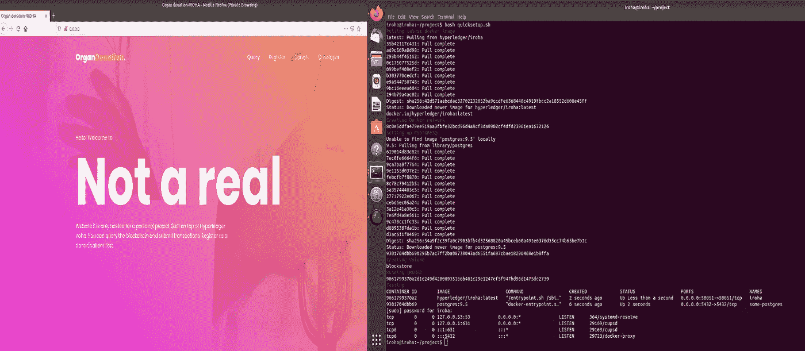

# 人体器官的符号化

> 原文：<https://medium.com/coinmonks/hyperledger-iroha-tokenization-of-human-body-organs-d05ef4f2bbf8?source=collection_archive---------1----------------------->

将敏感数据替换为非敏感数据的过程称为令牌化，这具有几个优点，如安全性、安全交易、简化合规性、提高交易者之间的信任度等。在这里，我努力将人体器官符号化，以便于管理捐赠者和接受者之间的交易。代码可以在这个 Github [链接](https://github.com/rietesh/Organ-Donation-IROHA.git)上找到。

Hyperledger Iroha 是一种简单且易于集成的分布式账本技术，它具有简单的构造、模块化、域驱动的 C++设计、强调客户端应用程序开发和一种新的崩溃容错共识算法，称为 YAC(又一种共识)，这是一种实用的拜占庭容错共识算法([原文](https://arxiv.org/pdf/1809.00554.pdf))。

Fabric 和 Iroha 的一些重要区别:
1。Iroha 框架不支持智能合约或任何其他形式的复杂业务逻辑。
2。Iroha 具有基于角色的访问控制，而 Fabric 用户访问控制列表
3。YAC 是一种高性能的一致性算法，允许以低延迟完成事务
4。与对等体轮询验证的 Fabric 不同，Iroha 应用程序以简单的客户端-服务器方式与对等体交互
5。Fabric 具有可插拔的一致性，允许平台依赖 CFT(崩溃容错)或 BFT(拜占庭容错)

**如何在本地复制该项目**

先决条件: [Docker 引擎](https://docs.docker.com/install/)，Python 3，Flask， [Iroha](https://github.com/hyperledger/iroha-python) (pip3 安装 Iroha)。

克隆回购:

```
git clone [https://github.com/rietesh/Organ-Donation-IROHA.git](https://github.com/rietesh/Organ-Donation-IROHA.git)sudo bash quicksetup.sh
```

该脚本将获取最新的 Iroha 和 Postgres 映像，创建所需的网络和永久卷存储，并以分离模式运行这两个容器([指南](https://iroha.readthedocs.io/en/latest/deploy/single.html))。



After the complete and successful setup

如果 Iroha 容器没有运行，您可以使用“docker ps”命令检查正在运行的容器:

```
docker rm irohadocker run --name iroha -d -p 50051:50051
-v $(pwd)/myconfig:/opt/iroha_data -v blockstore:/tmp/block_store --network=iroha-network -e KEY='node0' hyperledger/iroha:latest
```

Iroha 网络已经启动并运行，您可以通过在 Iroha 容器中打开一个终端来测试网络

```
docker exec -it iroha /bin/bash#Play with the iroha-cli:
iroha-cli --account_name admin@odwa
```

要完全删除设置" **sudo bash teardown.sh** "

要运行 flask web 应用程序

```
sudo python3 ./flaskapp/app.py
```

在您的 web 浏览器中导航到 http://localhost，您就准备好了。


Demo

# 体系结构

该架构包括两个域“odwa”和“patient”，两组角色“admin”和“patients”，资产是器官，它属于“organ”域。genesis 块如下所示:

在这里，我创建了资产，并添加了一个用户 admin，将他添加到“odwa”域，并将他的角色添加到 admin。我所有的资产都是精确到零的，这意味着没有小数部分，只有整数。我已经授予患者域的 can_transfer、can _ recieve 权限，以便接收和转移资产。

# 工作流程

我在下图中总结了工作流程:


Workflow

用于 flask web app 的 app.py:

使用 iroha-python SDK 与 iroha api 对话的最重要的文件保存为 iroha_sdk.py

肺作为资产的成功交易演示:


Another demo

这是一个简单的应用程序，可以大大改善，所以请如果你有任何建议，投诉，查询或改善这个项目的方式平我或留下评论如下感谢您的阅读。

> [在您的收件箱中直接获得最佳软件交易](https://coincodecap.com/?utm_source=coinmonks)

[](https://coincodecap.com/?utm_source=coinmonks)[](https://coincodecap.com)