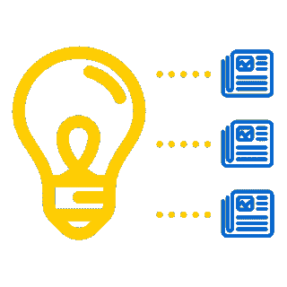
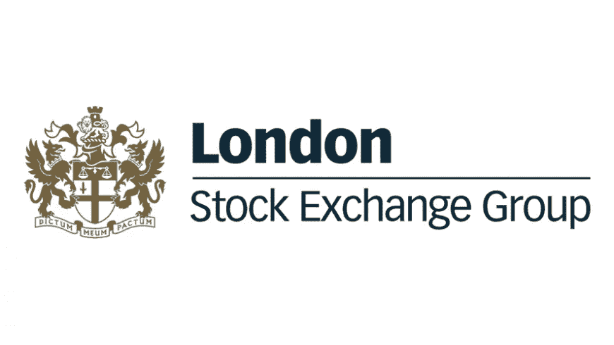
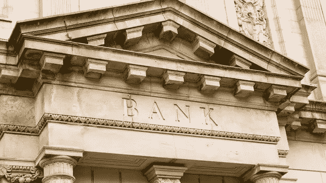

# 真实公司中的超级分类帐项目

> 原文：<https://medium.com/coinmonks/hyperledger-projects-in-real-companies-35016745362c?source=collection_archive---------2----------------------->

因此，一些公司已经利用了 IBM Hyperledger Fabric 的强大功能。

# 金融机构

CLS

对银行来说，最困难的改变可能是对风险采取新的态度，包括使用创新的做法来解决风险。这并不意味着金融服务公司需要满足于产生更大风险的区块链解决方案。区块链的前提和承诺就是降低风险，提高弹性、透明度和信任度；换句话说，就是创建一个“不可信”的环境，在这个环境中，第三方验证不再像过去那样是一项独立的活动。这个结果应该是一个突出的设计点，一个从一开始就建立并随着区块链计划的进展不断评估的设计点。

然而，根据 CLS-IBM 的合作，似乎大多数银行都需要重新调整他们在去/不去决策方面的风险方法，尤其是在项目的早期阶段。CLS 是全球外汇市场最大的结算和风险缓释服务提供商。我们的第一个区块链项目涉及为买方和卖方机构进行 140 多种货币的外汇交易的双边支付净额结算。

虽然我们引入的服务可以通过传统方法交付，但我们决定开发一个基于区块链的解决方案。我们认识到，区块链将简化架构，实现底层解决方案的可扩展性，并提供一个战略网络，通过该网络可以提供额外的区块链服务。因为我们正在进入新的技术领域，我们从一开始就开始与监管机构进行磋商。

正如我们所了解的，组织可以设计他们的第一个区块链计划来避免重大风险。在 CLS，我们的第一个决定是不要建太远或太宽的桥。换句话说，我们的第一个计划不能因为失败而将现有业务置于风险之中。其他机构对此深有体会

在未经测试的技术上推出核心业务产品是一种高风险的策略。此外，基于区块链的解决方案利用更广泛的组织的能力也很重要。在 IBM 和 CLS，我们都是从扩展现有流程来增加服务开始的，这是一种降低风险的考虑。这使我们能够交付基于区块链的解决方案，该解决方案与现有的生态系统相集成，涵盖流程、治理和支持应用程序。

在 IBM 全球融资(IGF)部门的第一批项目中，我们发现向现有流程添加新功能是一个很好的起点，而不是用新流程替换或完全重新设计业务流程。在 IGF，向从 IBM 供应商处购买产品的合作伙伴提供信贷，我们从争议解决开始，这是一个漫长的劳动密集型过程。IGF 的争议解决区块链可以处理 290 万笔交易，平均每年导致 25，000 起争议，并占用约 1 亿美元的资金。因此，解决争议的时间预计将从 40 多天减少到不到 10 天，资本效率将提高 40%。

IGF 选择不更换现有系统。相反，它将数据从遗留系统转移到并行运行的区块链。这减轻了将区块链与现有流程集成的挑战，并加快了投入生产的时间。

在 CLS，我们从以客户为中心的角度应对挑战。我们设计了一个技术接口，不需要我们的客户使用区块链来访问网络服务。他们可以选择通过其现有的 SWIFT 系统使用新服务，或者直接通过在我们封闭安全的网络上托管他们自己的区块链节点来使用新服务。

来源:[https://www-01.ibm.com/common/ssi/cgi-bin/ssialias?html FID = gbe 03886 usen&](https://www-01.ibm.com/common/ssi/cgi-bin/ssialias?htmlfid=GBE03886USEN&)

# 碳减排

在中国碳资产市场的使用中，它允许企业更有效地产生碳资产，有助于在中国建立一个绿色、低碳和环保的未来。碳资产开发，也称为 CER(碳减排)配额发放，是鼓励企业减少排放和使用低碳排放技术的一种流行方式。

能源区块链实验室首席战略官曹寅表示:“据估计，该平台将大大缩短碳资产开发周期，并将碳资产开发成本降低 20%至 30%，从而实现大量碳资产的经济高效开发。”。“区块链技术有望成为有效控制碳排放的重要手段，对全球最大碳排放源中国意义重大。”

两家公司在 2016 年底完成了概念验证，区块链碳资产管理平台的测试版将于 5 月发布。能源区块链实验室和 IBM 计划在今年晚些时候提供这一平台，与中国统一的全国碳市场开放保持同步。

“能源区块链实验室致力于成为数字化绿色资产的全球领导者，我们希望提高碳市场和绿色金融市场的效率，”能源区块链实验室首席执行官林乐说。“我们很高兴能与 IBM 合作减少碳排放。我们也希望与更多的伙伴合作应对气候变化。”

区块链技术为碳市场面临的许多问题提供了解决方案。结合智能合同的跨组织数字协作将大大提高碳资产开发和管理的效率。安全性丰富且不可变的分布式账本技术增加了碳减排市场的可信度。区块链技术还提供透明度和可审计性，帮助利益相关者满足监管要求。

中国国家气候变化战略研究与国际合作中心(NCSC)主任李俊峰表示:“作为巴黎协定的重要签署国，中国必须承担起全球气候治理的责任，继续实现 2020 年前的气候变化行动目标，建立一个标准的全国碳市场。”。“我们必须努力限制高能耗、高排放行业，鼓励清洁能源发展，进一步推动节能减排。这些任务不仅是中国自身可持续发展的需要，也是整个人类大家庭福祉的需要。”

“IBM 和能源区块链实验室在碳减排方面使用区块链技术是向前迈出的重要一步，”IBM 大中华区集团董事长陈黎明表示。“这是 IBM 帮助中国企业利用创新技术建立合作、公平、合理的全球气候变化治理机制的另一种方式。作为 Linux 基金会 Hyperledger 项目的创始成员，IBM 致力于提供更多创新的企业级区块链技术，帮助中国企业构建区块链生态系统。”

来源:https://www-03.ibm.com/press/us/en/pressrelease/51839.wss

# 卫生保健

IBM Watson Health(NYSE:[IBM](http://www.ibm.com/investor))与美国美国食品药品监督管理局(FDA)签署了一项研究计划，旨在使用区块链技术定义安全、高效和可扩展的健康数据交换。IBM 和 FDA 将探索交换来自多个来源的所有者中介数据，如电子医疗记录、临床试验、基因组数据以及来自移动设备、可穿戴设备和“物联网”的健康数据。最初的重点将是肿瘤学相关的数据。当医疗保健研究人员和提供商能够全方位了解患者数据时，变革性的医疗保健解决方案就成为可能。如今，患者很难获得他们的健康数据，也不容易与研究人员或提供者分享。让患者有机会出于研究目的或在医疗保健提供者之间安全地共享他们的数据，为医疗保健的重大进步创造了机会。区块链技术使组织能够更加信任地合作，旨在帮助实现这一目标。

通过在不可更改的分布式分类账上保留所有交易的审计跟踪，区块链技术在数据交换过程中建立了问责制和透明度。在过去，健康数据的大规模共享受到数据交换过程中数据安全和侵犯患者隐私的限制。

最近 [IBM 商业价值研究所的一篇论文](https://www-01.ibm.com/common/ssi/cgi-bin/ssialias?htmlfid=GBE03790USEN&) *【区块链医疗集会*[***【1】***](https://www-03.ibm.com/press/us/en/pressrelease/51394.wss#_ftn1)*，基于对大约 200 名医疗保健高管的调查，发现超过十分之七的行业领导者预计区块链医疗保健的最大好处是管理临床试验记录、法规遵从性和医疗/健康记录。*

*IBM 和 FDA 将探索区块链框架如何通过支持跨各种数据类型(包括临床试验和“真实世界”证据数据)的信息交换的重要用例，潜在地为公共卫生带来好处。结合医疗保健生态系统数据的新见解可能会带来新的生物医学发现。例如，来自可穿戴设备和互联设备的患者数据可以帮助医生和护理人员更好地管理人群健康。*

*此次合作还将提出新的方法来利用当今生物医学和医疗保健行业的大量不同数据。一个安全的以所有者为中介的数据共享生态系统可能会带来新发现和改善公共健康的希望。*

*IBM 在区块链技术方面拥有丰富的专业知识，例如，IBM 是 Linux 基金会 Hyperledger 项目的创始成员和主要贡献者。*

*随着区块链在医疗保健领域的前景越来越明显，IBM 将致力于为可扩展和分散的数据共享生态系统定义和构建技术解决方案。*

*“由于产生了大量不同的数据，医疗保健行业正在经历重大变革。区块链技术为数据共享提供了一个高度安全的去中心化框架，这将加速整个行业的创新，”IBM Watson Health 创新副总裁兼首席科学官 Shahram Ebadollahi 表示。*

# *药品零售商*

**

*简一区块链技术应用系统是一个使用 Hyperledger Fabric 的许可区块链平台。它与和睦家、一家药品零售商、一家医院和一家银行进行商业交易。今年 7 月，和睦家计划将该平台扩展至多家医药零售商、医院和银行。该系统旨在帮助消除制药行业的一些融资挑战。*

*由于信用体系不发达，缺乏成熟的信用评估和风险控制，中国中小型药品零售商往往难以筹集资金。例如，药品零售商将药品送到医院后，可能需要 60~90 天才能收回货款。如果没有良好的信用记录和符合融资标准的抵押品，这些零售商往往很难从传统金融机构获得贷款。*

*和佳与 IBM 合作，在这些供应链参与者之间建立了一个以区块链为基地的商业网络。通过跟踪供应链中的药品和加密交易记录，区块链的透明度有助于确定交易的真实性。反过来，这可能有助于降低金融机构的信用风险，从而缩短付款时间，可能缩短到第一个或下一个交易日。总体而言，该平台旨在帮助减少供应链双方的资金周转时间，并让银行了解更多信息，为中小型药品零售商提供资金。*

*和佳董事长冷天辉先生表示:“供应链金融服务平台的推出，标志着和佳与 IBM 在区块链技术创新应用方面的合作达到了一个里程碑。未来，该平台将扩展到更多行业，为参与公司和金融机构提供基于区块链创新的透明、高效的融资服务，这种商业模式将有助于中国的经济发展。”*

*平台的上线也标志着和睦家的业务转型成功。IBM 通过分析供应链金融行业和药品零售商面临的融资条件提供了见解，从而帮助了和佳。*

*沈博士说:“区块链可以通过消除低效率、加快交易速度和实现创新的新商业模式，从根本上改变商业。我们与和佳合作建立的简一区块链技术应用系统就是这种能力的绝佳展示。我们期待与和佳继续合作，将这项技术应用于其他行业用例。”*

*“IBM 提供基于 Hyperledger 架构的企业级区块链平台，帮助客户定义和开发新的行业用例，”IBM 大中华区集团全球业务服务部管理合伙人 Gregor Pillen 表示。“我们对各种行业和领先技术有着深刻的理解，我们使用这些技术来帮助企业客户解决业务挑战，同时寻找增长机会，以便他们能够为中国的经济转型做出贡献。"*

*来源:https://www-03.ibm.com/press/us/en/pressrelease/52055.wss*

# *伦敦证券交易所集团*

**

*Borsa Italiana 首席执行官 Raffaele Jerusalmi 表示:“通过我们与 IBM 在这一区块链解决方案上的合作，Borsa Italiana 率先改变了欧洲中小企业管理股东数据的方式，同时扩大了信贷渠道，所有这些都是在一个值得信赖的数字平台上实现的。*

*针对欧洲未上市中小企业的区块链解决方案旨在取代目前通常向私营公司发放的纸质交易证书。借助区块链解决方案实现的更加数字化、简化和透明的流程，包括发行人、监管机构和投资者在内的各方将能够更深入地了解公司信息。*

*传统上，私营中小企业缺乏进入公共股票交易网络或正规信贷结构的机会。借助该解决方案，欧洲的中小企业可以更好地获得信贷，并连接到更广泛、更成熟的投资者生态系统中，使他们能够建立新的交易网络，并通过在安全、透明的公共场所共享财务数据来获得资金。通过实施区块链解决方案，Borsa Italiana 率先改变了私营公司交换股东数据、提高股东数据透明度和扩大信贷渠道的方式。*

*“LSEG 正在测试区块链技术在金融业务网络中的应用，在该网络中，数据隔离和保密性至关重要。通过与构建企业级区块链解决方案的先驱 IBM 合作，我们致力于随着时间的推移构建、测试和扩展我们在新兴技术领域的能力，”首席运营官集团和伦敦证券交易所集团首席信息官 Chris Corrado 说道。*

*该系统构建于 Hyperledger Fabric 版之上，是一个区块链框架，是 Linux 基金会主持的 Hyperledger 项目之一，旨在帮助确保高度敏感的证券数据可以在获得许可的网络参与者之间共享，同时保持安全和受控。这一区块链解决方案是与 IBM 合作开发的，构建在高度安全的基础设施技术之上，可提供最高级别的商用加密[【1】](https://www-03.ibm.com/press/us/en/pressrelease/52836.wss#_ftn1)。该解决方案还旨在实现与 LSEG 现有系统的互操作性，从而提高效率和业务连续性。*

*IBM 区块链总经理 Marie Wieck 表示:“使用传统系统很难在股东网络之间共享安全、透明的关键网络数据。“区块链有望帮助消除传统价值转移方法中的一些障碍——就像互联网在 20 世纪 90 年代末为信息交换所做的那样。”*

*该解决方案正由一小组合作伙伴和客户进行初步测试。*

# ***天网能源社区***

**

*由于可再生能源发电在整个电力供应中所占的份额越来越大，电网变得更加不稳定。在未来几年，传统能源将无法完全满足电力需求。为了解决这个问题，TenneT 正在努力寻找新的方法来维护供应的安全性。作为更广泛的数字化转型计划的一部分，TenneT 正在探索使用许可的区块链网络，该网络使用 Hyperledger Fabric 将电动汽车和家用电池提供的灵活容量集成到电网中。TenneT 首席执行官 Mel Kroon 评论道:“这些试点项目是 TenneT 更广泛战略的一部分，旨在为电力系统做好准备，以适应不断增长的可再生能源。”*

*TenneT 将在两个试点项目中测试这一新概念:*

***荷兰 Vandebron 的试点项目***

*TenneT 负责维持高压电网的平衡。为了保证电力的持续供应，一周七天，一天 24 小时都要保持供需平衡。在供需不平衡的情况下，TenneT 确保供应额外的电力或部署备用容量。在这个试点项目中，Vandebron 将与拥有电动汽车的客户合作，使他们的汽车电池容量可以帮助 TenneT 平衡电网。Vandebron 将在不影响汽车电池可用性的情况下为客户提供这项服务。区块链通过记录它们的可用性和它们对来自 TenneT 的信号的响应来使每辆车能够参与。*

***sonnen 电子服务在德国的试点项目***

*重新调度措施可防止电网出现区域性过载。例如在德国，当德国北部产生的风能不能输送到该国南部的工业中心时，该系统是必要的。在 Sonnen e services(Sonnen 集团的能源集团)的这个试点项目中，将提供一个住宅太阳能电池网络，以帮助在运输能力不足时减少对风能的限制。区块链向来自 TenneT 的操作员展示了可用的灵活性池，按下按钮即可激活，之后区块链记录电池的贡献。这将使 sonnen 和 TenneT 能够支持将可再生能源纳入德国电力供应系统。*

*在荷兰和德国，市场各方将通过简讯和市场咨询研讨会了解试点项目和相关发展。一旦这一概念被证明是可行的，它将被推出，TenneT 能源社区将开放给其他各方加入。*

***区块链***

*验证和记录这些分布式灵活能源设备的性能值的数字流程是使用 IBM 区块链交付的，该区块链由 Hyperledger Fabric 构建，是区块链框架实现，也是 Linux 基金会托管的 Hyperledger 项目之一。区块链适合连接多方和大量分布式计算节点，使他们能够在可扩展、透明和可信的网络中采取联合行动。IBM 将开发这个平台，以确保小规模电池和电动汽车交易的可验证性和透明度。区块链将实现所有市场和职能部门的最佳分配。通过这种方式，TenneT 将能够获得洞察力，并有可能激活能源系统的灵活性，同时方便消费者将其灵活性用于平衡市场。*

*来源:https://www-03.ibm.com/press/us/en/pressrelease/52243.wss*

# *精力*

*跨国企业软件巨头 SAP 推出了一个云平台，致力于帮助企业开发区块链应用。*

*在 SAP 周三的一次活动中宣布，[基于云的解决方案](https://news.sap.com/sapphire-now-sap-intelligent-enterprise-products-choice/)旨在为企业提供一个框架，以在区块链系统(如 Hyperledger Fabric)上构建业务应用程序，Hyperledger Fabric 是由 Linux 基金会推出的区块链平台，SAP 也是其贡献者之一。*

*该公司在公告中表示，这项工作正在正式推出，此前它已与区块链联合创新计划中的 65 家公司合作，在供应链、制造、运输、食品和制药等多个行业测试了区块链应用。*

*上个月早些时候，CoinDesk [报道称](https://www.coindesk.com/sap-launches-new-blockchain-supply-chain-initiative/),该公司正在与美国香肠制造商 Johnsonville 以及 Naturipe Farms 和枫叶合作，开展一个跟踪整个供应链中食品来源的试点项目，作为其农场到消费者计划的一部分。*

*除了合作创新计划，SAP 还[宣布](https://discover.sap.com/sap-blockchain-consortium/en-us/index.html)它正在组建一个区块链联盟，其成员有权使用该集团开发的技术。该联盟中著名的公司目前包括惠普企业、英特尔和 UPS。*

*这项工作标志着 SAP 成为最新一个推出区块链应用开发平台的科技巨头，此前微软、IBM 以及中国的百度和腾讯也做过类似的工作。*

*来源:[https://www . coin desk . com/software-giant-sap-launchs-区块链-即服务-平台/](https://www.coindesk.com/software-giant-sap-launches-blockchain-as-a-service-platform/)*

# *银行担保*

**

*ANZ 和西太平洋银行已经与 IBM(纽约证券交易所代码: [IBM](http://www.ibm.com/investor) )和购物中心运营商 Scentre Group 合作，现在已经成功地将用于商业地产租赁的银行担保流程数字化。该试验使用分布式分类帐技术(DLT)消除了对当前基于纸张的银行担保文档的需要，从而实现了单一信息来源，降低了欺诈的可能性并提高了效率。由 Hyperledger Fabric V1.0 支持的 DLT 是一个区块链框架，是 Linux 基金会托管的 Hyperledger 项目之一。DLT 是支撑区块链的一部分。*

*参与试验的公司今天发布了一份白皮书，详细介绍了该解决方案的工作原理，以及如何将其用于其他依赖银行担保的情况。*

*除了消除对物理文档管理的需求之外，该试验还解决了当前银行担保流程中的其他低效问题，包括通过多次变更跟踪和报告担保状态的挑战。*

*这是一个更广泛的计划的一部分，该计划旨在与行业内的其他公司建立一个共享的解决方案，并邀请其他组织参与一个更大的试点项目。*

*Scentre Group 首席财务官马克布鲁姆(Mark Bloom)在评论这次成功的试验时表示:“早就应该更新长达几十年的担保发放、跟踪和索赔流程了。*

*“在澳大利亚和新西兰，大约有 11，500 家零售商使用保证金来支持租赁义务，手动跟踪保证金是一个极其繁琐和耗费人力的过程。”*

*ANZ 数字银行批发业务总经理 Nigel Dobson 表示:“我们一直热衷于避免围绕区块链和分布式账本技术的炒作，而是专注于实际和可交付的用例。*

*“这一概念证明展示了我们如何与合作伙伴协作，为客户开发数字解决方案，该解决方案也有可能在整个行业得到采用。”*

*西太平洋银行企业和机构银行业务总经理安德鲁麦克唐纳(Andrew McDonald)表示:“这是为了消除欺诈、错误和运营风险的成本，只要银行担保仍然是基于纸张和人工签发的，这些成本就会继续存在。*

*“下一步包括鼓励所有行业参与者采用这项技术，以便我们能够更好地保护客户并为他们省钱。除此之外，没有理由说这不能应用于其他行业。”*

*IBM 澳大利亚研究院副总裁兼实验室主任 Joanna Batstone 博士表示:“IBM 与 ANZ 合作，采用敏捷方法，将银行对行业及其合作伙伴的深厚知识与 IBM 的区块链专业知识相结合。*

*“业务用例展示了为所有相关方提高效率和透明度的机会。我们相信区块链有潜力推动澳大利亚所有行业的生产率。”*

*来源:https://www-03.ibm.com/press/us/en/pressrelease/52777.wss*

# *食品安全*

**

*每年，十分之一的人因受污染的食物而患病，40 万人因此死亡。*许多影响食品安全的关键问题，如交叉污染、食源性疾病的传播、不必要的浪费和召回的经济负担，都因缺乏信息和可追溯性而被放大。可能需要数周时间来确定污染的确切位置，从而导致进一步的疾病、收入损失和产品浪费。例如，在最近木瓜沙门氏菌事件中，花了两个多月才确定农场污染源。***

*区块链非常适合帮助解决这些挑战，因为它为所有交易建立了一个可信的环境。就全球食品供应链而言，所有参与者——种植者、供应商、加工者、经销商、零售商、监管者和消费者——都可以在交易中获得关于食品原产地和状态的已知和可信信息。这可以使食品供应商和生态系统的其他成员使用区块链网络在短时间内追踪受污染产品的来源，以确保安全地从商店货架上移除并阻止疾病的传播。*

*都乐、Driscoll's、金州食品、Kroger、McCormick and Company、McLane Company、雀巢、泰森食品、联合利华、沃尔玛和其他公司现在正与 IBM 合作，进一步支持区块链作为食品行业的使能技术。他们将一起帮助确定和优先考虑区块链可以使食品生态系统受益的新领域，并为新的 IBM 解决方案提供信息。这项工作将利用 IBM 在相关领域的多个试点和生产网络，这些试点和生产网络成功地展示了区块链对全球食品可追溯性产生积极影响的方式。*

*IBM Blockchain 总经理 Marie Wieck 表示:“与之前的任何技术不同，区块链正在改变志同道合的组织走到一起的方式，并在单一真理观的基础上实现新的信任水平。“我们与整个食品生态系统组织的合作，以及 IBM 的新平台，将进一步释放这一令人兴奋的技术的巨大潜力，使各行各业各种规模的组织更快地从概念转向生产，以改善业务开展方式。”*

****全新 IBM 区块链平台****

*除了食品供应链应用之外，区块链现在还被用于从鲜花、房地产和贸易融资到教育、保险和医疗服务等各个领域的流程改造和简化交易。*

*为了加快这种采用，IBM 推出了第一个完全集成的企业级生产区块链平台以及咨询服务，这将允许更多的组织快速激活自己的业务网络，并访问成功开发、运营、管理和保护这些网络所需的重要功能。 [IBM 区块链平台](http://ibm.com/blockchain/platform)可通过 [IBM 云](https://www.ibm.com/cloud-computing/)获得。*

*该平台建立在 IBM 向 400 多家组织提供的成功的区块链工作的基础上，结合了 IBM 在金融服务、供应链和物流、零售、政府和医疗保健等行业建立区块链网络时获得的见解。*

*该平台经过了广泛的测试和试点，解决了广泛的企业痛点，包括安全性、性能、协作和隐私方面的业务和技术需求，目前没有其他区块链平台能够提供这些需求。它包括在 [Hyperledger](https://www.hyperledger.org/) 社区通过开源合作开发的创新，包括最新的 [Hyperledger Fabric](https://www.hyperledger.org/projects/fabric) v1.0 框架和 [Hyperledger Composer](https://www.hyperledger.org/projects/composer) 区块链工具，两者都由 Linux 基金会托管。*

*该集成平台允许多方联合开发、管理、运营和保护区块链网络，以帮助企业加快区块链的采用。*

*来源:[https://www-03.ibm.com/press/us/en/pressrelease/53013.wss](https://www-03.ibm.com/press/us/en/pressrelease/53013.wss)*

# *银行*

**

*蒙特利尔银行(BMO)、CaixaBank、德国商业银行(Commerzbank)和 Erste Group 已经加入了瑞银和 IBM(纽约证券交易所: [IBM](http://www.ibm.com/investor) )在 2016 年发起的一项倡议，旨在建立一个基于区块链技术的新的全球贸易平台。这个新平台名为 Batavia，旨在供世界任何地方的各种规模的组织公开访问，并可以支持所有贸易模式的交易的贸易融资，无论货物是通过空运、陆运还是海运。Batavia 推进了由瑞银和 IBM 发起的工作，以开发一个基于 IBM 区块链平台的贸易融资平台，该平台由 Hyperledger Fabric 区块链框架提供支持。开发工作由五家银行和 IBM 协同完成，咨询了交通行业专家以及银行的客户，以确保该平台对客户来说是灵活和直观的，并且可以商业化。Batavia 的目标是在 2018 年初在网络上与客户进行试点交易，以测试和完善该平台。*

*新的全球贸易融资平台旨在支持更高效、更透明和更具成本效益的交易，将帮助组织更轻松地在全球范围内建立多方跨境贸易网络。Batavia 将允许交易方在货物离开仓库、被装上飞机、卡车或船只以及到达接收港口时查看货物的进度，并在流程的每一步自动发放付款。*

*该平台将有助于连接贸易网络中的参与者，提供改变全球贸易的潜力。该平台的开放性鼓励许多银行、供应商和监管机构的广泛参与，也将有助于开辟新的贸易走廊，将新的参与者带入市场，并加快以前极其耗时和昂贵的过程。*

*传统上，贸易伙伴，包括买方、卖方、他们的银行、运输商、检查员和监管者，都依赖于大量的基于纸张的文档来安全地进行贸易交易。这一过程可能需要长达数周的时间，不仅会产生成本，而且由于重复的手动重新处理和资金占用，数据很容易出错。贸易中的延迟和缺乏透明度会使公司难以获得融资，限制了他们跨境贸易和增加收入的能力。巴达维亚平台将消除处理和比较文件的必要性，允许买方、卖方及其银行以高度的效率和透明度执行交易。*

*区块链通过将协议数字化到永久、不可变的账本中，使贸易交易中的所有参与方都可以查看，从而提高了透明度。合同履行前的状态通过物联网传感器数据或用户输入自动更新。巴达维亚将通过确保数据在转手时的完整性，减少第三方验证过程，并最大限度地减少错误、篡改或争议的可能性，来节省用户的时间和降低成本。当交易中的所有参与者都可以访问共享版本的真相时，他们可以以更大的信任进行互动，建立更大、更分散的网络，从而增加收入。*

*来源:https://www-03.ibm.com/press/us/en/pressrelease/53208.wss*

# *数字货币*

**

*如今，进行国际支付既费钱又费力，而且容易出错。不同货币的交易可能需要多个中间人，需要几天或几周才能完成。据世界银行称，实现支付现代化和提供金融服务的举措可以改善货币和商业流动，并有助于实现到 2020 年将金融服务扩展到 10 亿人的目标*。*

*该解决方案已经在太平洋诸岛以及澳大利亚、新西兰和英国的 12 个货币通道中处理实时交易。使用区块链分布式分类帐，所有相关方均可访问和了解金融交易的清算和结算。它旨在为所有支付类型和价值增加全球金融流量，并允许金融机构选择自己选择的结算网络来交换中央银行发行的数字资产。例如，在未来，新的 IBM 网络可以使萨摩亚的一个农民与印度尼西亚的一个买家签订贸易合同。区块链将用于记录合同条款，管理贸易文件，允许农民提供担保，获得信用证，并最终确定立即付款的交易条款，以透明和相对轻松的方式进行全球贸易。*

*作为开发和部署过程的一部分，IBM 召集了一批不同的银行领导，包括 Banco Bilbao Vizcaya Argentaria、Bank Danamon Indonesia、Bank Mandiri、Bank Negara Indonesia、Bank Permata、Bank Rakyat Indonesia、Kasikornbank Thailand、Mizuho Financial Group、National Australia Bank、Rizal Commercial Banking corp .(RCBC)Philippines、Sumitomo Mitsui Financial Group、TD Bank、WorldCom Finance 的赵晓朴(香港)以及其他金融机构。*

*IBM 工业平台高级副总裁 Bridget van Kralingen 表示:“在一些世界领先金融机构的指导下，IBM 正在努力探索新的方法，使支付网络更加高效和透明，以便银行业务能够实时进行，即使是在世界上最偏远的地区。“提高分布式账本技术的互操作性是 IBM 领导推动区块链快速发展的最新例证。”*

*道明银行执行副总裁兼首席数字和支付官里兹万·哈尔凡表示:“道明银行很高兴能够与其他银行领导者一起观察 IBM 区块链如何支持更安全、更有效的支付解决方案。“我们专注于为我们的客户和业务增加价值的创新，区块链提供了一个转变和增强支付系统的巨大机会，使我们能够继续发展我们可以提供的产品和服务。”*

*为了与 IBM 的开源承诺保持一致，该解决方案在 IBM Blockchain 平台的 [Hyperledger Fabric](https://www.hyperledger.org/projects/fabric) 上运行，并与非营利组织和 [Hyperledger](https://hyperledger.org/) 的准成员 Stellar.org 以及太平洋地区的区域性金融服务公司 KlickEx Group 合作构建。Stellar 是一个开源的区块链网络，专门用于数字资产的发行和交换。数字资产在 Stellar 网络上发行，作为外汇交易的桥梁，允许近乎实时的结算。KlickEx Group 是该地区的创始金融机构，使用这一新网络为银行、零售客户和消费者提供服务。*

*IBM 将继续推进该解决方案，目标是扩展功能，以支持央行发行的数字货币、证券、债券和结构化金融资产。IBM Blockchain 提供了高性能的流程编排来在各方之间移动支付。每笔付款一经记录就不可更改，结算指令通过 Hyperledger Fabric 上的智能合同提供。最初，Stellar 将提供网络和数字资产，以促进 Hyperledger 上结算的交易的结算。*

*“这一新的创新和合作对 Stellar 以及整个金融科技行业来说都是一个重要的里程碑，”Stellar 的联合创始人 Jed McCaleb 说。“我们正在生产中使用区块链技术，以促进多个综合货币走廊中的跨境支付。目前，跨境支付往往需要几天时间才能完成清算。这一新的实施将在南太平洋国家引发一场深刻的变革，一旦被 IBM 及其银行合作伙伴全面推广，它可能会改变资金在全球流动的方式，有助于改善现有的国际交易，并推动发展中国家的金融包容性。”*

*该网络目前正由最初由联合国和 SWIFT 资助的公私合作组织 (APFII)成员的[Advanced Pacific Financial infra structure 使用。预计到明年初，它将处理南太平洋零售外汇走廊(包括澳大利亚、新西兰、斐济、萨摩亚和汤加)所有跨境支付的 60%。商业银行如 Banco Bilbao Vizcaya Argentaria、Bank Danamon Indonesia、Bank Mandiri、Bank Negara Indonesia、Bank Permata、Bank Rakyat Indonesia、Kasikornbank Thailand、Mizuho Financial Group、National Australia Bank、Rizal Commercial Banking corp(RCBC)Philippines、Sumitomo Mitsui Financial Group、TD Bank 和 WorldCom Finance 的赵晓朴(香港)将受邀加入该网络，并帮助其从 2018 年开始在世界不同地区扩张。](https://www.apfii.org/)*

*“这是第一次有人让区块链在制度上可行的规模上运作，”APFII 董事长兼 KlickEx 集团创始人罗伯特·贝尔(Robert Bell)说。“通过 KlickEx，太平洋地区在过去十年的大部分时间里拥有相对低成本的实时多币种支付，该项目是我们在太平洋地区创建无缝和无国界支付的自然下一步。随着我们继续推进消除跨境支付摩擦的使命，我们期待着使用 IBM 区块链的结果。”*

*这个与 KlickEx 和 Stellar 合作的区块链生产网络是 IBM 在金融服务领域正在进行的许多区块链项目之一，包括外汇支付净额结算、私募股权管理、证券借贷和贸易融资。*

*来源:https://www-03.ibm.com/press/us/en/pressrelease/53290.wss*

> *如果你喜欢这篇文章，请给我一些掌声。我会在未来分享更多的文章，所以不要忘记关注，如果你认为你的朋友会喜欢这篇文章，请随时与他们分享。感谢阅读👐*