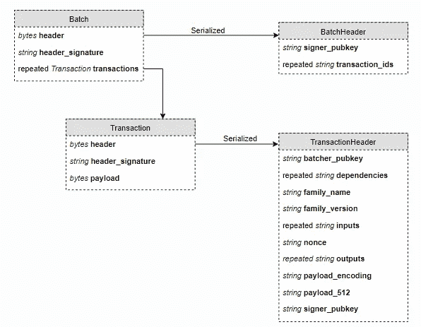

# 面向初学者的 Hyperledger 锯齿-事务和批

> 原文：<https://medium.com/coinmonks/hyperledger-sawtooth-for-a-beginner-transactions-and-batches-7c9cf444ecb5?source=collection_archive---------3----------------------->

source: [HLST docs](https://sawtooth.hyperledger.org/docs/core/releases/1.0/architecture/transactions_and_batches.html)

上图是 [Hyperledger 锯齿](http://sawtooth.hyperledger.org)架构中交易和批的每个字段的完整细分。

批次是系统中变化的的*原子单位。它是影响分类账状态的交易的集合。当一个批处理没有被完全处理时，其中的所有事务都会被暂停。这种结构简化了依赖机制，其中一个事务或一组事务需要验证前一个事务才能正常工作:那些具有相同或不冲突的依赖关系的事务一起进入一个批处理。*

两种结构遵循相同的正确格式原则；例如，它们都包含并且通过它们的报头细节的散列来寻址。它们还需要签名和验证，以确保其正确性。

如果你不知道在 [Merkle Tree](https://en.wikipedia.org/wiki/Merkle_tree) 结构中签名有什么帮助，下面是发生的事情:

*   数据是字段的集合，这些字段被加在一起，并通过算法转换成一个唯一的字符串，称为*散列*
*   可以利用散列中其他字段的知识来解密字段
*   更改底层数据会修改哈希
*   签名可以被验证为通过特定的公钥和特定的散列应用于散列

换句话说，所有内容都被序列化为这个唯一的字符串，该字符串经过签名以确保数据的可验证完整性。如果数据发生变化，签名的哈希解密将与原始哈希不匹配，我们就会知道发生了什么。

## 更多的绒毛

在依赖项和输入/输出下的文档中提供了一个非常酷的功能:

> 部分地址充当通配符，允许事务指定树的一部分，而不仅仅是叶节点。

这意味着可以通过指向树中较高位置的单个地址来检索一组给定的事务。

你可能不知道，但是锯齿波使用了一种独特的寻址格式。前 3 个字节-或 6 个字符-用于识别区块链的名称空间，然后后续的字符对指的是树中的下一个分支，直到到达树叶。

我发现这种格式在设计系统结构时特别容易使用。它非常直观，提供了一个可以简单缩放的模型。例如，系统可以按最大公约数对事务进行批处理，并将它们发送给指定的验证对等方。这通过在交易的网络范围内建立明确的责任划分简化了验证过程。

## 好了，现在怎么办

我将尝试这个框架，并试图结合我稀疏的编程知识，为公司创造有趣的解决方案。如果你对 entreprise 软件的开发过程感兴趣，特别是如果你喜欢看一个初学者穿过茂密的丛林动物，你会在这里有宾至如归的感觉。

反馈

**Click to read more Hyperledger Stories**