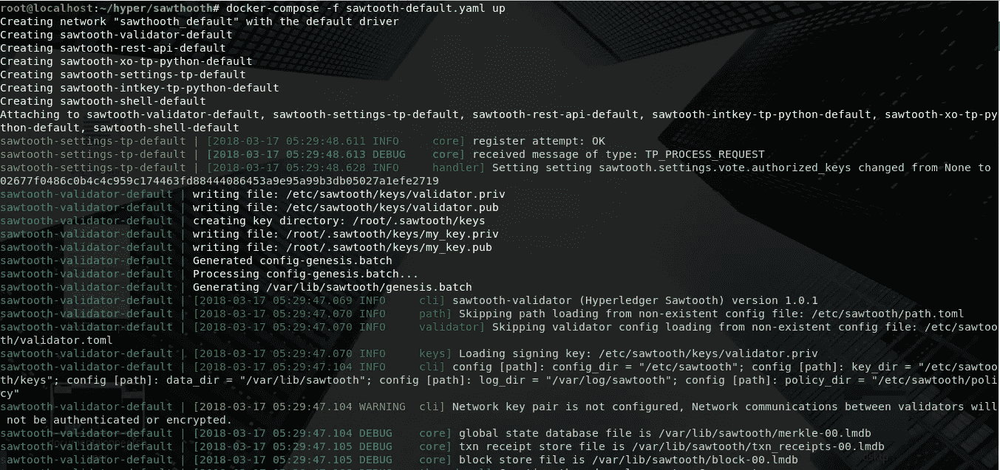
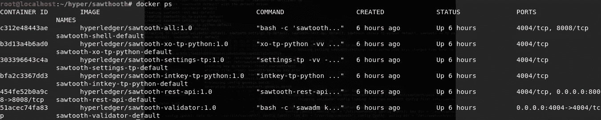
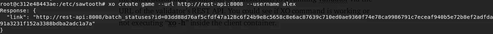
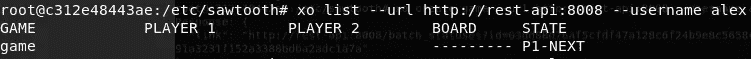
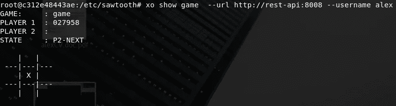
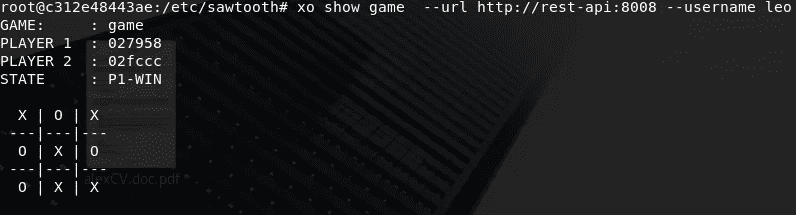

# 超级分类帐锯齿从零开始-第 1 部分

> 原文：<https://medium.com/coinmonks/hyperledger-sawtooth-from-scratch-part-1-52bd7b030838?source=collection_archive---------0----------------------->

## 在区块链玩井字游戏！！:)

# 放弃

本教程是对锯齿平台工作原理的一般性介绍。它没有深入解释锯齿波(比如它的底层加密等)。目前只有 Ubuntu 和 AWS 支持锯齿，所以我们将使用 docker，它便于我们部署锯齿，而不考虑底层系统的架构。

# 先决条件

## Windows 操作系统

为 Windows 安装最新版本的 [Docker 引擎。在 Windows 上，安装 Docker 引擎时会自动安装 Docker Compose。](https://docs.docker.com/docker-for-windows/install/)

## 马科斯

为 macOS 安装最新版本的 [Docker 引擎](https://docs.docker.com/docker-for-mac/install/)。在 macOS 上，安装 Docker 引擎时会自动安装 Docker Compose。

## Linux 操作系统

在 Linux 上，按照下列步骤操作:

1.  安装[码头引擎](https://docs.docker.com/engine/installation/linux/ubuntu)。
2.  安装[对接组件](https://github.com/docker/compose/releases)。

接下来，您必须下载 docker composer [文件](https://sawtooth.hyperledger.org/docs/core/releases/1.0.1/app_developers_guide/sawtooth-default.yaml)，它将支持在 docker 容器中部署锯齿网络。

**那我们开始吧:**

第一步:导航到下载 docker 文件的文件夹，运行下面的命令" **docker-compose -f 锯齿-default.yaml up** "。运行该命令后，您将看到 docker 容器正在初始化。

**提示**:你也可以通过输入“ **docker ps** ”命令来查看 docker 容器。

因为您已经在 Docker 容器中部署了锯齿，所以您需要登录到客户端容器来使用锯齿 cli。通过运行命令"**docker exec-it sawtoon-shell-default bash**"登录到客户端容器。一旦进入，您就可以访问锯齿 cli 命令。

您还可以通过运行"**curl http://rest-API:8008/blocks**"或者通过"**curl http://localhost:8008/blocks**"从主机检查连接性，以确认验证程序正在运行并且可以从 docker 容器内部到达。一旦您确定您的客户端容器可以访问 validater，接下来您创建两个用户来模拟两个玩家玩井字游戏。为此，您可以使用锯齿 cli 的 keygen 子命令，它会生成一个私钥文件和一个公钥文件，以便用户可以签署锯齿事务和批处理。

"**锯齿键根亚历克斯**"

"**锯齿克星狮子座**"

这些命令将创建两个名为“alex”和“leo”的用户。

要启动井字游戏，我们将使用“XO Cli”。这个 Cli 通过验证器的 REST API 的 URL 来处理事务的构造和提交到已经运行的验证器。要检查 XO 命令是否工作，请在客户端容器内执行“ **xo -h** ”。

现在开始一个游戏的 TIC-tak-toe run "**XO create game—URL**[**http://rest-API:8008**](http://rest-api:8008)**—username Alex**command*(****——****commands 中实际上是 2 个破折号(-)(不带空格)*。

现在使用“**xo list—URL**[**http://rest-API:8008**](http://rest-api:8008)**—用户名 alex** ”命令显示所有 XO 游戏的状态信息。

用户亚历克斯将采取第一步行动。运行命令“**XO take game 5—URL**[**http://rest-API:8008**](http://rest-api:8008)**—用户名 alex** ”。这会将井字格中的位置 5 标记为“X”。(网格空间从 1 到 9 编号。左上角是数字 1，右下角是数字 9。).要查看井字游戏网格，请使用 show sub 命令作为“**XO show game—URL**[**http://rest-API:8008**](http://rest-api:8008)**—用户名 alex** ”。

在这里我们可以看到关于游戏状态的所有信息。

对于玩家 2 来说，要在网格中标记他的空间，请运行与玩家 1 类似的 take sub 命令"**XO take game 6—URL**[**http://rest-API:8008**](http://rest-api:8008)**—用户名 leo** "。一旦玩家完成所有回合，您可以通过再次输入 show sub 命令查看游戏结果，“XO show game—URL[**http://rest-API:8008**](http://rest-api:8008)**—用户名 leo** ”。

不断重复不同位置的命令，并在玩家之间交替，最终你会找到胜利者。

这个小教程只是让你熟悉锯齿，在下一篇文章中我们会深入探讨。直到那时，继续编码和阅读。如果你想知道更多关于超级账本的信息，请继续。

请分享您的宝贵意见和评论…

谢谢…和平！！！

> [在您的收件箱中直接获得最佳软件交易](https://coincodecap.com/?utm_source=coinmonks)

