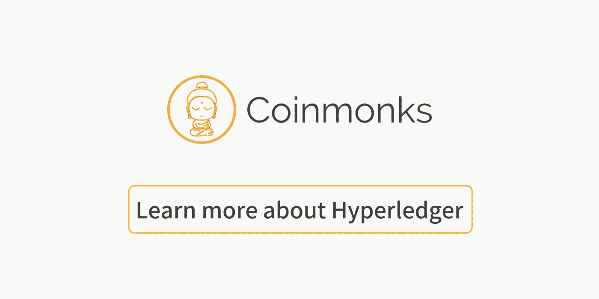

# 超分类帐锯齿:实际例子

> 原文：<https://medium.com/coinmonks/hyperledger-sawtooth-practical-example-980189e6a856?source=collection_archive---------0----------------------->

这个例子与解释织物的例子非常相似。和金枪鱼捕捞有关。我建议你参加 edx 课程。

## 后端安装

总结如何安装、启动和关闭此示例:

1.  下载锯齿的 [docker 实例](https://raw.githubusercontent.com/hyperledger/education/master/LFS171x/sawtooth-material/sawtooth-default.yaml)

**2。$ docker-compose -f 锯齿-default.yaml up**

3.在一个新的终端: **docker exec -it 锯齿-客户端-默认 bash**

4.检查 rest-api 是否可达:**curl**[**http://rest-API:8080/blocks**](http://rest-api:8080/blocks)

5.完成后，可以简单地使用:**$****docker-compose-f 锯齿-default.yaml down** 关闭实例

## Javascript 项目

该项目由两部分组成:交易处理器和客户端应用程序。

js project structure

## 交易处理器安装

在终端上运行事务处理器。

**$ cd 锯齿金枪鱼**
**$ cd 处理器**
**$ npm 安装
$ npm 启动**

## *客户端安装*

在另一个终端中运行客户端应用程序:

**$ cd 锯齿金枪鱼
$ cd 客户端**
**$ npm 安装**
**$ npm 运行构建**

最后，只需在您选择的任何浏览器窗口中打开**index.html**，即可启动客户端。

就是这样！您已经准备好推出应用程序。

> [直接在您的收件箱中获得最佳软件交易](https://coincodecap.com/?utm_source=coinmonks)

## 结论

该框架非常稳定、灵活且可扩展。我认为使用 Fabric 是 Hyperledger 中最有前途的框架。让我们等待未来，Hyperledger 可以用单个核心集成这一组框架，因此相互集成会更容易。

**Click more to read about Hyperledger**