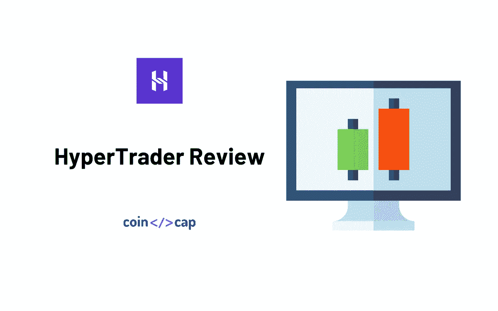
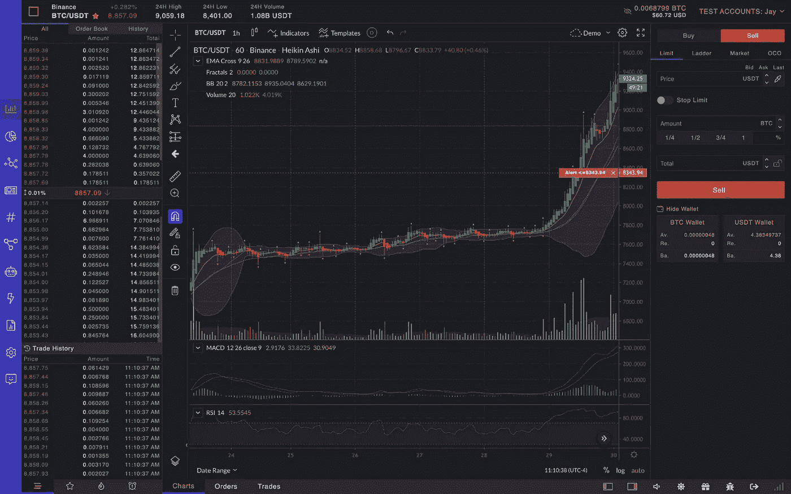
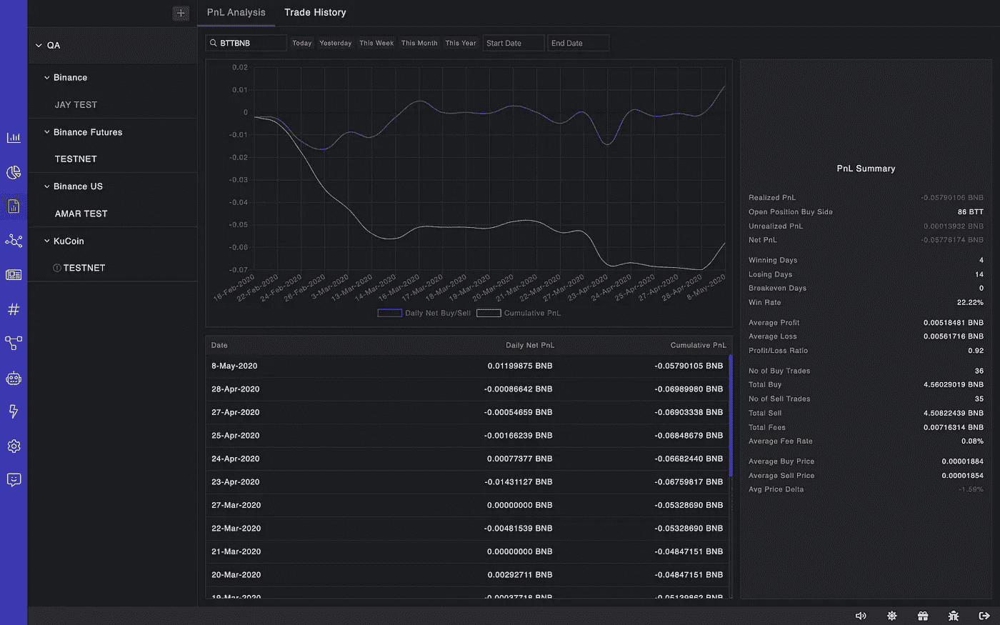

# 超级交易者评论——终极交易体验

> 原文：<https://medium.com/coinmonks/hypertrader-review-the-ultimate-trading-experience-93a44330f7ca?source=collection_archive---------2----------------------->

有没有想过为什么加密货币交易所不提供[高级交易工具](/coinmonks/whats-the-best-crypto-trading-bot-in-2020-top-8-bitcoin-trading-bot-c16adeb13317)？

事实上，在传统市场中，为交易提供工具并不是交易所的业务。交易所应该提供匹配引擎和交易相关数据。

然而，随着加密货币交易所采取的新方法，这种情况正在发生变化。

当然，交易所的首要任务仍然是为交易者提供匹配引擎和足够的流动性。

因此，即使他们通过自己的网站或原生应用程序提供交易平台，通常也只有基本的工具。大多数情况下，用户体验很糟糕。

这就是[超链接](https://hyperlinq.io/?utm_source=coincodecap)的用武之地。他们创建了一个漂亮的本机桌面应用程序，非常容易使用，并且包含了 exchanges 不提供的高级功能。

在这篇文章中，我们将回顾 HyperLinq 的原生桌面应用程序， [HyperTrader](https://hypertrader.app/?utm_source=coincodecap) ，它帮助加密货币交易者**更智能地组织，更好地分析，更快地交易。**

> 自 5 月 1 日起，折扣已改为 10%。

# 摘要

*   桌面应用程序
*   非常容易使用的[交易终端](https://coincodecap.com/category/multi-exchange-trading)
*   这个平台对于初学者和专业人士来说都非常好用。
*   您的交换密钥永远不会离开您的计算机，因此高度安全
*   最佳 UX 和直观界面

> 另请阅读:最佳加密交易机器人

# HyperTrader 功能

HyperTrader 有很多功能可以帮助提高交易者的交易效率。不管你是新手交易者还是专业交易者，你都需要这些增强的工具来跑赢市场。

以下是一些值得一提的优秀功能，它们让加密交易者的生活变得更加轻松:

*   将不同交易所的多个账户添加到相同的投资组合中。
*   跟踪这些投资组合中硬币的表现。
*   从同一交易所添加多个账户。
*   [TradingView](https://www.tradingview.com/) 图表集成。
*   分裂图表多达 4 个，并载入不同的硬币在同一时间。
*   根据图表交易。
*   更新实时订单，而不直接从图表中取消。
*   预订单类型。
*   图表上的盈亏平衡指标有助于减少亏损。
*   超快的数据更新。事实上，在某些情况下比交易网站更快。
*   通过详细的 PnL 分析，更深入地了解您的交易表现。
*   内置密码筛选程序

查看 HyperTrader 视频教程，了解如何在 HyperTrader 上设置限价止损单。了解下新订单并在需要时实时更新订单是多么简单。

除此之外，他们还有更多功能正在开发中，可在他们的[路线图](https://github.com/orgs/HyperLinqHQ/projects/9)中找到:

*   复制交易
*   信号市场
*   策略生成器
*   Bot 交易

他们目前整合了 6 个现货交易所，币安期货和 ByBit 等衍生品交易所即将成立。目前，可用的现货交易所有币安，币安美国，币安 JE，比特币基地专业，比特币基地总理，库币。

# HyperTrader 如何工作

*   [下载应用](https://hypertrader.app/?utm_source=coincodecap)，安装，输入你的邮箱。使用优惠券 **COINCODECAP** 获得 15%的折扣**。**
*   使用您的 API 密钥将您的帐户与一个受支持的交易所关联。一旦添加应用程序将自动获取您的所有数据，并准备 PnL 分析，跟踪您的投资组合，并打开位置。
*   一旦连接，您就可以开始管理您的订单和交易。你可以在这里阅读更多关于开始使用他们的[帮助文档。他们有一个优秀的](https://docs.hypertrader.app/getting-started)[产品指南](https://docs.hypertrader.app/)来引导你了解所有的功能。

> 自 5 月 1 日起，折扣已改为 10%。

# 用户体验

HyperTrader 最重要的一个方面就是它的易用性。即使你是交易新手，它直观的 UI 甚至不需要解释。

用户界面光滑、干净、简约。使用这个应用程序是一种享受，不像许多 HyperLinq 的竞争对手，如 Coinigy，不提供这样的用户体验。

你可以很容易地找到你需要的信息，这有助于你很快做出更好的决定。

真正突出的一点是您可以多快地更新现有的实时订单。所有未结订单都直接显示在图表上，您可以简单地上下拖动它们来更新价格。

另一个很好的例子是应用程序如何自动计算你的交易的盈亏平衡点，还包括费用。不要再把你的交易复制粘贴到 excel 表格上来计算在哪里平仓，这样你就不会亏损。这是一个节省时间和缓解压力的方法。

如果用户体验对你来说至关重要，像这样的功能使这个应用程序成为一个极好的选择。HyperTrader 确实帮助你更聪明地组织，更好地分析，更快地交易！

# 性能和安全性

那么，安全性如何呢？HyperLinq 的应用程序没有密码，使用电子邮件进行第二步身份验证。他们还计划使用 Google authenticator 或类似的应用程序来实现 MFA。他们加密所有静态和传输中的用户数据。你可以在这里阅读更多关于 HyperLinq 的安全性[。](https://docs.hypertrader.app/security)

我们在这篇评论的开头暗示了优越的性能。我们发现，在某些情况下，数据比交易所本身更快。

例如，币安 spot 的图表数据更新速度是币安网站的两倍。市价订单执行速度极快。

事实上，通过在图表上向上或向下拖动订单标记，您可以在一瞬间更新实时订单。

PnL 分析是准确和即时的。如果你买了一枚硬币，盈亏平衡指标会立即更新，还会显示费用，告诉你准确的开仓位置和零亏损的卖价。

# HyperTrader 与其他产品相比

市场上有许多类似的产品，允许你通过 API 连接到交易所，并[管理你的加密组合](https://coincodecap.com/category/portfolio-management)和/或管理订单。但是 HyperTrader 不一样。

他们不再一开始就优先考虑许多交换，而是关注可用性、效率和速度。

他们的设计简约而直观。他们不会给你过多你不需要的信息。它们没有太多的布局配置，这当然增加了用户体验的复杂性。

虽然其中一些对 HyperTrader 是有利的，但我们知道有些用户在某些情况下可能会有不同的想法，例如缺乏用户界面布局的定制，或者他们选择的 exchange 尚未集成。

对于 UI 布局和定制，很明显，HyperLinq 有自己的设计理念，我非常喜欢。关于交流，给它一些时间。

他们有 6 个现货交易所，两个衍生品交易所即将成立。这款应用相当新，仍处于测试阶段。我们都知道整合交易所需要时间。

HyperTrader 最大的优点之一是 PnL 分析。我还没有见过像 HyperTrader 这样分析你的交易的平台。你对自己的交易有了如此多的见解，这有助于你提高交易水平。

让 HyperLinq 在竞争中脱颖而出的是其卓越的客户服务。他们的实时聊天支持内置在应用程序中。

根据我们的经验，他们在实时聊天上的平均响应时间不到一分钟。他们不会让你发一封电子邮件，然后给你做鬼，因为这在其他公司相当普遍。

# 定价

HyperTrader 的订阅计划为每年每月 20.97 美元或每月 29.95 美元。你可以使用优惠券 **COINCODECAP** 享受八五折优惠。

> 自 5 月 1 日起，折扣已改为 10%。

# HyperTrader 的利弊

## 赞成的意见

*   专业级交易工具
*   易于配置
*   直观的界面
*   在 MacOS、Windows、Linux 上可用
*   高度安全，你的钥匙永远不会离开你的电脑

## 骗局

*   仅限台式机
*   路线图上仍有许多功能

# 结论

今天看来，HyperTrader 非常有前途，并期待着他们根据[路线图](https://github.com/orgs/HyperLinqHQ/projects/9)承诺的新功能。

显然，HyperLinq 不是第一家开发一体化应用程序来帮助多个交易所的加密交易员的公司，但事实上他们似乎是迄今为止最好的。我很期待他们在这里列出的[的高级订单类型。](https://docs.hypertrader.app/product-guide/order-types)

如果你想和其他交易者联系，HyperLinq 确实有一个不断增长的不和谐社区。值得一提的是，他们的客户支持令人惊叹不已。

至少值得一试！

[今天下载 HyperTrader](https://hypertrader.app/?utm_source=coincodecap) 并使用优惠券 **COINCODECAP** 获得 15%的折扣。

请在评论区告诉我们你对我们的 HyperTrader 评论的看法。

# 常见问题

**问【HyperTrader 有你的 app 的网页版吗？**

**答:**不，HyperTrader 没有我们应用的网页版。该团队认为，就实时数据的低延迟和更快的执行速度而言，桌面交易体验要优越得多。然而，一旦他们准备好了本地应用，他们就会考虑网络版。

**问【HyperTrader 有手机 app 吗？**

**A.** 没有，HyperTrader 还没有手机 app。该团队目前专注于桌面原生应用。

**问**HyperLinq 是交换吗？

**A.** HyperLinq 不是交易所。HyperLinq 提供许多桌面和移动应用程序来访问多个交易所，进行市场分析、交易、提醒、PnL 分析等等。HyperLinq 是一个 app 生态系统。

**问**HyperLinq 是加密货币经纪商吗？

**答:** HyperLinq 是一家构建交易系统的金融科技公司。他们不提供任何形式的经纪服务。

问:HyperLinq 收取交易佣金吗？

不，HyperLinq 对您的交易不收取任何佣金。他们只为你提供访问多个加密货币交易所的应用程序。当您在任何受支持的交易所进行交易时，您直接向交易所支付费用。

**问【HyperTrader 有交易机器人吗？**

交易机器人正在开发中，将于 2020 年晚些时候上市。

**问【HyperTrader 收费多少？**

**答:**是的，HyperTrader 的订阅计划是每年每月 20.97 美元或每月 29.95 美元。你可以使用优惠券 **COINCODECAP** 获得 15%的折扣。

# HyperTrader 替代品

1.  [Bitsgap](https://blog.coincodecap.com/go/bitsgap) ，满足您所有交易需求的一站式加密交易平台。它允许用户将他们所有的密码交易账户放在同一个屋檐下，通过一个集成的界面进行交易。阅读我们的 [Bitsgap 评论](/coinmonks/bitsgap-review-a-crypto-trading-bot-that-makes-easy-money-a5d88a336df2)。
2.  [Quadency](https://blog.coincodecap.com/go/quadency) ，2018 年推出的密码交易自动化平台。它给你带来了一个更聪明的方式来交易和管理你的密码。阅读我们的[季度回顾](https://blog.coincodecap.com/quadency-review-a-crypto-trading-automation-platform)。
3.  HaasOnline 是最古老、最有声望的密码自动交易公司之一。他们的卓越声誉来自于他们的[交易自动化软件](https://coincodecap.com/category/trading-automation)，该软件自 2014 年以来一直为加密交易员执行交易策略。阅读我们的[哈森在线评论](/coinmonks/haasonline-review-d8d1a3400419)。

**同样，请阅读**

*   [最佳加密交易机器人](/coinmonks/whats-the-best-crypto-trading-bot-in-2020-top-8-bitcoin-trading-bot-c16adeb13317)
*   最好的比特币[硬钱包](/coinmonks/the-best-cryptocurrency-hardware-wallets-of-2020-e28b1c124069)
*   最好的[加密税务软件](/coinmonks/best-crypto-tax-tool-for-my-money-72d4b430816b)
*   [最佳加密交易平台](/coinmonks/the-best-crypto-trading-platforms-in-2020-the-definitive-guide-updated-c72f8b874555)

> [直接在您的收件箱中获得最佳软件交易](https://coincodecap.com?utm_source=coinmonks)

*原载于 2020 年 6 月 24 日 https://blog.coincodecap.com***。**