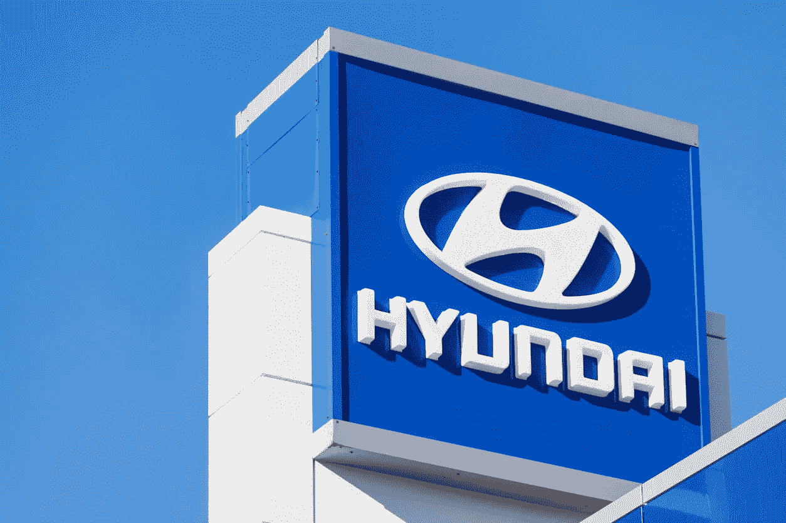

# 现代的 Hdac 推出 DApp /义大利的 Banca Sella 开放比特币交易至 120 万/中国推出全国区块链网络

> 原文：<https://medium.com/coinmonks/hyundais-hdac-launches-dapp-italy-s-banco-sella-opens-bitcoin-trading-to-1-2-cc685eeaa7be?source=collection_archive---------1----------------------->

[Source](https://cryptonews.com/news/hyundai-blockchain-subsidiary-hdac-launches-first-dapp-on-it-6061.htm)

*2020 年 3 月 25 日*

*本周在风景线上，* ***现代*** *区块链子公司，* ***Hdac*** *已经发布了第一个 DApp，并补充说一个“区块链驱动的交易平台”将紧随其后。* ***意大利*******Banco Sella****推出了比特币(BTC)交易服务，通过该银行的炒作平台，向 120 万意大利人提供用加密货币支付商品和服务的能力。* ***中国*** *在 100 个城市推出全国区块链网络，同时值得注意的是* ***中国央行*** *离发行其数字货币又近了一步。* ***阿根廷*** *的国家天然气监管机构****Gasnor****获准试点一个基于合同的智能认证平台，希望成为阿根廷整个天然气分销生态系统的通用数据库。在最高法院做出允许银行为加密公司提供服务的决定后，币安已经为区块链的初创公司设立了 5000 万美元的基金。正如许多正在远程工作的人一样，请欣赏这份由***提供的 8 个必备软件工具及其**web 3**【表兄弟】*解密* *。* ***丰田*** *透露了其自 2019 年 4 月以来一直在探索汽车行业区块链应用的区块链实验室。* ***比特币基地钱包*** *让通过 DeFi apps 赚取利息变得更加容易。***YGC 宣布启动工作室。* ***两院制企业*** *给我们带来了对不断发展的 Web3 商业模式的见解，****block stack****讨论了 Web3 如何解决数据垄断的挑战&滥用隐私，我们了解了* ***陶瓷协议*** *以及* ***心材祝你一周愉快！尽情享受吧！*******

****奖金*** *:我最近发布了最新的 Q1 2020 版 my* [*区块链版图*](https://www.linkedin.com/posts/kyleellicott_q12020-blockchain-landscapekyleellicotttopionetworks-activity-6638879840634310656-UNtB) *(包含在下面供下载)，它提供了一个行业概述，突出了 900 多家全球公司、风险基金和工作组。如果这是你看到的第一个版本，就把它当作你在这个行业中进一步导航的路线图。在这里获得高分辨率的免费！**

## *📈[现代区块链子公司 Hdac 在其 Mainnet 上推出首个 Dapp](https://cryptonews.com/news/hyundai-blockchain-subsidiary-hdac-launches-first-dapp-on-it-6061.htm)*

*现代区块链子公司 Hdac 在其区块链网络 Mainnet 上发布了第一个去中心化应用程序(d app)，并补充说“区块链驱动的交易平台”将紧随其后。DApp 由 Levoist 开发，它将允许粉丝从他们最喜欢的艺术家那里众筹音乐项目，并购买歌曲的数字版权份额。两家公司都希望通过在 Hdac 上推出暂定名为 WeXDaq 的“区块链交易平台”来推进其下一步的运营，交易将在 Hdac 币(HDAC)中进行……[阅读更多信息](https://cryptonews.com/news/hyundai-blockchain-subsidiary-hdac-launches-first-dapp-on-it-6061.htm)*

## *📈[意大利银行在封锁期间向 120 万人开放比特币交易](https://cointelegraph.com/news/italian-bank-opens-bitcoin-trading-to-12-million-during-lockdown)*

*意大利 Banca Sella 推出了比特币交易服务。交易通过银行的宣传平台进行，银行作为中介来减轻加密货币交易所的潜在安全风险。近 120 万意大利人已经使用 Banca Stella 的宣传进行交易，他们不仅可以购买和出售比特币(BTC)，还可以用加密货币支付商品和服务。客户不需要额外的文件或了解你的客户的要求就可以进行任何与比特币相关的活动。总部位于米兰的初创公司 Conio 也宣布，他们将在 Hype 平台上提供额外的比特币钱包，以及购买/出售和安全保管数字资产……[阅读更多](https://www.coindesk.com/figure-technologies-securitizes-150m-of-home-equity-loans-on-blockchain)*

**相关:* 🇨🇳 [中国在 100 个城市启动全国区块链网络](https://spectrum.ieee.org/computing/software/china-launches-national-blockchain-network-100-cities)*

## *📈[阿根廷天然气监管机构与 RSK 理工大学合作打造绿色产业区块链](https://www.coindesk.com/argentinas-gas-regulator-greenlights-industry-blockchain-built-with-rsk-tech)*

*阿根廷国家天然气监管机构已批准 gas nor(IOV 实验室和软件开发商 Grupo Sabra 的区块链许可平台)试点一个基于合同的智能认证平台。Grupo Sabra 的联合创始人佩德罗·佩罗塔(Pedro Perrota)表示:“如今，当你想为一个家庭或一家公司认证一个新的燃气连接时，你需要发送许多文件，并且需要长达 3 个月的处理时间。“他们使用区块链来证明不同的步骤，”IOV 实验室首席执行官迭戈·古铁雷斯说。“他们向参与该过程的每个专业人员提供私钥，因此他们使用这个共享系统来完成认证工作。”Gasnor 的共享生态系统可以促进任何数量的服务。该公司希望成为阿根廷整个天然气分销生态系统的公共数据库，面向所有九家受监管公司……[阅读更多信息](https://venturebeat.com/2020/03/10/zynga-cofounder-creates-blockchain-game-partners-for-decentralized-gaming/)*

## *📖[去中心化的互联网](https://hbr.org/podcast/2020/03/the-decentralized-internet)*

*在播客中，[mune EB Ali](https://medium.com/u/8dd3ab013f82?source=post_page-----cc685eeaa7be--------------------------------),[block stack](https://medium.com/u/19349106268a?source=post_page-----cc685eeaa7be--------------------------------)的联合创始人兼首席执行官，讨论了新兴的 Web 3.0 如何解决数据垄断&滥用隐私的挑战，并让用户对他们的数字生活有更多的控制权。该播客涵盖了应用生态系统的出现以及新的加密经济的作用。… [阅读更多信息](https://hbr.org/podcast/2020/03/the-decentralized-internet)*

**相关:📖* [*陶瓷协议简介*](/ceramic/introduction-to-the-ceramic-protocol-8d56951ae3f)*[*迈克尔塞纳*](https://medium.com/u/fc3b0ec804e?source=post_page-----cc685eeaa7be--------------------------------)**

> **👉与 [MaxDapp](https://medium.com/u/d123a5d6e54e?source=post_page-----cc685eeaa7be--------------------------------) 一起参加下周 4 月 1 日的 [AMA 会议](https://twitter.com/EOSDT/status/1242874986676785152?s=20)，我们将讨论 DApps、区块链、DeFi 等一切！**

## **💸[币安推出 5000 万美元的“区块链”基金](https://www.coindesk.com/binance-launches-50m-blockchain-for-india-fund)**

**在印度最高法院做出允许银行为加密公司提供服务的决定后，币安及其当地子公司成立了一只 5000 万美元的基金，以重振区块链初创公司的增长。它将对股权和象征性收购进行投资。币安基金对帮助印度发展完整的加密市场基础设施特别感兴趣。这可能包括菲亚特网关、汇款平台、stablecoin 解决方案和分散金融(DeFi)的新应用。该基金将投资 10 万至 500 万美元。新基金将与其他目标相同的本地基金进行合作和共同投资……[阅读更多信息](https://www.coindesk.com/binance-launches-50m-blockchain-for-india-fund)**

## **🖼️ [Winklevoss 双胞胎推出区块链数字艺术市场](https://www.bloomberg.com/news/articles/2020-03-17/winklevoss-twins-launch-a-marketplace-for-blockchain-digital-art)**

**来自文克莱沃斯双胞胎的初创公司 Nifty Gateway 将推出一个 nifties 市场，这种可交易的数字艺术可以卖到数千美元。该网站将允许消费者购买和销售艺术家的数字收藏品，包括迈克尔·卡根和莱尔·奥维尔科。据预测，这个市场最终将与艺术品、收藏品、游戏和数码产品的总和一样大……[阅读更多](https://www.forbes.com/sites/michaeldelcastillo/2020/03/08/morningstar-rates-first-ethereum-debt-security-in-40-million-fatburger-deal/)**

## **🚘[丰田历经 11 个月研究揭示区块链实验室](https://cointelegraph.com/news/toyota-reveals-blockchain-lab-after-11-months-of-research)**

**丰田汽车与丰田金融服务公司合作，推出了由六家丰田集团公司组成的[丰田区块链实验室](http://Toyota Blockchain Lab)。该公司成立于 2019 年 4 月，旨在利用区块链开发一个环境，让用户可以更开放、更安全地与为他们提供服务的公司联系。据报道，该实验室一直在开展调查研究和开展试验项目，其中一个阶段于 2019 年 11 月完成。确定的主要应用领域是客户和车辆验证、供应链监控和资产数字化。此外，该实验室计划在全球范围内加速各种现有区块链平台的社交实现… [阅读更多信息](https://cointelegraph.com/news/toyota-reveals-blockchain-lab-after-11-months-of-research)**

## **🏥[研究称，区块链可为制药行业节省 1.8 亿美元](https://cointelegraph.com/news/blockchain-can-save-pharmaceutical-industry-180-million-study-says)**

**UCLA Health and LedgerDomain 公布的一项研究表明，区块链技术每年将为美国制药行业节省超过 1 . 8 亿美元。该公司的创始人兼首席执行官在 Hyperledger Global Forum 的一次采访中强调，美国 17%的处方药分配不当，不符合 DSCSA 的新标准。为了解决这一问题并检测假冒处方药，LedgerDomain 与 UCLA Health 合作，在位于美国最繁忙的医院之一的一家药房内应用 DSCSA 要求… [阅读更多信息](https://www.coindesk.com/the-tokenization-delusion)**

# **本周的更多内容:**

**📈[信托谱](https://multicoin.capital/2020/03/24/trust-spectrum/)来自 [Multicoin Capital](https://medium.com/u/1ac059405a76?source=post_page-----cc685eeaa7be--------------------------------)**

**📈[远程工作:8 个基本软件工具及其 Web3 表兄弟](https://decrypt.co/23345/working-remotely-8-essential-software-tools-and-their-web3-cousins)**

**🇨🇳 [中国央行离发行数字货币又近了一步](https://www.theblockcrypto.com/post/59671/chinas-central-bank-is-one-step-closer-to-issuing-its-digital-currency-report)**

**📖[3 月 12 日:](https://multicoin.capital/2020/03/20/march-12-the-day-crypto-market-structure-broke-part-2/) [Multicoin Capital](https://medium.com/u/1ac059405a76?source=post_page-----cc685eeaa7be--------------------------------) 的[凯尔·萨马尼](https://medium.com/u/2e8de4ec5cc0?source=post_page-----cc685eeaa7be--------------------------------)打破密码市场结构的一天(下)**

**📖[介绍心材，下一个主要的 Zcash 升级](https://messari.io/article/introducing-heartwood-the-next-major-zcash-upgrade)**

**📖 [YGC](http://ygcdata.com/) [宣布工作室启动](https://news.yahoo.com/ygc-announces-startup-studio-rapidly-163700055.html)**

**📖[‘能下放的都下放’6 年后](https://www.coindesk.com/anything-that-can-be-decentralized-will-be-decentralized-6-years-later)**

**📖[卡尔达诺师爷的去垢溶液灵感来自希腊神话](https://decrypt.co/23487/cardano-touts-scaling-solution-inspired-by-greek-mythology)**

**📖 [Balancer Labs 筹集 300 万美元以增加可编程流动性](/balancer-protocol/balancer-labs-raises-3m-to-supercharge-programmable-liquidity-8f1a42323c78)费尔南多·马丁内利**

# **分散式应用程序手表**

## **📖[为 5000 万用户打造的 Dapps 关于 ICON](https://www.dapp.com/article/dapp-com-list-icon) 你应该知道的 8 个案例**

**经 ICONcommunity 批准，Dapp.com 正式将 ICON 区块链作为第 12 个区块链，并成为第一个与 ICON 区块链合作的 dapp 分析平台。Dapp.com[关注的图标区块链的标志性用例有 MyID，政府的第一个区块链用例，ICONbet，VisitMe，Broof，Somesing，STAYGE 和 ICON Vote。目前，有 7 个图标 dapps 已经在主网上推出…](https://medium.com/u/52849c27fcd5?source=post_page-----cc685eeaa7be--------------------------------) [阅读更多](https://www.dapp.com/article/dapp-com-list-icon)**

## **📖你认为隐私法会阻止监控资本主义吗？你不知道谷歌**

**如今的商业模式，用户拥有最少的隐私设置，通常是最有利可图的。从根本上说，投资者对不断增长的季度收益的期望永远无法与当今科技巨头引领的真正“私人”未来相提并论。我们需要更丰富的数据来制造更好的算法和更多的虚拟空间，以促进更深入、自主的数字交互，而不是在不修复底层范式的情况下获得更多隐私。这里有三个关键的基础设施，它们可以像一种机制一样产生大量的新数据；一套数字工具、产品和算法，以及“数据供应链”机制……[阅读更多](https://www.coindesk.com/think-a-privacy-law-will-stop-surveillance-capitalism-you-dont-know-google)来自[两院制风险投资](https://medium.com/u/2e1d9bbe8764?source=post_page-----cc685eeaa7be--------------------------------)**

**📖[如何通过](https://blog.bancor.network/guide-how-to-create-an-eos-liquidity-pool-on-xnation-45032c4fac6b) [Bancor](https://medium.com/u/2bd55d9e5fb5?source=post_page-----cc685eeaa7be--------------------------------) 在 xNation 上创建 EOS 流动性池并为其提供资金**

**📖 [ZenGo 警告 DApp 钱包存在重大安全漏洞](https://cointelegraph.com/news/zengo-warns-of-major-security-flaw-among-dapp-wallets)**

**📖 [Uniswap 宣布其下一代产品，计划在 Q2 推出](https://www.theblockcrypto.com/post/59630/uniswap-announces-its-next-iteration-set-for-launch-in-q2)**

**📖[比特币基地钱包](https://medium.com/u/beeba73b6047?source=post_page-----cc685eeaa7be--------------------------------)**

# **🎙️区块链工业状况 2020 年第一季度:**

***现已发售，下载你的高清副本****【Q1】2020****版* [*区块链景观图*](https://www.linkedin.com/posts/kyleellicott_q12020-blockchain-landscapekyleellicotttopionetworks-activity-6638879840634310656-UNtB) *。这是我现在发布的第五版景观，包括****747****家公司(* ***900 多家独特公司*** *包括更广泛的关键生态系统参与者)和超过***2010 年至 2020 年在整个景观中筹集的超过 220 亿美元资金**——自 2010 年以来投资超过 180 亿美元—出现明显的循环，并有完整的分解。****

***一个完整的 60 分钟的景观概述视频现在可以在* [*这里*](https://www.topionetworks.com/markets/blockchain-landscape-5bf43854b9abe4633c1f87da) *免费获得。在视频中，我对 2020 年的前景进行了细分，提供了 2019 年的总结、2020 年的新兴趋势、DeFi、Libra、CDBCs、Stablecoins、DApps 等等！***

****

**Source: [Topio Networks](https://www.topionetworks.com/markets/blockchain-landscape-5bf43854b9abe4633c1f87da)**

> ***👉下载新的* [*区块链基础设施景观 Q1 2020*](https://s3.amazonaws.com/spoke-profiles-prod-assets/uploads/d21d960161f92e629f68bf78b3d148743e4b3f49/original/Blockchain_Landscape_Q1_Feb2020_KyleEllicott.pdf?utm_source=pdf&utm_medium=email&utm_campaign=kyle) *版，了解关于 DeFi、DApps、基础设施、数字货币等的见解！***

**不想等到下周，[现在就订阅](http://click1.m.readwritelabs.com/xsdqkbbrgsdtqkmntpjlstcnkytvpvphsnhsqlvbrhhd_yfqbfcmslnskglmckvqv.html?source=post_page---------------------------)📥有关区块链、DApps 等的实时行业见解！**

> **[直接在您的收件箱中获得最佳软件交易](https://coincodecap.com/?utm_source=coinmonks)**

********