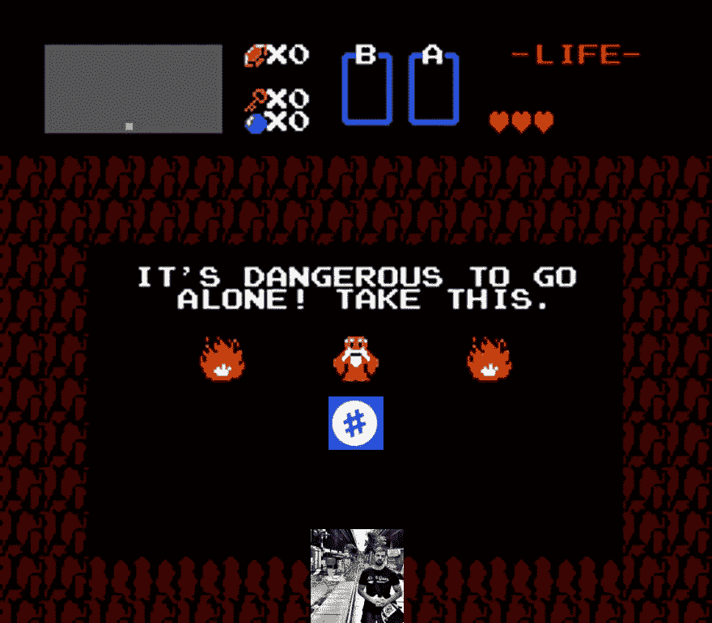

# 我从一个标签注册处买了一个 NFT

> 原文：<https://medium.com/coinmonks/i-bought-an-nft-from-a-hashtag-registry-9d74e6ebb2d9?source=collection_archive---------4----------------------->

Meme by me. Wise NPC provided by the Legend of Zelda.

# NFT 购物之旅

一个人去很危险。

想到这里，我不禁暗自发笑，但这句摘自 1986 年经典电子游戏《塞尔达传说》的话，是在我阅读一位职业熟人的留言时突然出现在我脑海中的。这一切都始于他在网上发布的一份声明: