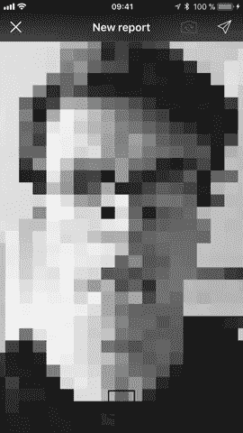
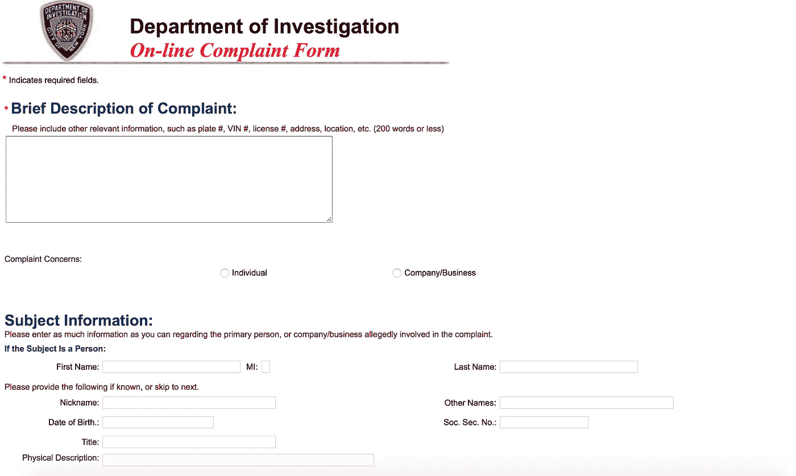
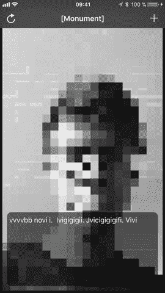
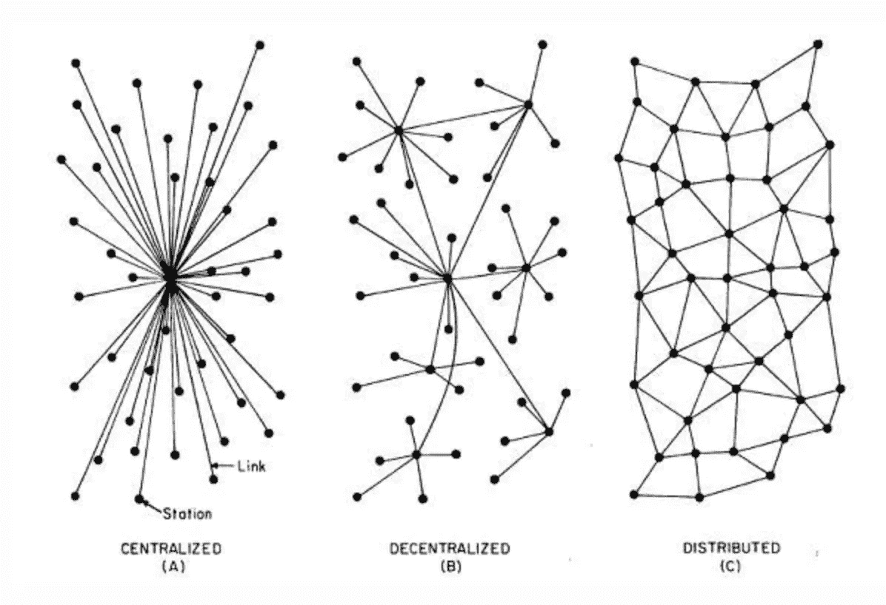

# 我在以太坊和 IPFS 上面建了一个 app，用来反腐

> 原文：<https://medium.com/coinmonks/i-built-an-app-on-top-of-ethereum-and-ipfs-to-fight-corruption-a2401c133e87?source=collection_archive---------2----------------------->

Introducing [Monument] — Corruption reporting app built on top of Ethereum and IPFS

# 腐败的根源

Andreas Antonopoulos 在他关于*隐私、身份、监控和金钱*的精彩演讲中，概述了基于等级原则的有缺陷的制度/组织设计。随着时间的推移，权力倾向于在这些机构/组织中积累，它们变得更加集中，随着权力的集中，腐败随之而来。

[Andreas Antonopoulos](https://antonopoulos.com) on *Privacy, Identity, Surveillance and Money*

安德烈亚斯还指出，这些权力结构的产物(腐败是其中之一)并不平等。在大多数情况下，它们实际上是限制性的(我还要加上破坏性的)。他们正在传播本土主义、民族主义、部落主义、阶级结构，从而使世界变得更小。

根据等级原则建立的权力结构缺乏问责制和透明度，导致腐败泛滥。另一方面，这些权力结构要求我们为了安全、打击恐怖主义或能够使用它们的服务而放弃我们所有的隐私。

# 我们如何解决这个问题？

如果我们互换角色呢？如果不是几十万人看着 75 亿人，而是 75 亿人盯着看(正如安德烈亚斯指出的那样)，会怎么样？他的想法正好相反[圆形监狱](https://www.theguardian.com/technology/2015/jul/23/panopticon-digital-surveillance-jeremy-bentham)。解决权力结构不透明性的一个方法是打破其秘密，为腐败举报者和泄密者提供一个灵活、分布式、透明、开源和安全的举报渠道。

**【纪念碑】**正是如此。

# 现在外面有什么？

现有的腐败报告工具落后于当前的 UX 趋势，而且报告本身通常不能被所有可能受类似腐败案件影响的人访问和公开。你无法直接搜索你所在地区、国家或公共机构的腐败报告。

Source: [New York City’s Inspector General corruption repot form](https://a032-secure.nyc.gov/ofcomplaint.html)

**【Monument】**正在将腐败举报引入一款带有 UX 的手机应用，用于类似于 Instagram Stories 的故事讲述。其背后的想法是将腐败案件公开给公众，在那里可以讨论、分享并容易被发现。所有这些都是通过匿名记者和隐藏他们的真实身份来完成的。

[Monument] — UX for browsing corruption reports based on Instagram Stories

# 为什么是以太坊和 IPFS？

腐败报告服务需要随时可用。它必须对政府的攻击和禁令免疫。系统需要能够是不可感知的，其内容应该是永久的。

这些类型的系统特征可以在最新的、最先进的分布式系统中找到。更具体地说，区块链(即[以太坊](https://ethereum.org))和分布式文件系统(即 [IPFS](http://ipfs.io/) )。

> **以太坊**是一个运行智能合约的**分散平台:应用程序完全按照编程运行，没有任何停机、审查、欺诈或第三方干扰的可能性。**

**【Monument】**利用以太坊的智能合同及其区块链技术来存储腐败报告的元数据(标题、描述、时间戳、上下投票、标签，但不是实际的视频内容)。它的[智能契约公开了简单的 API](https://github.com/bdjukic/monument/blob/master/ReportManager.sol) ,用于创建新报告、列出现有报告以及基于特定查询搜索报告。

视频内容本身由 IPFS 托管。

> ***IPFS*** *是一个分布式文件系统，它试图用相同的文件系统连接所有的计算设备。*

随着视频内容上传到 IPFS，唯一的散列(标识符)被分配给它。该散列随后被存储为以太坊上相应损坏报告的元数据。

通过使用 IPFS，**【Monument】**试图避免[HTTP](https://blog.neocities.org/blog/2015/09/08/its-time-for-the-distributed-web.html)中一个有根本缺陷的设计，即内容所有权和分发的集中化。这意味着，在政府或任何其他组织试图删除腐败报告内容的情况下，不存在单点故障。只要有足够数量的节点能够传播内容，系统本身就能抵御这类攻击。

We want to move away from centralised to more distributed content distribution to gain on resiliance — [source](https://blog.neocities.org/blog/2015/09/08/its-time-for-the-distributed-web.html)

IPFS 节点可以由关注腐败的非政府组织主持，也可以由热情的个人主持，他们在自己的国家非常关心这个问题。

如果你需要一个分布式 web、以太网和 IPFS 的快速入门之旅，我建议你看看 Siraj 的视频:

A Guide to Building Your First Decentralized Application

# 最后的想法

**【Monument】**处于原型阶段，其最初目的是测试新分布式范例的潜力，该范例旨在打破构建服务的传统方式，并产生社会/政治影响。

未来的一些改进可能包括:

1.  声音修改(除视频像素化之外，增加失真)
2.  能够对特定报告进行投票表决
3.  为社交媒体增加快速分享功能
4.  添加评论功能
5.  通过应用程序用户界面显示报告搜索
6.  创建可用于运行 IPFS/以太坊节点的 Raspberry Pi 映像，以改进内容的播种

> [在您的收件箱中直接获得最佳软件交易](https://coincodecap.com/?utm_source=coinmonks)

如果你觉得这是一个有趣的阅读，并希望看到**【纪念碑】**的进一步发展，你的提示非常受欢迎:

ETH:**0x 8980154 C5 c 6 ddf 1 C1 f 759 F7 D7 b 7 e 69 BD 903231 c 9**
BTC:**32 svvk5 bpk ZF 994 wp85 scsna 12 S5 vv mth**

如果您对**【Monument】**如何在幕后工作感兴趣，或者您想为该项目做出贡献，您应该查看:

 [## bdjukic/纪念碑

### 纪念碑-腐败报告工具建立在以太坊和 IPFS 之上

github.com](https://github.com/bdjukic/monument) 