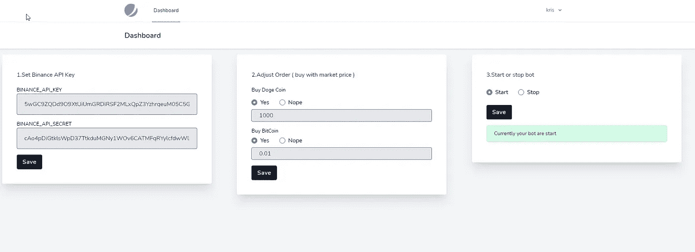
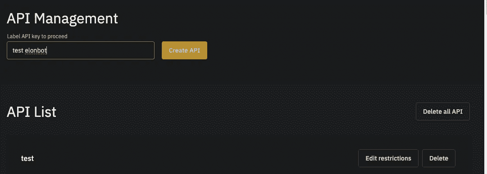
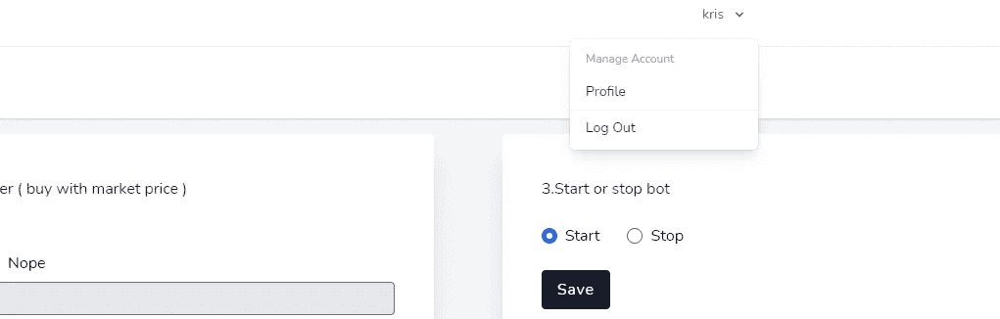

# 我根据埃隆·马斯克的推文创造了一个机器人，它将帮助你购买多吉或 BTC

> 原文：<https://medium.com/coinmonks/i-create-bot-that-help-your-buy-doge-or-btc-after-elon-musk-made-tweet-e0fddcf7a54e?source=collection_archive---------2----------------------->

> 这个帖子包含了很多附属链接，因为我推荐的所有工具都是运行机器人所必需的，并提供了一个简单的间接方式来资助项目，而无需向最终用户收费

现在，我们不需要等待埃隆·马斯克发微博。我们特别期待 Elon Mush 在推特上发布一些关于加密货币或公司的消息，这样它在市场上的价值就会上升。

为什么我们不创建一个机器人来分析埃隆·马斯克的推文，并通知我们有关推文的信息？

这个机器人相当简单。有两个方面:服务器端和客户端。

服务器端工作在主动模式。它会监控埃隆·马斯克的推文，当检测到推文包含一些 Doge 或比特币单词的暗示时，就会向客户端发送买入信号。

客户端工作在被动模式。它在 Doge 或比特币上等待来自服务器的信号，以便客户端可以分析这些信息。最后，客户可以决定购买哪种硬币。

下面的流程图展示了客户端和服务器端的确切解释:

## 限制…

目前，只有美国人民支持币安。

请订阅此电子邮件列表，并使用我的推荐链接注册到 [Gate.io](https://www.gate.io/signup/3265513) 或[比特币基地](http://coinbase-consumer.sjv.io/gbbRm2)。

# 路标

1.  从推文中只检测 Doge 或比特币单词。(**已经搞定**)
2.  在未来市场购买。(**尚未完成**)
3.  从推文图片中检测 Doge 和比特币标志。(**在列车模型**的途中)
4.  对股票进行情绪分析。仅适用于居住在美国的可以使用[羊驼](https://alpaca.markets/)或[罗宾汉](https://robinhood.com/)的人。(**还没有开始，只有美国人受益的功能可能会保留在一个付费计划**

# 如果您有任何疑问…

你可以加入我们的[脸书小组](https://www.facebook.com/groups/261805308872238\)并提问。

现在，如果您想开始实现 bot，请遵循以下步骤中提供的说明:

# 为客户端设置服务器

为了在服务器上运行机器人，我们需要一个便宜的服务器。为此，我推荐 Cloudways，因为他们提供每月 10 美元的 VPS 服务器。

定价计划如下图所示:

首先，我们需要进入注册页面进行注册，如下图所示:

然后，我们需要设置密码，如下图所示:

注册成功后，我们将被重定向到仪表板屏幕。在仪表板中，我们需要更改指定您的应用程序、服务器和项目的字段，如下图所示:

然后，我们需要选择 Laravel 作为服务器应用程序，如下图所示:

现在要创建一个新的服务器实例，我们需要按照下面的屏幕截图选择服务器的大小和位置:

在这里，我们可以看到我们每小时和每月收取多少费用。

接下来，我们只需点击 **LAUNCH NOW** 按钮，如下图所示:

发射操作需要一些时间。因此，我们可能需要等待大约 5 分钟来完成设置过程:

成功设置后，我们将访问服务器控制面板，如下面的屏幕截图所示:

接下来，我们需要进入**设置&包**菜单，选择**高级**选项卡，如下图所示:

现在，我们需要向下滚动同一个选项卡，并通过 IP 启用**访问应用程序，如下图所示:**

最后，我们需要**保存更改**，如下图所示:

现在，我们需要去设置我们的机器人。为此，我们需要进入**应用**选项卡，如下图所示:

我们可以在下面看到我们的空白应用程序:

现在，我们需要通过 Git 从侧边栏进入**部署，如下图所示:**

这里，我们需要点击**生成 SSH 密钥**，如下图所示:

## 在 GitHub 上注册以自动更新机器人

对于本教程，我选择在 GitHub 上托管源代码。这将使服务器更容易升级。

此外，请确保您有一个 GitHub 帐户。如果没有，您可以按照下面截图中的指示进行注册:

在 GitHub 中注册过程很简单，我们只需要按照下面截图中的指示填写凭证:

通过电子邮件成功注册后，我们需要进入帐户设置并导航至 **SSH 和 GPG 密钥**选项卡，如下图所示:

然后，我们需要点击**新的 SSH 键**，如下图所示:

现在我们需要回到 Cloudways 并点击**查看 SSH 密钥**标签。在这里，我们可以获取 SSH 密钥并将其添加到 GitHub 中。获取密钥的确切位置如下图所示:

在 SSH 密钥对话框中，我们需要复制 SSH 密钥:

然后，我们需要将 SSH 密钥粘贴到 GitHub，如下图所示:

接下来，我们需要回到 Cloudways，将机器人 URL 添加到[git@github.com](mailto:git@github.com):Kris snawat/elon bot _ client . git

然后，我们需要点击**拉动**按钮，如下图所示:

现在，如果一切正常，那就意味着下载成功了。

现在我们的下一步是设置机器人。为此，我们需要一个名为[安全外壳应用](https://chrome.google.com/webstore/detail/secure-shell-app/pnhechapfaindjhompbnflcldabbghjo/related?hl=en)的 Chrome 扩展。我们可以简单地从 Chrome 浏览器中在 google 中搜索并添加它。

成功安装后，我们可以点击**启动应用**，这将把我们重定向到以下屏幕:

这里，我们需要粘贴用户名和服务器 IP 地址。

但是首先，我们需要知道从哪里获得这些凭证。

为此，我们需要进入我们的应用程序，如下图所示:

如果我们在应用程序中导航，我们会看到在下面的屏幕截图中突出显示的凭据:

现在，我们可以连接并访问内部服务器，如下面的终端屏幕截图所示:

下图显示了服务器的终端:

接下来要做的是在终端中运行一些命令。我们需要执行`**composer install**` **。**

执行成功后，我们需要运行`**nano .env**` 命令，如下图终端截图所示:

现在在。env 文件，我们需要更新数据库凭据，如下图所示:

现在，我们需要返回到 Cloudways dashboard，在那里我们需要找到 DB 名称、用户名和密码。我们只需要在。环境文件:

完成后，我们需要点击`CTRL+X`来保存，如下图所示:

接下来，我们需要执行下面代码片段中显示的命令:

`php artisan migrate --seed`

下面的屏幕截图显示了该命令在终端中的具体执行情况:

因此，我们现在已经完成了安装。我们可以通过 Cloudways 仪表盘中的 URL 访问我们的应用程序:

如果我们导航到该 URL，我们将被重定向到登录页面。但是首先，我们需要按照下图中的指示进行注册:

我们需要输入我们的凭证并点击**注册**按钮:

注册成功后，我们需要执行以下任务:

1.  在币安上查找并创建 API 密钥和秘密密钥。
2.  选择你需要购买的硬币。
3.  启动机器人。
4.  最后，我们需要准备好 USDT 在币安的钱包。

# 正在创建币安 API 密钥

首先，我们需要进入币安 API 管理页面，如下图所示:

然后，我们需要按照下图中的指示填写密钥标签:

对于安全验证，您可以使用自己的凭据:

然后，我们将获得如下截图所示的密钥:

## 激活 2FA 来保护我们的机器人

在这一步中，我们将激活双因素身份认证服务来保护我们的 bot。

为此，我们需要进入 Profile 选项卡，如下图所示:

然后，我们需要通过点击**启用**按钮来启用 2FA:

要启用，它会要求您输入密码，然后点击**确认**按钮:

这里，我们必须确保不要忘记保存我们的恢复代码，以便使用 Google Authenticator:

现在，为了登录，我们需要执行双因素身份认证，如下面的屏幕截图所示:

> 加入 Coinmonks [电报集团](https://t.me/joinchat/EPmjKpNYwRMsBI4p)，了解加密交易和投资

## 另外，阅读

*   最好的[密码交易机器人](/coinmonks/crypto-trading-bot-c2ffce8acb2a)
*   [印度比特币交易所](/coinmonks/bitcoin-exchange-in-india-7f1fe79715c9)
*   [比特币储蓄账户](/coinmonks/bitcoin-savings-account-e65b13f92451)
*   最好的[加密税务软件](/coinmonks/best-crypto-tax-tool-for-my-money-72d4b430816b)
*   [电网交易](https://blog.coincodecap.com/grid-trading)
*   [最佳加密交易所](/coinmonks/crypto-exchange-dd2f9d6f3769)