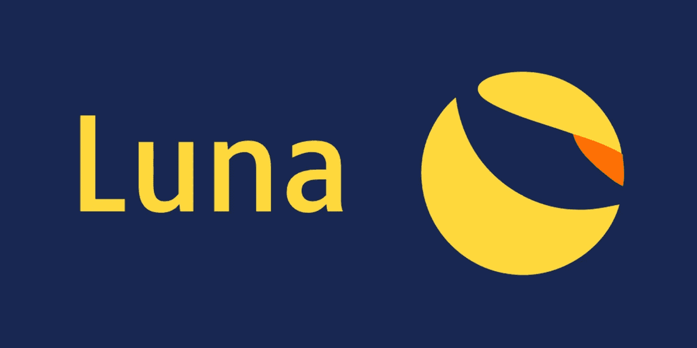

# 我对学习 Terra 感到非常舒服

> 原文：<https://medium.com/coinmonks/i-felt-completely-comfortable-learning-about-terra-c9b64bb86c95?source=collection_archive---------12----------------------->

Tera 是 2021 年为电子商务打造的区块链。它的价格翻了 70 倍，锁定在 terra 的价值正在飙升。那么什么是 terra，它是如何工作的，以及如何在它的基础上开始构建？

Source: Crypto Logos

Terra 由 Daniel Shin 和 Do Kwon 两位经验丰富的企业家于 2018 年 1 月创立。terra 的本土象征被称为 luna。它的最大供应量为 10 亿令牌，是第 11 大加密公司，市值为 180 亿美元。

Tera 是用 cosmos sdk 构建的区块链技术的证明。只有 130 个验证器，这并没有使它非常分散。让 terra 与众不同的是它能够发行稳定的硬币来兑换法定货币，比如与美元打包在一起的 UST。这些是算法稳定的硬币。每当稳定硬币的价格高于或超过目标时，市场参与者就会利用套利机会重新调整代币的价值。值得注意的是，这些稳定的硬币用得越多，月神令牌的价值就越高。

terra 上最著名的项目是 **CHAI** ，一款在韩国最大的电子商务平台 **TMON** 上使用的韩国移动支付应用。另一个有趣的项目是**锚**协议正在从多个 pos 区块链获取股份。此外还有 terra swap，这是 tera 上的一个分散式交易所。

目前 terra 拥有超过 200 万用户。用铁锈写的智能合同。为了测试，你可以使用当地的 terra 测试网。要在 tera 上与智能合约交互，您可以使用两个 sdk 中的一个一个在 javascript 中，另一个在 python 中。对于用户来说，tera 的官方钱包被称为 terra station，可在移动设备上使用，并作为 chrome 的扩展。那么关注 tera 值不值得。像 terra 上的这种算法稳定的硬币很难被检测到，因为没有中央发行者。

在监管机构越来越关注稳定硬币的时候，这一点尤为重要。我也很喜欢 terra 通过 chai 项目在电子商务领域的影响力。

你觉得 terra 怎么样？你要在 terra 上开始建造吗？

> 加入 Coinmonks [电报频道](https://t.me/coincodecap)和 [Youtube 频道](https://www.youtube.com/c/coinmonks/videos)了解加密交易和投资

## 另外，阅读

*   [加拿大最佳加密交易机器人](https://blog.coincodecap.com/5-best-crypto-trading-bots-in-canada) | [赌注加密](https://blog.coincodecap.com/staking-crypto)
*   [如何在印度购买比特币？](/coinmonks/buy-bitcoin-in-india-feb50ddfef94) | [瓦济克斯评论](/coinmonks/wazirx-review-5c811b074f5b)
*   [最佳网上赌场](https://blog.coincodecap.com/best-online-casinos) | [硬件钱包](/coinmonks/hardware-wallets-dfa1211730c6)
*   [如何在 WazirX 上购买柴犬(SHIB)币？](https://blog.coincodecap.com/buy-shiba-wazirx)
*   [比特币主根](https://blog.coincodecap.com/bitcoin-taproot) | [排名前 6 的比特币信用卡](/coinmonks/bitcoin-credit-card-bc8ab6f377c6)
*   [最佳免费加密信号](https://blog.coincodecap.com/free-crypto-signals) | [YoBit 评论](/coinmonks/yobit-review-175464162c62) | [Bitbns 评论](/coinmonks/bitbns-review-38256a07e161)
*   [南非的加密交易所](https://blog.coincodecap.com/crypto-exchanges-in-south-africa) | [BitMEX 加密信号](https://blog.coincodecap.com/bitmex-crypto-signals)
*   [MoonXBT 副本交易](https://blog.coincodecap.com/moonxbt-copy-trading) | [阿联酋的加密钱包](https://blog.coincodecap.com/crypto-wallets-in-uae)
*   [雷米塔诺评论](https://blog.coincodecap.com/remitano-review)|[1 英寸协议指南](https://blog.coincodecap.com/1inch) | [购买 Floki](https://blog.coincodecap.com/buy-floki-inu-token)
*   [MoonXBT vs Bybit vs 币安](https://blog.coincodecap.com/bybit-binance-moonxbt) | [Arbitrum:第二层解决方案](https://blog.coincodecap.com/arbitrum)
*   [买 PancakeSwap(蛋糕)](https://blog.coincodecap.com/buy-pancakeswap)|[matrix export Review](https://blog.coincodecap.com/matrixport-review)