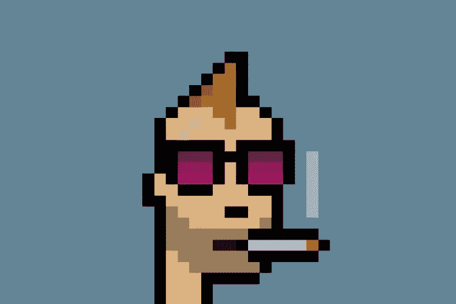

# 我终于明白为什么有些 NFT 值几百万美元了…

> 原文：<https://medium.com/coinmonks/i-finally-understood-why-some-nfts-are-worth-millions-of-dollars-7cc16fa6101f?source=collection_archive---------1----------------------->

This is a CryptoPunk

edito:NFT 有几种类型，比如电子游戏中的或者元宇宙使用的。在这个视频中，我们谈论的是“艺术”类型的非艺术电影。

你肯定听说过一些 PDF 文件和 JPEG 图像已经卖到了数百万美元。这让你感到惊讶吗？你认为地球不再转动了？(他去过了吗，嗯？).

NFT 的繁荣向我们表明，人类已经跨越了一个新的范式。这可能会令人不安，尤其是当你不试图理解这种变化的基础时。我们前进，我们行走，我们奔跑，奔向未来。那是什么意思？

除了我们使用互联网和电脑的逻辑延续之外，别无其他。哎，对了，科技史上没有比这更理性的了，就不要看科幻神秘感了。每个时代都有自己的新用途。千禧一代会说这是进步吗？婴儿潮一代会说这是废话吗？

简单的 PNG 图片所换来的天文数字的价格，乍一看似乎有些疯狂。毕竟，一个以像素化彩虹为背景的喵喵叫猫的视频已经为自己赢得了数百万美元。

这只猫有什么特别之处？坦白说，什么都没有？

什么都没有，如果不是他的故事？或许它的价值仅仅来自于在区块链的“开采”？

如果我们试图分析这只像素化的猫和它的艺术价值，那是在浪费我们的时间和精力。我们不能在这里辩论，也不能扮演艺术评论家的角色，试图找到一些理由。事实上，这不是争论的焦点。

不再只是他房间里的小极客买 crypto 谁收集数字作品。哦，不，像佳士得这样的艺术机构(仅此而已)或大型投资公司购买并提高赌注。Visa 公司也在做。她花了 15 万美元买了她的第一部 NFT。签证的小事？相当于我们一天的购物和少数持卡人的一些佣金。

也就是说，这个手势意义重大。

它比你第一眼看到的要多得多。请记住，Visa 是一家金融运营商，它并不总是表现出对加密货币的“宽容”。通过购买 NFT，该公司清楚地向我们表明，它现在正在接受这项新技术。对一些人来说，这甚至是法定货币向加密货币辞职和让位的形象。

时代在变，心态在变，历史已经向我们展示了一个人对一般新产品的不情愿。

有多少艺术家没有遭受过被同时代人误解的痛苦？

请记住塞尚和立体派尽管进行了密集的生产，却难以支付租金。立体派作品——在早期——被认为是美学上的淫秽作品。无论如何，在开始时，在历史学家鞭打我之前，我要说明这一点。一些商人拒绝用这些画付款。它根本没有价值。

更糟糕的是，一幅画中的女人被毁容成那样，谁会想把它挂在她的餐厅里呢？

立体派，不用谢！

反正你可以很好的截图你的毕加索吧？你不需要有原件，你会告诉我。你甚至可以让一个有才华的艺术家再做一次，对吗？好的赝品甚至难以用肉眼识别。像他这样的专家。

我们知道有些画的赝品与原作完全相同。如此相似，以至于有人说我们的许多博物馆都充满了它们。你嘴巴里有角吗？然而，除非你把显微镜对准艺术品，否则你看不出任何区别。

此外，显微镜本身将是第一个被愚弄的。绘画的模仿者是如此有才华，他们甚至欺骗科学实验室来估计作品的年龄，这是为了告诉你他们做得有多好！

这种类型的骗子在英语中被称为“骗子艺术家”并不是没有道理的。在这个名字下，它包括了所有极有天赋伪造行为或作品的人。

假设你有一幅和原作一模一样的作品。

我向你挑战，所以尝试转售你的毕加索的完美副本(声称它是一个副本，嗯)。

这就是你理解 NFT 的全部智慧的方式。

有了 NFT，你一定会得到原作。真正的作品，而所有其他的只是复写本。

仅仅因为作品是数字化的并不意味着它没有权利拥有它的原始文件。因此，如果毕加索有他的 NFT，今天就不可能卖出一幅赝品。为什么？它在区块链上是完全可追踪的。是的，是的，你知道这个巨大的存储库，所有的交换交易都写在这里，而且是不可逆的。

要知道，每一个主人都会被小心翼翼地记录在这个电脑账本上。我们会知道作品在哪里，属于谁，甚至是转售的确切时间。

因此，如果回想起来，它失去了一些光彩，然而，锚定在当代世界，NFT 是有意义的。

在你看到的惊人价格背后，也反映了(但不仅仅是)背后的技术价格。这就是为什么 NFT 在其他领域也非常有趣和有用，如文凭(不再有假文凭)、数字身份、视频游戏等。

因此，除了 NFT 和技术，数字艺术作品和油画一样有重量和存在的理由。正如我们所知，这仅仅是艺术史上的又一个进步，它不是静止不变的，也不是固定不变的。

例如，人们不理解为什么一个 Beeple 视频卖几千欧元，当谈到杰弗·昆斯的作品时，这一定是同样的误解的一部分。对于新手来说，当代艺术和非传统艺术一样令人好奇(就作品销量而言)。

昆斯的兔子艺术品已经卖出了 9000 多万美元。在一个挑剔的收藏家眼里，他只看到两个艺术家用两种不同的媒介。

有些人厚颜无耻地认为，一些非功能性测试卖得很高，只是因为他们是 NFT(因此也是计算机技术)。

这就给我们带来了一个必须要问的终极问题:成为 NFT 会给一个形象增加(财务)价值吗？一些真正价值百万的 NFT 真的值吗？

对于第一个问题，我想立即回答你，以避免任何混乱。不，仅仅因为你要在你和你的大便的照片上“挖掘”一个 NFT 并不意味着这张照片会卖几百万。

很遗憾的告诉你，它就像你孩子的画画一样一文不值(就像它一样有天赋)。它不值什么钱，没有人会想买。

事实上，必须明白的是，一件数字作品无论是否由 NFT 作品表现，都不会保留它所隐含的艺术代码。

基本上，记住 NFT 在这里只是一个向量，一个支撑，就像画布和桌子对于毕加索的画一样。

不是所有的 NFT 都值几百万，说清楚一点。并不是所有的艺术作品都将被载入史册…人们甚至可以预测，尽管目前大肆宣传，但今天创造的许多非功能性艺术作品将被遗忘。很少有非功能性词汇具有真实和可感知的意义。

我跑题是因为最后，扭曲一下帕斯卡的名言，我们经常同意“艺术有它被理性忽略的理由”…。

而且，如果你已经理解了为什么杜尚的尿壶或马蒂斯的尿壶能卖几百万，为什么一个人能为司汤达综合症感到高兴，你肯定会理解为什么一些非功能性尿壶确实价值几百万。

____

这只是我的观点，我很乐意和你讨论。

> 加入 Coinmonks [电报频道](https://t.me/coincodecap)和 [Youtube 频道](https://www.youtube.com/c/coinmonks/videos)了解加密交易和投资

## 另外，阅读

*   [最佳期货交易信号](https://blog.coincodecap.com/futures-trading-signals) | [流动性交易回顾](https://blog.coincodecap.com/liquid-exchange-review)
*   [印度的加密交易所](/coinmonks/bitcoin-exchange-in-india-7f1fe79715c9) | [比特币储蓄账户](/coinmonks/bitcoin-savings-account-e65b13f92451)
*   [OKEx vs KuCoin](https://blog.coincodecap.com/okex-kucoin) | [摄氏替代品](https://blog.coincodecap.com/celsius-alternatives) | [如何购买 VeChain](https://blog.coincodecap.com/buy-vechain)
*   [币安期货交易](https://blog.coincodecap.com/binance-futures-trading)|[3 commas vs Mudrex vs eToro](https://blog.coincodecap.com/mudrex-3commas-etoro)
*   [如何购买 Monero](https://blog.coincodecap.com/buy-monero) | [IDEX 评论](https://blog.coincodecap.com/idex-review) | [BitKan 交易机器人](https://blog.coincodecap.com/bitkan-trading-bot)
*   [CoinDCX 评论](/coinmonks/coindcx-review-8444db3621a2) | [加密保证金交易交易所](https://blog.coincodecap.com/crypto-margin-trading-exchanges)
*   [Bookmap 评论](https://blog.coincodecap.com/bookmap-review-2021-best-trading-software) | [美国 5 大最佳加密交易所](https://blog.coincodecap.com/crypto-exchange-usa)
*   [最佳以太坊钱包](https://blog.coincodecap.com/best-ethereum-wallets) | [电报上的加密货币机器人](https://blog.coincodecap.com/telegram-crypto-bots)
*   [交易杠杆代币的最佳交易所](https://blog.coincodecap.com/leveraged-token-exchanges)
*   [AscendEx Staking](https://blog.coincodecap.com/ascendex-staking)|[Bot Ocean Review](https://blog.coincodecap.com/bot-ocean-review)|[最佳比特币钱包](https://blog.coincodecap.com/bitcoin-wallets-india)
*   [隐料斗替代品](/coinmonks/cryptohopper-alternatives-d67287b16d27) | [HitBTC 审查](/coinmonks/hitbtc-review-c5143c5d53c2)
*   [折叠 App 审核](https://blog.coincodecap.com/fold-app-review) | [Kucoin 交易机器人](/coinmonks/kucoin-trading-bot-automate-your-trades-8cf0ca2138e0) | [Probit 审核](https://blog.coincodecap.com/probit-review)
*   [如何匿名购买比特币](https://blog.coincodecap.com/buy-bitcoin-anonymously) | [比特币现金钱包](https://blog.coincodecap.com/bitcoin-cash-wallets)
*   [币安 vs FTX](https://blog.coincodecap.com/binance-vs-ftx) | [最佳(SOL)索拉纳钱包](https://blog.coincodecap.com/solana-wallets)
*   [如何在 Uniswap 上交换加密？](https://blog.coincodecap.com/swap-crypto-on-uniswap) | [A-Ads 评论](https://blog.coincodecap.com/a-ads-review)
*   [WazirX vs CoinDCX vs bit bns](/coinmonks/wazirx-vs-coindcx-vs-bitbns-149f4f19a2f1)|[block fi vs coin loan vs Nexo](/coinmonks/blockfi-vs-coinloan-vs-nexo-cb624635230d)
*   [本地比特币审核](/coinmonks/localbitcoins-review-6cc001c6ed56) | [加密货币储蓄账户](https://blog.coincodecap.com/cryptocurrency-savings-accounts)
*   如何在 Bitbns 上购买柴犬(SHIB)币？
*   [Godex.io 审核](/coinmonks/godex-io-review-7366086519fb) | [邀请审核](/coinmonks/invity-review-70f3030c0502) | [BitForex 审核](https://blog.coincodecap.com/bitforex-review)
*   [MoonXBT vs Bybit vs 币安](https://blog.coincodecap.com/bybit-binance-moonxbt) | [硬件钱包](/coinmonks/hardware-wallets-dfa1211730c6)
*   [火币交易机器人](https://blog.coincodecap.com/huobi-trading-bot) | [如何购买 ADA](https://blog.coincodecap.com/buy-ada-cardano) | [Geco？一次审查](https://blog.coincodecap.com/geco-one-review)
*   [币安 vs 比特邮票](https://blog.coincodecap.com/binance-vs-bitstamp) | [比特熊猫 vs 比特币基地 vs Coinsbit](https://blog.coincodecap.com/bitpanda-coinbase-coinsbit)