# 我预测了 2018 年的比特币崩盘...是时候出售了📉

> 原文：<https://medium.com/coinmonks/i-predicted-the-2018-bitcoin-crash-its-time-to-exit-the-market-before-2022-a482979746d2?source=collection_archive---------0----------------------->

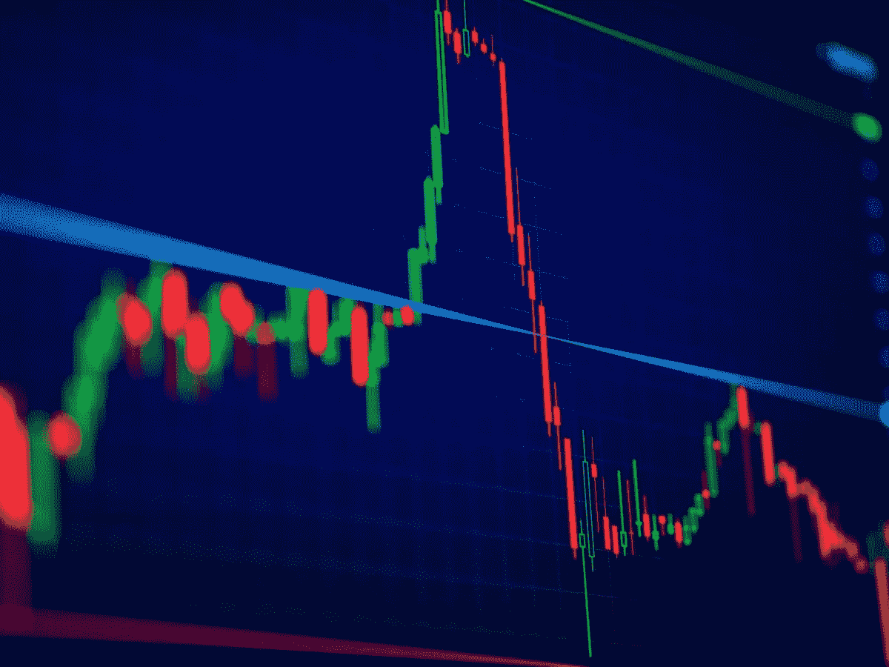 [## 加密启示录…理性的声音(2017)

### 不管每个人现在说什么…不管图表看起来有多“看涨”…不管 FOMO 有多高…

medium.com](/@5a9awneh/the-crypto-apocalypse-the-voice-of-reason-ced03aa5b1b1) 

> 当人们生活在 hopium 上时，他们脱离现实，拒绝看更大的画面

**分析瘫痪**是由于过度思考而无法做出决定

在金融市场上，通常**伴随着一厢情愿的总体情绪**

这转化为极度的恐惧和贪婪，投资者越恐惧或贪婪，就越难预测下一步的市场走势。当市场处于历史新高或新低时尤其如此。

你猜对了，**目前的市场读数是超买，每个人都很贪婪，想进去，价格在新 ATH**

这迟早会导致一个结局…而且比你想象的要简单和丑陋得多

# **先加密，其他跟随**

相对来说，加密市场被证明是传统股票市场的试验场，因为几乎每一次重大的加密崩溃之后，紧接着就是股票市场的崩溃

我坚信我们正处于衰退的边缘，至少，其他人甚至会称之为萧条

> 我的观点描绘了即将到来的比特币加密市场崩溃，随后是股市崩溃引发的长期熊市和全球衰退的连锁反应

事不宜迟，我们开始吧！

# **技术面**

***收益率曲线***

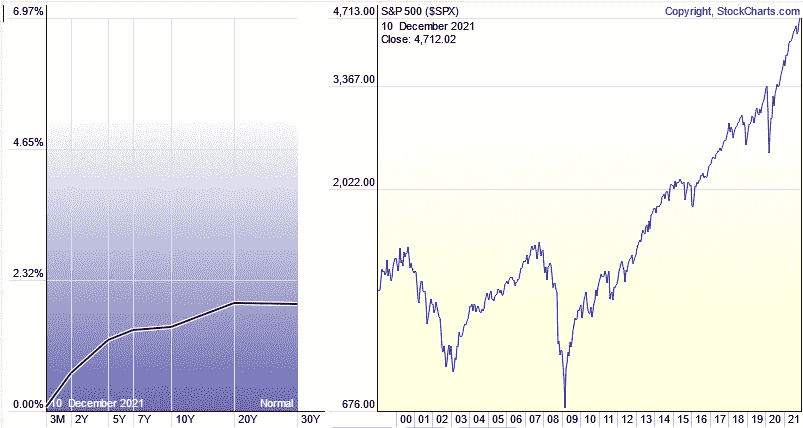

Dynamic Yield Curve vs. S&P 500 — [StockCharts.com](https://stockcharts.com/freecharts/yieldcurve.php)

收益率曲线显示了美国国债短期&长期利率之间的**关系**

通常，期限越长，利率越高，但当利率彼此接近时，收益率曲线变平。曲线的反转通常被视为市场的警告信号

> 长话短说，收益率曲线最近变平了，长期债券接近一年来的最低点
> 
> **上一次出现这种情况是在 2018 年比特币猛烈崩盘！**

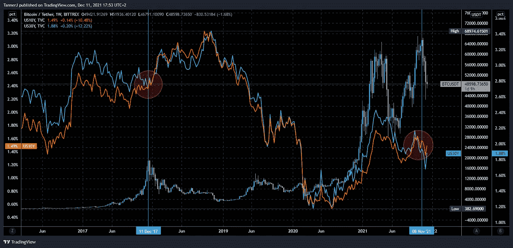

BTC/USDT 1W compared to US10Y and US30Y

***【美国消费者价格指数】***

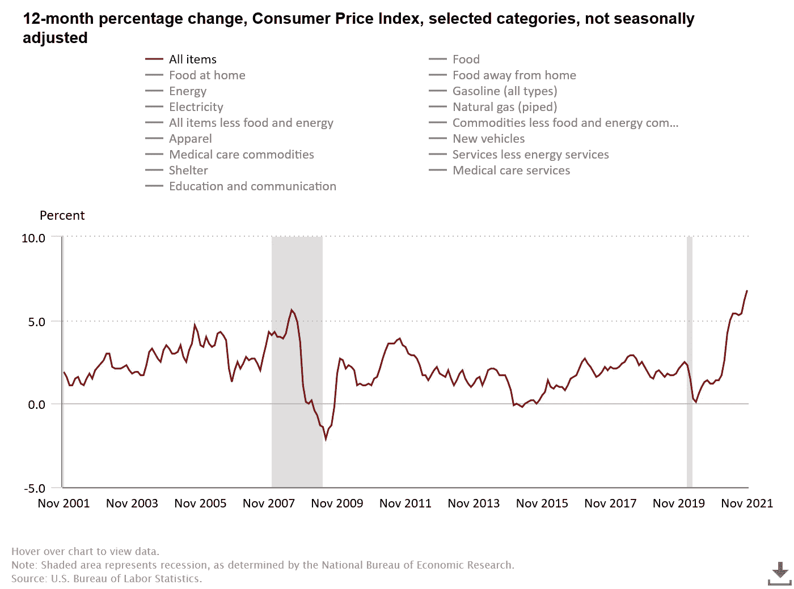

12-month percentage change, Consumer Price Index — [U.S. Bureau of Labor Statistics](https://www.bls.gov/)

CPI 是衡量美国城市消费者购买一篮子消费品和服务的价格随时间变化的平均值

> **2008 年经济衰退前，CPI 处于 5.6%的历史高点，目前 ATH 为 6.8%**

***膨胀***

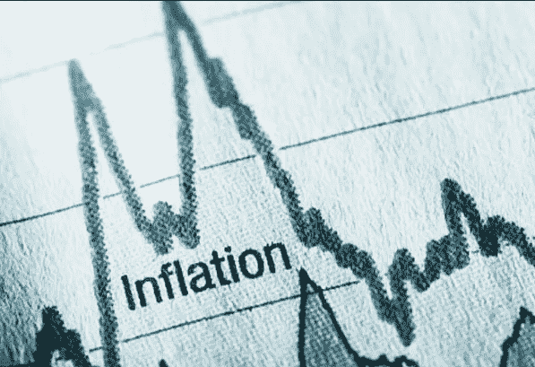

> **你不可能永远印钞票！**
> 
> 稀缺性是价值的定义。如果每个人都有，他们为什么想要它？

事实上，这就是经济暴跌、货币变得一文不值的原因，就像委内瑞拉和黎巴嫩一样

量化宽松(QE)是一种货币政策，通过这种政策，中央银行购买预定数量的政府债券或其他金融资产，以便向经济注入资金，扩大经济活动

> 这个花哨的术语简单地解释为**凭空创造更多的金钱**无论是实物还是数字**！**

Fed Chair Jerome Powell: We print money — 60 Minutes

美联储印制了前所未有的巨款来支持受冠状病毒侵袭的经济

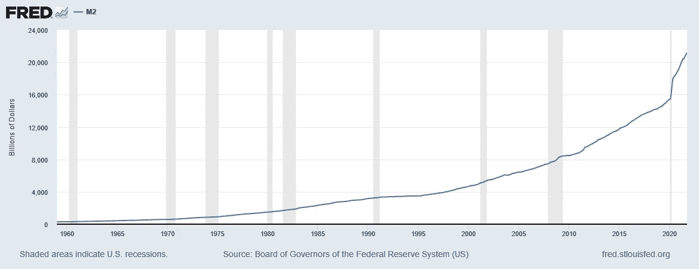

M2 (M2SL) — [FRED](https://fred.stlouisfed.org/series/M2SL)

美联储的数据显示，衡量美元存量的一个广泛指标，即 M2，从 2020 年初的 15.4 万亿美元上升到 2021 年 12 月的 21.18 万亿美元。

> 增加的 5.78 万亿美元相当于美元总供应量的 27.28%。
> 
> **这意味着超过四分之一的美元是在 2020 年和 2021 年创造的！**

***美元强势***

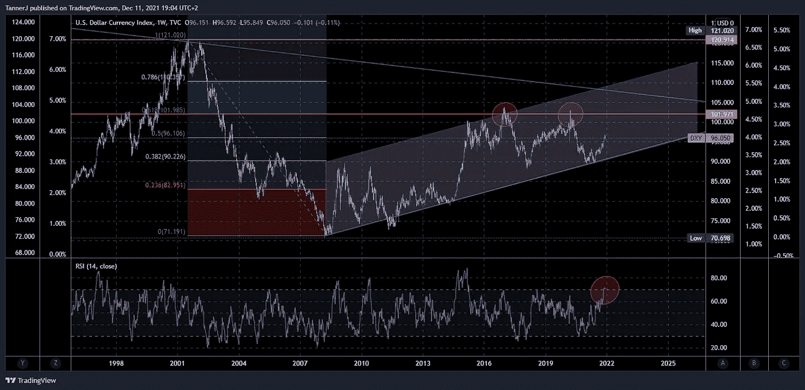

DXY in symmetrical triangle struggling to break Fib 0.5 with over-bought RSI

美元指数(DXY)代表美元相对于一篮子外国货币的价值，其中最重要的是欧元，占一篮子货币的 57.6%

> 截至本文撰写之时，DXY 已经两次未能突破 100 点附近的历史阻力位 Fib 0.618，除非这次能够突破该阻力位(考虑到过度买入的 RSI，我对此表示怀疑)，否则预计至少**会拉回之前的支撑位 80，如果不重新测试 ATL 的 70**

另一方面，作为对美元的对冲，欧元预计将上涨

# **比特币**

BTC/USDT 1W — Mar 2020 Bull-run till Dec 12, 2021

***技术分析:概述***

看看周线和月线，你可以清楚地看到，70000 美元的价格两次被双顶拒绝，缩小一点，头肩顶形态完成了一半，成交量下降，RSI 超买，MACD 看跌，BB 扩大。

***价格行动情景***

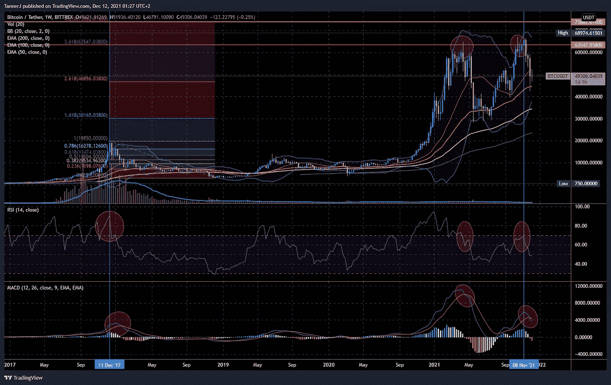

BTC/USDT 1W — 2017 vs. 2021

B

> **我们能够延续另一轮牛市**的唯一方法是我们设法突破，并且每周收盘**超过 74k 美元**

一个 **平均情况**场景是一个 H &右肩在**【53k】美元**，如果我们设法分手，这可能是一个**多头陷阱重新测试到 58k-60k 美元**

W **orst 案例**我们只是继续抛售以重新测试之前的关键支撑位 **$42k，$36k 和$30k** ，这是双顶的颈线

> **如果我们不能持有 3 万美元**，那么它将从那里下降到 2 万美元、1.6 万美元、1.3 万美元、1.1 万美元、**以及最后的 9.5 万美元，这可能是 BTC 最后一次再次达到 4 位数，**因为 2 万美元将成为新的支撑

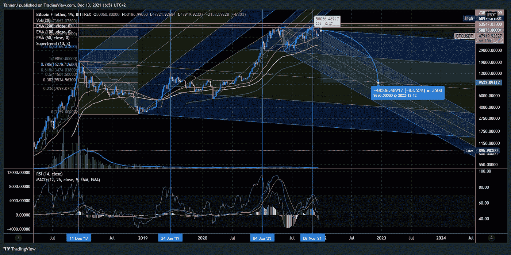

BTC/USDT 1W — Log-scale chart

这有**汇流**与 0.5 音叉(19850–3217–64802)和 0.5 音叉(64802–28149–68974)以及 Fib 0.382(19850–3159)**在$9534** 处相交，这在 1W 帧上的**对数标度**图表上查看时是有意义的，您可以清楚地看到一个强

*****BTC 一家独大*****

**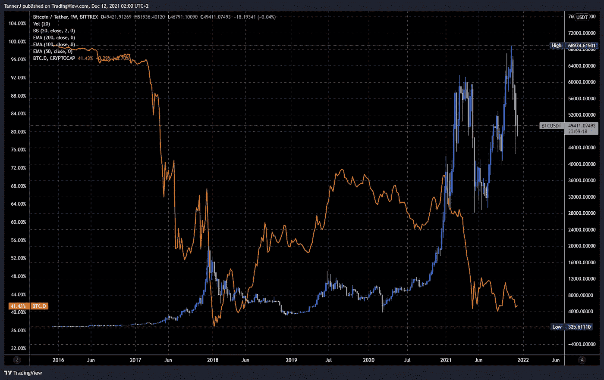**

**BTC/USDT 1W — Compared to BTC.D — 2017 vs. 2021**

**BTC 价格与其市场支配地位之间的**反比关系**意味着**当 BTC 在 BTC ATH 的时候。d 在 ATL****

**这正是现在 BTC 的情况。d 目前位于 40.5%，似乎正在测试之前 37.5%的支撑，从而形成一个巨大的双底，准备强劲反弹**

# **替代硬币**

**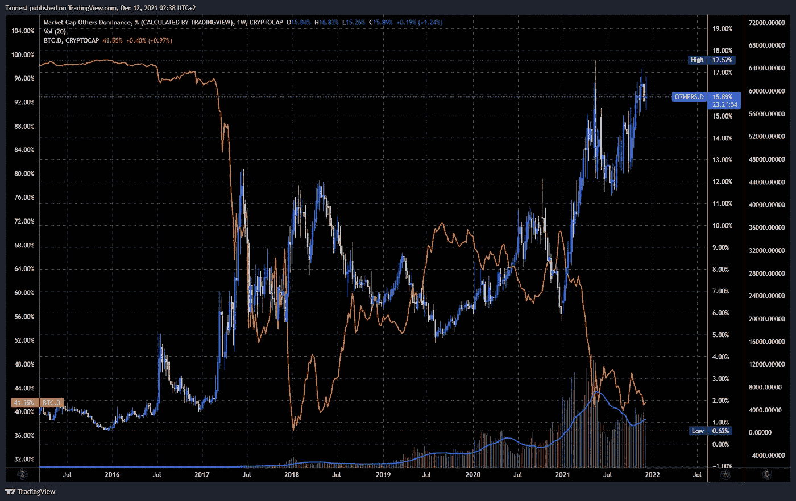**

**OTHERS.D 1W — Compared to BTC.D**

> **我可能预见**最后一个 alt 赛季给那些还没有重整旗鼓的**，尤其是那些 2017 年以来被遗忘的**项目和基本面都很强的。****

**如果发生了，这可能是你最后的机会了。但是不要指望它会持续很久，所以你必须小心和快速。**

# **基本面**

*****Omicron*****

**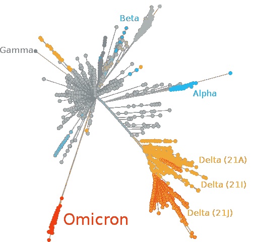**

**Omicron variant and other major or previous [variants of concern](https://en.wikipedia.org/wiki/Variant_of_concern) of [SARS-CoV-2](https://en.wikipedia.org/wiki/Severe_acute_respiratory_syndrome_coronavirus_2) depicted in a tree scaled radially by genetic distance**

**当世界还在遭受 2 年隔离和封锁的影响时，新冠肺炎的新奥米克隆变种最近刚刚袭击**

> **人们已经精疲力尽，精神上和经济上都受到了创伤，无法承受更多的困难，更不用说一年或六个月的限制了**
> 
> **从政治角度来看，政府最终将别无选择，只能取消所有限制，让生活恢复正常，以避免叛乱和骚乱**
> 
> **从财政上来说，经济刺激措施已经没有存在的理由了，我们必须通过创造就业机会，降低全球前所未有的通货膨胀率和失业率，回到自然但可持续的增长**

** [## 在美联储主席鲍威尔表示他希望加快“缩减购债规模”后，道琼斯以 650 点的跌幅收盘

### 华尔街周二大幅下挫，道琼斯工业平均指数在联邦政府宣布破产后下跌了 600 多点

news.yahoo.com](https://news.yahoo.com/dow-falls-600-points-fed-172244356.html) 

换句话说，**当新冠肺炎在 2020 年 3 月第一次遭遇**时，美联储和其他政府所做的事情——无论是刺激检查、税收减免、贷款再融资，还是对个人或企业的任何类型的特殊金融援助——**都不会再次发生，或者相比之下微不足道**

> 崩盘只是被推迟了，随着所有累积的利息，崩盘将不可避免地很快发生

***不要相信我的话，听专家们的***

看看世界顶级投资者、亿万富翁和对冲基金经理是怎么说的，这里有一些例子

Jeremy Grantham: Next Crash Will Rival 1929, 2000

你会发现**知名大亨**的无限视频和采访(或“删除”的推文，如迈克尔·伯里的视频和采访),如杰里米·格兰瑟姆、雷伊·达里奥、沃伦·巴菲特、查理·芒格、凯西·伍德、罗伯特·清崎和许多其他人**警告即将到来的崩溃的严重性！**

Deleted tweet by Michael J. Burry on twitter

 [## 《富爸爸穷爸爸》的作者罗伯特·清崎预计会出现市场崩盘和经济危机，并计划在价格下跌时购买黄金、比特币和房地产

### 罗伯特·清崎预计市场会崩溃，美国经济会陷入萧条。《富爸爸穷爸爸》的作者…

markets.businessinsider.com](https://markets.businessinsider.com/news/stocks/rich-poor-dad-kiyosaki-market-crash-depression-gold-bitcoin-housing-2021-12) 

Charlie Munger: If the government prints too much money, it ends up like Venezuela

# 怎么办？

***投资重要行业***

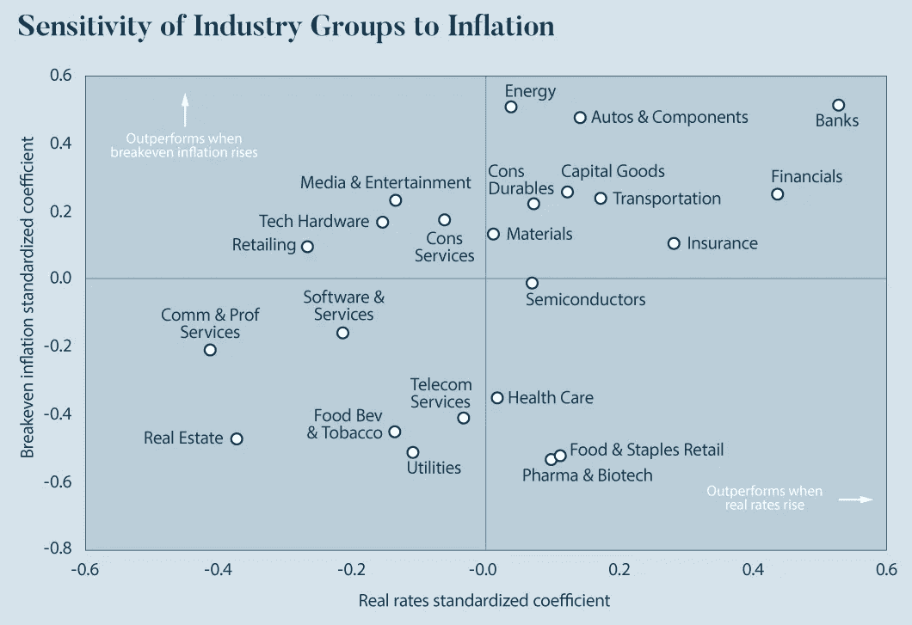

[**Four Tips to Protect Portfolios in a Rising Rate Environment**](https://advisor.visualcapitalist.com/four-tips-to-protect-portfolios-in-a-rising-rate-environment/) —Visual Capitalist

**银行、能源、汽车零部件、资本货物和金融**是一些最好的行业类别，当市场预期通货膨胀上升时**它们可能受益最大**

我们在艰难时期和繁荣时期生存所需的其他重要服务还包括健康、农业、食品供应链

> 最近，比尔·盖茨已经秘密成为美国最大的土地所有者，主要目标是靠近水源的农田

Why Bill Gates Is Buying Up U.S. Farmland

Michael J. Burry has been betting on farmland investment since 2010

当考虑到迫在眉睫的粮食供应危机时，这是有意义的，因为许多世界级的投资者已经预计到全球粮食严重短缺和世界某些地区可能发生饥荒

***寻找下一个 TSLA / GME***

不管是牛市还是熊市，只要你努力寻找，市场上总是有机会的

> 虽然疫情严重损害了像旅游和观光这样的行业，但它也极大地惠及了其他行业，如制药和科技

如果你研究一下全球范围内一些低端的非美国航空公司的股票价格，你会发现它们正处于历史最低点，而且还没有恢复

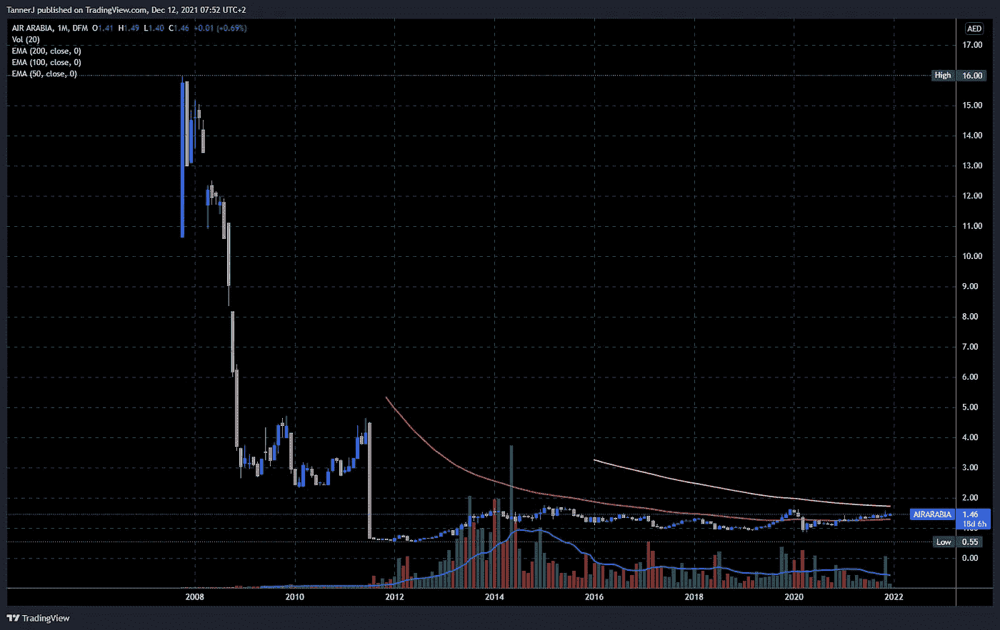

AIRARABIA/AED 1M

你也可以考虑航空 ETF，进行更多样化的低风险投资

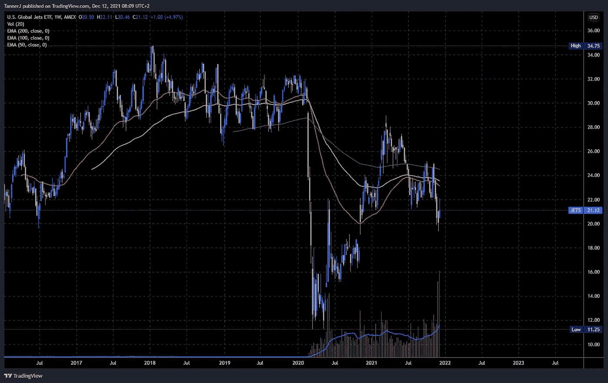

U.S. Global Jets ETF 1W

**AirBNB 是新的特斯拉？**

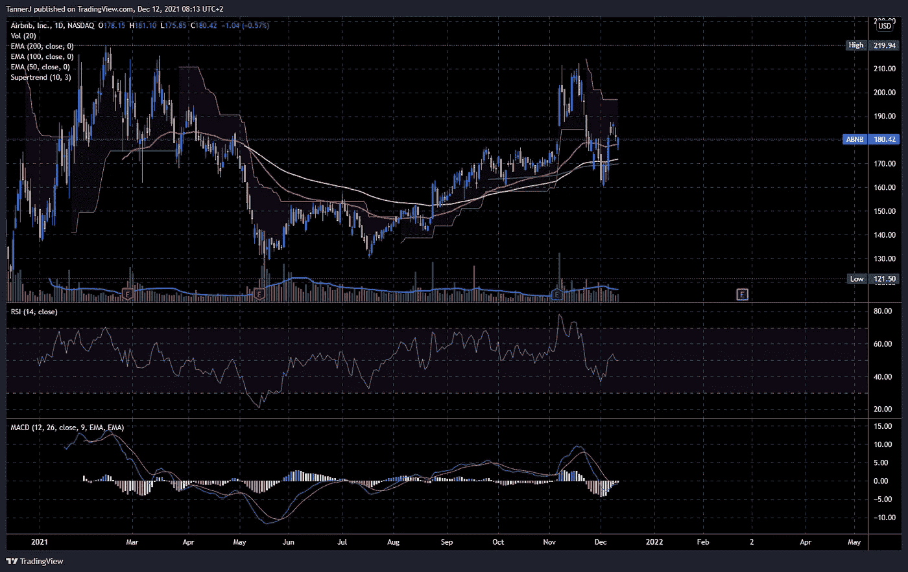

ABNB 1D

**诺基亚是新苹果？**

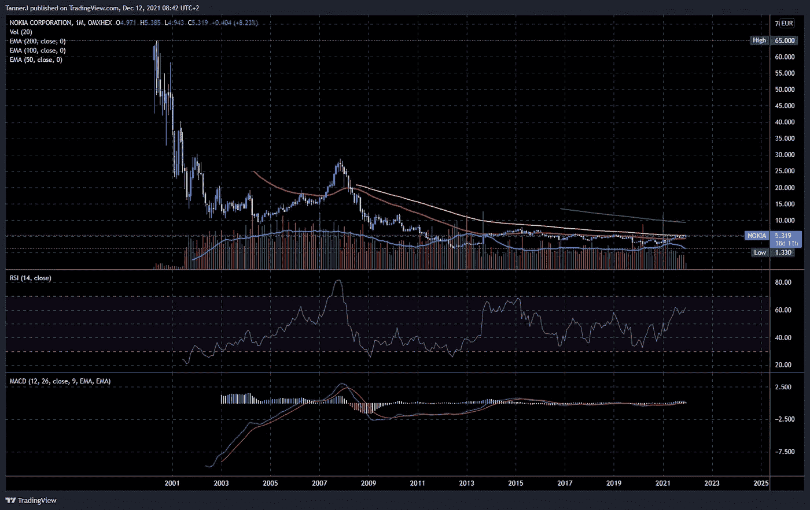

NOKIA 1M

我也会远离科技股和医药股，尤其是那些已经涨势超出可能的股票；AAPL，MSFT，谷歌，NFLX，TSLA 现在是一些主要的危险信号！

AAPL 1M

***贵金属***

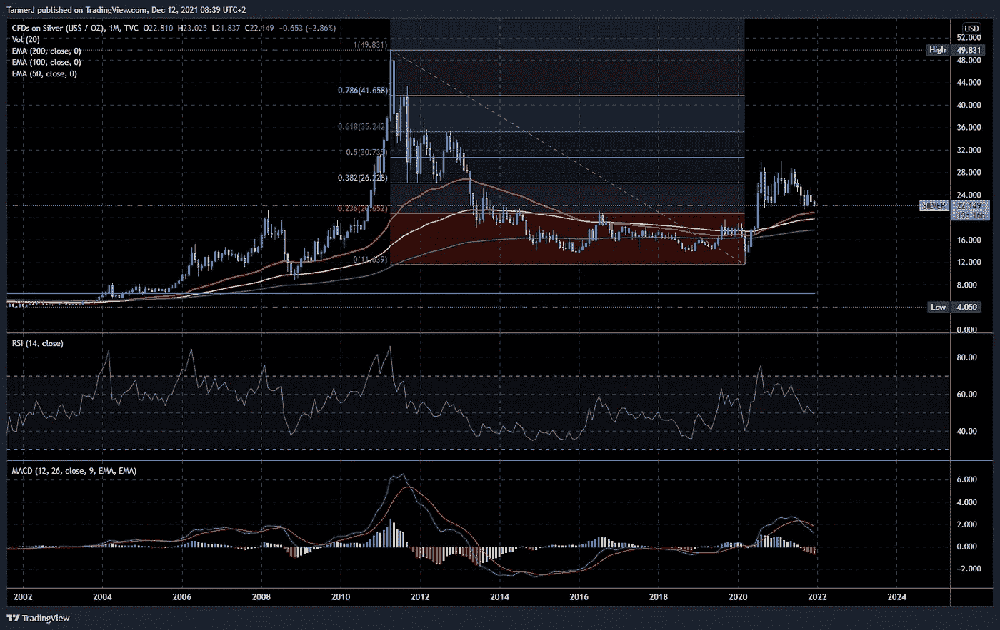

SILVER (US$ / OZ) 1M

人们总是求助于黄金和白银作为对冲通胀和财富损失的好工具，这次我看不出有什么不同

> 然而，与黄金相比，**白银现在被大大低估，如果不创造新的记录**,它将反弹至之前的 ATH

# 最后

> 用约翰·图尔德的话说[的保证金叫](https://www.imdb.com/title/tt1615147/)
> 
> **恐怕我什么也没听到。只是…沉默**

Margin Call: The Music Stops (2011)

保持安全，不要失去你的钱，这将是毫无准备的痛苦

另一边见，小不点-阿拉

*一路顺风*

*免责声明:非理财建议！请自担风险进行交易。*

> 加入 Coinmonks [电报频道](https://t.me/coincodecap)和 [Youtube 频道](https://www.youtube.com/c/coinmonks/videos)获取每日[加密新闻](http://coincodecap.com/)

## 另外，阅读

*   [密码电报信号](http://Top 4 Telegram Channels for Crypto Traders) | [密码交易机器人](/coinmonks/crypto-trading-bot-c2ffce8acb2a)
*   [复制交易](/coinmonks/top-10-crypto-copy-trading-platforms-for-beginners-d0c37c7d698c) | [加密税务软件](/coinmonks/crypto-tax-software-ed4b4810e338)
*   [网格交易](https://coincodecap.com/grid-trading) | [加密硬件钱包](/coinmonks/the-best-cryptocurrency-hardware-wallets-of-2020-e28b1c124069)
*   [最佳加密交易所](/coinmonks/crypto-exchange-dd2f9d6f3769) | [印度最佳加密交易所](/coinmonks/bitcoin-exchange-in-india-7f1fe79715c9)
*   [面向开发人员的最佳加密 API](/coinmonks/best-crypto-apis-for-developers-5efe3a597a9f)
*   最佳[密码借贷平台](/coinmonks/top-5-crypto-lending-platforms-in-2020-that-you-need-to-know-a1b675cec3fa)
*   [杠杆代币的终极指南](/coinmonks/leveraged-token-3f5257808b22)
*   [加密交易的最佳 VPN](https://coincodecap.com/best-vpns-for-crypto-trading)
*   [最佳加密分析或链上数据](https://coincodecap.com/blockchain-analytics) | [Bexplus 评论](https://coincodecap.com/bexplus-review)
*   [NFT 十大市场造币集锦](https://coincodecap.com/nft-marketplaces)
*   [AscendEx Staking](https://coincodecap.com/ascendex-staking)|[Bot Ocean Review](https://coincodecap.com/bot-ocean-review)|[最佳比特币钱包](https://coincodecap.com/bitcoin-wallets-india)
*   [Bitget 回顾](https://coincodecap.com/bitget-review)|[Gemini vs block fi](https://coincodecap.com/gemini-vs-blockfi)|[OKEx 期货交易](https://coincodecap.com/okex-futures-trading)**